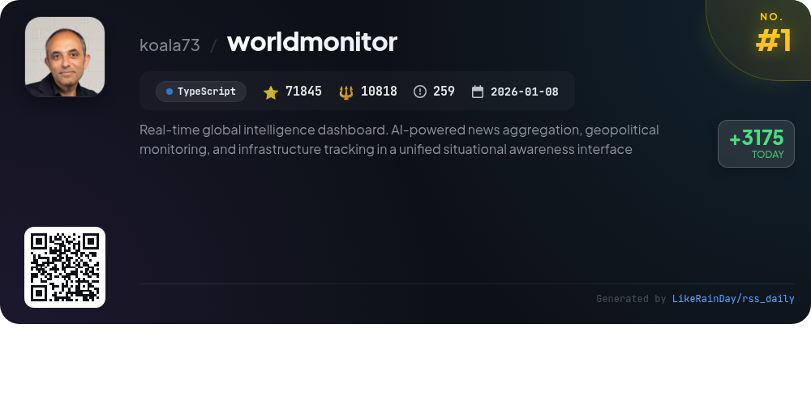
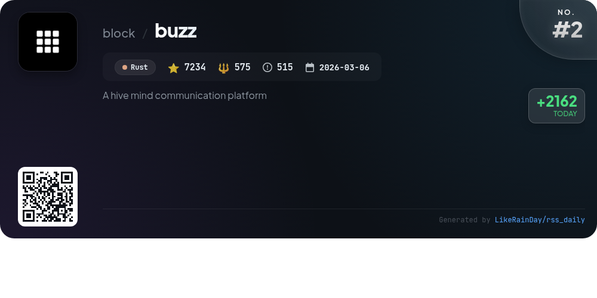
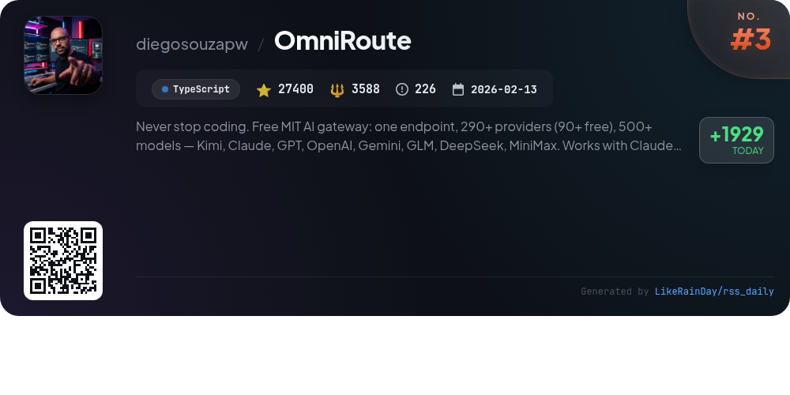
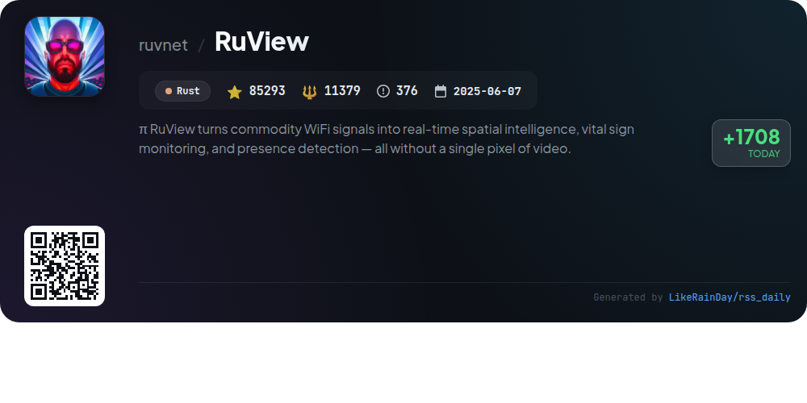
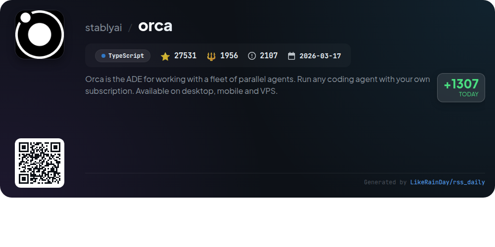
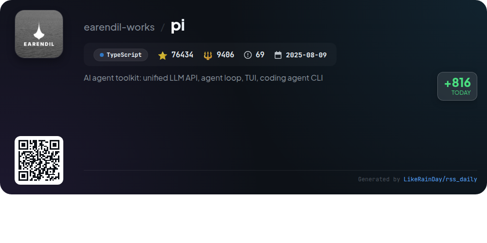
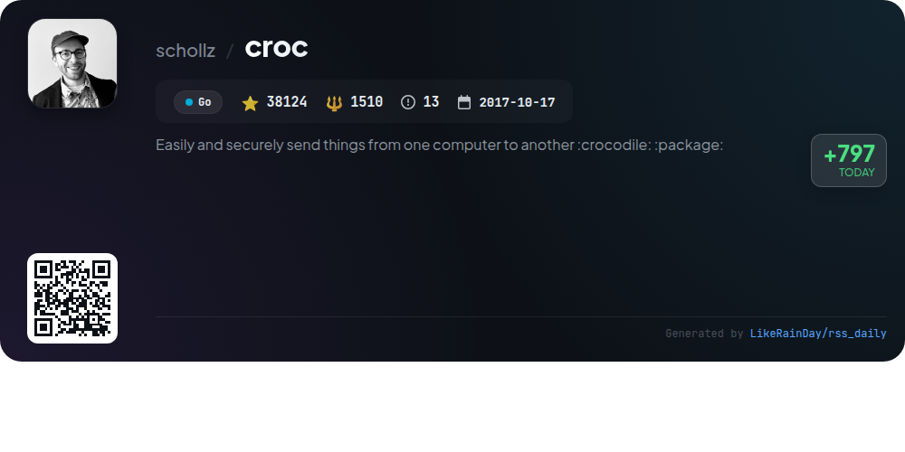
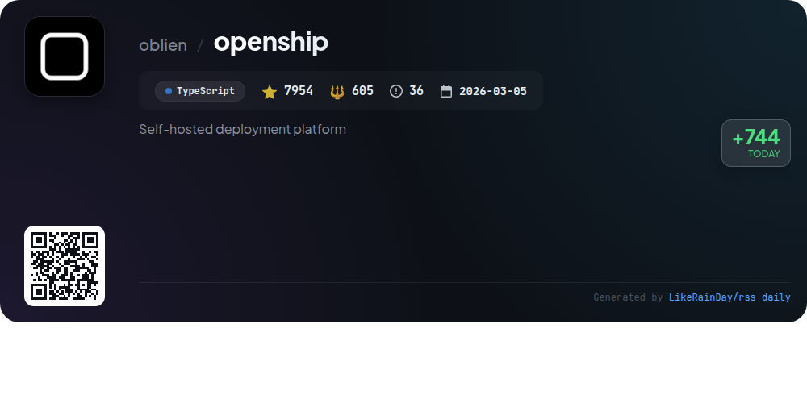
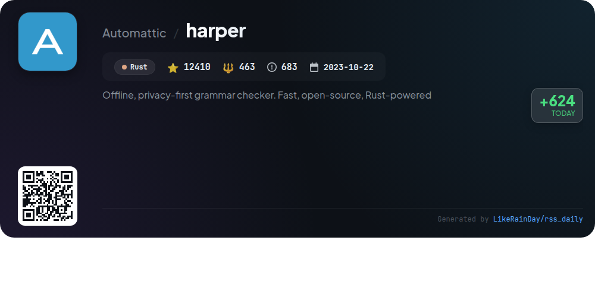
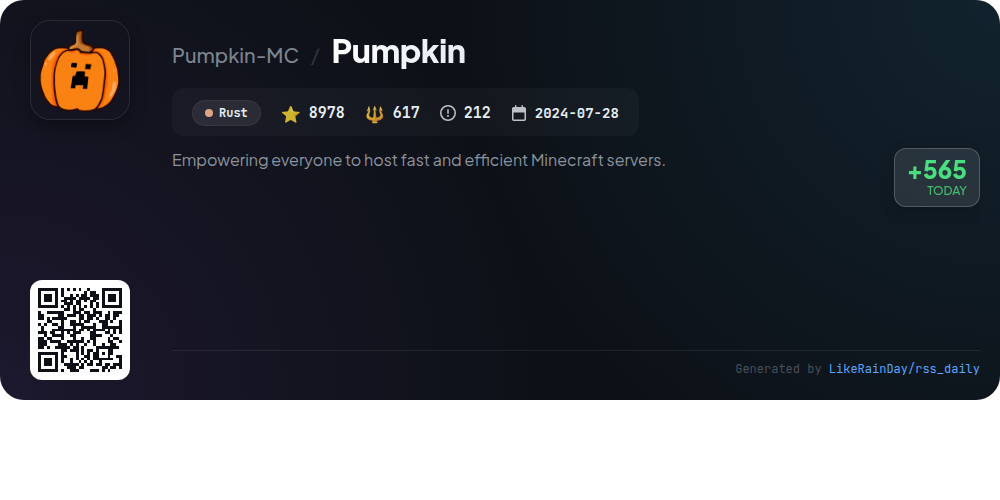

# 📊 🌟 GitHub Trending Daily - 2026-07-24

> > 📅 每日精选 GitHub 热门仓库 | 基于智能算法推荐

## 📋 Overview

**10** 个项目 | **363203** ⭐ | **40917** 🍴

**热门语言:** `TypeScript` (5) · `Rust` (4) · `Go` (1)

**更新时间:** 2026-07-24 03:23 UTC

**分类分布:**

- 🌟 每日 Top 10 精选 (10 项)

---

## 🌟 每日 Top 10 精选

### 1. [worldmonitor](https://github.com/koala73/worldmonitor)

> 🤖 **推荐理由**  
> *World Monitor is an AI-powered, real-time global intelligence dashboard that aggregates news, monitors geopolitical events, and tracks infrastructure within a unified interface. Key features include over 500 curated news feeds, a dual map engine (3D globe and flat map), a Country Instability Index, and a finance radar covering stock exchanges and commodities. It supports six site variants from a single codebase and offers a native desktop app for macOS, Windows, and Linux. Programmatic access is available via a REST API and SDKs in multiple languages, enhancing its utility for developers and analysts.*

- ⭐ 71845 stars
- 💻 TypeScript
- 📅 Updated: 2026-07-24

### 2. [buzz](https://github.com/block/buzz)

> 🤖 **推荐理由**  
> *Buzz is a self-hostable workspace platform that integrates humans and AI agents for collaborative project management. It features a single-relay system where every message, workflow, and event is logged, providing an authoritative audit trail. Key highlights include scoped agent permissions, the ability to triage bugs, and turning feature branches into dedicated collaboration rooms. Buzz supports media comments, seamless channel creation, and multi-community capabilities. Built in Rust, it aims to unify disparate tools into a cohesive workspace for enhanced productivity.*

- ⭐ 7234 stars
- 💻 Rust
- 📅 Updated: 2026-07-24

### 3. [OmniRoute](https://github.com/diegosouzapw/OmniRoute)

> 🤖 **推荐理由**  
> *OmniRoute is a free, MIT-licensed AI gateway that provides access to over 290 AI providers, including 90+ free options and 500+ models like GPT, Claude, and Gemini through a single endpoint. Key features include quota-aware auto-fallback, multi-layered token compression saving 15-95% tokens, and seamless integration with coding tools such as Claude Code and Copilot. Built by over 500 contributors, it offers a user-friendly dashboard for tracking free tier usage and supports multiple platforms, making it an essential tool for developers seeking efficient AI solutions.*

- ⭐ 27400 stars
- 💻 TypeScript
- 📅 Updated: 2026-07-24

### 4. [RuView](https://github.com/ruvnet/RuView)

> 🤖 **推荐理由**  
> *RuView is a cutting-edge WiFi sensing platform that transforms ordinary WiFi signals into real-time spatial intelligence, enabling presence detection, vital sign monitoring, and activity recognition without cameras or wearables. Key features include through-wall sensing, multi-person tracking, and health monitoring, using low-cost ESP32 nodes. It integrates seamlessly with major smart-home ecosystems like Home Assistant, Apple Home, Google Home, and Alexa. Built on Rust, RuView leverages advanced machine learning and operates entirely on edge hardware, ensuring privacy and local processing.*

- ⭐ 85293 stars
- 💻 Rust
- 📅 Updated: 2026-07-24

### 5. [orca](https://github.com/stablyai/orca)

> 🤖 **推荐理由**  
> *Orca is an advanced Development Environment (ADE) for managing parallel agents, available on desktop, mobile, and VPS. With over 27,500 stars on GitHub, it enables users to run multiple coding agents like Codex and ClaudeCode simultaneously in isolated worktrees, allowing for real-time comparison and merging of outputs. Key features include a mobile companion app for remote monitoring, terminal splits, SSH worktrees, and integrated GitHub task management. Users can script workflows via the Orca CLI, making it a powerful tool for AI-driven development.*

- ⭐ 27531 stars
- 💻 TypeScript
- 📅 Updated: 2026-07-24

### 6. [pi](https://github.com/earendil-works/pi)

> 🤖 **推荐理由**  
> *Pi is an AI agent toolkit featuring a unified LLM API, agent loop, and interactive coding agent CLI, built in TypeScript. With over 76,000 stars, its core components include the multi-provider LLM API for OpenAI and Google, an agent runtime for tool management, and a terminal UI library. Pi supports containerization for enhanced security and allows users to share coding agent sessions to improve AI performance. Developers can contribute easily, with clear guidelines and automated issue handling. Visit pi.dev for demos and documentation.*

- ⭐ 76434 stars
- 💻 TypeScript
- 📅 Updated: 2026-07-24

### 7. [croc](https://github.com/schollz/croc)

> 🤖 **推荐理由**  
> *Croc is a powerful CLI tool for securely transferring files and folders between any two computers using end-to-end encryption. Key features include support for cross-platform transfers (Windows, Linux, Mac), multiple file transfers, and the ability to resume interrupted transfers without needing a local server or port-forwarding. It supports IPv6 with IPv4 fallback and can operate through proxies like Tor. Croc also offers customization options, such as code phrases and clipboard functionalities, making it a versatile choice for file sharing.*

- ⭐ 38124 stars
- 💻 Go
- 📅 Updated: 2026-07-24

### 8. [openship](https://github.com/oblien/openship)

> 🤖 **推荐理由**  
> *Openship is an open-source, self-hosted deployment platform designed for seamless code deployment and infrastructure management. With over 7,900 stars, it offers built-in CI/CD, enabling push-to-deploy, preview environments, and rollbacks without complex configurations. Core features include support for multiple stacks, automatic domain and SSL management via Let's Encrypt, real-time monitoring, and scalable architecture. Users can interact through a desktop app, web dashboard, or CLI, making it suitable for solo developers and teams alike. Openship can be deployed on various platforms, ensuring flexibility and portability.*

- ⭐ 7954 stars
- 💻 TypeScript
- 📅 Updated: 2026-07-24

### 9. [harper](https://github.com/Automattic/harper)

> 🤖 **推荐理由**  
> *Harper is an open-source, privacy-first grammar checker built in Rust, designed for speed and efficiency. Offering a lightweight solution, it operates offline, avoiding the privacy concerns associated with competitors like Grammarly. Harper provides rapid document linting, taking milliseconds compared to other tools, while using significantly less memory. Currently supporting English, it has an extensible core for potential multilingual capabilities. Harper integrates seamlessly with popular editors like Visual Studio Code and Neovim, and can even run via WebAssembly, enhancing its accessibility.*

- ⭐ 12410 stars
- 💻 Rust
- 📅 Updated: 2026-07-24

### 10. [Pumpkin](https://github.com/Pumpkin-MC/Pumpkin)

> 🤖 **推荐理由**  
> *Pumpkin is a fast, efficient, and customizable Minecraft server built in Rust, boasting 8,978 stars on GitHub. It focuses on high performance through multi-threading while maintaining compatibility with both Java and Bedrock editions. Key features include extensive configuration options, robust security measures, and a foundation for plugin development. Players benefit from advanced world loading, entity management, and real-time server status. Currently in active development, Pumpkin encourages community contributions and provides comprehensive documentation for users.*

- ⭐ 8978 stars
- 💻 Rust
- 📅 Updated: 2026-07-24

---

## 📡 RSS订阅

通过 RSS 订阅，第一时间获取每日精选项目：

- 🔔 [RSS 订阅源] (../../daily-top.xml)
- 🔔 [每日简报] (../../GITHUB_TODAY_CN.md)
- 🔔 [每日 Top 10 精选](../../daily-top.xml)

---

*⚡ Powered by Smart Trending Algorithm | Generated at 2026-07-24 03:23:53 UTC
