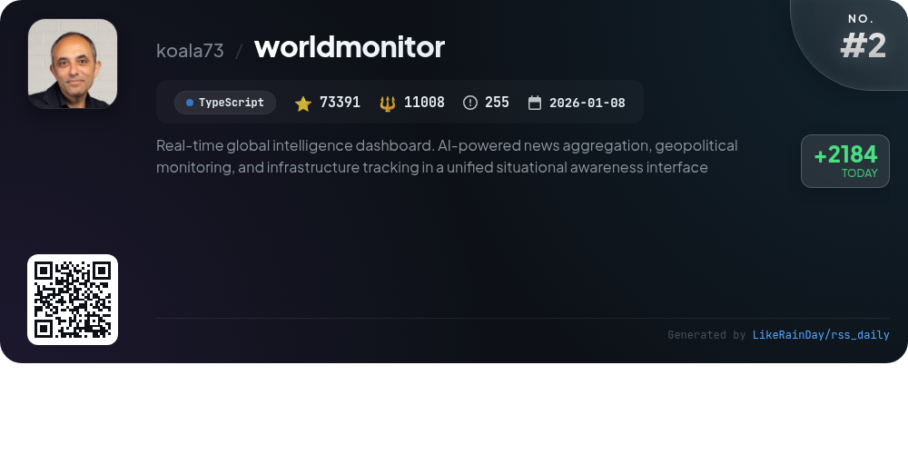
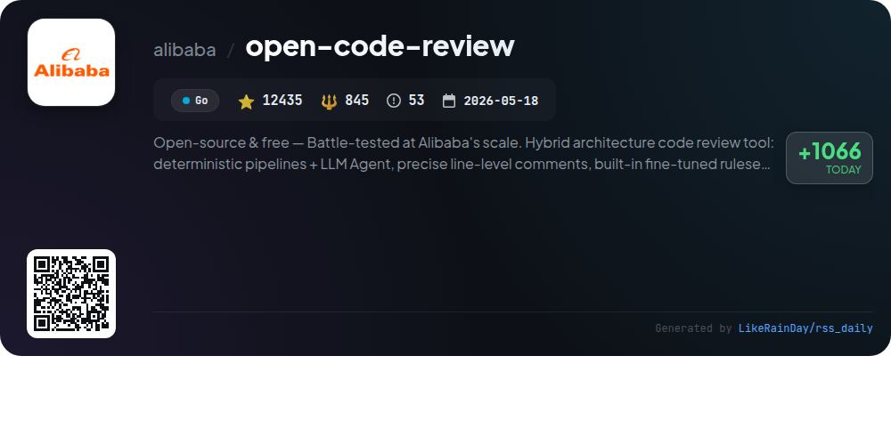
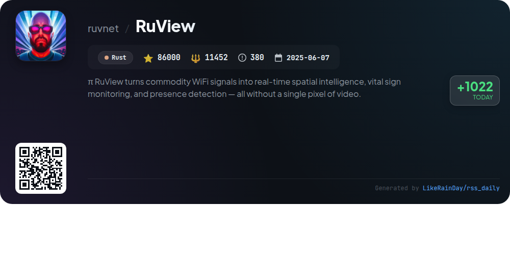
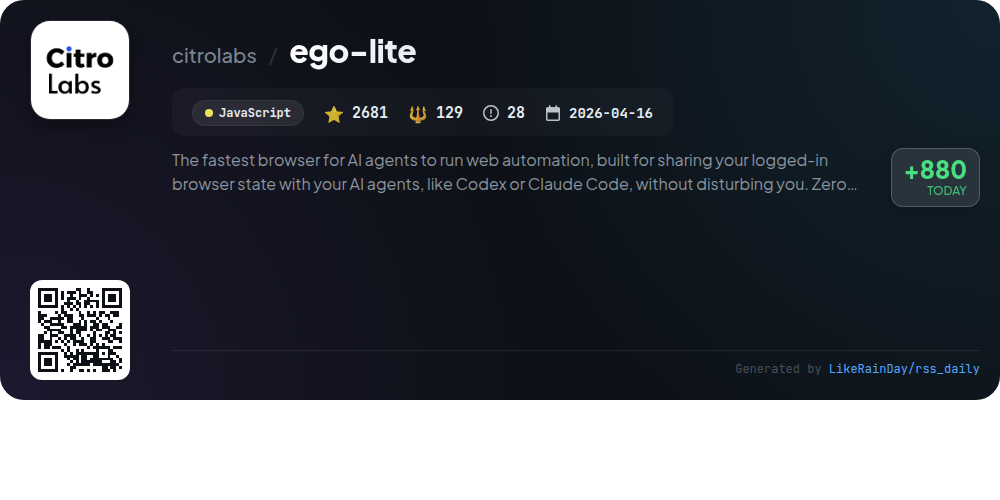
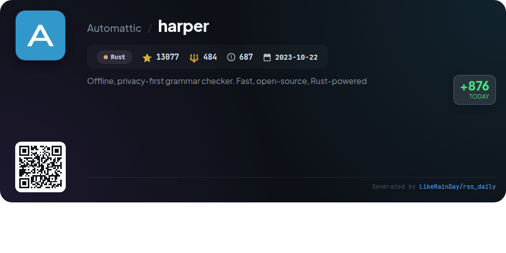
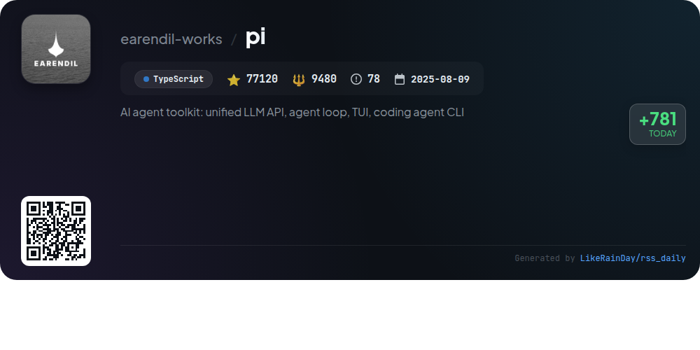
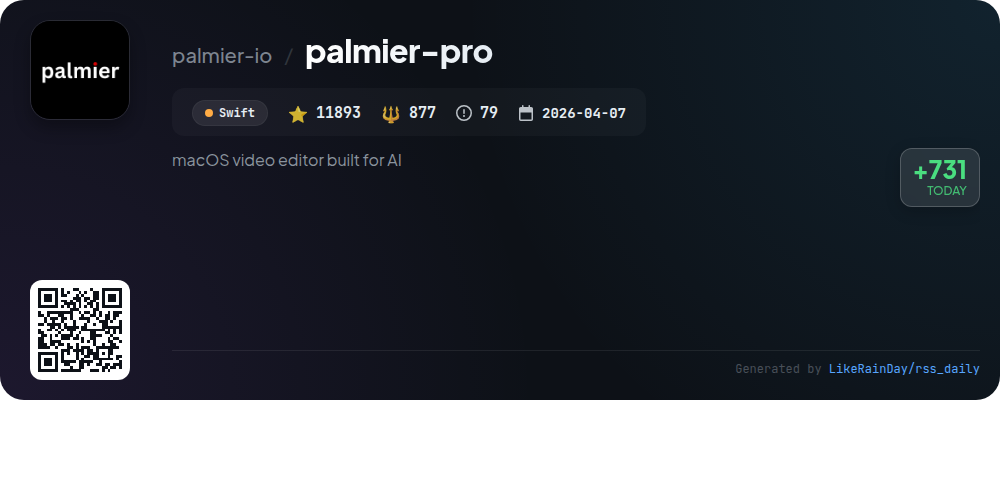
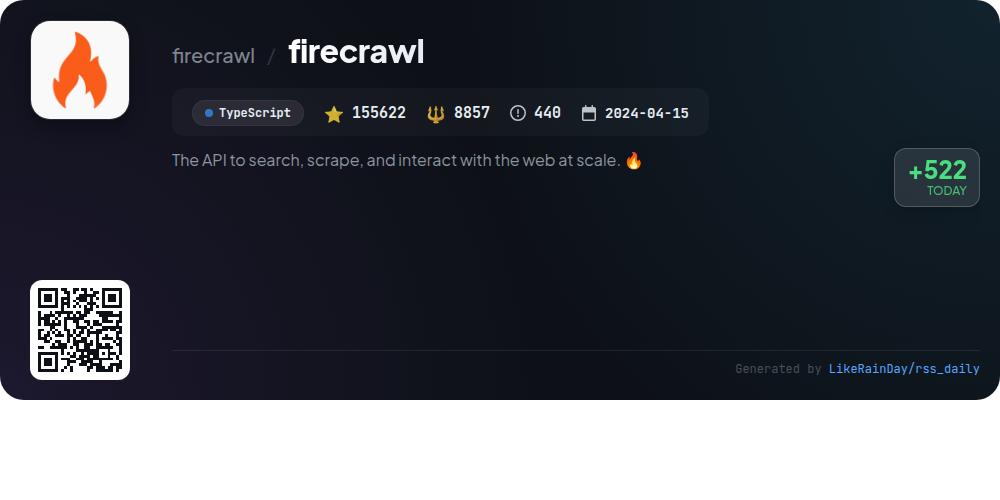

# 📊 🌟 GitHub Trending Daily - 2026-07-25

> > 📅 每日精选 GitHub 热门仓库 | 基于智能算法推荐

## 📋 Overview

**10** 个项目 | **471364** ⭐ | **47721** 🍴

**热门语言:** `TypeScript` (4) · `Rust` (3) · `Go` (1)

**更新时间:** 2026-07-25 03:22 UTC

**分类分布:**

- 🌟 每日 Top 10 精选 (10 项)

---

## 🌟 每日 Top 10 精选

### 1. [buzz](https://github.com/block/buzz)

> 🤖 **推荐理由**  
> *Buzz is a self-hostable hive mind communication platform where humans and AI agents collaborate seamlessly within a shared workspace. With features like event logging, scoped agent actions, and the ability to turn feature branches into dedicated rooms, Buzz centralizes project memory and workflows. Users can search conversations, code reviews, and approvals in one place, ensuring a cohesive audit trail. Key services include a desktop app, buzz-cli for agent interactions, and YAML-based workflows, all built on a Rust foundation. Buzz aims to enhance teamwork by integrating communication, code management, and AI capabilities in a single environment.*

- ⭐ 10168 stars
- 💻 Rust
- 📅 Updated: 2026-07-25

### 2. [worldmonitor](https://github.com/koala73/worldmonitor)

> 🤖 **推荐理由**  
> *World Monitor is a real-time global intelligence dashboard that aggregates news, monitors geopolitics, and tracks infrastructure through a unified interface. Key features include over 500 curated news feeds, a dual map engine (3D globe and flat map), a Country Instability Index, and a finance radar covering stock exchanges and commodities. It offers six site variants, a native desktop app for macOS, Windows, and Linux, and supports 25 languages. Built with TypeScript, it provides programmatic access via REST API, CLI, and SDKs in Python, Ruby, and Go.*

- ⭐ 73391 stars
- 💻 TypeScript
- 📅 Updated: 2026-07-25

### 3. [OmniRoute](https://github.com/diegosouzapw/OmniRoute)

> 🤖 **推荐理由**  
> *OmniRoute is a free MIT-licensed AI gateway that consolidates access to over 290 providers, including 90+ free options, and more than 500 models like Kimi, Claude, and GPT. It supports various coding tools with quota-aware auto-fallback and employs advanced RTK+Caveman compression to save 15-95% in token usage. Key features include seamless integration with popular CLIs, a robust dashboard for monitoring free tier usage, and a user-friendly setup requiring no API keys. Built by over 500 contributors, OmniRoute is designed for efficient and cost-effective AI-driven development.*

- ⭐ 28977 stars
- 💻 TypeScript
- 📅 Updated: 2026-07-25

### 4. [open-code-review](https://github.com/alibaba/open-code-review)

> 🤖 **推荐理由**  
> *Open-source & free — Battle-tested at Alibaba's scale. Hybrid architecture code review tool: deterministic pipelines + LLM Agent, precise line-level. popular project, actively maintained, recently updated*

- ⭐ 12435 stars
- 🍴 845 forks
- 💻 Go
- 📅 Updated: 2026-07-25

### 5. [RuView](https://github.com/ruvnet/RuView)

> 🤖 **推荐理由**  
> *RuView transforms commodity WiFi signals into real-time spatial intelligence, enabling presence detection, vital sign monitoring, and activity recognition without cameras or wearables. Key features include through-wall sensing, multi-person counting, and sleep quality monitoring using low-cost ESP32 sensors. It integrates seamlessly with major smart-home ecosystems like Home Assistant, Apple Home, Google Home, and Alexa. RuView operates on edge hardware, ensuring privacy and requiring no internet, making it ideal for various applications, including healthcare and smart homes.*

- ⭐ 86000 stars
- 💻 Rust
- 📅 Updated: 2026-07-25

### 6. [ego-lite](https://github.com/citrolabs/ego-lite)

> 🤖 **推荐理由**  
> *ego-lite is a fast browser designed for AI agents to perform web automation while allowing users to maintain their browsing experience. Key features include dedicated Spaces for each agent, enabling parallel multitasking without interference, and a high-quality page Snapshot for accurate webpage interaction. It seamlessly inherits Chrome data, requires zero configuration, and is free to use. With its JavaScript-based capabilities, ego-lite significantly speeds up complex tasks, achieving results up to 2.5× faster than traditional automation frameworks. Currently available for macOS, with Windows and Linux support in the pipeline.*

- ⭐ 2681 stars
- 💻 JavaScript
- 📅 Updated: 2026-07-25

### 7. [harper](https://github.com/Automattic/harper)

> 🤖 **推荐理由**  
> *Harper is an offline, privacy-first English grammar checker built with Rust, designed for speed and efficiency. It outperforms competitors like Grammarly and LanguageTool by providing rapid linting in milliseconds while using significantly less memory. Harper ensures user privacy, as it processes everything locally without sending data to servers. Currently supporting English, it features extensibility for future language support. Harper integrates seamlessly with various editors, including Visual Studio Code, Neovim, and Emacs. With over 13,000 stars on GitHub, it stands as a robust, open-source solution for grammar checking.*

- ⭐ 13077 stars
- 💻 Rust
- 📅 Updated: 2026-07-25

### 8. [pi](https://github.com/earendil-works/pi)

> 🤖 **推荐理由**  
> *Pi is an AI agent toolkit featuring a unified LLM API, agent loop, and an interactive coding agent CLI. It includes three core packages: **@earendil-works/pi-ai** for multi-provider LLM integration (OpenAI, Anthropic, Google), **@earendil-works/pi-agent-core** for agent runtime and state management, and **@earendil-works/pi-coding-agent** for a coding assistant CLI. The project supports containerization for enhanced security and offers a terminal UI library. Engaged community support is available through Discord, with extensive documentation at pi.dev.*

- ⭐ 77120 stars
- 💻 TypeScript
- 📅 Updated: 2026-07-25

### 9. [palmier-pro](https://github.com/palmier-io/palmier-pro)

> 🤖 **推荐理由**  
> *Palmier Pro is an open-source macOS video editor designed for AI integration, built with Swift. It features a timeline editor allowing users to collaborate with AI agents to generate and edit videos. Key highlights include built-in generative AI capabilities using advanced models, seamless integration with agents like Claude and Codex via an MCP server, and a user-friendly interface. While the core editor is free, generative AI features require a subscription. Palmier Pro supports macOS 26 (Tahoe) on Apple Silicon, making it a powerful tool for modern video editing.*

- ⭐ 11893 stars
- 💻 Swift
- 📅 Updated: 2026-07-25

### 10. [firecrawl](https://github.com/firecrawl/firecrawl)

> 🤖 **推荐理由**  
> *Firecrawl is a powerful API designed for efficient web search, scraping, and interaction at scale. Key features include industry-leading reliability with 96% web coverage, fast response times (P95 latency of 3.4s), and LLM-ready output formats like clean Markdown and structured JSON. Core services encompass web searching, content scraping, automated data gathering with AI agents, and comprehensive website crawling. Firecrawl also supports media parsing and real-time interactions, making it ideal for dynamic applications. The project is open source and easily integrable with various AI tools.*

- ⭐ 155622 stars
- 💻 TypeScript
- 📅 Updated: 2026-07-25

---

## 📡 RSS订阅

通过 RSS 订阅，第一时间获取每日精选项目：

- 🔔 [RSS 订阅源] (../../daily-top.xml)
- 🔔 [每日简报] (../../GITHUB_TODAY_CN.md)
- 🔔 [每日 Top 10 精选](../../daily-top.xml)

---

*⚡ Powered by Smart Trending Algorithm | Generated at 2026-07-25 03:22:25 UTC
