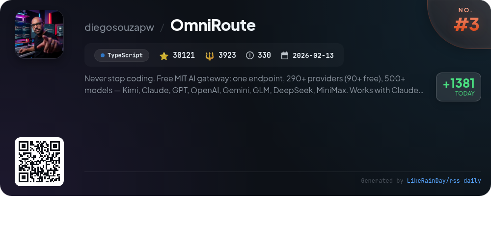
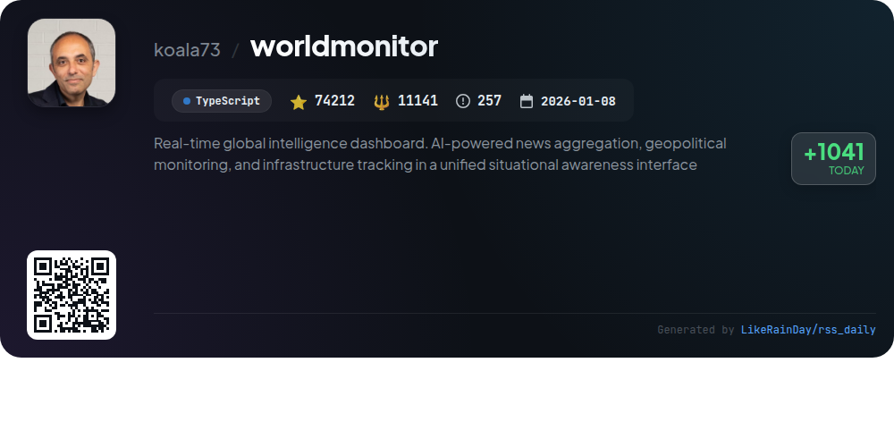
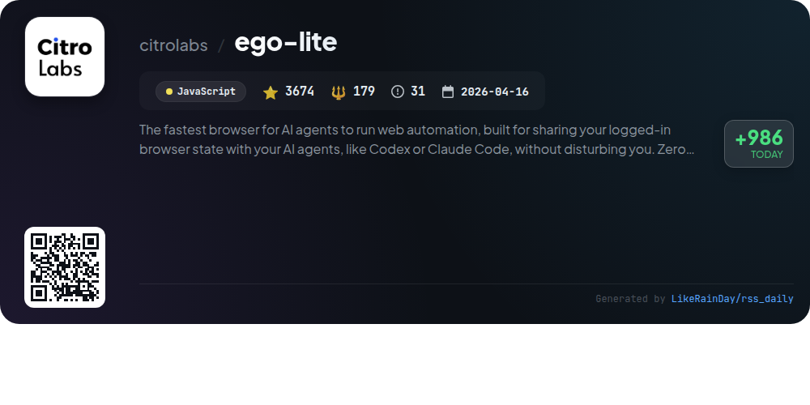
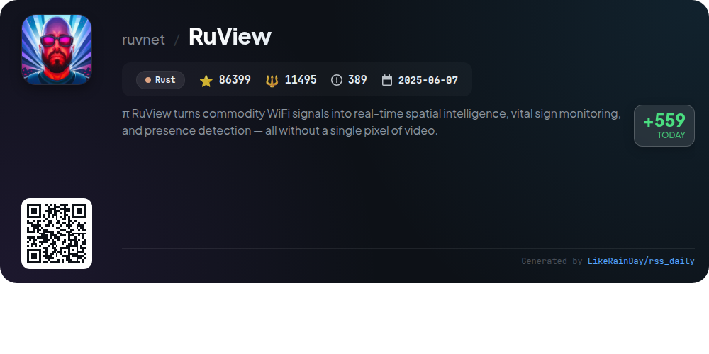
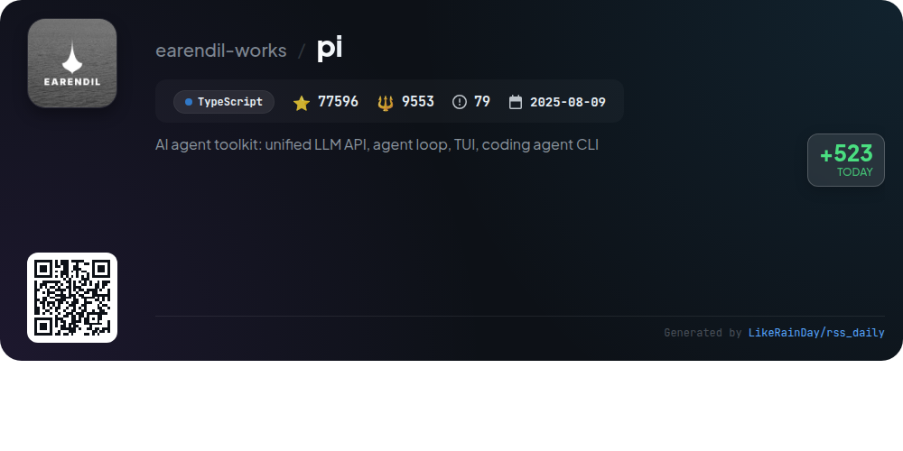
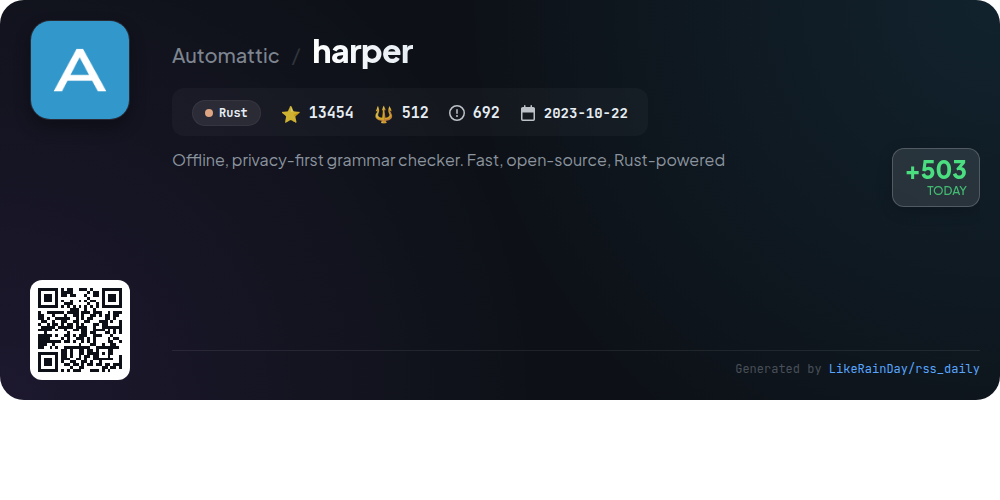
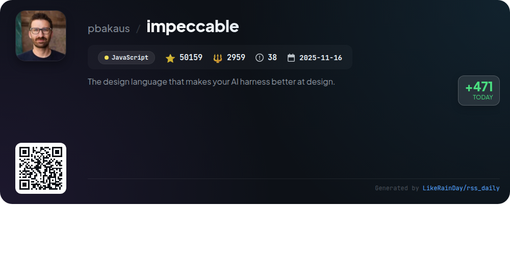

# 📊 🌟 GitHub Trending Daily - 2026-07-26

> > 📅 每日精选 GitHub 热门仓库 | 基于智能算法推荐

## 📋 Overview

**10** 个项目 | **396380** ⭐ | **45684** 🍴

**热门语言:** `Rust` (3) · `TypeScript` (3) · `JavaScript` (2)

**更新时间:** 2026-07-26 03:36 UTC

**分类分布:**

- 🌟 每日 Top 10 精选 (10 项)

---

## 🌟 每日 Top 10 精选

### 1. [buzz](https://github.com/block/buzz)

> 🤖 **推荐理由**  
> *Buzz is a self-hostable hive mind communication platform that facilitates collaboration between humans and AI agents within a single workspace. Key features include event logging for messages, code reviews, and workflows, with agents acting as full team members capable of executing tasks like triaging bugs and managing releases. It supports rich media interactions, searchable audit trails, and community-specific identities. Built in Rust, Buzz offers a unified protocol for seamless integration of communication, project management, and AI capabilities, making it a powerful tool for modern development teams.*

- ⭐ 12076 stars
- 💻 Rust
- 📅 Updated: 2026-07-26

### 2. [bitchat](https://github.com/permissionlesstech/bitchat)

> 🤖 **推荐理由**  
> *bitchat is a decentralized peer-to-peer messaging app that combines Bluetooth mesh networks for offline communication and the Nostr protocol for global messaging. Key features include intelligent message routing, location-based channels, and end-to-end encryption using Noise Protocol and NIP-17. The app supports both iOS and macOS, offers a familiar IRC-style command interface, and prioritizes user privacy with no accounts or phone numbers required. Its hybrid architecture ensures reliable communication in various scenarios, including emergencies and remote areas.*

- ⭐ 28791 stars
- 💻 Swift
- 📅 Updated: 2026-07-26

### 3. [OmniRoute](https://github.com/diegosouzapw/OmniRoute)

> 🤖 **推荐理由**  
> *OmniRoute is an open-source, MIT-licensed AI gateway that consolidates over 290 AI providers (90+ free) and 500+ models, including Kimi, Claude, and GPT, through a single endpoint. Key features include quota-aware auto-fallback, intelligent routing across 19 strategies, and advanced token compression saving 15-95%. It supports various coding tools like Codex and Copilot with zero configuration required. Built by over 500 contributors, OmniRoute is designed for seamless integration, cost-effectiveness, and efficiency in AI development.*

- ⭐ 30121 stars
- 💻 TypeScript
- 📅 Updated: 2026-07-26

### 4. [worldmonitor](https://github.com/koala73/worldmonitor)

> 🤖 **推荐理由**  
> *World Monitor is a real-time global intelligence dashboard that aggregates news, monitors geopolitical events, and tracks infrastructure using AI. Key features include over 500 curated news feeds across 15 categories, a dual map engine with 3D and flat maps, a Country Instability Index for 31 countries, and a finance radar covering various markets. The platform offers six site variants from a single codebase and a native desktop app for macOS, Windows, and Linux. It supports 25 languages and provides programmatic access via APIs and SDKs.*

- ⭐ 74212 stars
- 💻 TypeScript
- 📅 Updated: 2026-07-26

### 5. [ego-lite](https://github.com/citrolabs/ego-lite)

> 🤖 **推荐理由**  
> *ego-lite is a high-speed browser designed for seamless web automation by AI agents, allowing users to maintain their browsing experience without interruption. Key features include isolated workspaces for each agent, parallel multitasking, and minimal setup. The `ego-browser` skill enables agents to perform tasks using JavaScript functions, enhancing efficiency and reducing costs. With superior page snapshots and local data storage, ego-lite stands out as a comprehensive solution for AI-driven browsing. Currently available for macOS, with Windows and Linux support planned.*

- ⭐ 3674 stars
- 💻 JavaScript
- 📅 Updated: 2026-07-26

### 6. [superfile](https://github.com/yorukot/superfile)

> 🤖 **推荐理由**  
> *superfile is a modern terminal file manager crafted in Go, boasting a user-friendly interface and a range of powerful features. It supports macOS, Linux, and Windows, offering easy installation via scripts and package managers. Key highlights include customizable themes, extensive plugin support, and hotkey configurations tailored for Vim users. An automatic update function ensures users have the latest version. With a strong community backing and active development, superfile has garnered nearly 20,000 stars on GitHub, marking it as a valuable tool for terminal enthusiasts.*

- ⭐ 19898 stars
- 💻 Go
- 📅 Updated: 2026-07-26

### 7. [RuView](https://github.com/ruvnet/RuView)

> 🤖 **推荐理由**  
> *RuView is a cutting-edge WiFi sensing platform that converts standard WiFi signals into real-time spatial intelligence, vital sign monitoring, and presence detection without cameras or wearables. Key features include through-wall occupancy detection, breathing and heart rate monitoring, and activity recognition using low-cost ESP32 devices. The system integrates seamlessly with major smart home ecosystems like Home Assistant, Apple Home, Google Home, and Amazon Alexa. Built on Rust, it leverages local edge processing for privacy and efficiency, making it ideal for applications in healthcare, retail, and smart homes.*

- ⭐ 86399 stars
- 💻 Rust
- 📅 Updated: 2026-07-26

### 8. [pi](https://github.com/earendil-works/pi)

> 🤖 **推荐理由**  
> *Pi is an AI agent toolkit that provides a unified LLM API, an interactive coding agent CLI, and a terminal UI library, all built in TypeScript. Key features include the multi-provider LLM API for OpenAI and Google, an agent runtime for tool calling and state management, and a self-extensible coding agent. With over 77,000 stars, it supports various automation workflows and offers containerization options for enhanced security. Developers can easily contribute, with clear guidelines and an emphasis on secure dependency management. Visit pi.dev for more information and demos.*

- ⭐ 77596 stars
- 💻 TypeScript
- 📅 Updated: 2026-07-26

### 9. [harper](https://github.com/Automattic/harper)

> 🤖 **推荐理由**  
> *Harper is a fast, offline, privacy-first grammar checker built with Rust, designed to address the limitations of existing solutions like Grammarly and LanguageTool. With a minimal memory footprint and lightning-fast performance, Harper checks documents in milliseconds while ensuring user privacy by processing everything locally. Currently supporting English, Harper is extensible for additional languages. It integrates seamlessly with popular editors like Visual Studio Code, Neovim, and Emacs. The project is open-source and welcomes contributions to enhance its capabilities.*

- ⭐ 13454 stars
- 💻 Rust
- 📅 Updated: 2026-07-26

### 10. [impeccable](https://github.com/pbakaus/impeccable)

> 🤖 **推荐理由**  
> *Impeccable is a design language tool for AI coding agents, featuring 23 commands and 60 deterministic detector rules to enhance AI-generated frontend design. Key features include a streamlined setup flow with `/impeccable init`, commands for design critique, auditing, and polishing, and a live browser iteration mode. It helps maintain design quality by detecting anti-patterns and missteps in UI/UX. Supported on platforms like Claude Code, GitHub Copilot, and Codex, Impeccable empowers developers to create refined, user-centric designs efficiently. Full documentation is available at impeccable.style.*

- ⭐ 50159 stars
- 💻 JavaScript
- 📅 Updated: 2026-07-26

---

## 📡 RSS订阅

通过 RSS 订阅，第一时间获取每日精选项目：

- 🔔 [RSS 订阅源] (../../daily-top.xml)
- 🔔 [每日简报] (../../GITHUB_TODAY_CN.md)
- 🔔 [每日 Top 10 精选](../../daily-top.xml)

---

*⚡ Powered by Smart Trending Algorithm | Generated at 2026-07-26 03:36:12 UTC
