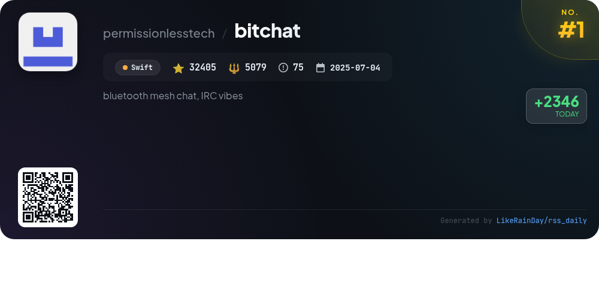
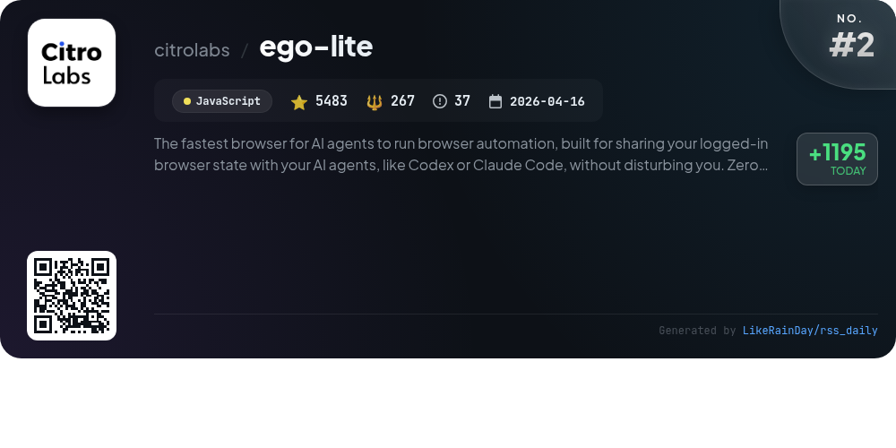
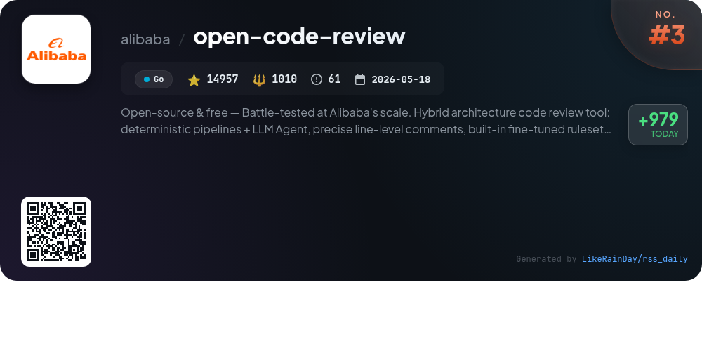
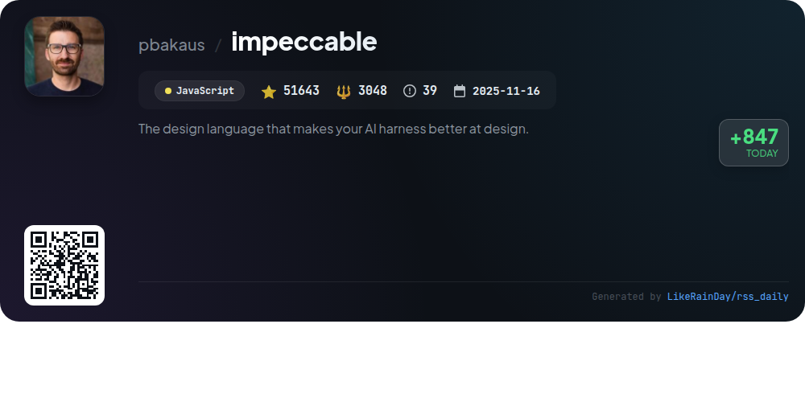
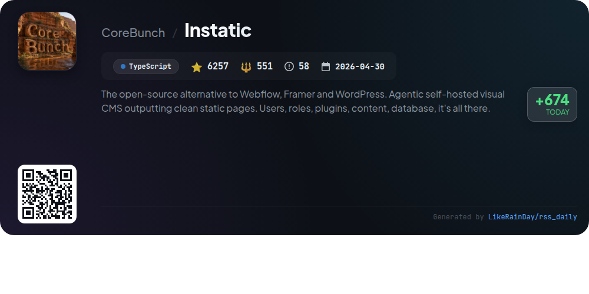
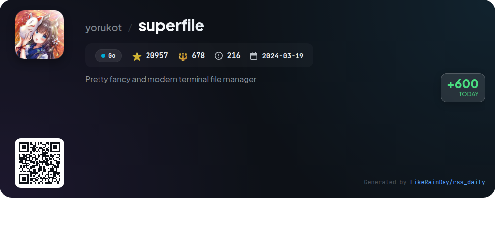
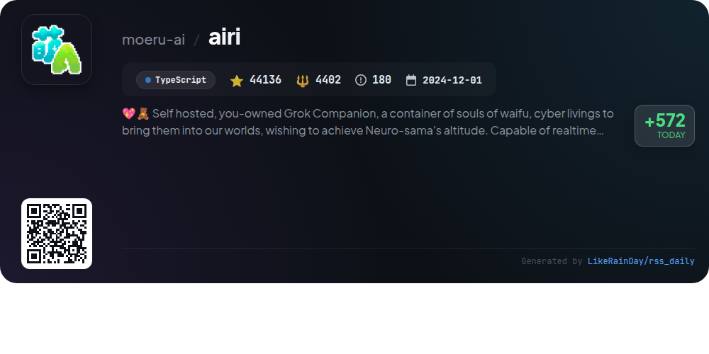
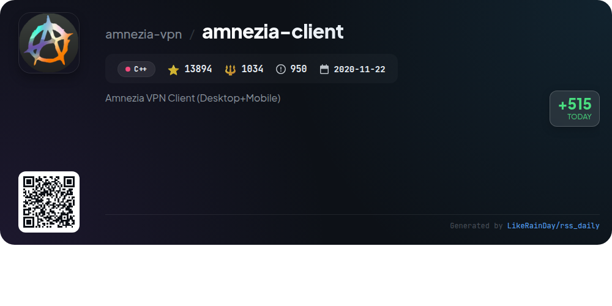
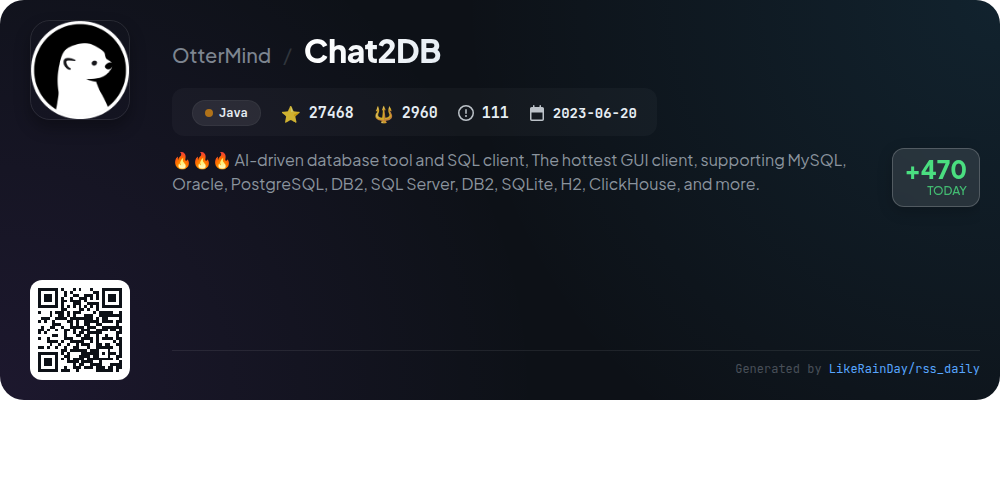
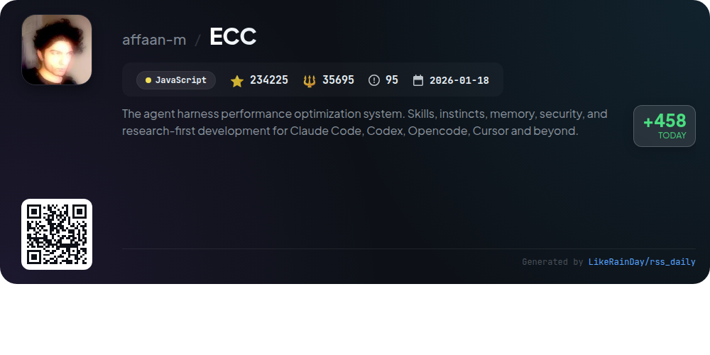

# 📊 🌟 GitHub Trending Daily - 2026-07-28

> > 📅 Daily Picks of GitHub Trending Repositories | Powered by Smart Algorithms

## 📋 Overview

**10** Projects | **451425** ⭐ | **54724** 🍴

**Top Languages:** `JavaScript` (3) · `Go` (2) · `TypeScript` (2)

**Updated:** 2026-07-28 03:00 UTC

**Categories:**

- 🌟 Daily Top 10 (10 items)

---

## 🌟 Daily Top 10

### 1. [bitchat](https://github.com/permissionlesstech/bitchat)

> 🤖 **Why Recommend**  
> *bitchat is a decentralized peer-to-peer messaging app that combines Bluetooth mesh networks for offline communication with the internet-based Nostr protocol for global connectivity. Key features include dual transport architecture, location-based channels, intelligent message routing, and end-to-end encryption. Users benefit from a privacy-first approach with no accounts required, along with IRC-style commands for familiar interaction. The app supports iOS and macOS, ensuring versatile usage. Emergency wipe functionality and performance optimizations enhance user experience, making bitchat ideal for secure, local, and global messaging.*

- ⭐ 32405 stars
- 💻 Swift
- 📅 Updated: 2026-07-28

### 2. [ego-lite](https://github.com/citrolabs/ego-lite)

> 🤖 **Why Recommend**  
> *ego-lite is a high-speed browser designed for seamless AI agent automation. It allows users to share their logged-in browser state with agents like Codex or Claude Code, ensuring parallel task execution without interference. Key features include dedicated workspaces for each agent, high-quality page snapshots, and a JavaScript-based connection layer (`ego-browser`) for efficient task management. With zero configuration and easy setup, ego-lite enhances automation speed by up to 2.5x compared to traditional frameworks. Currently available for macOS, with Windows and Linux support planned.*

- ⭐ 5483 stars
- 💻 JavaScript
- 📅 Updated: 2026-07-28

### 3. [open-code-review](https://github.com/alibaba/open-code-review)

> 🤖 **Why Recommend**  
> *Open-source & free — Battle-tested at Alibaba's scale. Hybrid architecture code review tool: deterministic pipelines + LLM Agent, precise line-level. popular project, actively maintained, recently updated*

- ⭐ 14957 stars
- 🍴 1010 forks
- 💻 Go
- 📅 Updated: 2026-07-28

### 4. [impeccable](https://github.com/pbakaus/impeccable)

> 🤖 **Why Recommend**  
> *Impeccable is a JavaScript design language for AI coding agents, boasting 51,643 stars. It provides design guidance with one setup command, 23 commands for various design tasks, and 60 deterministic detector rules for AI-generated frontend design. Key features include live browser iteration, project context setup, and a shared design vocabulary. It supports multiple AI tools like Claude Code and GitHub Copilot. Installation is seamless via `npx impeccable install`, enhancing design quality while avoiding common anti-patterns. Full documentation is available at [impeccable.style](https://impeccable.style).*

- ⭐ 51643 stars
- 💻 JavaScript
- 📅 Updated: 2026-07-28

### 5. [Instatic](https://github.com/CoreBunch/Instatic)

> 🤖 **Why Recommend**  
> *Instatic is an open-source visual CMS that serves as a self-hosted alternative to platforms like Webflow, Framer, and WordPress. Built on a single Bun server, it combines a visual editor, content engine, and publisher, producing clean static pages comprised of semantic HTML and compact CSS. Key features include a powerful design framework, a modular component system, integrated forms, and a plugin architecture. It supports SQLite and Postgres databases, offers one-click deployment, and ensures robust user management with MFA and audit logs. Ideal for developers and content creators seeking full control over their sites.*

- ⭐ 6257 stars
- 💻 TypeScript
- 📅 Updated: 2026-07-28

### 6. [superfile](https://github.com/yorukot/superfile)

> 🤖 **Why Recommend**  
> *superfile is a modern terminal file manager developed in Go, designed for efficient file management across macOS, Linux, and Windows. With over 20,900 stars on GitHub, it offers a sleek user interface, customizable themes, and a robust plugin system. Key features include hotkey support, auto-update functionality, and straightforward installation scripts for multiple platforms. Users can quickly perform common operations through an intuitive command-line experience. The project is community-supported, inviting contributions and offering comprehensive documentation for setup and usage.*

- ⭐ 20957 stars
- 💻 Go
- 📅 Updated: 2026-07-28

### 7. [airi](https://github.com/moeru-ai/airi)

> 🤖 **Why Recommend**  
> *Project AIRI is a self-hosted, open-source AI companion inspired by Neuro-sama, designed to bring virtual characters, or "cyber waifus," into users' lives. It supports real-time voice chat and can engage in games like Minecraft and Factorio. The platform is compatible with web, macOS, and Windows. Key features include multi-provider voice synthesis, VRM and Live2D model support, and integration with various LLM APIs. AIRI emphasizes user ownership of digital companions, making it a robust solution for interactive AI experiences.*

- ⭐ 44136 stars
- 💻 TypeScript
- 📅 Updated: 2026-07-28

### 8. [amnezia-client](https://github.com/amnezia-vpn/amnezia-client)

> 🤖 **Why Recommend**  
> *Amnezia VPN Client is an open-source VPN solution for desktop and mobile, enabling users to self-host their own VPN servers effortlessly. Key features include easy setup by simply entering an IP address and SSH credentials, support for popular protocols like OpenVPN, WireGuard, and IKEv2, and traffic obfuscation options. It offers split tunneling for selective app or site access, and is available on Windows, macOS, Linux, Android, and iOS. With robust documentation and community support, Amnezia is designed for both ease of use and advanced functionality.*

- ⭐ 13894 stars
- 💻 C++
- 📅 Updated: 2026-07-28

### 9. [Chat2DB](https://github.com/OtterMind/Chat2DB)

> 🤖 **Why Recommend**  
> *Chat2DB is an AI-driven database client and SQL workspace supporting over 30 databases, including MySQL, PostgreSQL, Oracle, and more. It features a full SQL workspace for editing and managing queries, an AI assistant for SQL generation and optimization, and tools for data import/export and visualization through dashboards and charts. Available as a free, cross-platform application, Chat2DB offers both community and commercial editions, enhancing database management for developers, DBAs, and analysts. It runs locally and emphasizes user security with encryption for sensitive data.*

- ⭐ 27468 stars
- 💻 Java
- 📅 Updated: 2026-07-28

### 10. [ECC](https://github.com/affaan-m/ECC)

> 🤖 **Why Recommend**  
> *ECC is an advanced agent harness performance optimization system designed to enhance coding workflows. It integrates over 67 specialized agents and 281 reusable skills, focusing on planning, testing, security, and review processes. ECC supports multiple platforms, including Claude Code and Codex, with features like AgentShield for security audits, memory persistence, and continuous learning. Users can optimize their coding efficiency through structured workflows, automated hooks, and a comprehensive command catalog. The project is open-source and community-supported, ensuring ongoing enhancements and collaboration.*

- ⭐ 234225 stars
- 💻 JavaScript
- 📅 Updated: 2026-07-28

---

## 📡 RSS Subscription

Subscribe via RSS to get daily trending updates:

- 🔔 [RSS XML] (../../daily-top.xml)
- 🔔 [Daily Report] (../../GITHUB_TODAY.md)
- 🔔 [Daily Top 10](../../daily-top.xml)

---

*⚡ Powered by Smart Trending Algorithm | Generated at 2026-07-28 03:00:23 UTC
