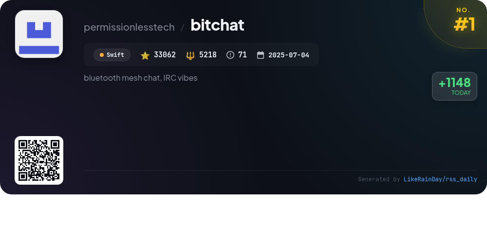
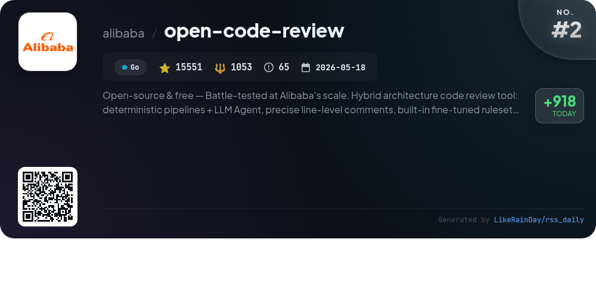
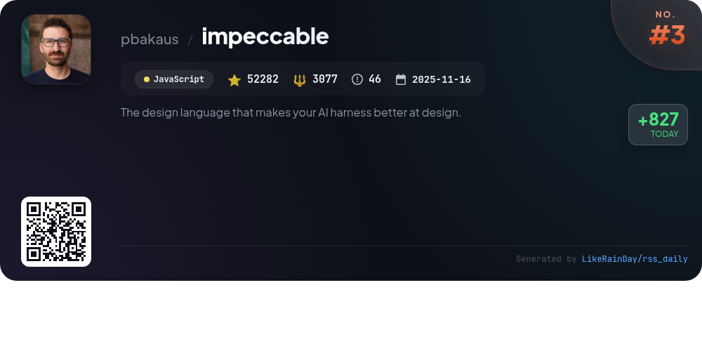
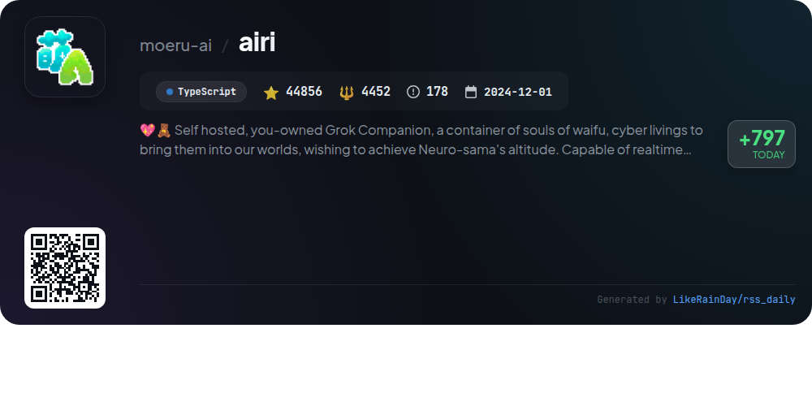
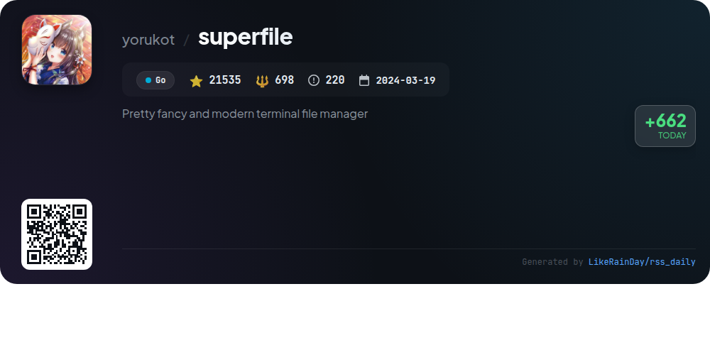
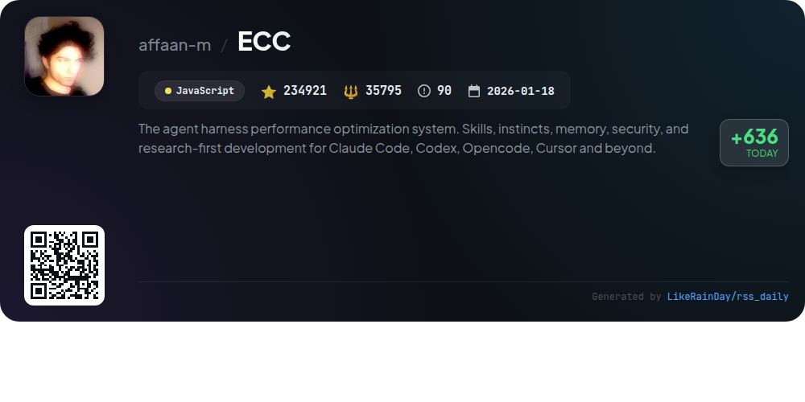
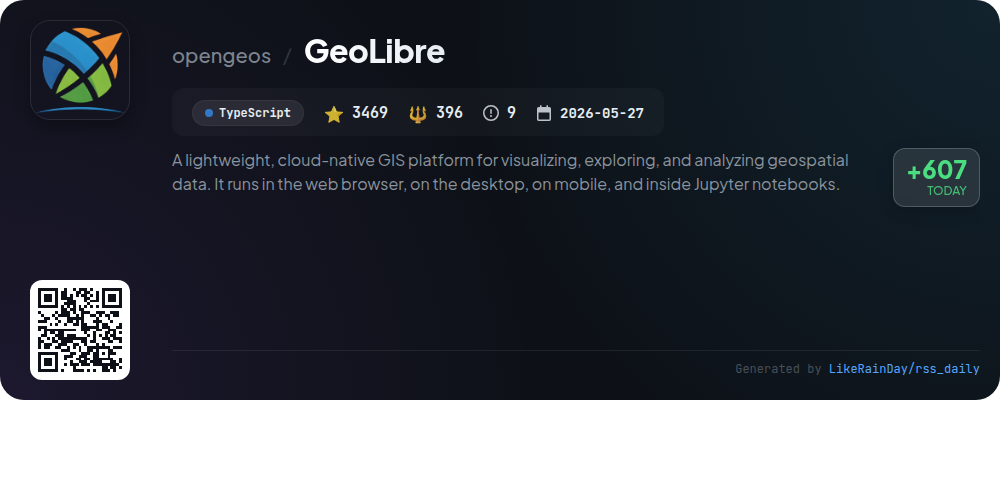
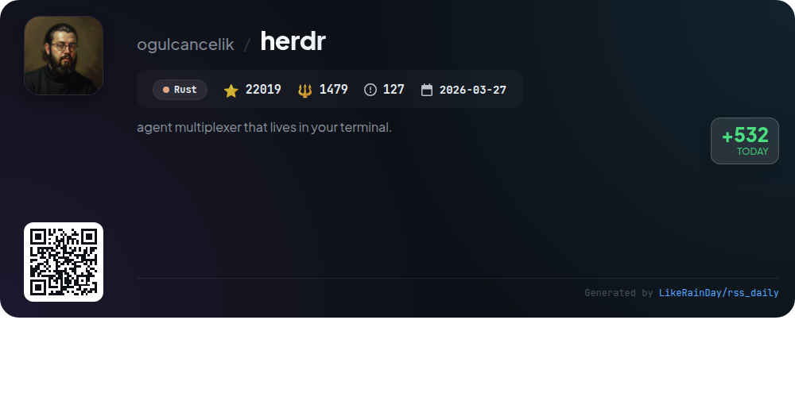
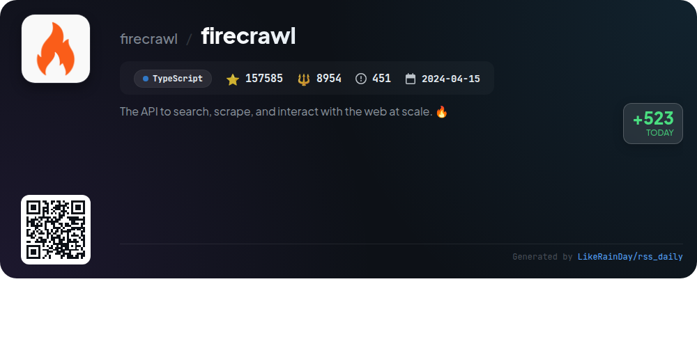
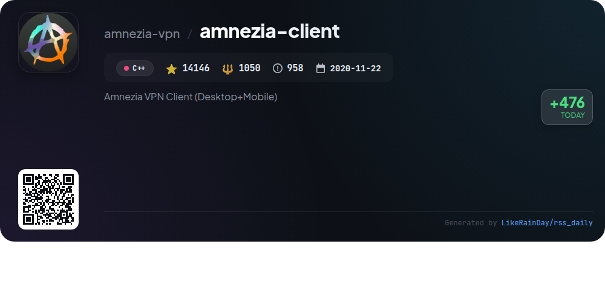

# 📊 🌟 GitHub Trending Daily - 2026-07-29

> > 📅 每日精选 GitHub 热门仓库 | 基于智能算法推荐

## 📋 Overview

**10** 个项目 | **599426** ⭐ | **62172** 🍴

**热门语言:** `TypeScript` (3) · `Go` (2) · `JavaScript` (2)

**更新时间:** 2026-07-29 03:19 UTC

**分类分布:**

- 🌟 每日 Top 10 精选 (10 项)

---

## 🌟 每日 Top 10 精选

### 1. [bitchat](https://github.com/permissionlesstech/bitchat)

> 🤖 **推荐理由**  
> *bitchat is a decentralized peer-to-peer messaging app that combines Bluetooth mesh and Nostr protocols for seamless communication. With no accounts or servers needed, it offers offline messaging via local Bluetooth and global reach through the internet. Key features include intelligent message routing, location-based channels, end-to-end encryption, and an IRC-style command interface. The app supports native iOS and macOS platforms, ensuring privacy and reliability in diverse scenarios, from local gatherings to global discussions. Emergency data wipe and performance optimizations enhance user experience.*

- ⭐ 33062 stars
- 💻 Swift
- 📅 Updated: 2026-07-29

### 2. [open-code-review](https://github.com/alibaba/open-code-review)

> 🤖 **推荐理由**  
> *Open-source & free — Battle-tested at Alibaba's scale. Hybrid architecture code review tool: deterministic pipelines + LLM Agent, precise line-level. popular project, actively maintained, recently updated*

- ⭐ 15551 stars
- 🍴 1053 forks
- 💻 Go
- 📅 Updated: 2026-07-29

### 3. [impeccable](https://github.com/pbakaus/impeccable)

> 🤖 **推荐理由**  
> *Impeccable is a JavaScript design language tool for AI coding agents, featuring 23 commands and 60 deterministic design rules to enhance frontend design quality. Key features include a streamlined setup process with `/impeccable init`, a shared design vocabulary for effective communication with AI, and capabilities for design audits, critiques, and final polish. The tool integrates with various AI platforms like Claude Code and GitHub Copilot, allowing for real-time feedback and improvements. For installation, simply run `npx impeccable install`. Full documentation is available at impeccable.style.*

- ⭐ 52282 stars
- 💻 JavaScript
- 📅 Updated: 2026-07-29

### 4. [airi](https://github.com/moeru-ai/airi)

> 🤖 **推荐理由**  
> *AIRI is a self-hosted AI companion project designed to recreate Neuro-sama, offering users their own digital waifu or virtual character. Key features include real-time voice chat and gaming capabilities with popular titles like Minecraft and Factorio. AIRI supports multiple platforms (Web, macOS, Windows) and integrates advanced AI technologies, enabling users to engage in immersive conversations and gaming experiences. With a strong community and ongoing development, AIRI aims to enhance digital companionship through innovative tech. The project has garnered significant attention, achieving over 44,000 stars on GitHub.*

- ⭐ 44856 stars
- 💻 TypeScript
- 📅 Updated: 2026-07-29

### 5. [superfile](https://github.com/yorukot/superfile)

> 🤖 **推荐理由**  
> *superfile is a modern terminal file manager written in Go, designed for efficiency and usability. It boasts features like customizable themes, hotkeys, and support for plugins, enhancing user experience. With auto-update functionality, it ensures users have the latest version effortlessly. superfile supports macOS, Linux, and Windows (partially), and offers straightforward installation scripts for each platform. The project is community-driven, with a dedicated Discord channel for support and collaboration. With over 21,500 stars, it is a popular choice among developers.*

- ⭐ 21535 stars
- 💻 Go
- 📅 Updated: 2026-07-29

### 6. [ECC](https://github.com/affaan-m/ECC)

> 🤖 **推荐理由**  
> *ECC is a performance optimization system designed for coding agents, providing a structured toolbox for planning, testing, and reviewing code. It features 67 specialized agents, 281 skills, and 94 command shims, enabling workflows like Test-Driven Development (TDD) and security reviews. Key highlights include AgentShield for security auditing, a unified memory vault for context sharing across harnesses, and integration with multiple platforms like Claude Code, Codex, and GitHub Copilot. ECC is MIT-licensed and actively maintained, with a strong community for support and collaboration.*

- ⭐ 234921 stars
- 💻 JavaScript
- 📅 Updated: 2026-07-29

### 7. [GeoLibre](https://github.com/opengeos/GeoLibre)

> 🤖 **推荐理由**  
> *GeoLibre is a lightweight, cloud-native GIS platform designed for visualizing, exploring, and analyzing geospatial data across web browsers, desktops, mobiles, and Jupyter notebooks. Built with TypeScript, React, and MapLibre GL JS, it ensures data privacy by keeping it local. Key features include 3D visualization, planetary basemaps, and a SQL workspace for geoprocessing. With 3,469 stars on GitHub, GeoLibre offers extensive documentation, tutorials, and downloadable desktop apps for Windows, macOS, and Linux, making it a versatile tool for geospatial analysis.*

- ⭐ 3469 stars
- 💻 TypeScript
- 📅 Updated: 2026-07-29

### 8. [herdr](https://github.com/ogulcancelik/herdr)

> 🤖 **推荐理由**  
> *Herdr is a terminal-based agent multiplexer built in Rust, designed for efficient task management. It allows users to monitor agent statuses—blocked, working, done—in real-time, and supports session persistence, enabling agents to run even when detached. Herdr features a pure socket API for agent communication, tmux-style keyboard shortcuts, and mouse interactions for seamless navigation. With plugin support to enhance workflows and a single binary without Electron dependencies, Herdr delivers a lightweight yet powerful terminal experience. For more details, visit herdr.dev.*

- ⭐ 22019 stars
- 💻 Rust
- 📅 Updated: 2026-07-29

### 9. [firecrawl](https://github.com/firecrawl/firecrawl)

> 🤖 **推荐理由**  
> *Firecrawl is a powerful API designed for searching, scraping, and interacting with the web at scale. It boasts industry-leading reliability, covering 96% of the web, including JavaScript-heavy pages, with a P95 latency of just 3.4 seconds. Core features include web search, content scraping in various formats, and interaction capabilities. Firecrawl automates data gathering through an AI agent, supports media parsing, and provides tools for batch scraping and website crawling. It is open-source and offers a hosted service, making it versatile for developers and businesses alike.*

- ⭐ 157585 stars
- 💻 TypeScript
- 📅 Updated: 2026-07-29

### 10. [amnezia-client](https://github.com/amnezia-vpn/amnezia-client)

> 🤖 **推荐理由**  
> *Amnezia VPN Client is an open-source VPN solution for desktop and mobile, enabling users to easily deploy their own VPN servers. Key features include support for major protocols like OpenVPN, WireGuard, and IKEv2, alongside advanced options such as traffic masking and split tunneling. The client is user-friendly, requiring just an IP address and credentials for setup. It supports multiple platforms, including Windows, macOS, Linux, Android, and iOS. With over 14,000 stars on GitHub, Amnezia offers comprehensive documentation and community support.*

- ⭐ 14146 stars
- 💻 C++
- 📅 Updated: 2026-07-29

---

## 📡 RSS订阅

通过 RSS 订阅，第一时间获取每日精选项目：

- 🔔 [RSS 订阅源] (../../daily-top.xml)
- 🔔 [每日简报] (../../GITHUB_TODAY_CN.md)
- 🔔 [每日 Top 10 精选](../../daily-top.xml)

---

*⚡ Powered by Smart Trending Algorithm | Generated at 2026-07-29 03:19:46 UTC
