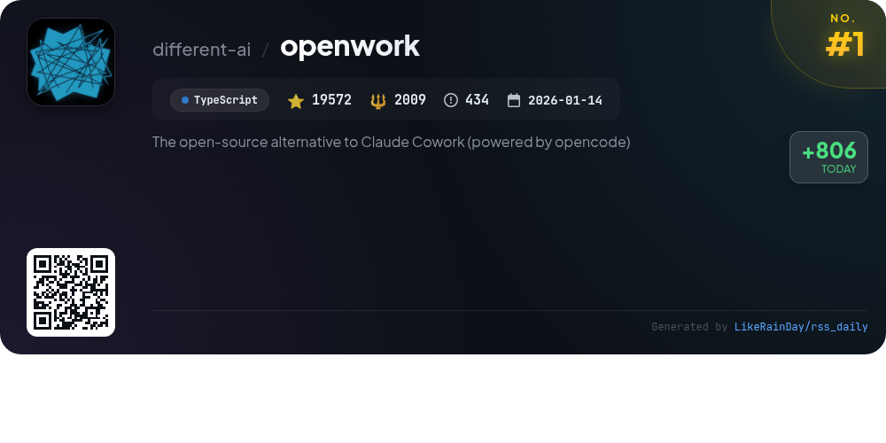
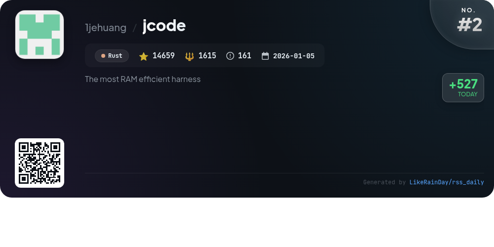
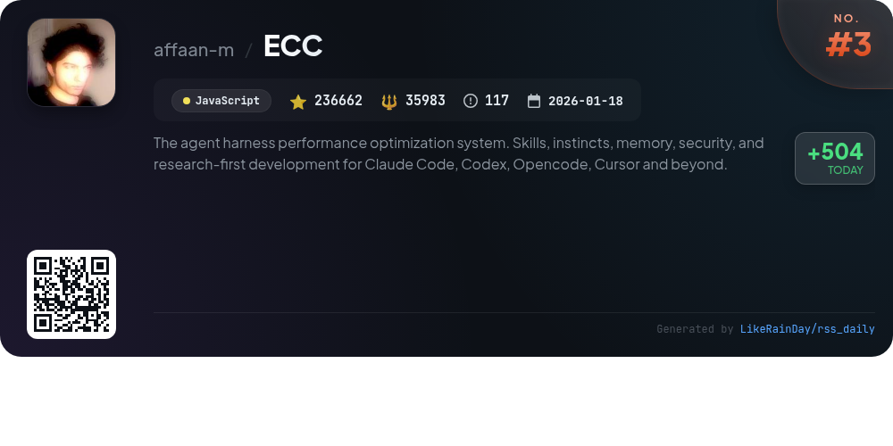
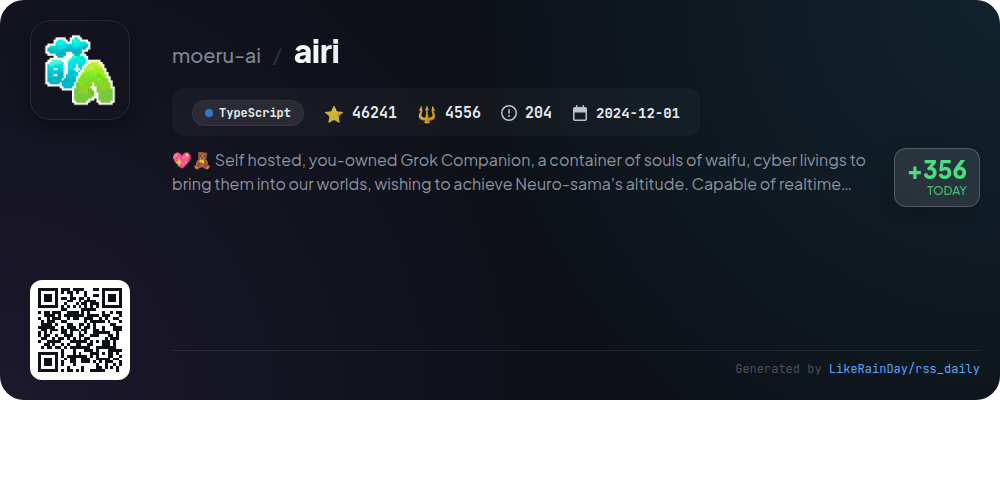
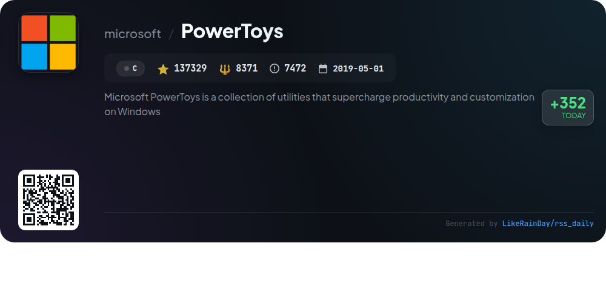
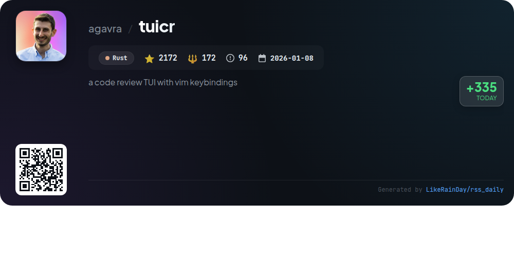
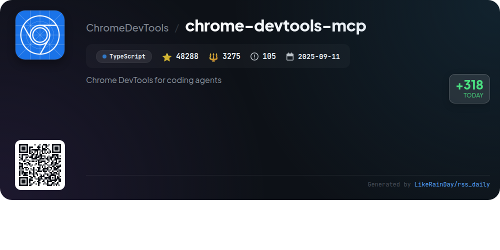
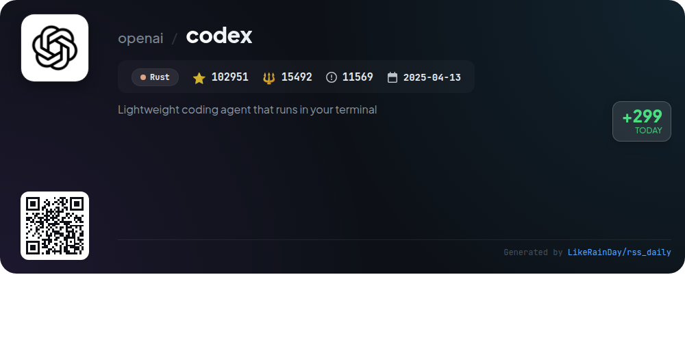
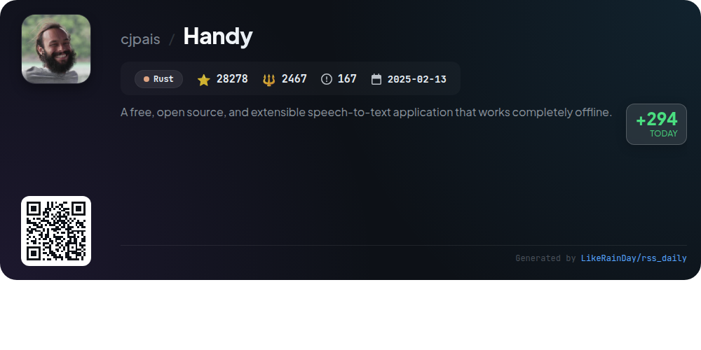
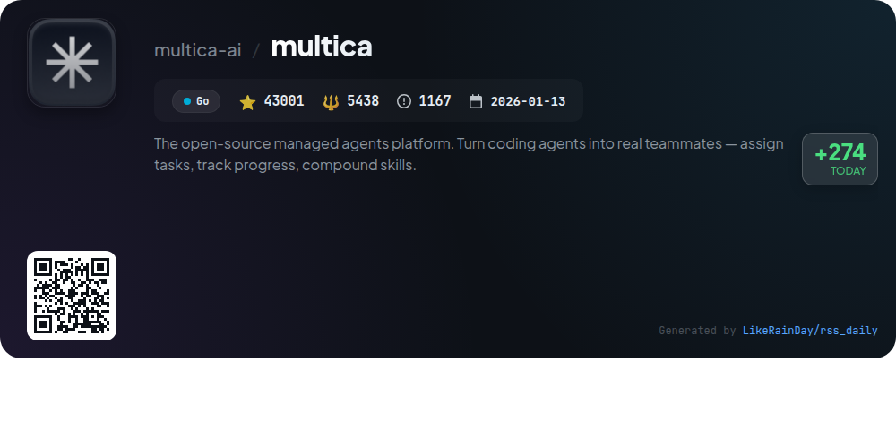

# 📊 🌟 GitHub Trending Daily - 2026-08-01

> > 📅 Daily Picks of GitHub Trending Repositories | Powered by Smart Algorithms

## 📋 Overview

**10** Projects | **679153** ⭐ | **79378** 🍴

**Top Languages:** `Rust` (4) · `TypeScript` (3) · `JavaScript` (1)

**Updated:** 2026-08-01 03:33 UTC

**Categories:**

- 🌟 Daily Top 10 (10 items)

---

## 🌟 Daily Top 10

### 1. [openwork](https://github.com/different-ai/openwork)

> 🤖 **Why Recommend**  
> *OpenWork is a free, open-source desktop application designed for sharing AI workflows, serving as an alternative to Claude Cowork. Compatible with macOS, Windows, and Linux, it allows users to integrate skills and capabilities across various AI agents like Codex and Claude Code. Key features include an admin interface for managing teams and access, the ability to create and share workspaces, and tools for searching and executing capabilities. OpenWork Den provides centralized control for organizations to manage resources and permissions effectively.*

- ⭐ 19572 stars
- 💻 TypeScript
- 📅 Updated: 2026-08-01

### 2. [jcode](https://github.com/1jehuang/jcode)

> 🤖 **Why Recommend**  
> *jcode is a highly efficient RAM harness built with Rust, boasting over 14,600 stars on GitHub. Key features include exceptional resource optimization, supporting up to 10 active sessions with minimal RAM usage, and rapid response times. It integrates a human-like memory system for intelligent context recall, along with a customizable UI for enhanced user experience. Additionally, jcode supports multi-agent workflows, OAuth integrations for various providers, and offers a built-in browser tool for automation. Ideal for scalable, multi-session coding environments.*

- ⭐ 14659 stars
- 💻 Rust
- 📅 Updated: 2026-08-01

### 3. [ECC](https://github.com/affaan-m/ECC)

> 🤖 **Why Recommend**  
> *ECC is an advanced performance optimization system designed to enhance agent capabilities in coding tasks. It integrates 67 specialized agents, 281 skills, and 94 commands, enabling workflows like planning, code review, and security scanning. ECC supports various harnesses such as Claude Code, Codex, and Cursor, facilitating seamless collaboration across platforms. Key features include a structured memory vault for context persistence, AgentShield for security audits, and automated workflows to enforce best practices like Test-Driven Development (TDD). With extensive documentation and community support, ECC empowers developers to optimize their coding processes effectively.*

- ⭐ 236662 stars
- 💻 JavaScript
- 📅 Updated: 2026-08-01

### 4. [airi](https://github.com/moeru-ai/airi)

> 🤖 **Why Recommend**  
> *AIRI is a self-hosted Grok Companion designed to bring AI waifus and virtual characters into users' lives, inspired by Neuro-sama. It supports real-time voice chat, gaming in popular titles like Minecraft and Factorio, and is compatible with web, macOS, and Windows platforms. Key features include multi-provider voice synthesis, VRM and Live2D support, and seamless integration with Discord and Telegram. AIRI emphasizes user ownership and customization, allowing developers to contribute and expand its capabilities. With over 46,000 stars on GitHub, it represents a vibrant community-driven project in AI companionship.*

- ⭐ 46241 stars
- 💻 TypeScript
- 📅 Updated: 2026-08-01

### 5. [PowerToys](https://github.com/microsoft/PowerToys)

> 🤖 **Why Recommend**  
> *Microsoft PowerToys is a powerful collection of over 30 utilities designed to enhance productivity and customization on Windows. Key features include Advanced Paste, Color Picker, FancyZones for window management, PowerRename for batch renaming, and a Command Palette for quick access to functions. With an active community contributing to ongoing development and a roadmap for future enhancements, PowerToys is continually evolving. Installation is straightforward via the Microsoft Store, GitHub, or WinGet, making it accessible for all users.*

- ⭐ 137329 stars
- 💻 C
- 📅 Updated: 2026-08-01

### 6. [tuicr](https://github.com/agavra/tuicr)

> 🤖 **Why Recommend**  
> *tuicr is a code review TUI (Text User Interface) built in Rust, featuring Vim keybindings for intuitive navigation. With 2,172 stars on GitHub, it supports continuous diff viewing in the terminal, allows inline comments at various levels, and tracks review progress across sessions. Key services include exporting reviews to GitHub and GitLab, copying structured markdown to the clipboard, and reviewing uncommitted changes or specific commits. The application is compatible with git, jj, and Mercurial, making it a versatile tool for developers.*

- ⭐ 2172 stars
- 💻 Rust
- 📅 Updated: 2026-08-01

### 7. [chrome-devtools-mcp](https://github.com/ChromeDevTools/chrome-devtools-mcp)

> 🤖 **Why Recommend**  
> *chrome-devtools-mcp is a powerful TypeScript-based tool that enables AI coding agents like Antigravity, Claude, and Copilot to control and inspect live Chrome browsers. With over 48,000 stars on GitHub, it acts as a Model-Context-Protocol (MCP) server, facilitating automation, debugging, and performance analysis through Chrome DevTools. Key features include advanced browser debugging, performance insights, and reliable automation via Puppeteer. Additionally, it provides a CLI for streamlined usage, supports various configurations, and ensures privacy by allowing users to opt-out of usage statistics.*

- ⭐ 48288 stars
- 💻 TypeScript
- 📅 Updated: 2026-08-01

### 8. [codex](https://github.com/openai/codex)

> 🤖 **Why Recommend**  
> *Codex is a lightweight coding agent by OpenAI that runs locally in your terminal, designed for seamless integration with your coding workflow. With over 102,000 stars on GitHub, it offers installation via various methods including npm and Homebrew. Users can sign in with their ChatGPT account to access enhanced features tailored for Plus, Pro, and Enterprise plans. Codex also supports IDE integrations and a desktop app experience. Comprehensive documentation and contributing guidelines are available to facilitate user engagement and development.*

- ⭐ 102951 stars
- 💻 Rust
- 📅 Updated: 2026-08-01

### 9. [Handy](https://github.com/cjpais/Handy)

> 🤖 **Why Recommend**  
> *Handy is a free, open-source, offline speech-to-text application built with Rust, boasting over 28,000 stars on GitHub. It enables cross-platform transcription by allowing users to record speech locally and paste it directly into any text field, ensuring privacy and simplicity. Key features include customizable keyboard shortcuts, support for Whisper and Parakeet models, and voice activity detection. Handy is extensible, actively developed, and designed to be forked, making it a valuable tool for those seeking a reliable, privacy-focused transcription solution.*

- ⭐ 28278 stars
- 💻 Rust
- 📅 Updated: 2026-08-01

### 10. [multica](https://github.com/multica-ai/multica)

> 🤖 **Why Recommend**  
> *The open-source managed agents platform. Turn coding agents into real teammates — assign tasks, track progress, compound skills.. popular project, actively maintained, recently updated*

- ⭐ 43001 stars
- 🍴 5438 forks
- 💻 Go
- 📅 Updated: 2026-08-01

---

## 📡 RSS Subscription

Subscribe via RSS to get daily trending updates:

- 🔔 [RSS XML] (../../daily-top.xml)
- 🔔 [Daily Report] (../../GITHUB_TODAY.md)
- 🔔 [Daily Top 10](../../daily-top.xml)

---

*⚡ Powered by Smart Trending Algorithm | Generated at 2026-08-01 03:33:54 UTC
