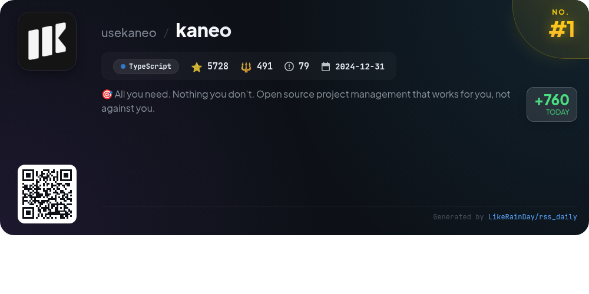
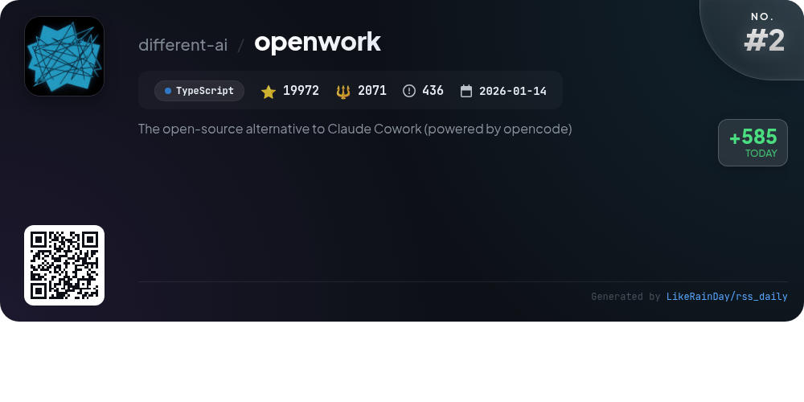
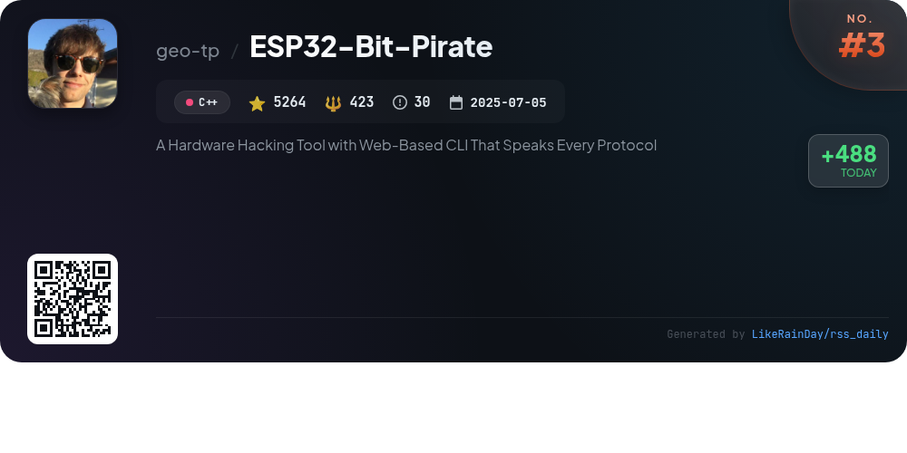
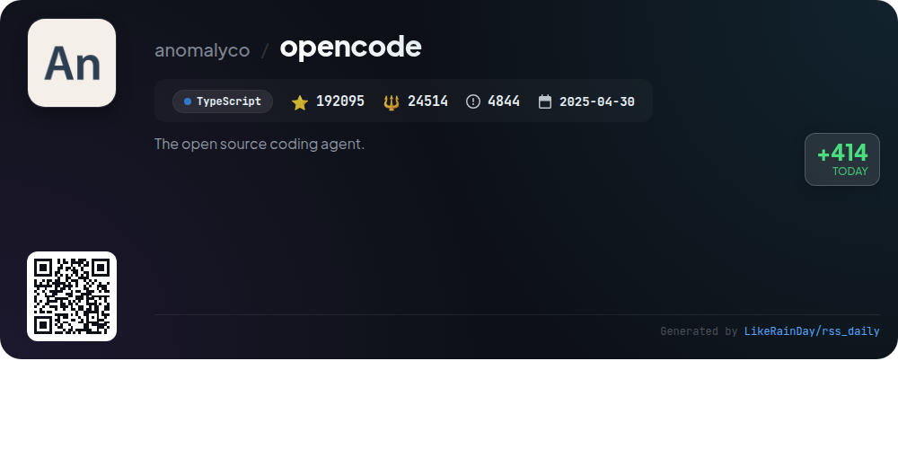
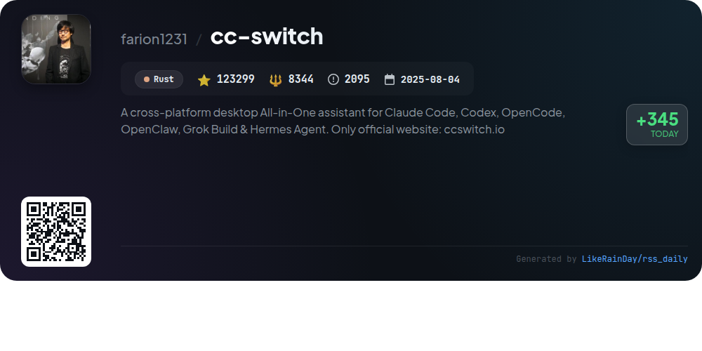
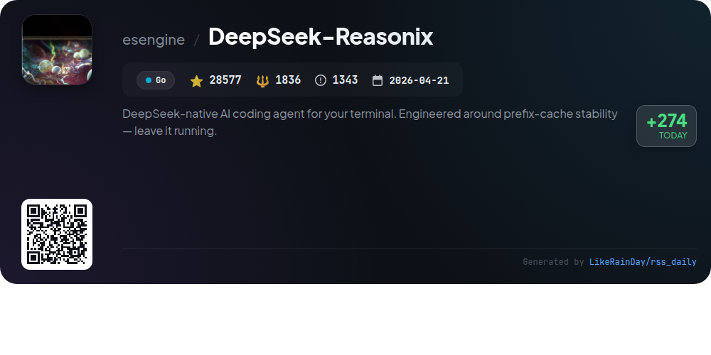
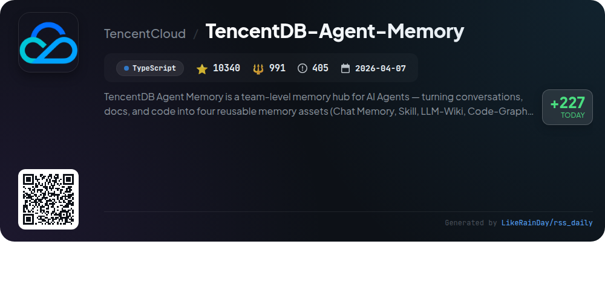
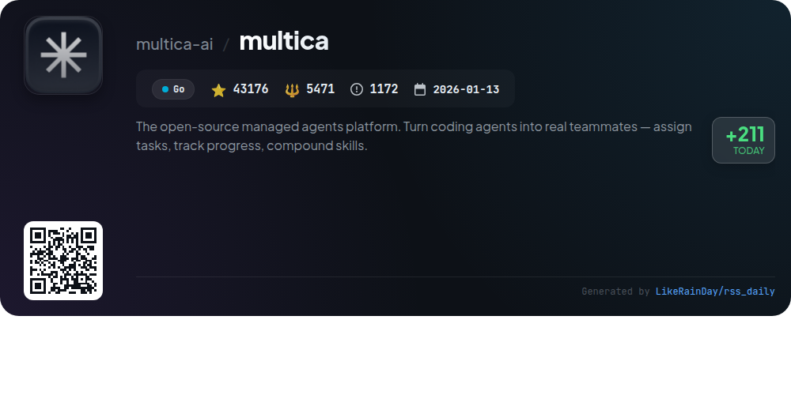
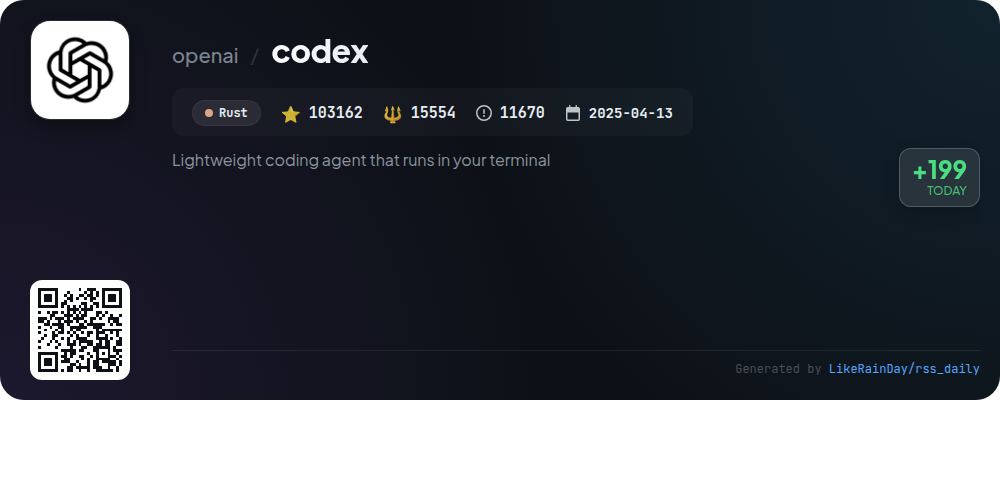
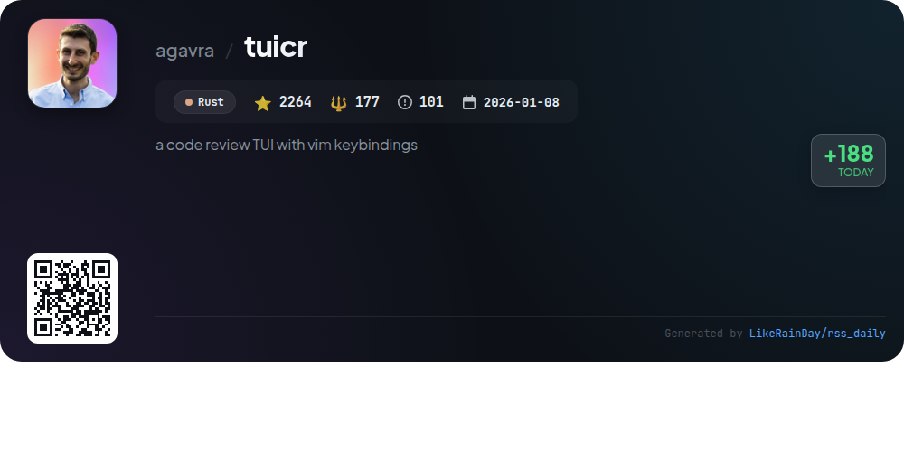

# 📊 🌟 GitHub Trending Daily - 2026-08-02

> > 📅 Daily Picks of GitHub Trending Repositories | Powered by Smart Algorithms

## 📋 Overview

**10** Projects | **533877** ⭐ | **59872** 🍴

**Top Languages:** `TypeScript` (4) · `Rust` (3) · `Go` (2)

**Updated:** 2026-08-02 03:33 UTC

**Categories:**

- 🌟 Daily Top 10 (10 items)

---

## 🌟 Daily Top 10

### 1. [kaneo](https://github.com/usekaneo/kaneo)

> 🤖 **Why Recommend**  
> *Kaneo is an open-source project management tool designed to enhance productivity by minimizing distractions. With a clean interface, it focuses on essential features that solve real problems without unnecessary complexity. Key highlights include self-hosting for data security, high performance, and a permissive MIT license. Deployment is streamlined via a one-click setup with Drim or Docker Compose. Kaneo fosters community engagement through Discord and GitHub, making it easy for users to contribute and collaborate. Explore more at kaneo.app.*

- ⭐ 5728 stars
- 💻 TypeScript
- 📅 Updated: 2026-08-02

### 2. [openwork](https://github.com/different-ai/openwork)

> 🤖 **Why Recommend**  
> *OpenWork is a free, open-source desktop app designed for sharing AI workflows, serving as an alternative to Claude Cowork and Codex for macOS, Windows, and Linux. With OpenWork, users can integrate skills and services across tools, enabling seamless collaboration. Key features include the OpenWork MCP for managing capabilities, a control plane for team administration (OpenWork Den), and easy installation via existing AI agents. It supports multiple organizations, offers plugin publishing, and enables efficient access management, making it ideal for both individual and collaborative use.*

- ⭐ 19972 stars
- 💻 TypeScript
- 📅 Updated: 2026-08-02

### 3. [ESP32-Bit-Pirate](https://github.com/geo-tp/ESP32-Bit-Pirate)

> 🤖 **Why Recommend**  
> *ESP32 Bit Pirate is an open-source firmware that transforms your device into a versatile multi-protocol development tool. It features a web-based CLI and supports various digital protocols, including I2C, UART, SPI, Bluetooth, Wi-Fi, and RFID. Key highlights include protocol sniffing, scripting capabilities, and device management via USB Serial or WiFi. The project offers extensive documentation, hardware guides, and web tools for easy integration. With support for multiple ESP32-S3 boards, it is ideal for hardware hacking, analysis, and development tasks.*

- ⭐ 5264 stars
- 💻 C++
- 📅 Updated: 2026-08-02

### 4. [opencode](https://github.com/anomalyco/opencode)

> 🤖 **Why Recommend**  
> *OpenCode is an open-source AI coding agent built in TypeScript, boasting over 192,000 stars on GitHub. It offers two main agents: a full-access **build** agent for development and a read-only **plan** agent for code exploration, enhancing productivity and safety. Users can install it easily via various package managers or download a beta desktop application. OpenCode supports multiple languages and provides comprehensive documentation and community support through Discord. Ideal for developers seeking efficient coding assistance, it streamlines workflows and code management.*

- ⭐ 192095 stars
- 💻 TypeScript
- 📅 Updated: 2026-08-02

### 5. [cc-switch](https://github.com/farion1231/cc-switch)

> 🤖 **Why Recommend**  
> *CC Switch is a cross-platform desktop application designed to manage multiple AI coding tools, including Claude Code, Codex, and Gemini CLI, from a single interface. It features over 50 provider presets, eliminating the need for manual configuration edits. Users can benefit from unified MCP and Skills management, quick provider switching via system tray, and cloud sync across devices. Built with Tauri in Rust, CC Switch supports Windows, macOS, and Linux, offering a robust solution for developers to streamline their AI-powered coding workflows. For more details, visit ccswitch.io.*

- ⭐ 123299 stars
- 💻 Rust
- 📅 Updated: 2026-08-02

### 6. [DeepSeek-Reasonix](https://github.com/esengine/DeepSeek-Reasonix)

> 🤖 **Why Recommend**  
> *DeepSeek-Reasonix is a powerful AI coding agent designed for terminal use, developed in Go. With 28,577 stars on GitHub, it features a config-driven architecture that allows for multi-model and plugin integration, making it adaptable for various coding tasks. Key highlights include cache-aware context maintenance, zero-friction distribution as a single binary, and support for OpenAI-compatible endpoints. Users can easily set it up via CLI, desktop app, or VS Code extension, ensuring a seamless coding experience. Join the bilingual Discord community for support and feature discussions.*

- ⭐ 28577 stars
- 💻 Go
- 📅 Updated: 2026-08-02

### 7. [TencentDB-Agent-Memory](https://github.com/TencentCloud/TencentDB-Agent-Memory)

> 🤖 **Why Recommend**  
> *TencentDB-Agent-Memory is a TypeScript-based memory hub designed for AI Agents, enabling efficient knowledge sharing within teams. It transforms conversations, documents, and code into four key memory assets: Chat Memory, Skills, LLM-Wiki, and Code-Graph, all of which can be governed and reused across Agents. Key features include automatic asset extraction, cross-framework compatibility, and a control panel for managing memory assets. This solution minimizes repetitive tasks, accelerates onboarding, and enhances team productivity by preserving and leveraging collective experience.*

- ⭐ 10340 stars
- 💻 TypeScript
- 📅 Updated: 2026-08-02

### 8. [multica](https://github.com/multica-ai/multica)

> 🤖 **Why Recommend**  
> *The open-source managed agents platform. Turn coding agents into real teammates — assign tasks, track progress, compound skills.. popular project, actively maintained, recently updated*

- ⭐ 43176 stars
- 🍴 5471 forks
- 💻 Go
- 📅 Updated: 2026-08-02

### 9. [codex](https://github.com/openai/codex)

> 🤖 **Why Recommend**  
> *Codex is a lightweight coding agent by OpenAI that operates in your terminal, designed for seamless integration with local development environments. It supports installation via various methods, including scripts and package managers like npm and Homebrew. Users can also access Codex through the desktop app or IDEs like VS Code. Key features include easy setup, ChatGPT account integration for enhanced functionality, and cloud-based support via Codex Web. With over 103,000 stars on GitHub, Codex is a powerful tool for developers seeking an efficient coding assistant.*

- ⭐ 103162 stars
- 💻 Rust
- 📅 Updated: 2026-08-02

### 10. [tuicr](https://github.com/agavra/tuicr)

> 🤖 **Why Recommend**  
> *tuicr is a Rust-based terminal user interface (TUI) for code reviews, featuring Vim keybindings and supporting exports to GitHub, GitLab, or clipboard. With over 2,200 stars, it offers a continuous diff view, PR-style comments, and review tracking across sessions. Users can review uncommitted changes or specific commit ranges and leverage features like inline commenting and structured markdown export. Compatible with Git, jj, and Mercurial, tuicr simplifies the code review process while providing a streamlined installation and update experience.*

- ⭐ 2264 stars
- 💻 Rust
- 📅 Updated: 2026-08-02

---

## 📡 RSS Subscription

Subscribe via RSS to get daily trending updates:

- 🔔 [RSS XML] (../../daily-top.xml)
- 🔔 [Daily Report] (../../GITHUB_TODAY.md)
- 🔔 [Daily Top 10](../../daily-top.xml)

---

*⚡ Powered by Smart Trending Algorithm | Generated at 2026-08-02 03:33:41 UTC
