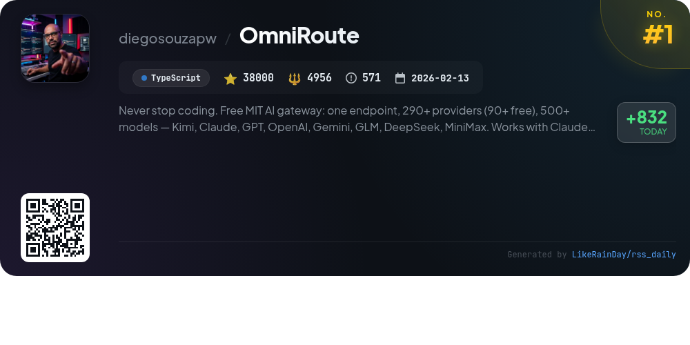
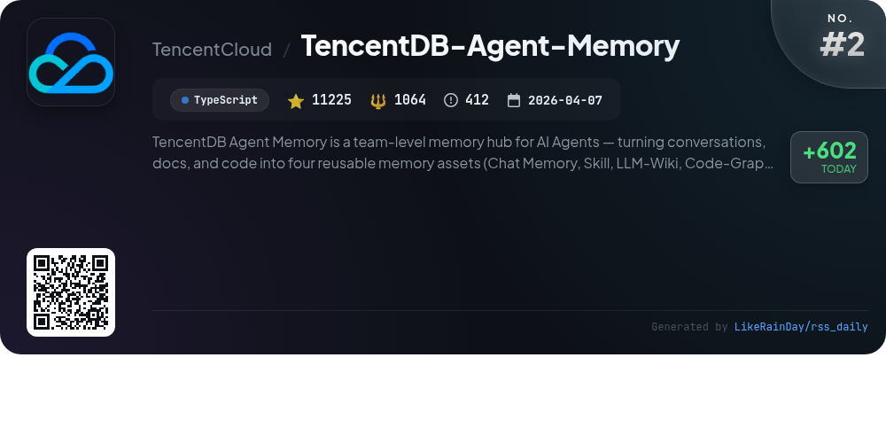
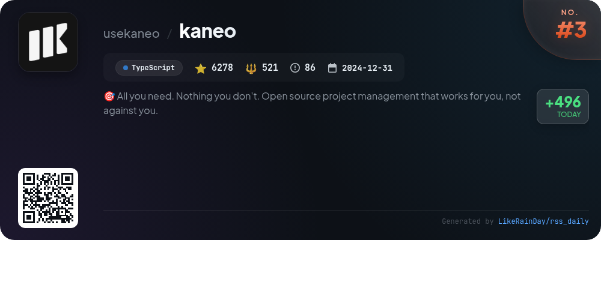
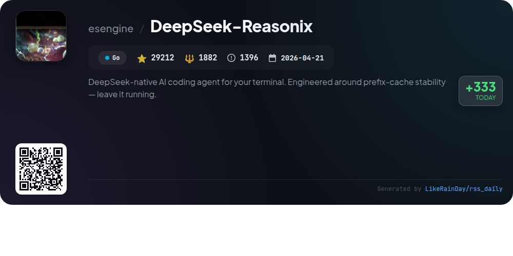
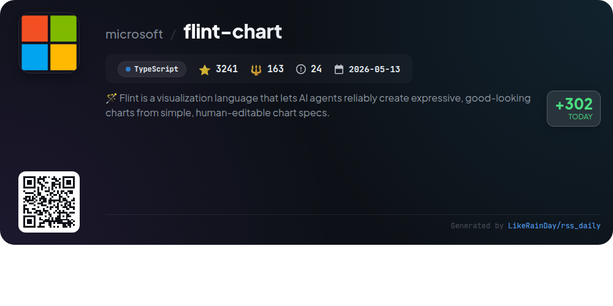
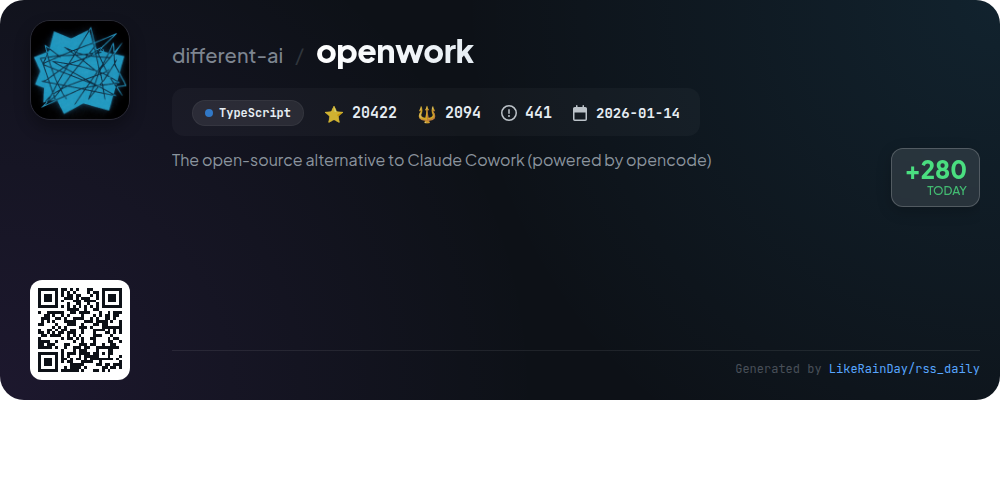
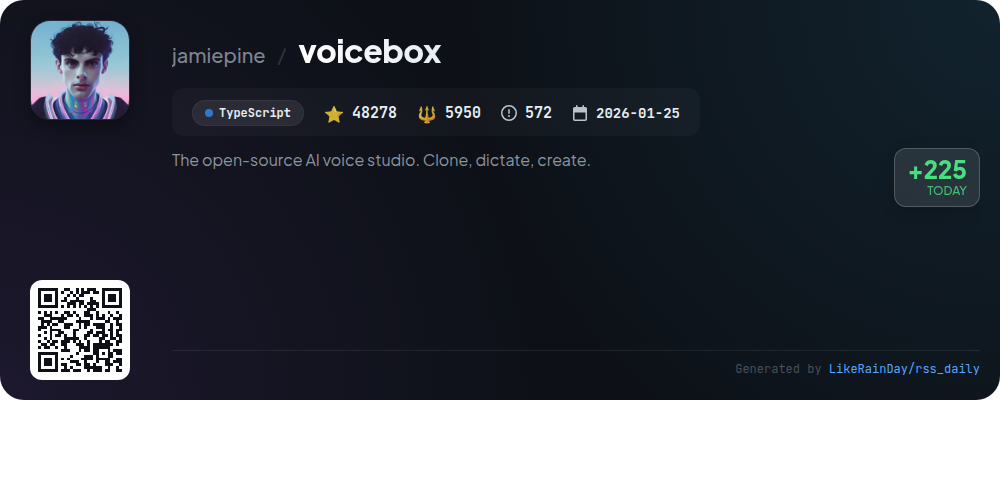
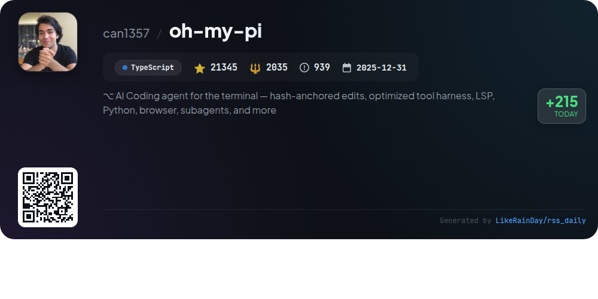
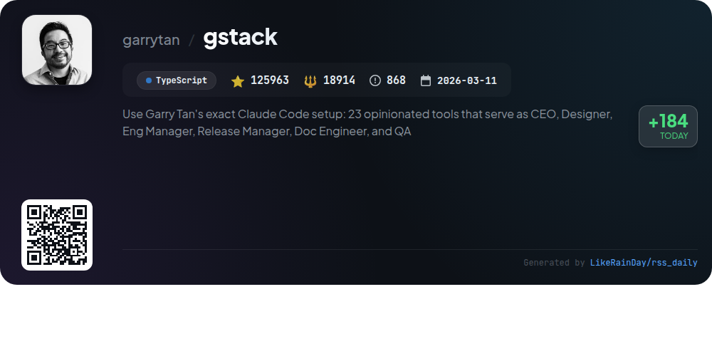
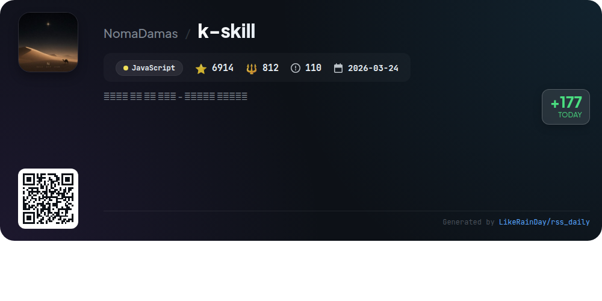

# 📊 🌟 GitHub Trending Daily - 2026-08-03

> > 📅 每日精选 GitHub 热门仓库 | 基于智能算法推荐

## 📋 Overview

**10** 个项目 | **310878** ⭐ | **38391** 🍴

**热门语言:** `TypeScript` (8) · `Go` (1) · `JavaScript` (1)

**更新时间:** 2026-08-03 03:36 UTC

**分类分布:**

- 🌟 每日 Top 10 精选 (10 项)

---

## 🌟 每日 Top 10 精选

### 1. [OmniRoute](https://github.com/diegosouzapw/OmniRoute)

> 🤖 **推荐理由**  
> *OmniRoute is a powerful, open-source AI gateway that connects developers to over 290 AI providers, including Claude, GPT, and Gemini, with more than 90 free tiers available. Key features include quota-aware auto-fallback routing, advanced token compression (saving 15-95%), and seamless integration with coding tools like Copilot and Codex. Its zero-config setup allows for instant use, while a robust CLI, desktop app, and PWA ensure accessibility across platforms. Built by over 500 contributors, OmniRoute emphasizes efficiency, cost savings, and user privacy.*

- ⭐ 38000 stars
- 💻 TypeScript
- 📅 Updated: 2026-08-03

### 2. [TencentDB-Agent-Memory](https://github.com/TencentCloud/TencentDB-Agent-Memory)

> 🤖 **推荐理由**  
> *TencentDB-Agent-Memory is a team-level memory hub for AI agents, transforming conversations, documents, and code into reusable assets: Chat Memory, Skills, LLM-Wiki, and Code-Graph. Key features include automatic asset extraction, cross-framework compatibility, and cold-start capabilities that enable new agents to leverage existing knowledge. The platform promotes efficiency by reducing repetitive tasks through structured memory management and a human-controlled team memory panel. With over 11,225 stars on GitHub, it supports seamless collaboration, making it ideal for teams looking to enhance AI workflows.*

- ⭐ 11225 stars
- 💻 TypeScript
- 📅 Updated: 2026-08-03

### 3. [kaneo](https://github.com/usekaneo/kaneo)

> 🤖 **推荐理由**  
> *Kaneo is an open-source project management tool designed for simplicity and efficiency. With a clean interface, it enhances your team's workflow without overwhelming distractions. Key features include self-hosting for data privacy, high performance, and a focus on essential functionalities. Kaneo supports quick deployment via Docker and Kubernetes, ensuring easy setup. The project is actively developed, with a welcoming community on Discord for support. With 6,278 stars on GitHub, Kaneo is built on the principle that less is more, making project management seamless and effective.*

- ⭐ 6278 stars
- 💻 TypeScript
- 📅 Updated: 2026-08-03

### 4. [DeepSeek-Reasonix](https://github.com/esengine/DeepSeek-Reasonix)

> 🤖 **推荐理由**  
> *DeepSeek-Reasonix is a Go-based AI coding agent designed for terminal use, featuring a config-driven architecture that supports various providers and tools via a single static binary. Key highlights include multi-model support, enabling the use of different AI endpoints, and a plugin-driven framework that allows external tools to integrate seamlessly. The project emphasizes cache stability for efficient long-session performance and easy cross-platform distribution. With a strong community presence on Discord and extensive documentation, it's a versatile solution for AI-assisted coding tasks.*

- ⭐ 29212 stars
- 💻 Go
- 📅 Updated: 2026-08-03

### 5. [flint-chart](https://github.com/microsoft/flint-chart)

> 🤖 **推荐理由**  
> *Flint is a visualization language designed for AI agents to create expressive charts from simple, human-editable specs. Key features include semantic chart specifications with over 70 types, automatic layout adaptation, and support for multiple backends like Vega-Lite, ECharts, Chart.js, and Plotly, plus native Excel charts. The project comprises the `flint-chart` library for compiling specs and the `flint-chart-mcp` server for agent-driven chart creation. With 3,241 stars on GitHub, Flint aims to enhance the accessibility and quality of data visualization.*

- ⭐ 3241 stars
- 💻 TypeScript
- 📅 Updated: 2026-08-03

### 6. [openwork](https://github.com/different-ai/openwork)

> 🤖 **推荐理由**  
> *OpenWork is a free, open-source desktop app designed for sharing AI workflows, serving as an alternative to Claude Cowork and Codex for macOS, Windows, and Linux. Key features include the ability to integrate with various AI agents, creating and managing workflows, and utilizing a control interface for team management. Through OpenWork MCP, users can access skills, plugins, and services across different platforms. The app also supports organizational control, allowing admins to manage access, publish skills, and enforce policies. Download OpenWork to enhance your AI collaboration experience.*

- ⭐ 20422 stars
- 💻 TypeScript
- 📅 Updated: 2026-08-03

### 7. [voicebox](https://github.com/jamiepine/voicebox)

> 🤖 **推荐理由**  
> *Voicebox is an open-source AI voice studio that allows users to clone voices, generate speech, and dictate into any application, all running locally for complete privacy. Key features include voice cloning with over 50 preset voices, support for 23 languages across 7 TTS engines, and post-processing effects. Voicebox offers global dictation hotkeys, a multi-track stories editor, and an API for seamless integration with applications. It is built with a focus on performance using Tauri and supports various platforms, including macOS, Windows, and Linux.*

- ⭐ 48278 stars
- 💻 TypeScript
- 📅 Updated: 2026-08-03

### 8. [oh-my-pi](https://github.com/can1357/oh-my-pi)

> 🤖 **推荐理由**  
> *oh-my-pi is an advanced AI coding agent designed for terminal use, featuring seamless integration with IDE capabilities. Key highlights include 40+ providers, 32 built-in tools, and LSP support for real-time code editing and debugging. Its core services encompass code execution, project memory management, collaborative coding sessions, and robust search capabilities across various sources like GitHub and arXiv. The agent utilizes a unique hashline editing method for precise code modifications and supports multiple programming languages, making it a versatile tool for developers.*

- ⭐ 21345 stars
- 💻 TypeScript
- 📅 Updated: 2026-08-03

### 9. [gstack](https://github.com/garrytan/gstack)

> 🤖 **推荐理由**  
> *gstack is an open-source toolkit designed to enhance productivity for founders and developers, utilizing AI to simulate a full engineering team. With 23 specialized tools, it streamlines the software development process by automating roles such as CEO, Designer, Eng Manager, and QA. Key features include structured project planning, rigorous code reviews, and automated testing, all facilitated through intuitive commands. gstack allows rapid iteration, enabling users to ship high-quality products efficiently while maintaining best practices, making it ideal for technical leaders and first-time AI users.*

- ⭐ 125963 stars
- 💻 TypeScript
- 📅 Updated: 2026-08-03

### 10. [k-skill](https://github.com/NomaDamas/k-skill)

> 🤖 **推荐理由**  
> *k-skill is a comprehensive skill collection for Koreans, enabling users to automate various tasks through AI agents. It supports services like SRT/KTX bookings, public transport navigation, weather updates, and legal document searches. With seamless installation via `npx`, users can deploy specific skills or the entire suite. Key features include real-time subway information, fine dust alerts, and access to government services. The project boasts over 6,900 stars on GitHub and is designed for both novice and advanced users seeking efficient solutions tailored to Korean needs.*

- ⭐ 6914 stars
- 💻 JavaScript
- 📅 Updated: 2026-08-03

---

## 📡 RSS订阅

通过 RSS 订阅，第一时间获取每日精选项目：

- 🔔 [RSS 订阅源] (../../daily-top.xml)
- 🔔 [每日简报] (../../GITHUB_TODAY_CN.md)
- 🔔 [每日 Top 10 精选](../../daily-top.xml)

---

*⚡ Powered by Smart Trending Algorithm | Generated at 2026-08-03 03:36:44 UTC
