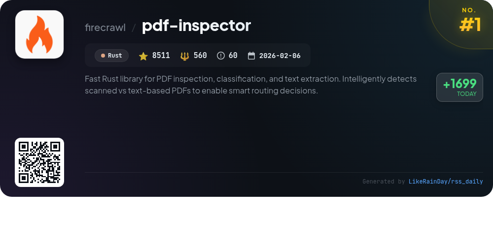
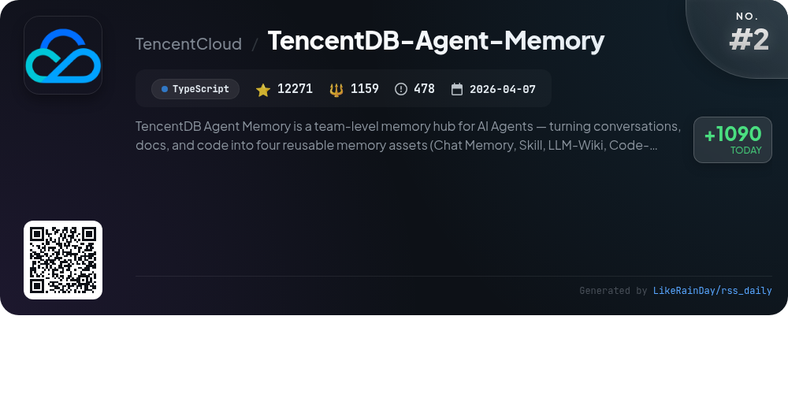
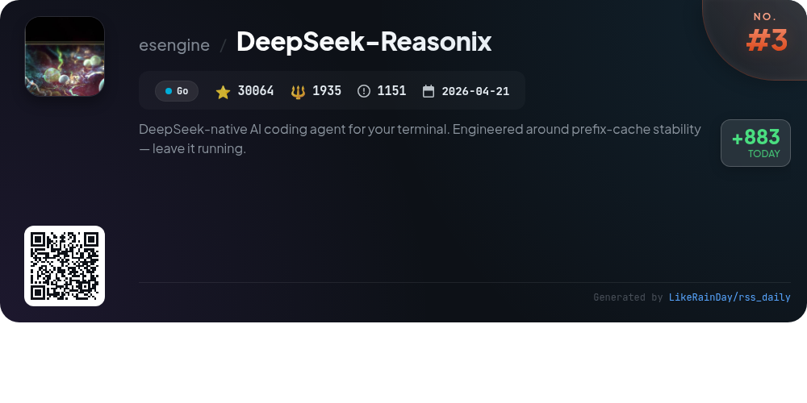
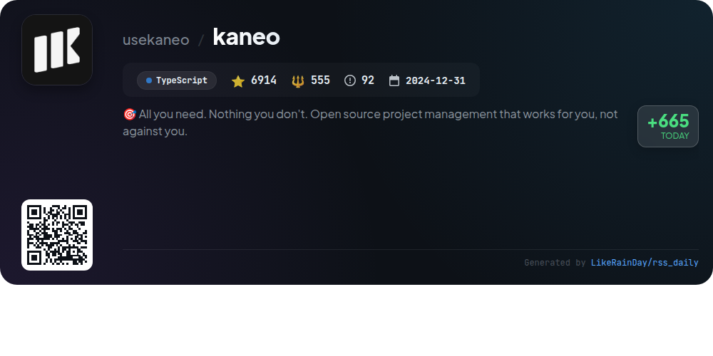
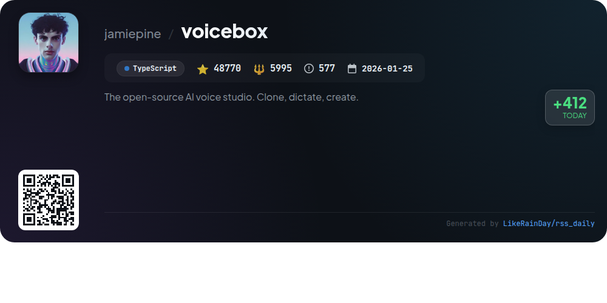
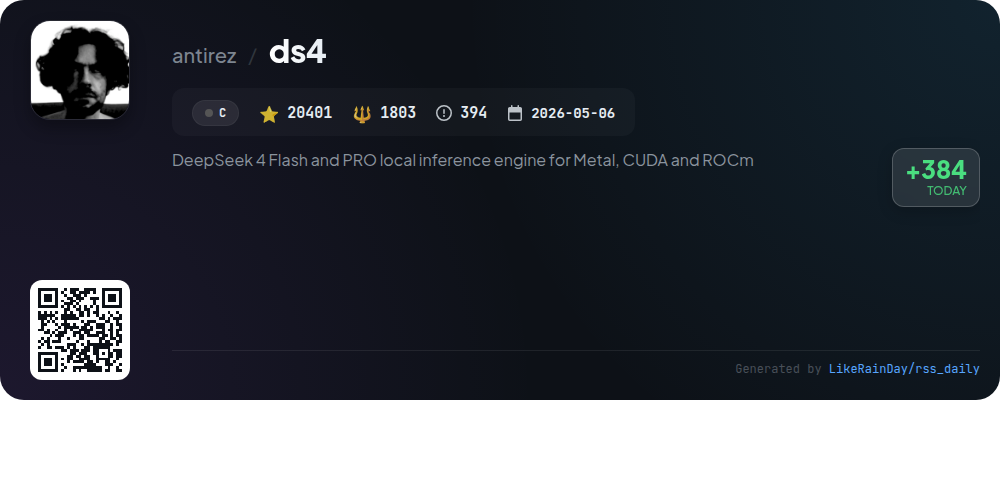
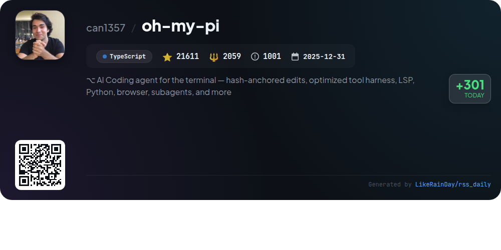
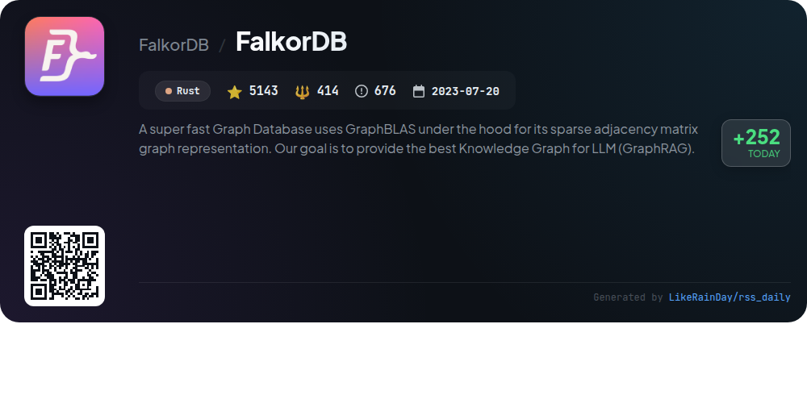
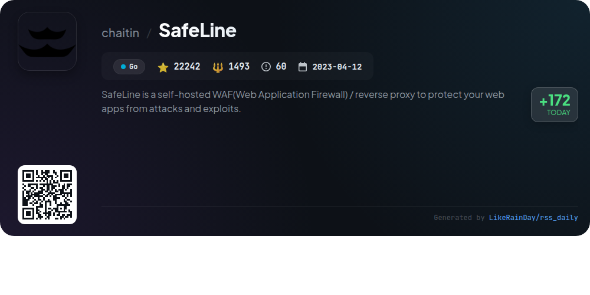
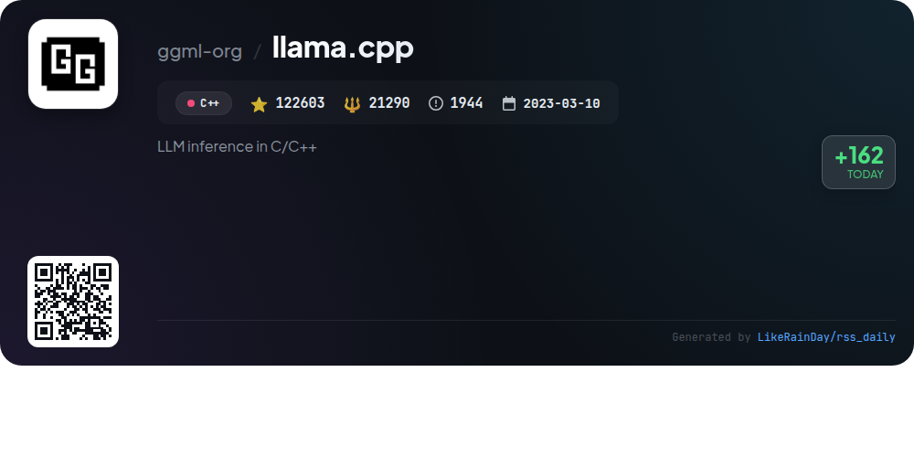

# 📊 🌟 GitHub Trending Daily - 2026-08-04

> > 📅 每日精选 GitHub 热门仓库 | 基于智能算法推荐

## 📋 Overview

**10** 个项目 | **298530** ⭐ | **37263** 🍴

**热门语言:** `TypeScript` (4) · `Rust` (2) · `Go` (2)

**更新时间:** 2026-08-04 03:19 UTC

**分类分布:**

- 🌟 每日 Top 10 精选 (10 项)

---

## 🌟 每日 Top 10 精选

### 1. [pdf-inspector](https://github.com/firecrawl/pdf-inspector)

> 🤖 **推荐理由**  
> *pdf-inspector is a high-performance Rust library designed for PDF inspection, classification, and text extraction. It efficiently distinguishes between text-based and scanned PDFs, enabling optimized processing for ~54% of documents that do not require OCR. Key features include smart classification with confidence scores, position-aware text extraction, and conversion to structured Markdown. It supports multi-column layouts, table detection, and CID font decoding. With bindings for Python, Node.js, and WebAssembly, pdf-inspector is ideal for handling native-text PDFs quickly and locally, minimizing latency and cost.*

- ⭐ 8511 stars
- 💻 Rust
- 📅 Updated: 2026-08-04

### 2. [TencentDB-Agent-Memory](https://github.com/TencentCloud/TencentDB-Agent-Memory)

> 🤖 **推荐理由**  
> *TencentDB-Agent-Memory is a TypeScript-based memory hub for AI agents, designed to enhance team collaboration by transforming conversations, documents, and code into reusable assets: Chat Memory, Skills, LLM-Wiki, and Code-Graph. With over 12,000 stars, it enables automatic asset extraction, cold-start support for new agents, and multi-agent compatibility. Users can manage and share memory assets through a team panel, ensuring efficient workflows and knowledge retention. The hub facilitates smoother project continuities by allowing agents to inherit and utilize accumulated experiences.*

- ⭐ 12271 stars
- 💻 TypeScript
- 📅 Updated: 2026-08-04

### 3. [DeepSeek-Reasonix](https://github.com/esengine/DeepSeek-Reasonix)

> 🤖 **推荐理由**  
> *DeepSeek-Reasonix is a powerful AI coding agent for your terminal, built with Go and featuring a config- and plugin-driven architecture. It supports multi-model configurations and allows you to integrate various OpenAI-compatible endpoints seamlessly. Key highlights include cache-aware context maintenance, zero-friction distribution as a single binary, and plugin-driven external tool support. With over 30,000 stars, it offers CLI, desktop, and VS Code extension options for easy setup and use, making it an indispensable tool for developers seeking efficient coding assistance.*

- ⭐ 30064 stars
- 💻 Go
- 📅 Updated: 2026-08-04

### 4. [kaneo](https://github.com/usekaneo/kaneo)

> 🤖 **推荐理由**  
> *Kaneo is an open-source project management tool designed to enhance productivity by focusing on simplicity and performance. With a clean interface, Kaneo eliminates unnecessary distractions, allowing teams to concentrate on building great products. Key features include self-hosting for data privacy, fast performance, and a permissive MIT license. It offers easy deployment options through CLI tools and Docker Compose. Kaneo's community support is available via Discord, and comprehensive documentation guides users in setup and development.*

- ⭐ 6914 stars
- 💻 TypeScript
- 📅 Updated: 2026-08-04

### 5. [voicebox](https://github.com/jamiepine/voicebox)

> 🤖 **推荐理由**  
> *Voicebox is an open-source AI voice studio that enables users to clone voices, generate speech, and dictate in various applications. It features seven TTS engines, supports 23 languages, and offers complete privacy by running locally. Key highlights include voice cloning from audio samples, expressive speech with paralinguistic tags, a stories editor for multi-track narratives, and a global dictation hotkey. Voicebox also integrates with MCP-aware agents for dynamic voice interactions and provides a REST API for seamless integration into custom applications.*

- ⭐ 48770 stars
- 💻 TypeScript
- 📅 Updated: 2026-08-04

### 6. [ds4](https://github.com/antirez/ds4)

> 🤖 **推荐理由**  
> *DwarfStar (ds4) is a compact inference engine optimized for DeepSeek V4 Flash and GLM 5.2, supporting backends like Metal, CUDA, and ROCm. Key features include SSD streaming for low-memory setups, multi-GPU support for NVIDIA systems, and pipeline parallelism for distributed inference. It enables local execution of high-performance models on consumer hardware while maintaining low latency through a native coding agent. The project emphasizes model adaptability, fast local inference, and efficient resource utilization, making it ideal for running advanced AI models on personal machines.*

- ⭐ 20401 stars
- 💻 C
- 📅 Updated: 2026-08-04

### 7. [oh-my-pi](https://github.com/can1357/oh-my-pi)

> 🤖 **推荐理由**  
> *oh-my-pi is an AI coding agent designed for terminal use, combining powerful coding tools and services in a single interface. It features hash-anchored edits, a robust tool harness, integrated Language Server Protocol (LSP) support, and subagent capabilities for parallel task execution. With over 60 providers and 31 built-in tools, it offers functionalities like code execution, debugging, real-time collaboration, and memory management. Built with TypeScript and Rust, oh-my-pi emphasizes efficiency, making coding tasks simpler and more effective for developers. Explore more at omp.sh.*

- ⭐ 21611 stars
- 💻 TypeScript
- 📅 Updated: 2026-08-04

### 8. [FalkorDB](https://github.com/FalkorDB/FalkorDB)

> 🤖 **推荐理由**  
> *FalkorDB is an ultra-fast graph database built in Rust, leveraging GraphBLAS for sparse adjacency matrix representation. It aims to optimize knowledge graphs for large language models (LLMs) with low latency and high performance. Key features include a sparse matrix representation, linear algebra querying, and compliance with the Property Graph Model, supporting OpenCypher for advanced querying. FalkorDB powers applications in generative AI, agent memory, cloud security, and fraud detection, and offers easy integration with various client libraries.*

- ⭐ 5143 stars
- 💻 Rust
- 📅 Updated: 2026-08-04

### 9. [SafeLine](https://github.com/chaitin/SafeLine)

> 🤖 **推荐理由**  
> *SafeLine is a self-hosted Web Application Firewall (WAF) and reverse proxy designed to protect web applications from various attacks like SQL injection, XSS, and more. With over 22,000 stars on GitHub, it offers robust features including web attack blocking, IP-based rate limiting, dynamic HTML/JS encryption, and authentication challenges. SafeLine is production-ready, supporting over 1,000,000 websites and handling 30 billion daily HTTP requests. It integrates with systems like Kubernetes and Kong Gateway. Join the community on Discord for support and discussions.*

- ⭐ 22242 stars
- 💻 Go
- 📅 Updated: 2026-08-04

### 10. [llama.cpp](https://github.com/ggml-org/llama.cpp)

> 🤖 **推荐理由**  
> *llama.cpp is a high-performance library for LLM inference implemented in C/C++. With over 122,000 stars, it supports extensive hardware optimization, including ARM for Apple silicon, AVX for x86, and various backends like CUDA and HIP for GPUs. Key features include integer quantization for faster inference, a built-in CLI for model interaction, and an OpenAI-compatible API server. Users can easily set up using Docker or pre-built binaries, making it versatile for both local and cloud deployments. The project is built on the ggml library and welcomes community contributions.*

- ⭐ 122603 stars
- 💻 C++
- 📅 Updated: 2026-08-04

---

## 📡 RSS订阅

通过 RSS 订阅，第一时间获取每日精选项目：

- 🔔 [RSS 订阅源] (../../daily-top.xml)
- 🔔 [每日简报] (../../GITHUB_TODAY_CN.md)
- 🔔 [每日 Top 10 精选](../../daily-top.xml)

---

*⚡ Powered by Smart Trending Algorithm | Generated at 2026-08-04 03:19:05 UTC
