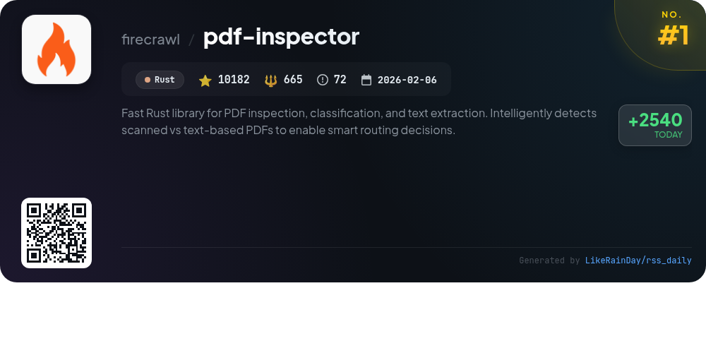
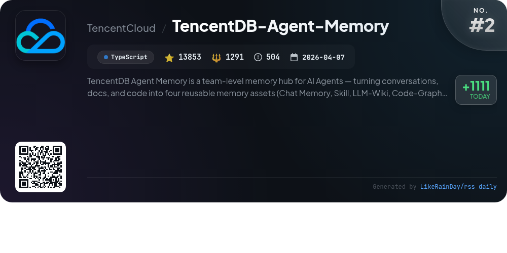
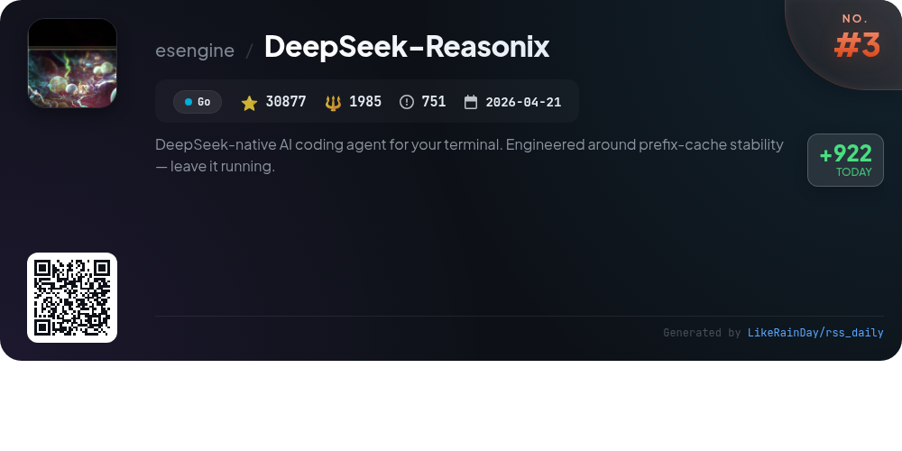
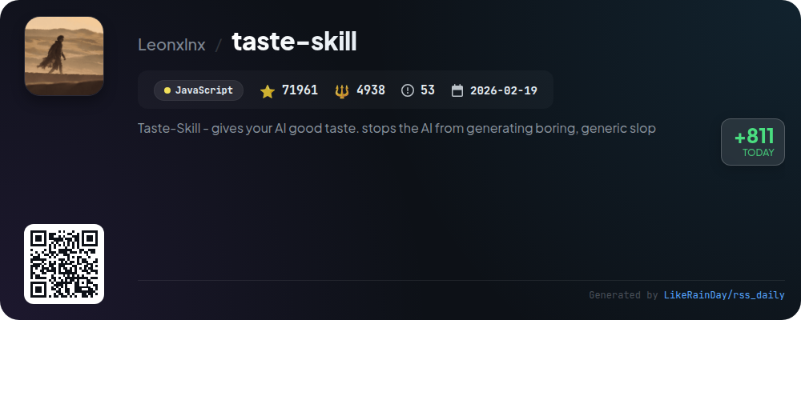
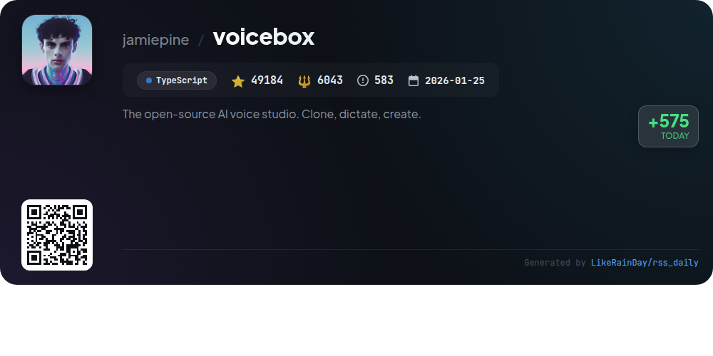
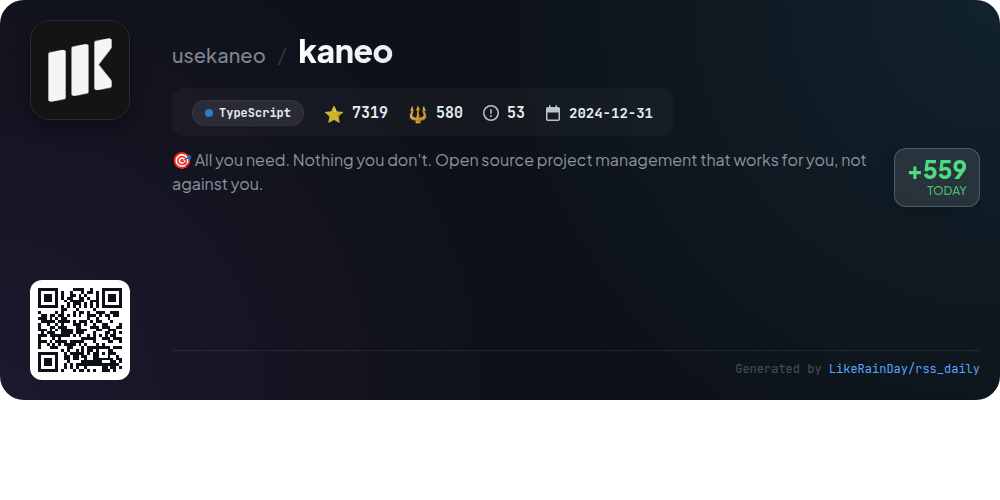
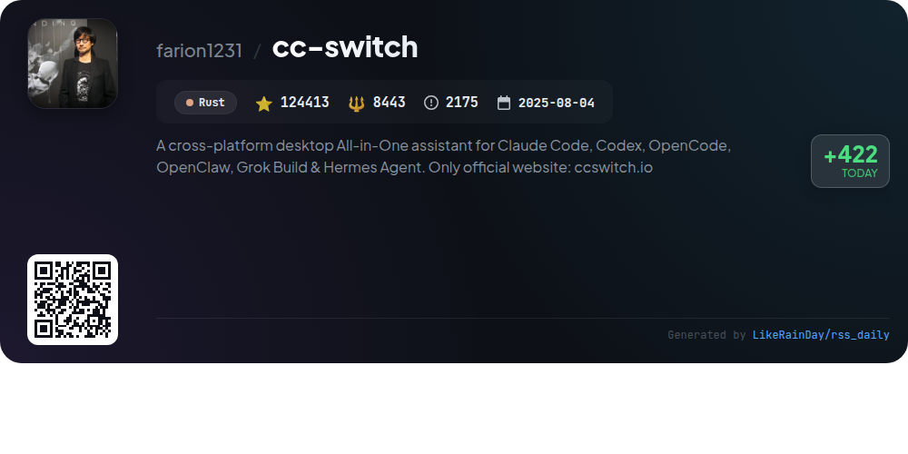
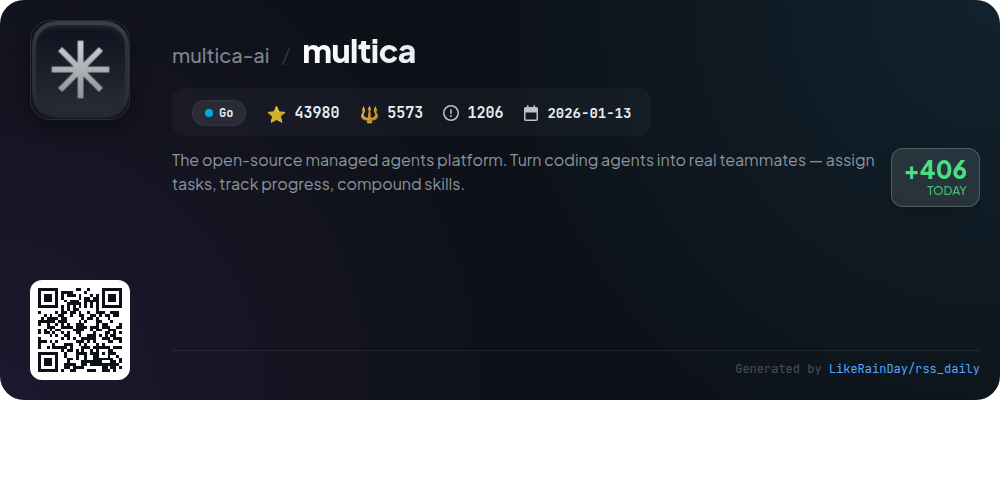
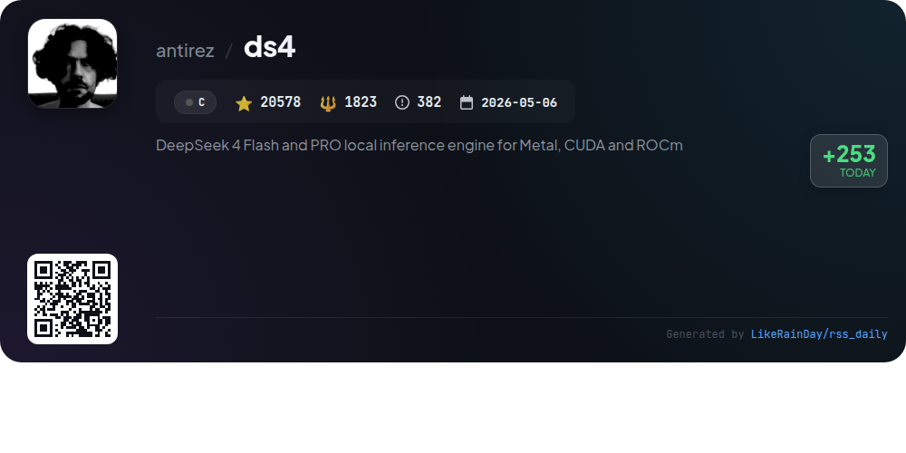
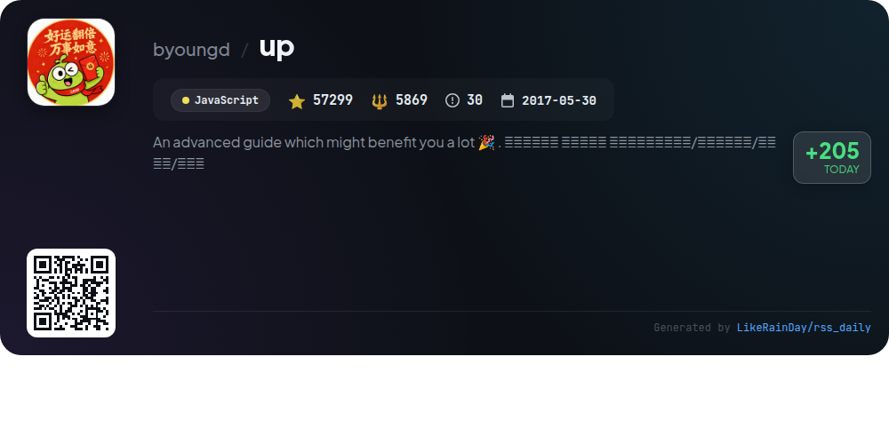

# 📊 🌟 GitHub Trending Daily - 2026-08-05

> > 📅 Daily Picks of GitHub Trending Repositories | Powered by Smart Algorithms

## 📋 Overview

**10** Projects | **429646** ⭐ | **37210** 🍴

**Top Languages:** `TypeScript` (3) · `JavaScript` (2) · `Rust` (2)

**Updated:** 2026-08-05 03:00 UTC

**Categories:**

- 🌟 Daily Top 10 (10 items)

---

## 🌟 Daily Top 10

### 1. [pdf-inspector](https://github.com/firecrawl/pdf-inspector)

> 🤖 **Why Recommend**  
> *pdf-inspector is a fast Rust library designed for PDF inspection, classification, and text extraction. With 10,182 stars, it intelligently distinguishes between text-based and scanned PDFs, facilitating efficient routing decisions. Key features include smart classification with confidence scoring, position-aware text extraction, and Markdown conversion, including multi-column layout and table detection. It operates locally in under 200ms, avoiding costly OCR for the majority of PDFs. The library supports Python, Node.js, and browser WebAssembly, making it versatile for various applications.*

- ⭐ 10182 stars
- 💻 Rust
- 📅 Updated: 2026-08-05

### 2. [TencentDB-Agent-Memory](https://github.com/TencentCloud/TencentDB-Agent-Memory)

> 🤖 **Why Recommend**  
> *TencentDB-Agent-Memory is an innovative memory hub for AI agents, enabling seamless knowledge sharing across teams. It transforms conversations, documents, and code into four key memory assets: Chat Memory, Skill, LLM-Wiki, and Code-Graph. This system enhances efficiency by reducing repetitive tasks and facilitating quick onboarding through existing project contexts. Key features include automatic asset extraction, multi-agent compatibility, and a centralized team memory panel for managing ownership and access. With 13,853 stars, it supports frameworks like OpenClaw and Hermes.*

- ⭐ 13853 stars
- 💻 TypeScript
- 📅 Updated: 2026-08-05

### 3. [DeepSeek-Reasonix](https://github.com/esengine/DeepSeek-Reasonix)

> 🤖 **Why Recommend**  
> *DeepSeek-Reasonix is a powerful AI coding agent for terminal environments, built in Go and focusing on prefix-cache stability for low token costs. Key features include a config-driven architecture, multi-model support, and a plugin-driven system that allows external tools to run via JSON-RPC. Users can easily install it as a CLI, desktop app, or VS Code extension. With over 30,000 stars on GitHub, it offers robust documentation, community support via Discord, and seamless distribution as a single binary. Ideal for developers seeking efficient code assistance.*

- ⭐ 30877 stars
- 💻 Go
- 📅 Updated: 2026-08-05

### 4. [taste-skill](https://github.com/Leonxlnx/taste-skill)

> 🤖 **Why Recommend**  
> *Taste-Skill is an innovative JavaScript framework designed to enhance AI-generated front-end interfaces, preventing dull, generic designs. With over 71,961 stars, it offers portable Agent Skills for improved layout, typography, and motion. Key features include v2 (experimental) skills for design variance, motion intensity, and visual density adjustments. The framework supports integration with tools like ChatGPT and Codex, enabling seamless image-to-code workflows. Its specialized skills cater to various design aesthetics, ensuring high-quality UI outcomes across different platforms.*

- ⭐ 71961 stars
- 💻 JavaScript
- 📅 Updated: 2026-08-05

### 5. [voicebox](https://github.com/jamiepine/voicebox)

> 🤖 **Why Recommend**  
> *Voicebox is an open-source AI voice studio that enables users to clone voices, generate speech, and dictate into any application, all locally on their machine. Key features include voice cloning with zero-shot capability, support for 23 languages across 7 TTS engines, and post-processing effects for enhanced audio output. It offers a global dictation hotkey, a stories editor for multi-track narratives, and an API for integration with agents. Designed for privacy, Voicebox ensures no data leaves your machine, making it a versatile tool for voice applications and accessibility solutions.*

- ⭐ 49184 stars
- 💻 TypeScript
- 📅 Updated: 2026-08-05

### 6. [kaneo](https://github.com/usekaneo/kaneo)

> 🤖 **Why Recommend**  
> *Kaneo is an open-source project management tool designed to enhance productivity without unnecessary complexity. Built with TypeScript, it boasts a clean interface that prioritizes user experience. Key features include self-hosting for data security, fast performance, and a focus on essential functionalities that solve real problems. Kaneo supports one-click deployments via drim and offers Docker Compose setup for quick trials. It also includes a built-in MCP server for AI integrations. Join the community on Discord for support and collaboration.*

- ⭐ 7319 stars
- 💻 TypeScript
- 📅 Updated: 2026-08-05

### 7. [cc-switch](https://github.com/farion1231/cc-switch)

> 🤖 **Why Recommend**  
> *CC Switch is a cross-platform desktop assistant for managing AI tools like Claude Code, Codex, and Gemini CLI. With over 124,000 stars on GitHub, this Rust-based app offers a unified interface to switch between 50+ provider presets without manual configuration. Key features include one-click provider switching, unified MCP and Skills management, and cloud sync across devices. Built with Tauri, it supports Windows, macOS, and Linux, ensuring easy integration and usage tracking for AI-powered coding tasks. Visit ccswitch.io for more information.*

- ⭐ 124413 stars
- 💻 Rust
- 📅 Updated: 2026-08-05

### 8. [multica](https://github.com/multica-ai/multica)

> 🤖 **Why Recommend**  
> *The open-source managed agents platform. Turn coding agents into real teammates — assign tasks, track progress, compound skills.. popular project, actively maintained, recently updated*

- ⭐ 43980 stars
- 🍴 5573 forks
- 💻 Go
- 📅 Updated: 2026-08-05

### 9. [ds4](https://github.com/antirez/ds4)

> 🤖 **Why Recommend**  
> *DwarfStar (ds4) is a specialized inference engine for DeepSeek V4 Flash and PRO, optimized for Metal, CUDA, and ROCm. It enables high-performance local inference on consumer hardware, leveraging SSD streaming for low-RAM setups. Key features include multi-GPU support with CUDA, tensor and pipeline parallelism for model scaling, and a native coding agent for seamless interaction. DwarfStar also provides utilities for model management and evaluation, focusing on efficient execution of open-weight models. With a strong community and extensive documentation, it meets diverse user needs in AI inference.*

- ⭐ 20578 stars
- 💻 C
- 📅 Updated: 2026-08-05

### 10. [up](https://github.com/byoungd/up)

> 🤖 **Why Recommend**  
> *The "up" project is an advanced guide designed to empower individuals in their personal growth through efficient English learning and practical life strategies. With over 57,000 stars on GitHub, it offers a structured approach to mastering English skills across listening, speaking, reading, and writing, while integrating AI tools for enhanced learning. Key features include a comprehensive English learning roadmap, AI-assisted study methods, and resources for long-term personal development. This guide aims to transform knowledge into actionable skills and foster resilience in navigating life's challenges.*

- ⭐ 57299 stars
- 💻 JavaScript
- 📅 Updated: 2026-08-05

---

## 📡 RSS Subscription

Subscribe via RSS to get daily trending updates:

- 🔔 [RSS XML] (../../daily-top.xml)
- 🔔 [Daily Report] (../../GITHUB_TODAY.md)
- 🔔 [Daily Top 10](../../daily-top.xml)

---

*⚡ Powered by Smart Trending Algorithm | Generated at 2026-08-05 03:00:29 UTC
