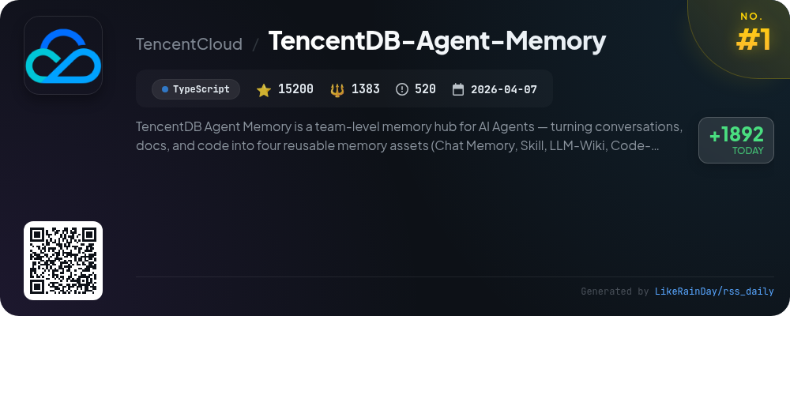
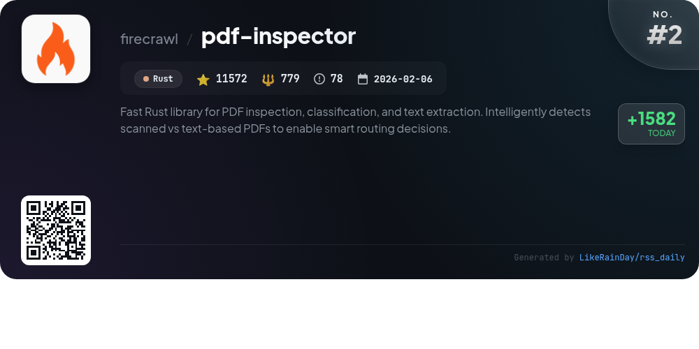
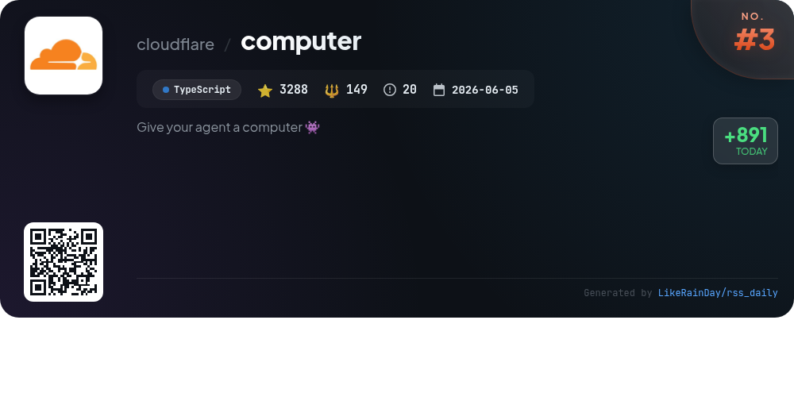
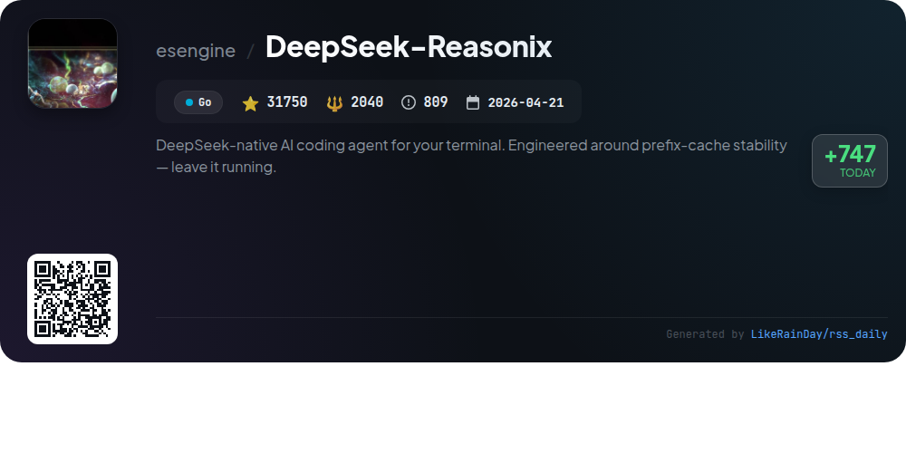
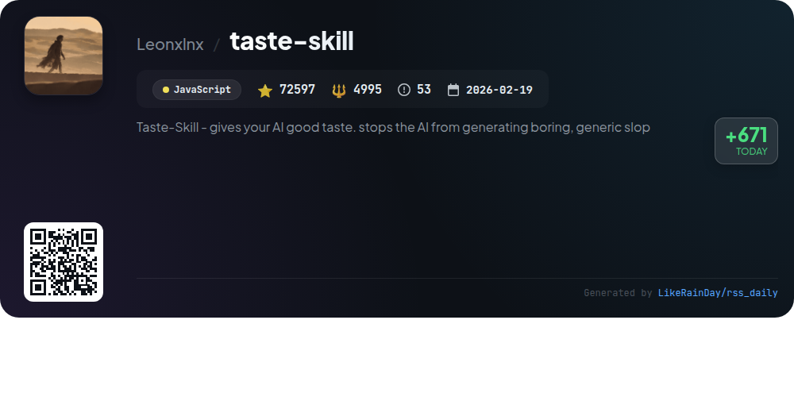
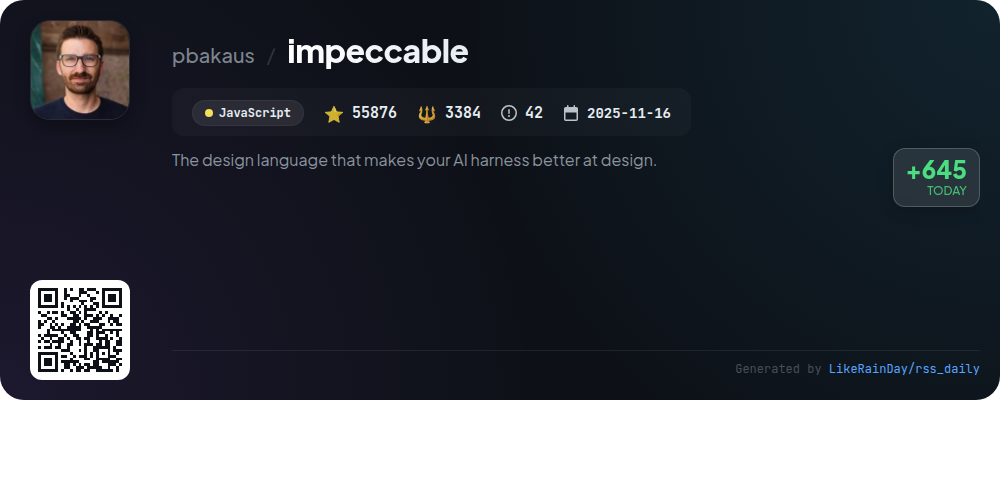
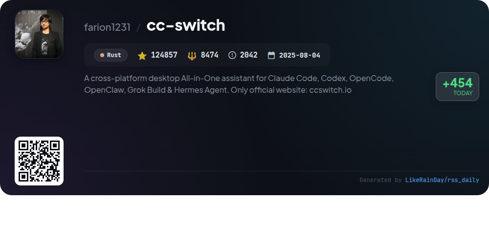
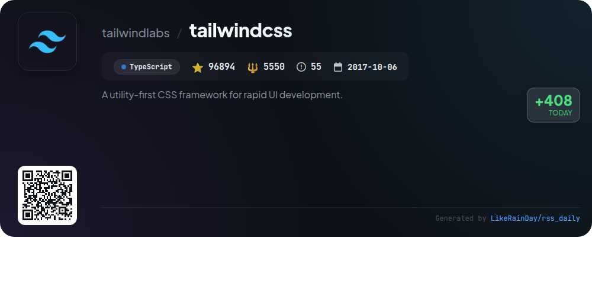
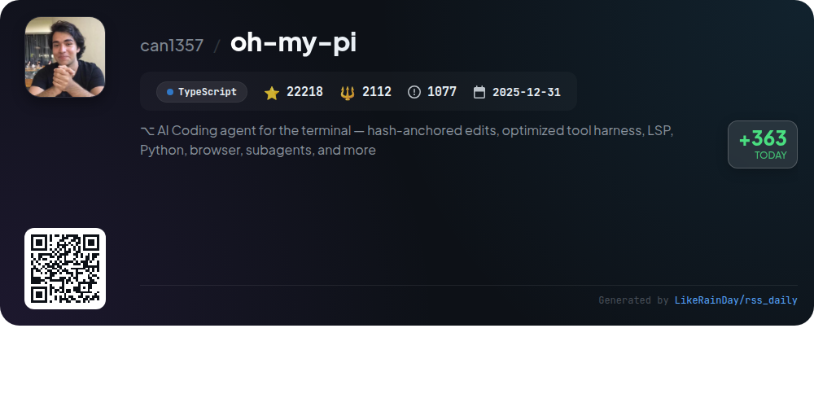
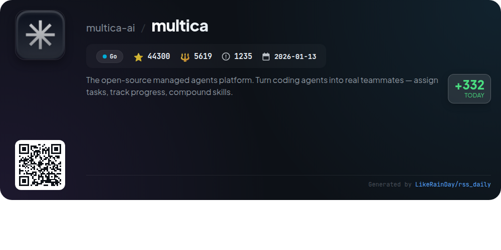

# 📊 🌟 GitHub Trending Daily - 2026-08-06

> > 📅 Daily Picks of GitHub Trending Repositories | Powered by Smart Algorithms

## 📋 Overview

**10** Projects | **478552** ⭐ | **34485** 🍴

**Top Languages:** `TypeScript` (4) · `Rust` (2) · `Go` (2)

**Updated:** 2026-08-06 03:17 UTC

**Categories:**

- 🌟 Daily Top 10 (10 items)

---

## 🌟 Daily Top 10

### 1. [TencentDB-Agent-Memory](https://github.com/TencentCloud/TencentDB-Agent-Memory)

> 🤖 **Why Recommend**  
> *TencentDB-Agent-Memory is a TypeScript-based memory hub for AI agents, facilitating the reuse of information through four core assets: Chat Memory, Skills, LLM-Wiki, and Code-Graph. It enhances collaboration by allowing agents to share and manage these assets, reducing repetitive tasks and improving efficiency. Key features include automatic asset extraction, cross-framework compatibility, and a user-friendly control panel for managing team memory. With 15,200 stars, this project aims to streamline workflows and retain valuable knowledge, making it ideal for teams seeking to leverage AI effectively.*

- ⭐ 15200 stars
- 💻 TypeScript
- 📅 Updated: 2026-08-06

### 2. [pdf-inspector](https://github.com/firecrawl/pdf-inspector)

> 🤖 **Why Recommend**  
> *pdf-inspector is a high-performance Rust library for PDF inspection, classification, and text extraction. It intelligently distinguishes between text-based and scanned PDFs, enabling efficient routing decisions. Key features include smart classification with confidence scoring, position-aware text extraction, Markdown conversion, and table detection. With multi-language bindings (Python, Node.js, WebAssembly), it processes PDFs locally in under 200ms, avoiding costly OCR for ~54% of documents. Ideal for reports, invoices, and legal documents, pdf-inspector streamlines PDF handling at scale.*

- ⭐ 11572 stars
- 💻 Rust
- 📅 Updated: 2026-08-06

### 3. [computer](https://github.com/cloudflare/computer)

> 🤖 **Why Recommend**  
> *Cloudflare Computer is a TypeScript-based virtual filesystem utilizing Durable Objects and SQLite, designed for experimentation and prototyping. It features three execution backends: a FUSE mount container for full Linux userland, a Dynamic Worker running a shell through just-bash, and an ECMAScript module execution environment. Users can register multiple backends and execute commands via a single entry point. The project includes several runnable examples and is not yet suitable for production use. Contributions and feedback are encouraged as the project evolves.*

- ⭐ 3288 stars
- 💻 TypeScript
- 📅 Updated: 2026-08-06

### 4. [DeepSeek-Reasonix](https://github.com/esengine/DeepSeek-Reasonix)

> 🤖 **Why Recommend**  
> *DeepSeek-Reasonix is an AI coding agent for terminals, built in Go, with over 31,750 stars on GitHub. It features a config-driven architecture, enabling multi-model support and composable workflows without hardcoded models. Users can leverage a plugin-driven system for tools and resources, ensuring cache-aware context maintenance for efficient sessions. The project offers easy installation via npm or Homebrew and supports a CLI, desktop app, and VS Code extension. Engage with the community on Discord for setup help and feature discussions.*

- ⭐ 31750 stars
- 💻 Go
- 📅 Updated: 2026-08-06

### 5. [taste-skill](https://github.com/Leonxlnx/taste-skill)

> 🤖 **Why Recommend**  
> *Taste-Skill is an innovative JavaScript framework designed to enhance AI-generated frontends, ensuring high-quality, visually appealing designs instead of generic outputs. With over 72,000 stars, it offers portable Agent Skills for improved layout, typography, and motion. Key features include customizable design parameters, a range of specialized skills for various design tasks, and image-generation capabilities for branding and UI mockups. Ideal for integrating with major coding agents, Taste-Skill empowers developers to create sophisticated, engaging user interfaces effortlessly.*

- ⭐ 72597 stars
- 💻 JavaScript
- 📅 Updated: 2026-08-06

### 6. [impeccable](https://github.com/pbakaus/impeccable)

> 🤖 **Why Recommend**  
> *Impeccable is a JavaScript design language tool for AI coding agents, boasting 55,876 stars on GitHub. It offers a streamlined setup with 23 commands, including `polish`, `audit`, and `critique`, to enhance AI-generated frontend designs. With 59 deterministic detector rules, it allows for live browser iteration and comprehensive design context through a single command, `/impeccable init`. The tool emphasizes best practices, helping avoid common design pitfalls. Compatible with platforms like Claude Code, GitHub Copilot, and Grok Build, Impeccable is an essential resource for improving AI-assisted design workflows.*

- ⭐ 55876 stars
- 💻 JavaScript
- 📅 Updated: 2026-08-06

### 7. [cc-switch](https://github.com/farion1231/cc-switch)

> 🤖 **Why Recommend**  
> *CC Switch is a cross-platform desktop assistant for managing AI coding tools like Claude Code, Codex, and Gemini CLI. With over 50 built-in provider presets, it enables seamless switching between APIs without manual configuration. Key features include unified management of MCP and Skills, cloud sync across devices, and a user-friendly interface for tracking usage and costs. Built with Tauri in Rust, it supports Windows, macOS, and Linux, ensuring robust performance and reliability. Visit ccswitch.io for more information.*

- ⭐ 124857 stars
- 💻 Rust
- 📅 Updated: 2026-08-06

### 8. [tailwindcss](https://github.com/tailwindlabs/tailwindcss)

> 🤖 **Why Recommend**  
> *Tailwind CSS is a utility-first CSS framework designed for rapid UI development, enabling developers to create custom user interfaces efficiently. With a focus on flexibility, it offers a comprehensive set of utility classes that streamline styling without the need for custom CSS. The project boasts over 96,000 stars on GitHub, indicating its popularity and community support. Key highlights include extensive documentation, active community discussions, and clear guidelines for contributions. For more information, visit the official site at tailwindcss.com.*

- ⭐ 96894 stars
- 💻 TypeScript
- 📅 Updated: 2026-08-06

### 9. [oh-my-pi](https://github.com/can1357/oh-my-pi)

> 🤖 **Why Recommend**  
> *oh-my-pi is an advanced AI coding agent for terminal environments, designed to enhance coding workflows with integrated features like LSP support, persistent Python and JavaScript execution, and subagent collaboration. Key highlights include hash-anchored edits, real-time debugging, memory curation, and extensive tooling across 60+ providers. Users benefit from seamless code execution, structured web searching, and efficient code review processes. Built on TypeScript, this project fosters open contributions and offers a robust, interactive experience for developers. Explore more at omp.sh.*

- ⭐ 22218 stars
- 💻 TypeScript
- 📅 Updated: 2026-08-06

### 10. [multica](https://github.com/multica-ai/multica)

> 🤖 **Why Recommend**  
> *The open-source managed agents platform. Turn coding agents into real teammates — assign tasks, track progress, compound skills.. popular project, actively maintained, recently updated*

- ⭐ 44300 stars
- 🍴 5619 forks
- 💻 Go
- 📅 Updated: 2026-08-06

---

## 📡 RSS Subscription

Subscribe via RSS to get daily trending updates:

- 🔔 [RSS XML] (../../daily-top.xml)
- 🔔 [Daily Report] (../../GITHUB_TODAY.md)
- 🔔 [Daily Top 10](../../daily-top.xml)

---

*⚡ Powered by Smart Trending Algorithm | Generated at 2026-08-06 03:17:52 UTC
