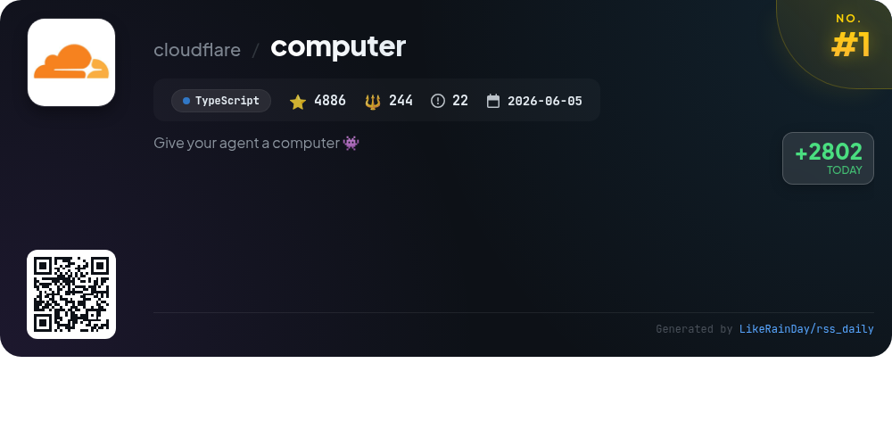
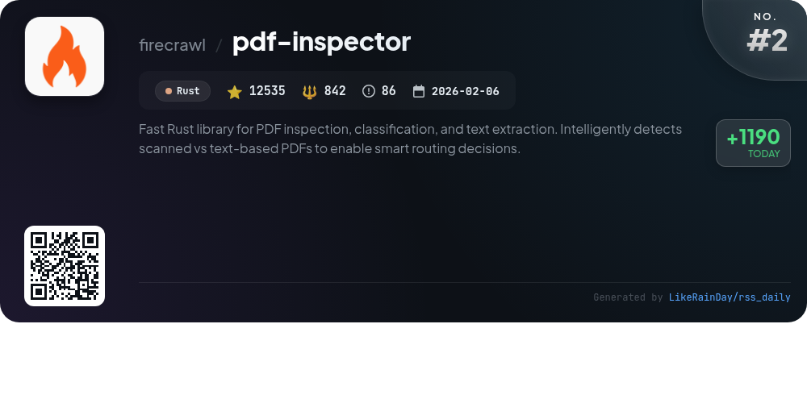
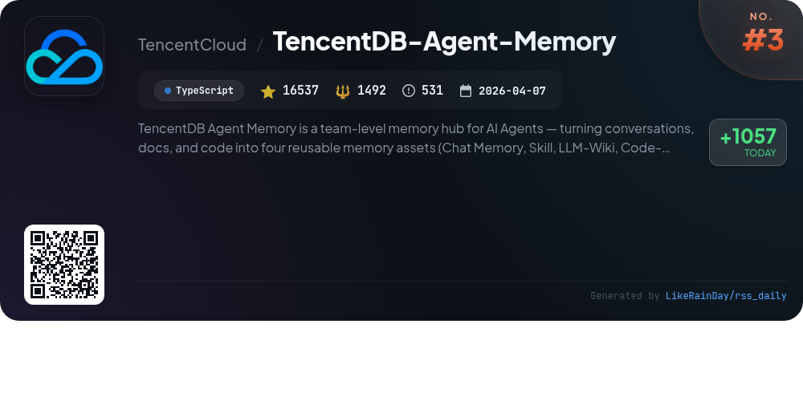
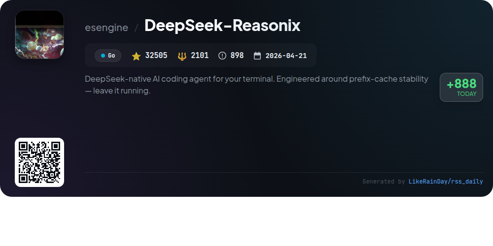
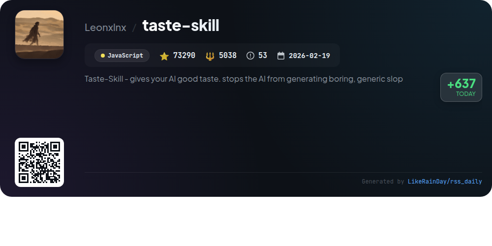
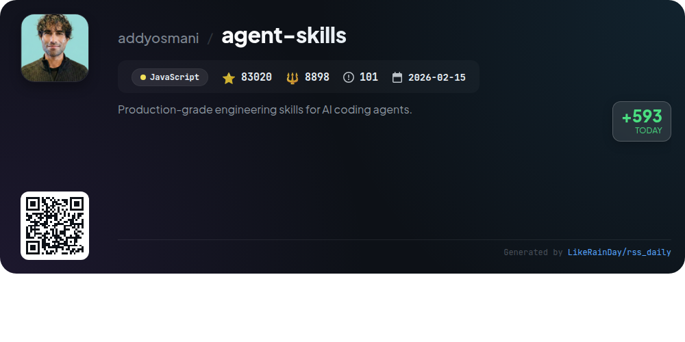
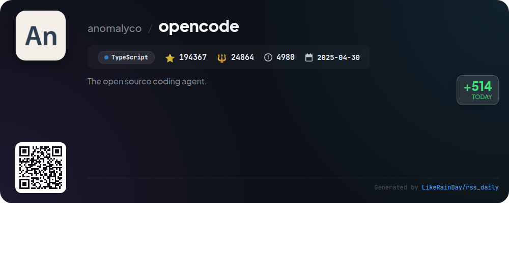
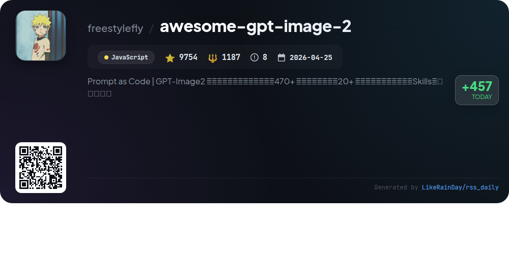
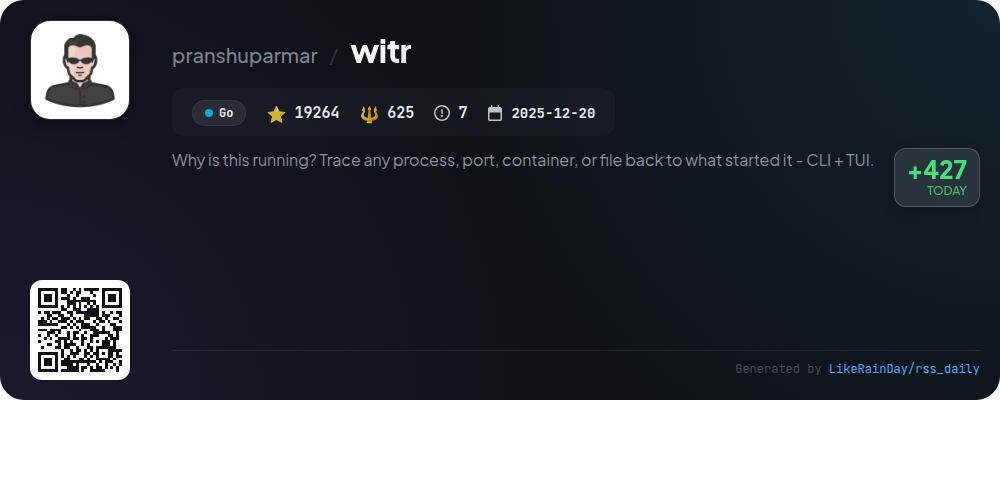
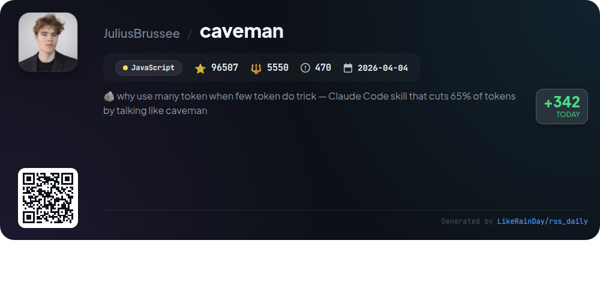

# 📊 🌟 GitHub Trending Daily - 2026-08-07

> > 📅 Daily Picks of GitHub Trending Repositories | Powered by Smart Algorithms

## 📋 Overview

**10** Projects | **542665** ⭐ | **50841** 🍴

**Top Languages:** `JavaScript` (4) · `TypeScript` (3) · `Go` (2)

**Updated:** 2026-08-07 02:58 UTC

**Categories:**

- 🌟 Daily Top 10 (10 items)

---

## 🌟 Daily Top 10

### 1. [computer](https://github.com/cloudflare/computer)

> 🤖 **Why Recommend**  
> *Cloudflare Computer is a TypeScript-based virtual filesystem residing in a Durable Object, utilizing SQLite for state management. It offers three execution backends: a FUSE-mounted container for full Linux userland, a shell environment using just-bash, and a JavaScript runtime for ECMAScript modules. Users can register multiple backends and execute commands or scripts via a unified entry point. The project is in preview, suitable for experimentation rather than production. It includes various examples, performance benchmarks, and a structured monorepo for easy navigation and contribution.*

- ⭐ 4886 stars
- 💻 TypeScript
- 📅 Updated: 2026-08-07

### 2. [pdf-inspector](https://github.com/firecrawl/pdf-inspector)

> 🤖 **Why Recommend**  
> *pdf-inspector is a fast Rust library designed for PDF inspection, classification, and text extraction, capable of distinguishing between scanned and text-based PDFs in under 50ms. It offers position-aware text extraction, Markdown conversion, and dual-mode table detection, making it ideal for processing reports, invoices, and legal documents. With bindings for Python, Node.js, and WebAssembly, it enables local processing without OCR, significantly reducing costs and latency. The library is lightweight, relying solely on Rust and a single dependency for PDF parsing.*

- ⭐ 12535 stars
- 💻 Rust
- 📅 Updated: 2026-08-07

### 3. [TencentDB-Agent-Memory](https://github.com/TencentCloud/TencentDB-Agent-Memory)

> 🤖 **Why Recommend**  
> *TencentDB-Agent-Memory is a TypeScript-based memory hub designed for AI agents, enabling them to convert conversations, documents, and code into reusable assets: Chat Memory, Skills, LLM-Wiki, and Code-Graph. It streamlines team collaboration by allowing agents to inherit and share knowledge, reducing repetitive work and enhancing efficiency. Key features include automatic asset extraction, cross-framework compatibility, and a structured memory management system. With a focus on preserving team experience, it offers tools for access control, asset management, and cold-start capabilities for new agents.*

- ⭐ 16537 stars
- 💻 TypeScript
- 📅 Updated: 2026-08-07

### 4. [DeepSeek-Reasonix](https://github.com/esengine/DeepSeek-Reasonix)

> 🤖 **Why Recommend**  
> *DeepSeek-Reasonix is a powerful AI coding agent designed for terminal use, built in Go. It features a config-driven architecture allowing for multi-model functionality, enabling users to integrate various OpenAI-compatible endpoints seamlessly. The plugin-driven system supports tools and extensions, enhancing flexibility. With cache-aware context maintenance, it ensures low token costs during long sessions. Deployment is simplified through a single static binary, compatible across multiple platforms. Engage with the community on Discord for support and collaboration.*

- ⭐ 32505 stars
- 💻 Go
- 📅 Updated: 2026-08-07

### 5. [taste-skill](https://github.com/Leonxlnx/taste-skill)

> 🤖 **Why Recommend**  
> *Taste-Skill is an innovative JavaScript framework designed to enhance AI-generated frontends, ensuring they avoid generic designs. With over 73,000 stars, it offers portable Agent Skills for superior layout, typography, and spacing, alongside image-generation capabilities for web and mobile. Key features include adjustable dials for design variance, motion intensity, and visual density, as well as various specialized skills like redesign and minimalist UI. Compatible with major coding agents, Taste-Skill empowers developers to create visually engaging interfaces effortlessly.*

- ⭐ 73290 stars
- 💻 JavaScript
- 📅 Updated: 2026-08-07

### 6. [agent-skills](https://github.com/addyosmani/agent-skills)

> 🤖 **Why Recommend**  
> *Agent Skills is a GitHub project that provides production-grade engineering workflows for AI coding agents, enabling them to adhere to best practices throughout the software development lifecycle. It features 24 structured skills, including commands for defining, planning, building, verifying, reviewing, and shipping code, all designed to enforce high-quality standards. The project supports integration with multiple agents and provides a quick setup via a CLI. Key highlights include automated task execution, quality gates, and specialized personas for targeted reviews, ensuring reliable and efficient code production.*

- ⭐ 83020 stars
- 💻 JavaScript
- 📅 Updated: 2026-08-07

### 7. [opencode](https://github.com/anomalyco/opencode)

> 🤖 **Why Recommend**  
> *OpenCode is an open-source AI coding agent built in TypeScript, boasting over 194,000 stars on GitHub. It offers a desktop application across multiple platforms and supports installation via various package managers. Key features include two built-in agents: "build" for full development access and "plan" for read-only code exploration, enhancing user experience in unfamiliar codebases. OpenCode emphasizes community engagement through Discord and provides extensive documentation for configuration and contribution. Visit opencode.ai for more information.*

- ⭐ 194367 stars
- 💻 TypeScript
- 📅 Updated: 2026-08-07

### 8. [awesome-gpt-image-2](https://github.com/freestylefly/awesome-gpt-image-2)

> 🤖 **Why Recommend**  
> *awesome-gpt-image-2 is an industrial-grade prompt engine and template library for AI image generation, featuring over 500 reverse-engineered cases and 20+ templates. Designed for automation and agent workflows, it structures prompts into reusable components, enhancing controllability and efficiency. The project offers a visual website for browsing, generating prompts, and testing outputs, along with a paid community for discussions. Sponsored by AI platforms, it continuously updates its library, making it a valuable resource for developers and creatives seeking to leverage GPT image generation effectively.*

- ⭐ 9754 stars
- 💻 JavaScript
- 📅 Updated: 2026-08-07

### 9. [witr](https://github.com/pranshuparmar/witr)

> 🤖 **Why Recommend**  
> *witr is a powerful CLI and TUI tool designed to trace any process, port, container, or file back to its origin, answering the question, "Why is this running?" With over 19,000 stars on GitHub, it provides human-readable outputs and machine-readable JSON, making debugging intuitive. Key features include real-time process tracking, filtering capabilities, and detailed ancestry views. It supports various platforms, including Linux, macOS, Windows, and FreeBSD. The interactive TUI enhances usability, allowing users to explore processes, ports, and containers effortlessly.*

- ⭐ 19264 stars
- 💻 Go
- 📅 Updated: 2026-08-07

### 10. [caveman](https://github.com/JuliusBrussee/caveman)

> 🤖 **Why Recommend**  
> *Caveman is a JavaScript skill/plugin for AI coding agents like Claude Code and Codex, designed to minimize output tokens by up to 65% while retaining technical accuracy. It transforms verbose responses into concise "caveman-speak" without losing essential information. Key features include adjustable verbosity levels, conventional commit messages, and streamlined PR comments. The installation is simple, supporting over 30 agents. Caveman also offers persistent token savings and integrates with tools like OpenClaw. Join the growing community with over 96,000 stars on GitHub.*

- ⭐ 96507 stars
- 💻 JavaScript
- 📅 Updated: 2026-08-07

---

## 📡 RSS Subscription

Subscribe via RSS to get daily trending updates:

- 🔔 [RSS XML] (../../daily-top.xml)
- 🔔 [Daily Report] (../../GITHUB_TODAY.md)
- 🔔 [Daily Top 10](../../daily-top.xml)

---

*⚡ Powered by Smart Trending Algorithm | Generated at 2026-08-07 02:58:43 UTC
