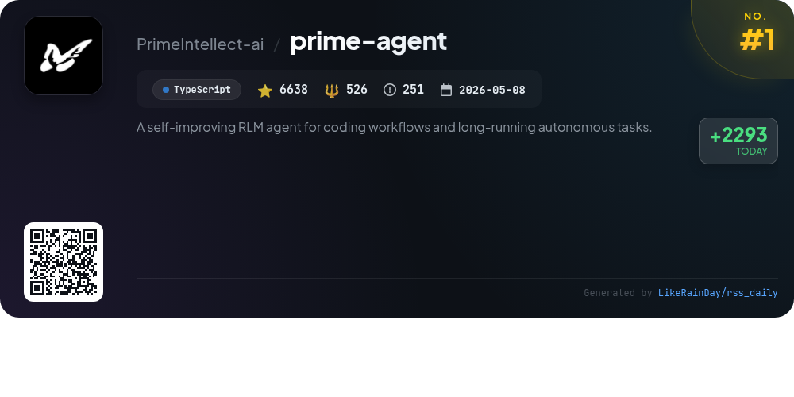
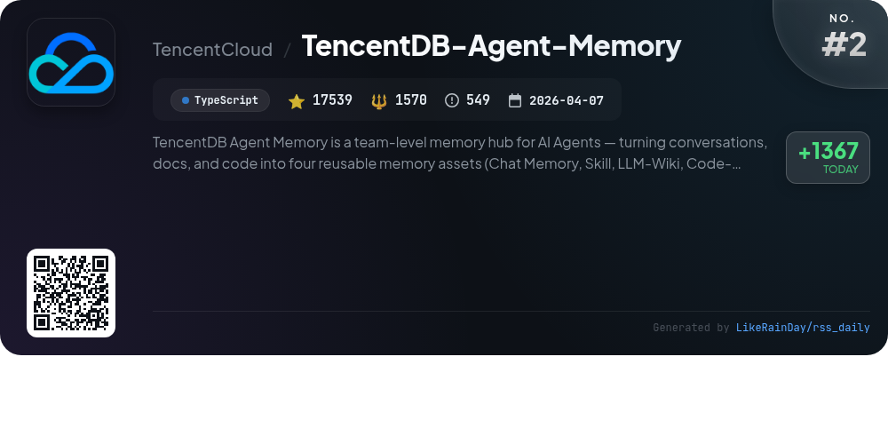
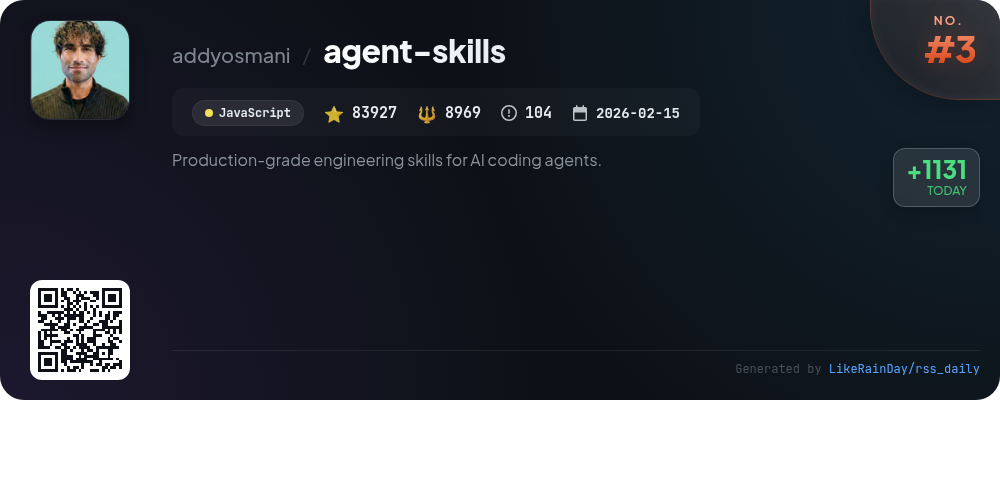
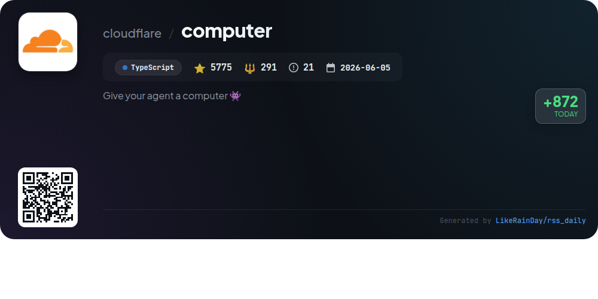
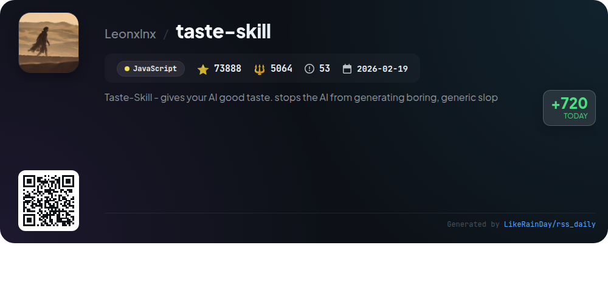
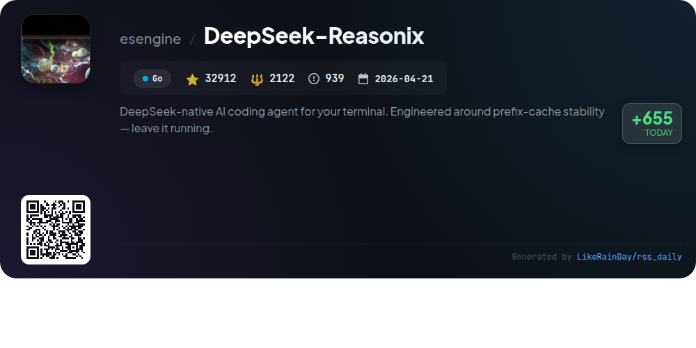
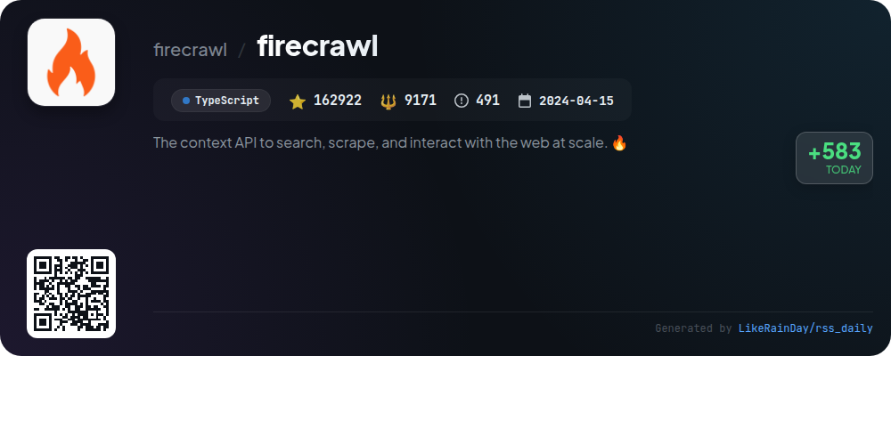
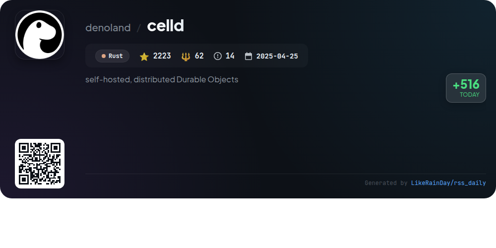
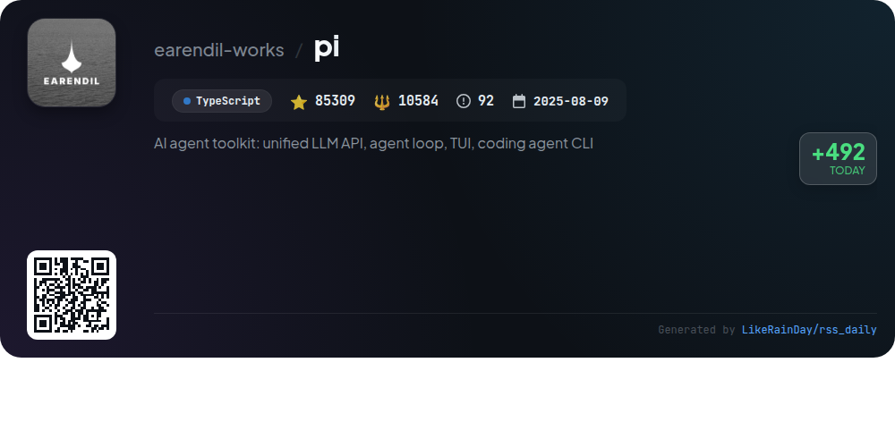
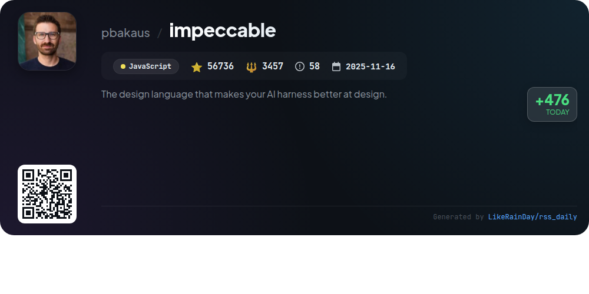

# 📊 🌟 GitHub Trending Daily - 2026-08-08

> > 📅 每日精选 GitHub 热门仓库 | 基于智能算法推荐

## 📋 Overview

**10** 个项目 | **527869** ⭐ | **41816** 🍴

**热门语言:** `TypeScript` (5) · `JavaScript` (3) · `Go` (1)

**更新时间:** 2026-08-08 02:03 UTC

**分类分布:**

- 🌟 每日 Top 10 精选 (10 项)

---

## 🌟 每日 Top 10 精选

### 1. [prime-agent](https://github.com/PrimeIntellect-ai/prime-agent)

> 🤖 **推荐理由**  
> *Prime Agent is an open-source, self-improving RLM agent designed for coding workflows and long-running tasks, boasting over 6,600 stars on GitHub. It utilizes a Recursive Language Model (RLM) for context management and a Continual Harness for refining skills and prompts. Key features include programmatic subagents for parallel work, persistent IPython environments, and long-term task management with heartbeats and schedules. The agent supports background operations, direct communication between agents, and executable skills, making it ideal for research and automation.*

- ⭐ 6638 stars
- 💻 TypeScript
- 📅 Updated: 2026-08-08

### 2. [TencentDB-Agent-Memory](https://github.com/TencentCloud/TencentDB-Agent-Memory)

> 🤖 **推荐理由**  
> *TencentDB-Agent-Memory is an innovative memory hub for AI agents that transforms conversations, documents, and code into reusable assets: Chat Memory, Skills, LLM-Wiki, and Code-Graph. Key features include automatic asset extraction, cross-framework compatibility, and cold-start capabilities, allowing new teams to leverage existing knowledge. The Memory Hub enables human-controlled management of memory assets, ensuring efficient collaboration and access control. With over 17,500 stars on GitHub, this TypeScript project enhances agent performance by reducing repetitive tasks and improving team efficiency.*

- ⭐ 17539 stars
- 💻 TypeScript
- 📅 Updated: 2026-08-08

### 3. [agent-skills](https://github.com/addyosmani/agent-skills)

> 🤖 **推荐理由**  
> *Agent Skills is a comprehensive toolkit for AI coding agents, designed to enforce engineering best practices throughout the software development lifecycle. With 24 structured skills, it guides agents through defining, planning, building, verifying, reviewing, and shipping code. Key features include automated workflow commands, the ability to generate plans with `/build auto`, and tailored skills that activate based on context. It integrates seamlessly with various tools like Claude Code, Copilot, and more, enhancing code quality and reliability by embedding industry standards and methodologies.*

- ⭐ 83927 stars
- 💻 JavaScript
- 📅 Updated: 2026-08-08

### 4. [computer](https://github.com/cloudflare/computer)

> 🤖 **推荐理由**  
> *Cloudflare Computer is a TypeScript-based virtual filesystem residing in a Durable Object, utilizing SQLite for authoritative state management. It offers three execution backends: a FUSE-mounted sandbox container, a just-bash shell in a Dynamic Worker, and an ECMAScript module execution environment. Users can register multiple backends and execute commands through a unified interface. The project is in preview, intended for experimentation and prototyping, with various examples available, including chat agents and artifact generation. Contributing is encouraged, though unsolicited pull requests are not accepted.*

- ⭐ 5775 stars
- 💻 TypeScript
- 📅 Updated: 2026-08-08

### 5. [taste-skill](https://github.com/Leonxlnx/taste-skill)

> 🤖 **推荐理由**  
> *Taste-Skill is an advanced JavaScript framework designed to enhance AI-generated frontends, ensuring high-quality, visually appealing designs. With 73,888 stars on GitHub, it provides portable Agent Skills that improve layout, typography, motion, and spacing, mitigating bland UIs. Key features include image-generation skills for web and mobile designs, a CLI for easy installation, and adjustable parameters for design variance, motion intensity, and visual density. It supports multiple coding agents, making it versatile for diverse projects.*

- ⭐ 73888 stars
- 💻 JavaScript
- 📅 Updated: 2026-08-08

### 6. [DeepSeek-Reasonix](https://github.com/esengine/DeepSeek-Reasonix)

> 🤖 **推荐理由**  
> *DeepSeek-Reasonix is a powerful AI coding agent designed for terminal use, built with a focus on prefix-cache stability for efficient long-session operation. Key features include a config-driven architecture, multi-model support for OpenAI-compatible endpoints, a plugin-driven ecosystem, and cache-aware context maintenance. The project is distributed as a single static Go binary, enabling zero-friction installation across various platforms. With extensive documentation and community support on Discord, it offers versatile integration options, including CLI, desktop apps, and VS Code extensions.*

- ⭐ 32912 stars
- 💻 Go
- 📅 Updated: 2026-08-08

### 7. [firecrawl](https://github.com/firecrawl/firecrawl)

> 🤖 **推荐理由**  
> *Firecrawl is an open-source context API designed for large-scale web searching, scraping, and interaction. Key features include high reliability (covering 96% of the web), fast P95 latency of 3.4 seconds, and LLM-ready outputs like markdown and JSON. Users can search, scrape, and interact with web content effortlessly, leveraging automated data gathering and media parsing capabilities. The API facilitates seamless connections to AI agents, supporting actions like clicking and scrolling. Firecrawl is available as both an open-source project and a hosted service.*

- ⭐ 162922 stars
- 💻 TypeScript
- 📅 Updated: 2026-08-08

### 8. [celld](https://github.com/denoland/celld)

> 🤖 **推荐理由**  
> *celld is an open-source, self-hosted daemon for running distributed Durable Objects on your own infrastructure, written in Rust. It enables applications to shard data effectively by treating each object as its own SQLite database, reducing contention and failure risks. Nodes coordinate through an S3-compatible bucket for state management without requiring a control plane. Key features include idle cell hibernation, seamless database replication, and a robust deployment system using Docker. Ideal for scalable applications, celld offers efficient resource management and easy installation.*

- ⭐ 2223 stars
- 💻 Rust
- 📅 Updated: 2026-08-08

### 9. [pi](https://github.com/earendil-works/pi)

> 🤖 **推荐理由**  
> *Pi is an advanced AI agent toolkit that features a unified LLM API, an interactive coding agent CLI, and a terminal UI library. It provides core services such as the Pi agent runtime for tool management and state handling, and multi-provider LLM support (OpenAI, Anthropic, Google). With over 85,000 stars, Pi emphasizes extensibility and community collaboration, allowing users to share coding sessions to enhance agent performance. The project prioritizes secure supply-chain practices and offers comprehensive documentation for developers. Visit pi.dev for more information and demos.*

- ⭐ 85309 stars
- 💻 TypeScript
- 📅 Updated: 2026-08-08

### 10. [impeccable](https://github.com/pbakaus/impeccable)

> 🤖 **推荐理由**  
> *Impeccable is a design language tool for AI coding agents, enhancing frontend design with 23 commands and 59 deterministic detector rules. It simplifies project setup with a single command, `/impeccable init`, which configures design context for subsequent commands. Users can perform audits, critiques, and polish designs while ensuring adherence to best practices. The tool integrates seamlessly with various platforms like GitHub Copilot and Claude Code, offering a streamlined process for improving AI-generated designs. Explore more at [impeccable.style](https://impeccable.style).*

- ⭐ 56736 stars
- 💻 JavaScript
- 📅 Updated: 2026-08-08

---

## 📡 RSS订阅

通过 RSS 订阅，第一时间获取每日精选项目：

- 🔔 [RSS 订阅源] (../../daily-top.xml)
- 🔔 [每日简报] (../../GITHUB_TODAY_CN.md)
- 🔔 [每日 Top 10 精选](../../daily-top.xml)

---

*⚡ Powered by Smart Trending Algorithm | Generated at 2026-08-08 02:03:58 UTC
