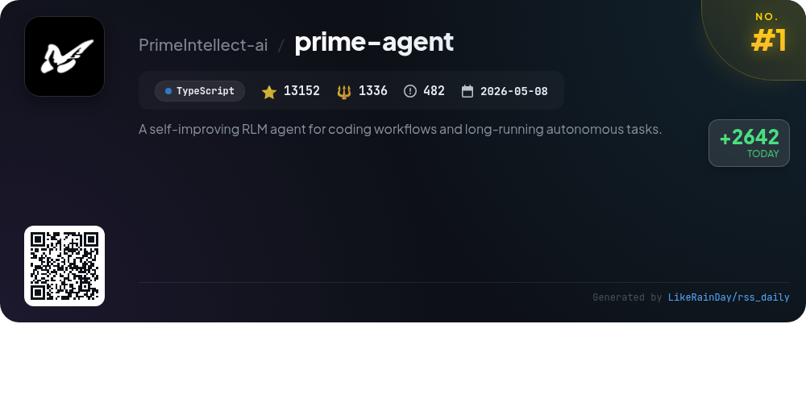
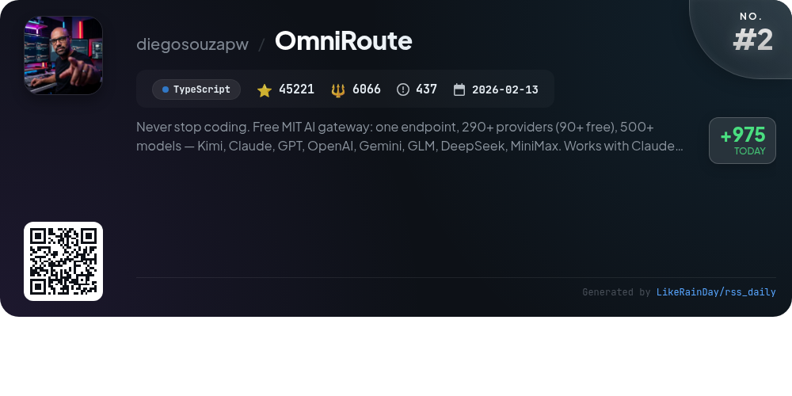
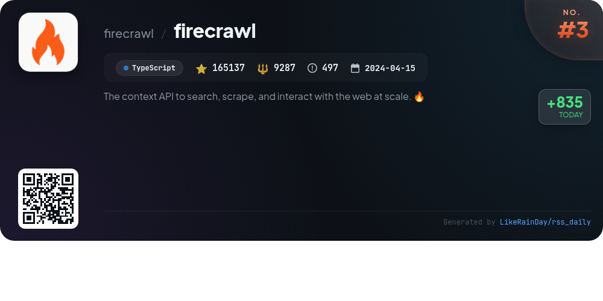
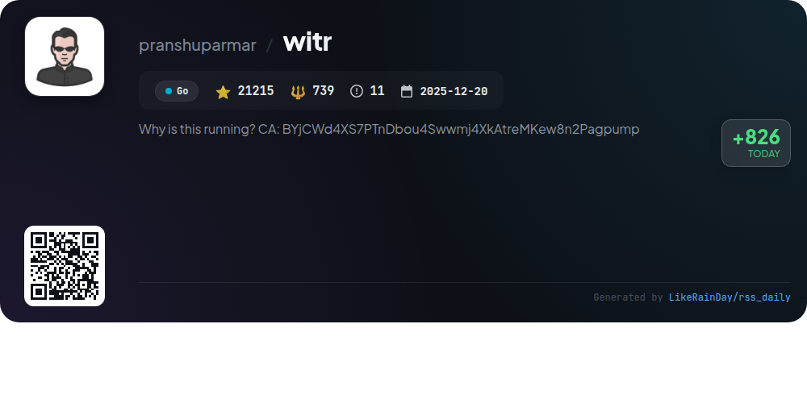
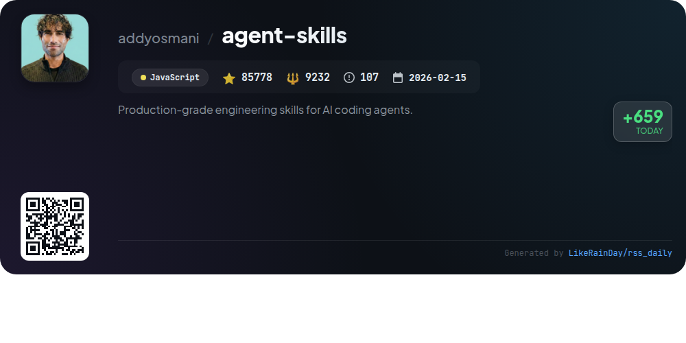
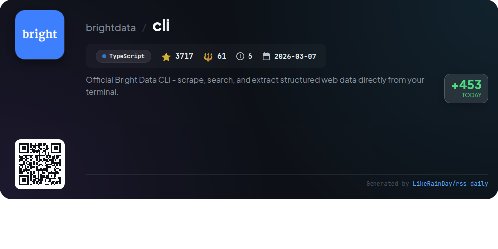
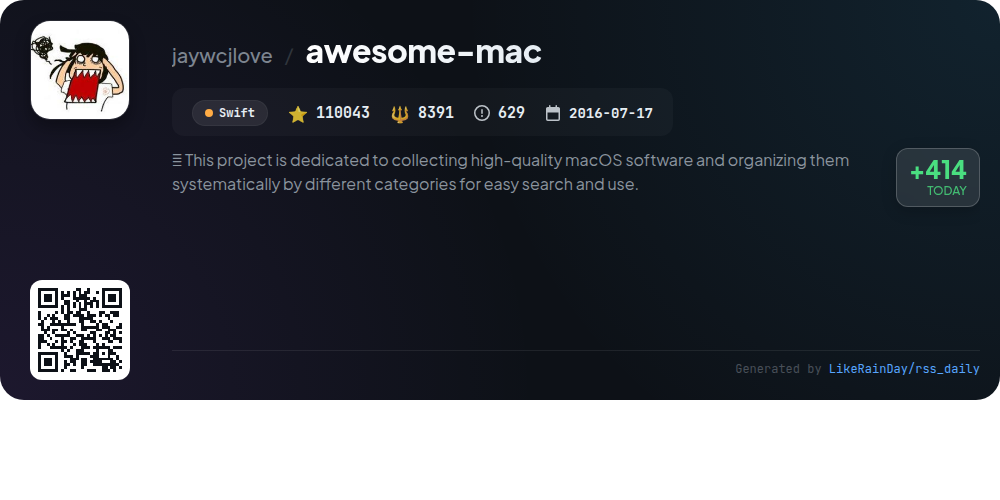
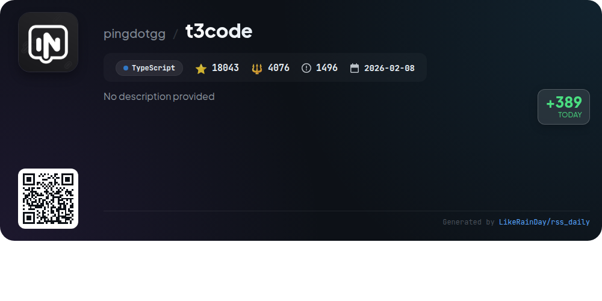
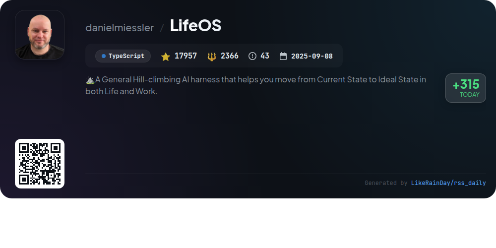
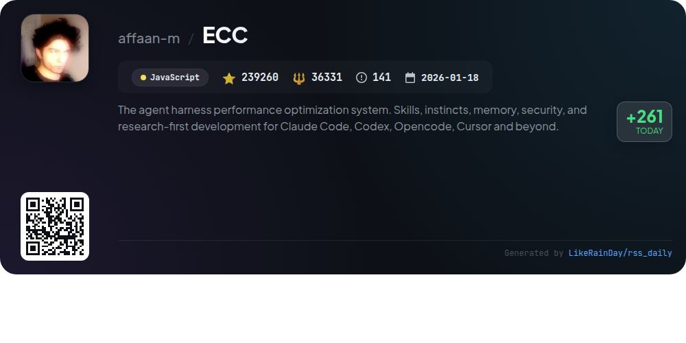

# 📊 🌟 GitHub Trending Daily - 2026-08-11

> > 📅 Daily Picks of GitHub Trending Repositories | Powered by Smart Algorithms

## 📋 Overview

**10** Projects | **719523** ⭐ | **77885** 🍴

**Top Languages:** `TypeScript` (6) · `JavaScript` (2) · `Go` (1)

**Updated:** 2026-08-11 02:11 UTC

**Categories:**

- 🌟 Daily Top 10 (10 items)

---

## 🌟 Daily Top 10

### 1. [prime-agent](https://github.com/PrimeIntellect-ai/prime-agent)

> 🤖 **Why Recommend**  
> *Prime Agent is an open-source self-improving RLM agent designed for coding workflows and long-running autonomous tasks. Key features include a persistent IPython environment, programmatic tool and subagent calling, and a Continual Harness for refining context and skills. It supports background sessions, direct agent communication, and persistent goals, enabling seamless task continuity. Users can create and manage executable skills and run agents autonomously with customizable limits. Designed for research evaluations, Prime Agent enhances coding efficiency and task management.*

- ⭐ 13152 stars
- 💻 TypeScript
- 📅 Updated: 2026-08-11

### 2. [OmniRoute](https://github.com/diegosouzapw/OmniRoute)

> 🤖 **Why Recommend**  
> *OmniRoute is an MIT-licensed AI gateway that consolidates access to over 290 AI providers (90+ free) and 500+ models, including Kimi, Claude, GPT, and Gemini, through a single endpoint. Key features include quota-aware auto-fallback, advanced token compression saving 15-95% on usage, and seamless integration with various coding tools like Codex and Copilot. It supports desktop and PWA deployments, offers live analytics of free tiers, and is backed by over 500 contributors, making it a powerful solution for developers seeking efficient AI interactions.*

- ⭐ 45221 stars
- 💻 TypeScript
- 📅 Updated: 2026-08-11

### 3. [firecrawl](https://github.com/firecrawl/firecrawl)

> 🤖 **Why Recommend**  
> *Firecrawl is a powerful web context API designed for searching, scraping, and interacting with web content at scale. It features industry-leading reliability, covering 96% of the web, including JavaScript-heavy sites, with fast response times. Core functionalities include searching for web content, scraping URLs for clean Markdown or JSON output, and the ability to interact with pages using AI prompts. Additionally, Firecrawl offers automated data gathering through its Agent feature, batch scraping of multiple URLs, and comprehensive integrations with various platforms. Open-source and available as a hosted service, Firecrawl simplifies web data extraction for developers and AI applications.*

- ⭐ 165137 stars
- 💻 TypeScript
- 📅 Updated: 2026-08-11

### 4. [witr](https://github.com/pranshuparmar/witr)

> 🤖 **Why Recommend**  
> *witr is a powerful tool designed to trace processes, ports, containers, and files back to their origin with a focus on answering "Why is this running?" It provides a human-readable output or an interactive TUI for real-time exploration. Key features include detailed process ancestry, support for various container runtimes, and system-wide file lock insights. It is available across major platforms (Linux, macOS, Windows, FreeBSD) and integrates with multiple package managers. With 21,215 stars on GitHub, witr simplifies system diagnostics and enhances operational clarity.*

- ⭐ 21215 stars
- 💻 Go
- 📅 Updated: 2026-08-11

### 5. [agent-skills](https://github.com/addyosmani/agent-skills)

> 🤖 **Why Recommend**  
> *Agent Skills is a JavaScript project designed to equip AI coding agents with production-grade engineering workflows. It features 24 structured skills that guide agents through the software development lifecycle, including defining, planning, building, verifying, reviewing, and shipping code. Key highlights include 8 slash commands for seamless task execution, automated planning with the `/build auto` command, and specialized agent personas for targeted reviews. The skills emphasize best practices derived from Google's engineering culture, ensuring high-quality software development. With over 85,000 stars, it is a popular choice for enhancing AI-assisted coding.*

- ⭐ 85778 stars
- 💻 JavaScript
- 📅 Updated: 2026-08-11

### 6. [cli](https://github.com/brightdata/cli)

> 🤖 **Why Recommend**  
> *The Bright Data CLI is a powerful tool for scraping, searching, and extracting structured web data directly from the terminal. Key features include scraping any URL with anti-bot protection, AI-powered web discovery, and creating custom scrapers from natural language descriptions. Users can perform searches across major engines, extract data from over 40 platforms, and control a real browser session. The CLI supports various output formats, interactive setup, and offers a free tier with 5,000 monthly credits. Ideal for developers and data professionals.*

- ⭐ 3717 stars
- 💻 TypeScript
- 📅 Updated: 2026-08-11

### 7. [awesome-mac](https://github.com/jaywcjlove/awesome-mac)

> 🤖 **Why Recommend**  
> *Awesome Mac is a comprehensive repository of high-quality macOS software, meticulously organized by category for easy navigation. With over 110,000 stars on GitHub, it offers a vast array of tools, including productivity apps, development utilities, design software, and more. Key features include open-source options, curated lists for specialized tasks, and a focus on user contributions. The project promotes collaboration and invites users to enhance the collection through suggestions and pull requests, making it an invaluable resource for macOS users seeking efficient software solutions.*

- ⭐ 110043 stars
- 💻 Swift
- 📅 Updated: 2026-08-11

### 8. [t3code](https://github.com/pingdotgg/t3code)

> 🤖 **Why Recommend**  
> *T3 Code is an agent harness control surface written in TypeScript, designed for managing various AI agents on your machine through a mobile app (iOS/Android), web app, and an Electron-based desktop app. With support for services like Claude Code, Codex, Cursor, Grok Build, and OpenCode, T3 Code aims to enhance the development experience by providing a performant and open solution. Users can easily install the app or run it in their terminal for a quick test. The project is in early development, prioritizing user feedback and potential forks for customization.*

- ⭐ 18043 stars
- 💻 TypeScript
- 📅 Updated: 2026-08-11

### 9. [LifeOS](https://github.com/danielmiessler/LifeOS)

> 🤖 **Why Recommend**  
> *LifeOS is an AI-powered life operating system designed to help users transition from their Current State to an Ideal State in both personal and professional contexts. Built with TypeScript, it features persistent memory, custom skills, and intelligent routing to enhance productivity and efficiency. Key components include the Algorithm, TELOS, and a unique skill system, enabling seamless integration with various AI harnesses. LifeOS is open-source and free forever, making it a versatile tool for anyone aiming to optimize their life and work.*

- ⭐ 17957 stars
- 💻 TypeScript
- 📅 Updated: 2026-08-11

### 10. [ECC](https://github.com/affaan-m/ECC)

> 🤖 **Why Recommend**  
> *ECC is an advanced performance optimization system designed for coding agents like Claude Code, Codex, and Cursor. It features 68 specialized agents for planning, review, and security, alongside 285 reusable skills and 94 command shims. ECC enhances agent capabilities with memory persistence, continuous learning, and security scanning via AgentShield, ensuring robust development workflows. It supports multi-harness environments and includes tools for TDD, security reviews, and context management. The project is open-source and encourages contributions, fostering a community around optimized coding practices.*

- ⭐ 239260 stars
- 💻 JavaScript
- 📅 Updated: 2026-08-11

---

## 📡 RSS Subscription

Subscribe via RSS to get daily trending updates:

- 🔔 [RSS XML] (../../daily-top.xml)
- 🔔 [Daily Report] (../../GITHUB_TODAY.md)
- 🔔 [Daily Top 10](../../daily-top.xml)

---

*⚡ Powered by Smart Trending Algorithm | Generated at 2026-08-11 02:11:11 UTC
