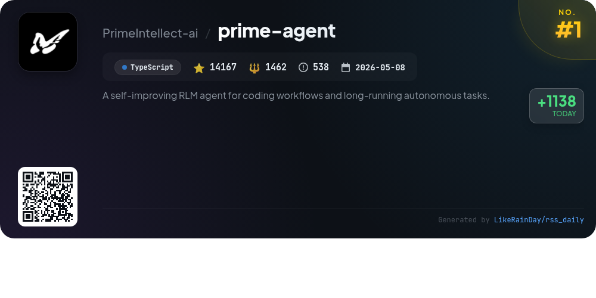
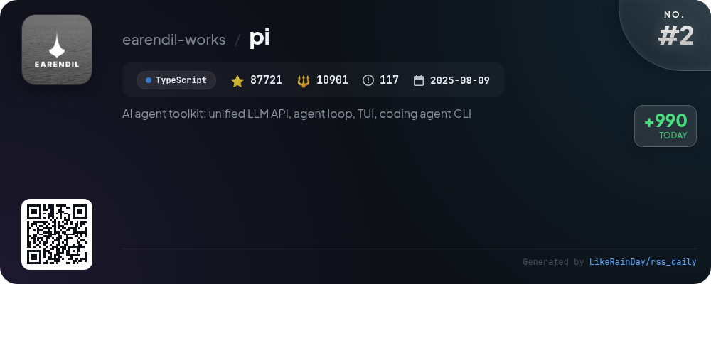
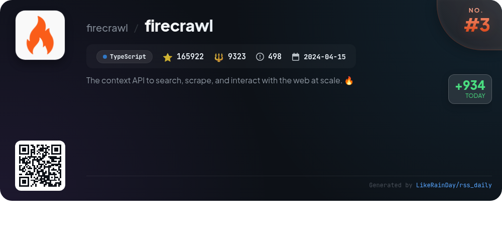
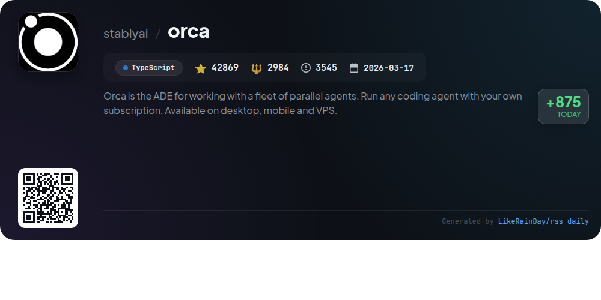
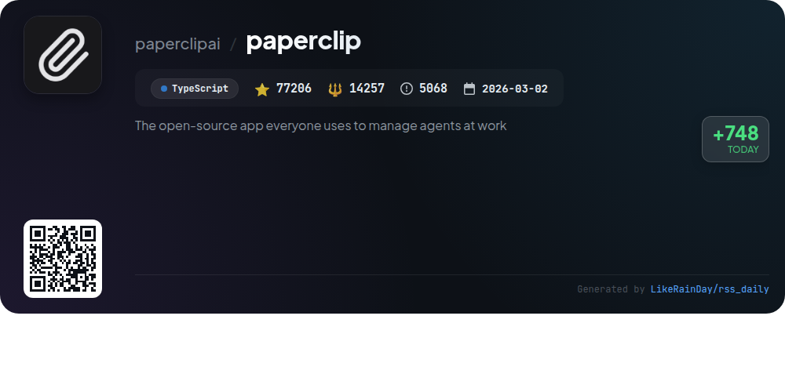
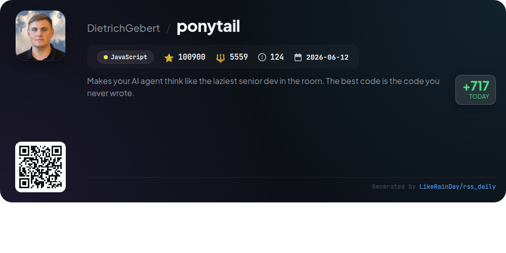
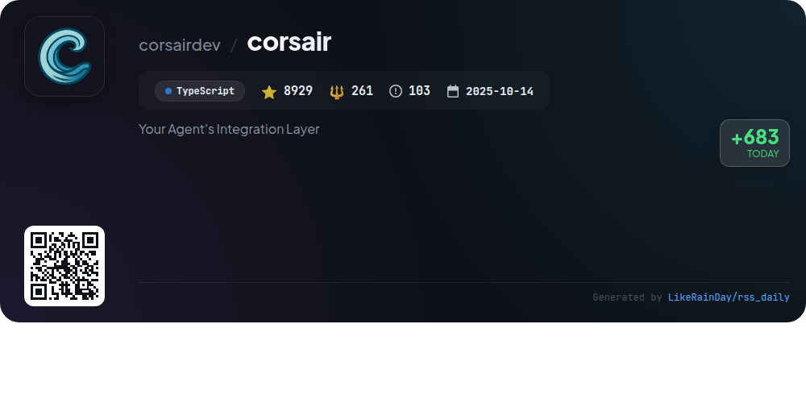
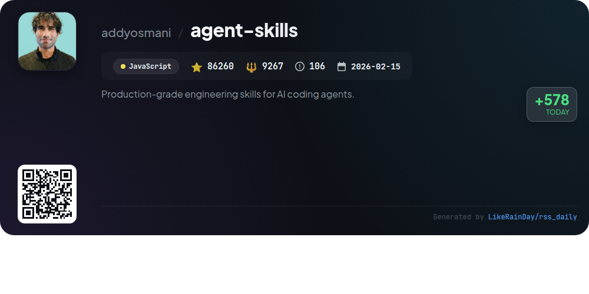
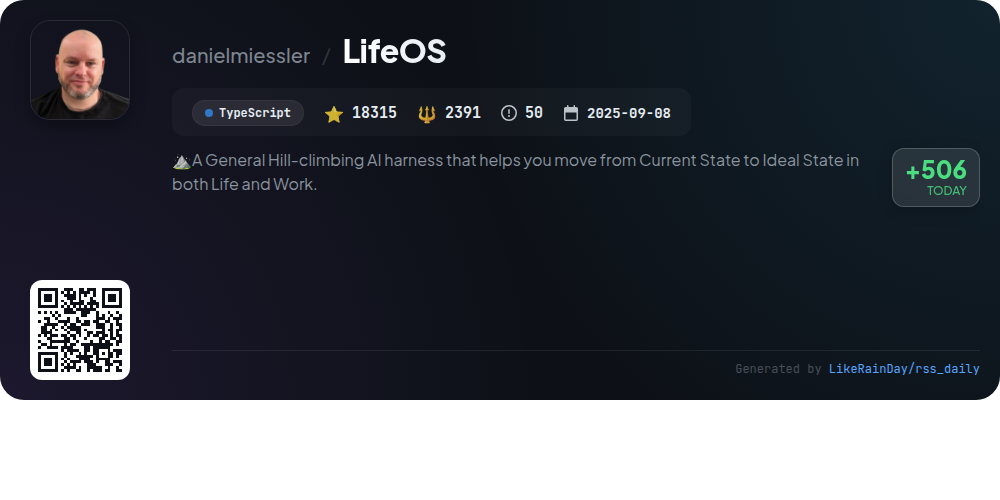
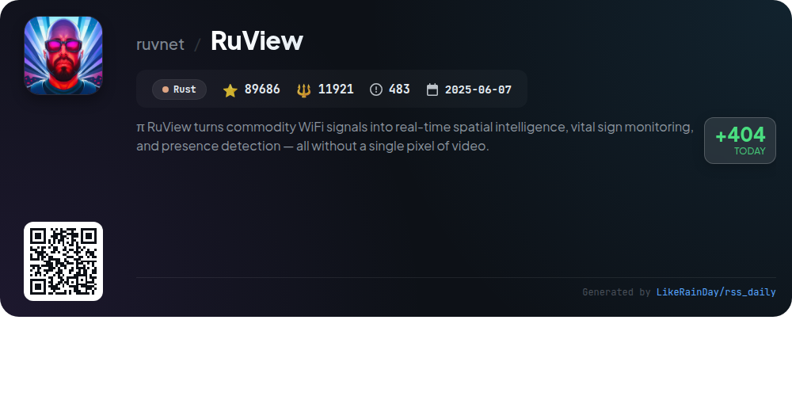

# 📊 🌟 GitHub Trending Daily - 2026-08-12

> > 📅 Daily Picks of GitHub Trending Repositories | Powered by Smart Algorithms

## 📋 Overview

**10** Projects | **691975** ⭐ | **68326** 🍴

**Top Languages:** `TypeScript` (7) · `JavaScript` (2) · `Rust` (1)

**Updated:** 2026-08-12 02:28 UTC

**Categories:**

- 🌟 Daily Top 10 (10 items)

---

## 🌟 Daily Top 10

### 1. [prime-agent](https://github.com/PrimeIntellect-ai/prime-agent)

> 🤖 **Why Recommend**  
> *Prime Agent is a self-improving RLM agent designed for coding workflows and long-running autonomous tasks. Built in TypeScript, it leverages a persistent Python control environment with two core abstractions: the Recursive Language Model (RLM) for context management and the Continual Harness for refining state and skills. Key features include programmatic subagent creation, background session continuity, agent-to-agent communication, and automated task management with persistent goals. Open-source and highly extensible, it enables efficient coding and research automation.*

- ⭐ 14167 stars
- 💻 TypeScript
- 📅 Updated: 2026-08-12

### 2. [pi](https://github.com/earendil-works/pi)

> 🤖 **Why Recommend**  
> *Pi is an AI agent toolkit designed for unified interaction with large language models (LLMs). It offers a comprehensive suite of features, including an interactive coding agent CLI, an agent runtime for tool calling and state management, and a multi-provider LLM API supporting services like OpenAI and Google. Key components include a terminal UI library and telemetry contracts. Pi emphasizes security through containerization options and provides extensive documentation and community support. With over 87,000 stars on GitHub, it aims to enhance coding workflows and collaboration in open-source projects.*

- ⭐ 87721 stars
- 💻 TypeScript
- 📅 Updated: 2026-08-12

### 3. [firecrawl](https://github.com/firecrawl/firecrawl)

> 🤖 **Why Recommend**  
> *Firecrawl is a powerful context API designed for searching, scraping, and interacting with the web at scale. It offers industry-leading reliability, covering 96% of the web, and delivers clean, LLM-ready outputs such as Markdown and structured JSON. Key features include real-time scraping, automated data gathering, and seamless integration with AI agents. Users can easily search the web, scrape content from URLs, and crawl entire websites with a single request. Firecrawl is open source and available as a hosted service, making it ideal for developers and businesses alike.*

- ⭐ 165922 stars
- 💻 TypeScript
- 📅 Updated: 2026-08-12

### 4. [orca](https://github.com/stablyai/orca)

> 🤖 **Why Recommend**  
> *Orca is an advanced development environment (ADE) designed for managing fleets of parallel agents, enabling users to run multiple coding agents like Codex, ClaudeCode, and Pi simultaneously in isolated worktrees. Key features include a mobile companion app for remote monitoring, terminal splits for enhanced productivity, design mode for UI interaction, and seamless integration with GitHub and Linear for task management. With support for various platforms and CLI agents, Orca streamlines workflows, making it ideal for developers seeking efficiency and collaboration.*

- ⭐ 42869 stars
- 💻 TypeScript
- 📅 Updated: 2026-08-12

### 5. [paperclip](https://github.com/paperclipai/paperclip)

> 🤖 **Why Recommend**  
> *Paperclip is an open-source app designed for managing AI agents in a work environment, featuring a Node.js server and React UI. With over 77,000 stars, it enables users to bring their own agents, set business goals, and monitor budgets from a single dashboard. Key features include goal alignment, cost control, heartbeats for agent tasks, and a robust governance system. Paperclip supports multiple companies with complete data isolation and provides tools for task management, org charts, and agent training, making it ideal for orchestrating diverse AI teams effectively.*

- ⭐ 77206 stars
- 💻 TypeScript
- 📅 Updated: 2026-08-12

### 6. [ponytail](https://github.com/DietrichGebert/ponytail)

> 🤖 **Why Recommend**  
> *Ponytail is a JavaScript GitHub project designed to optimize AI agent coding by emulating a "lazy senior developer." With over 100,900 stars, it reduces code output by up to 94%, resulting in significant cost and time savings while maintaining safety in development. Key features include minimalistic code generation, real-time auditing for over-engineering, and seamless integration with various AI platforms like Claude Code and Codex. Ponytail emphasizes writing only necessary code, leveraging existing libraries and features to enhance efficiency and reduce complexity in software development.*

- ⭐ 100900 stars
- 💻 JavaScript
- 📅 Updated: 2026-08-12

### 7. [corsair](https://github.com/corsairdev/corsair)

> 🤖 **Why Recommend**  
> *Corsair is a robust TypeScript integration layer for agents, allowing secure connections to various applications without exposing credentials. It features customizable permission modes, such as cautious and strict, ensuring user approval for sensitive actions. With multi-tenancy support, Corsair isolates data and permissions for different users. Built-in webhook handlers streamline event management. This project aims to automate tasks safely, empowering agents to perform actions while maintaining user control and oversight. Visit [corsair.dev](https://corsair.dev) for more information.*

- ⭐ 8929 stars
- 💻 TypeScript
- 📅 Updated: 2026-08-12

### 8. [agent-skills](https://github.com/addyosmani/agent-skills)

> 🤖 **Why Recommend**  
> *Agent Skills is a robust framework designed to enhance AI coding agents with production-grade engineering practices. It encompasses 24 structured workflows—covering the entire software development lifecycle—from defining and planning to building, verifying, reviewing, and shipping code. Key features include eight slash commands that automate tasks, skills that trigger based on context, and a CLI for easy installation across 70+ agents. The project promotes best practices derived from Google's engineering culture, ensuring reliable, high-quality software development. With 86,260 stars, it's widely adopted and continuously maintained.*

- ⭐ 86260 stars
- 💻 JavaScript
- 📅 Updated: 2026-08-12

### 9. [LifeOS](https://github.com/danielmiessler/LifeOS)

> 🤖 **Why Recommend**  
> *LifeOS is an AI-powered life operating system designed to help users transition from their Current State to an Ideal State in both personal and professional realms. Key features include persistent memory, custom skills tailored to user needs, and intelligent routing for efficient workflows. Built in TypeScript, LifeOS is harness-agnostic, allowing integration with various AI coding platforms. It offers a self-contained skill library encompassing research, writing, and art. With robust community support and an open-source model, LifeOS is free and continuously evolving.*

- ⭐ 18315 stars
- 💻 TypeScript
- 📅 Updated: 2026-08-12

### 10. [RuView](https://github.com/ruvnet/RuView)

> 🤖 **Why Recommend**  
> *RuView transforms ordinary WiFi signals into real-time spatial intelligence, enabling vital sign monitoring, presence detection, and activity recognition without cameras or wearables. Key features include contactless detection of breathing and heart rates, through-wall occupancy sensing, and integration with smart home systems like Home Assistant, Apple Home, Google Home, and Alexa. Built on low-cost ESP32 hardware, RuView’s edge computing capabilities ensure privacy and efficiency. It supports a wide range of applications from healthcare to industrial safety, all while maintaining a strong focus on user data protection.*

- ⭐ 89686 stars
- 💻 Rust
- 📅 Updated: 2026-08-12

---

## 📡 RSS Subscription

Subscribe via RSS to get daily trending updates:

- 🔔 [RSS XML] (../../daily-top.xml)
- 🔔 [Daily Report] (../../GITHUB_TODAY.md)
- 🔔 [Daily Top 10](../../daily-top.xml)

---

*⚡ Powered by Smart Trending Algorithm | Generated at 2026-08-12 02:28:49 UTC
