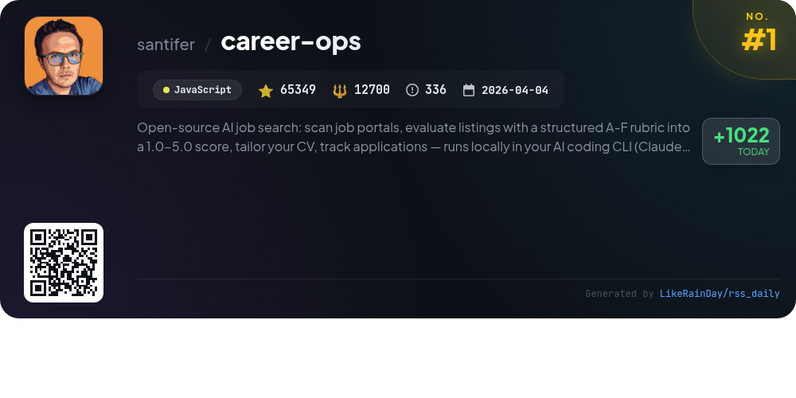
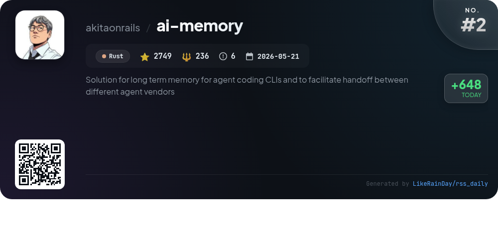
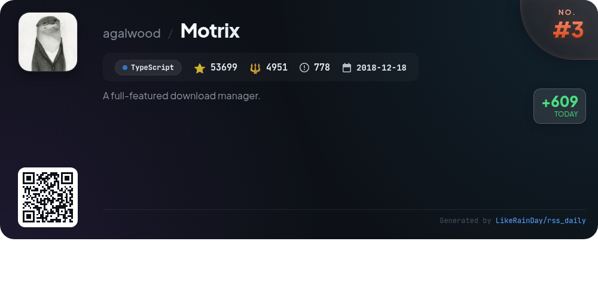
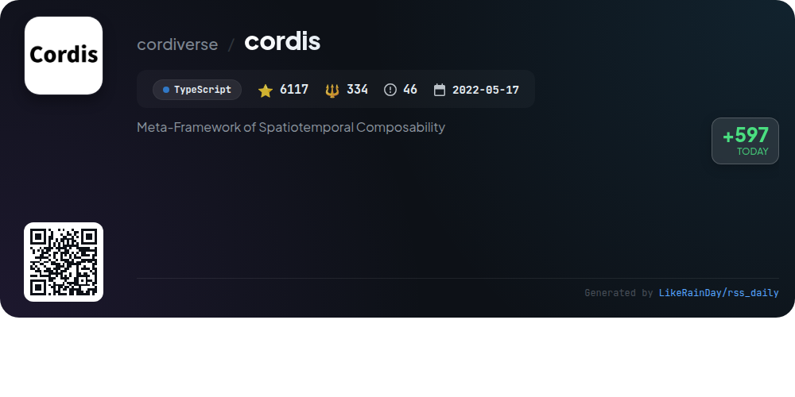
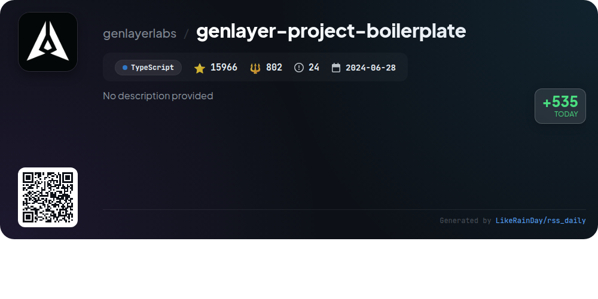
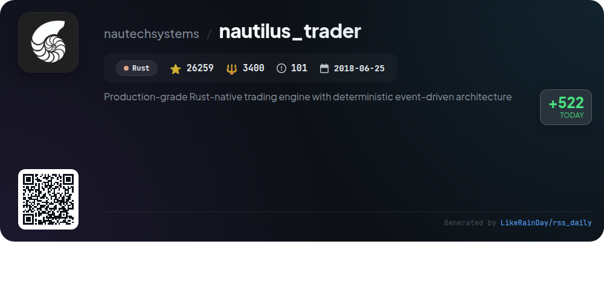
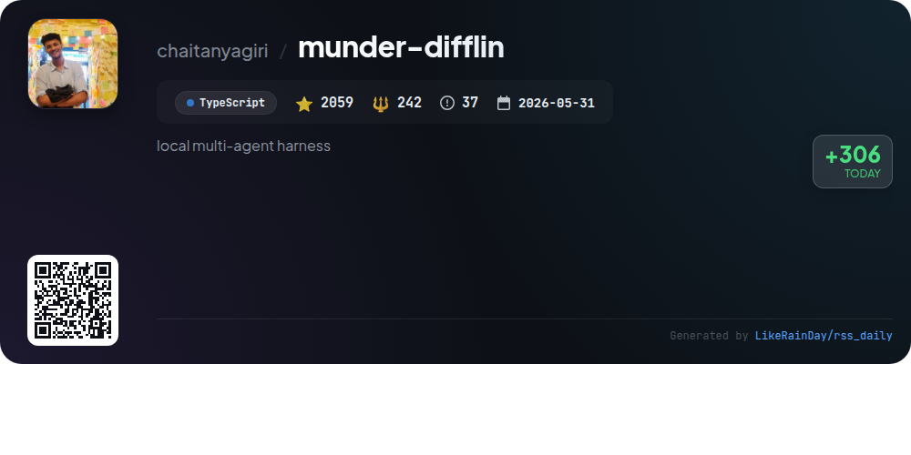
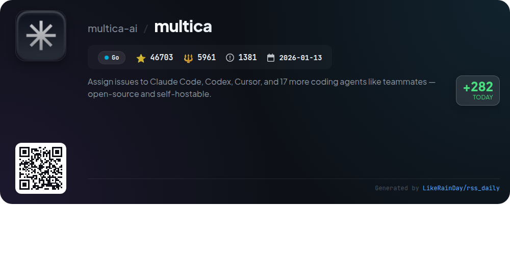
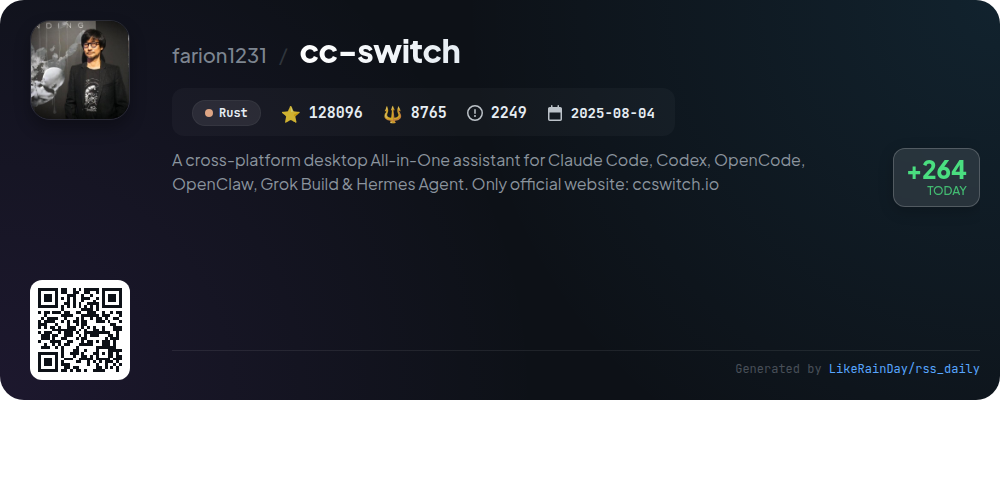

# 📊 🌟 GitHub Trending Daily - 2026-08-19

> > 📅 每日精选 GitHub 热门仓库 | 基于智能算法推荐

## 📋 Overview

**10** 个项目 | **379736** ⭐ | **39412** 🍴

**热门语言:** `Rust` (4) · `TypeScript` (4) · `JavaScript` (1)

**更新时间:** 2026-08-19 01:42 UTC

**分类分布:**

- 🌟 每日 Top 10 精选 (10 项)

---

## 🌟 每日 Top 10 精选

### 1. [career-ops](https://github.com/santifer/career-ops)

> 🤖 **推荐理由**  
> *career-ops is an open-source AI job search tool that transforms any AI coding CLI into a comprehensive job application pipeline. Key features include automatic job listing scanning, an A-F evaluation system scoring offers based on structured criteria, and tailored ATS-optimized CV generation. Users can track applications, generate cover letters, and find contacts at target companies. With batch processing, the system ensures users focus on high-value opportunities while maintaining control over application submissions. Ideal for managing job searches efficiently.*

- ⭐ 65349 stars
- 💻 JavaScript
- 📅 Updated: 2026-08-19

### 2. [ai-memory](https://github.com/akitaonrails/ai-memory)

> 🤖 **推荐理由**  
> *ai-memory is a Rust-based long-term memory solution for AI coding agents, enabling seamless transitions between different agents like Claude Code and OpenAI Codex without losing context. Key features include zero-friction lifecycle capture, cross-agent handoffs, and a markdown-based wiki for easy retrieval and management of project knowledge. It supports multiple platforms (Linux, macOS, Windows via WSL2) and integrates with various agents and LLM providers. The system offers enhanced continuity through managed workstreams and entity-assisted recall, ensuring efficient knowledge transfer and project collaboration.*

- ⭐ 2749 stars
- 💻 Rust
- 📅 Updated: 2026-08-19

### 3. [Motrix](https://github.com/agalwood/Motrix)

> 🤖 **推荐理由**  
> *Motrix is a modern, full-featured download manager built with TypeScript, supporting HTTP, FTP, BitTorrent, and magnet links. Key features include a clean interface with dark mode, customizable dashboards, and built-in tracker management. It offers both a desktop app for macOS, Windows, and Linux, and a headless server option via Docker, allowing remote access. The app supports browser extensions, a command-line client, and an extensible plugin system. With robust session management and system notifications, Motrix provides a seamless downloading experience.*

- ⭐ 53699 stars
- 💻 TypeScript
- 📅 Updated: 2026-08-19

### 4. [cordis](https://github.com/cordiverse/cordis)

> 🤖 **推荐理由**  
> *Cordis is a meta-framework designed for spatiotemporal composability, currently under active development with an evolving API. It facilitates the integration and manipulation of spatial and temporal data, enabling developers to create complex applications with ease. Key features include a comprehensive documentation guide (cordis-primer) and a foundational research paper outlining its programming paradigm. With over 6,100 stars on GitHub, Cordis aims to revolutionize how developers interact with spatiotemporal constructs in their projects.*

- ⭐ 6117 stars
- 💻 TypeScript
- 📅 Updated: 2026-08-19

### 5. [llmfit](https://github.com/AlexsJones/llmfit)

> 🤖 **推荐理由**  
> *llmfit is a Rust-based terminal tool designed to optimize large language model (LLM) performance on your hardware. It scores hundreds of models based on memory fit, speed, quality, and context, ensuring ideal selections for your system's RAM, CPU, and GPU. Key features include an interactive TUI, multi-GPU support, dynamic quantization, and real-time benchmarking. Users can contribute performance data to improve estimates for others. With support for various runtime providers like Ollama and Docker, llmfit streamlines model management for AI applications.*

- ⭐ 32739 stars
- 💻 Rust
- 📅 Updated: 2026-08-19

### 6. [genlayer-project-boilerplate](https://github.com/genlayerlabs/genlayer-project-boilerplate)

> 🤖 **推荐理由**  
> *The genlayer-project-boilerplate is a TypeScript-based boilerplate for implementing GenLayer intelligent contracts, specifically for a football betting game. It features an example contract with web access and LLM integration, direct mode and integration tests, static contract linting, and a CI pipeline using GitHub Actions. The project includes a production-ready Next.js 15 frontend and deployment scripts. Key capabilities include fast in-memory testing, robust error checking, and seamless deployment to GenLayer Studio. Community support is available via Discord and Telegram.*

- ⭐ 15966 stars
- 💻 TypeScript
- 📅 Updated: 2026-08-19

### 7. [nautilus_trader](https://github.com/nautechsystems/nautilus_trader)

> 🤖 **推荐理由**  
> *NautilusTrader is a production-grade, Rust-native trading engine designed for multi-asset, multi-venue trading systems. It features a deterministic event-driven architecture that integrates research, backtesting, and live execution seamlessly. Core capabilities include high performance, type safety, and modular integration with various trading venues via REST and WebSocket APIs. Python serves as the control plane for strategy development, enabling easy transitions from research to live trading. Key highlights include advanced order types, backtesting with nanosecond precision, and AI training support. The project is open-source and actively maintained, fostering community contributions.*

- ⭐ 26259 stars
- 💻 Rust
- 📅 Updated: 2026-08-19

### 8. [munder-difflin](https://github.com/chaitanyagiri/munder-difflin)

> 🤖 **推荐理由**  
> *Munder Difflin is a powerful open-source multi-agent harness designed to emulate an office of clones, enabling seamless collaboration among various AI agents. Key features include real terminal integration for agents like Claude Code and OpenAI Codex, a visual office floor where agents work as avatars, and a central orchestrating agent (Michael) for task routing and management. Enhanced with instant memory recall, semantic indexing, and a robust command center, it supports Slack integrations, custom API keys, and local LLMs. Available on macOS, Windows, and Linux, it aims to optimize productivity while keeping users in control.*

- ⭐ 2059 stars
- 💻 TypeScript
- 📅 Updated: 2026-08-19

### 9. [multica](https://github.com/multica-ai/multica)

> 🤖 **推荐理由**  
> *Multica is an open-source platform that enables teams to assign coding tasks to AI agents, such as Claude Code and Codex, as if they were teammates. It supports 20 agent CLIs, allowing seamless integration and collaboration. Key features include issue assignment, real-time progress tracking, execution logs, and self-hosting capabilities. Users can manage agents, create squads, and utilize skills for efficient task handling. Multica promotes a streamlined workflow by connecting agents and human teammates in a single workspace, enhancing productivity without vendor lock-in.*

- ⭐ 46703 stars
- 💻 Go
- 📅 Updated: 2026-08-19

### 10. [cc-switch](https://github.com/farion1231/cc-switch)

> 🤖 **推荐理由**  
> *CC Switch is a cross-platform desktop assistant designed to streamline the management of AI coding tools, including Claude Code, Codex, and Gemini CLI. With over 50 built-in provider presets, it eliminates the need for manual configuration, enabling one-click switching between APIs. Key features include unified MCP and Skills management, a local proxy for seamless failover, and cloud sync options. The app supports Windows, macOS, and Linux, providing a robust interface for developers to optimize their coding workflows efficiently. Visit ccswitch.io for more information.*

- ⭐ 128096 stars
- 💻 Rust
- 📅 Updated: 2026-08-19

---

## 📡 RSS订阅

通过 RSS 订阅，第一时间获取每日精选项目：

- 🔔 [RSS 订阅源] (../../daily-top.xml)
- 🔔 [每日简报] (../../GITHUB_TODAY_CN.md)
- 🔔 [每日 Top 10 精选](../../daily-top.xml)

---

*⚡ Powered by Smart Trending Algorithm | Generated at 2026-08-19 01:42:19 UTC
