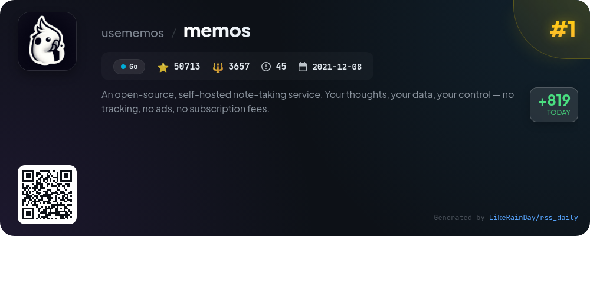
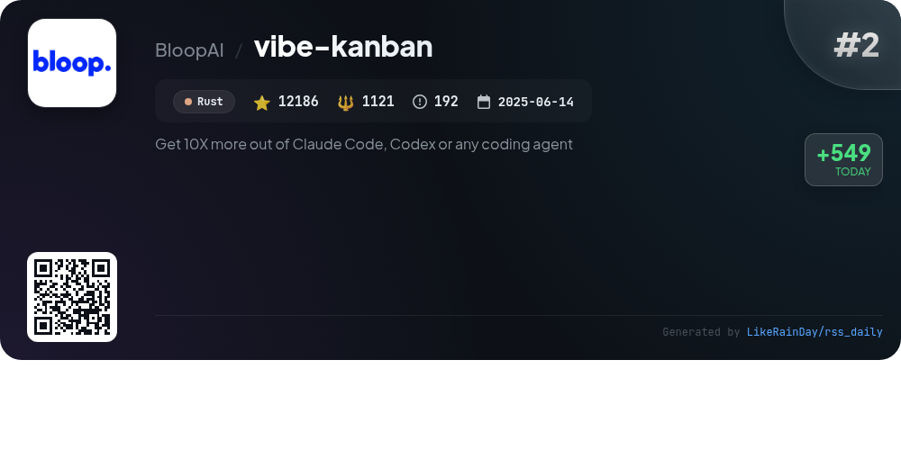
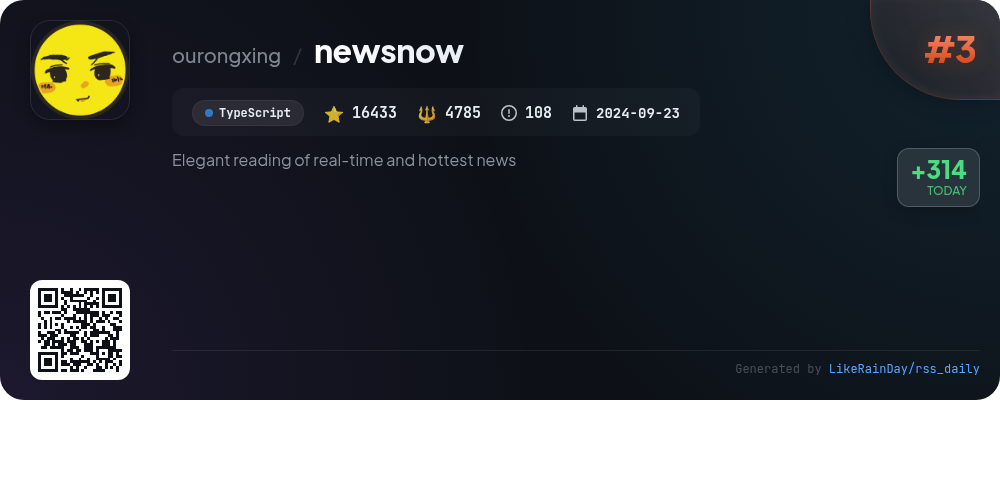
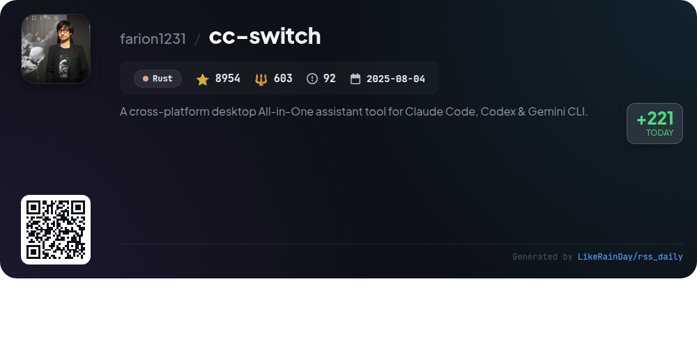
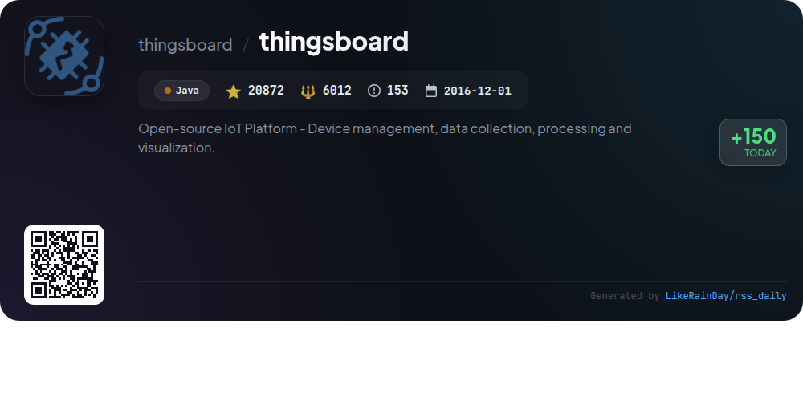
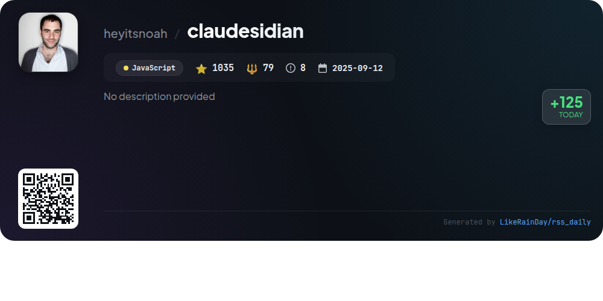
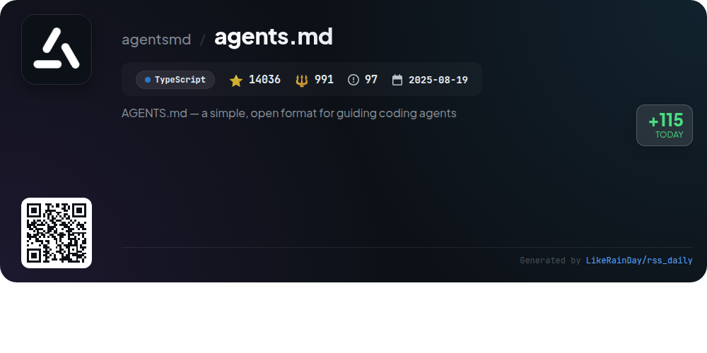
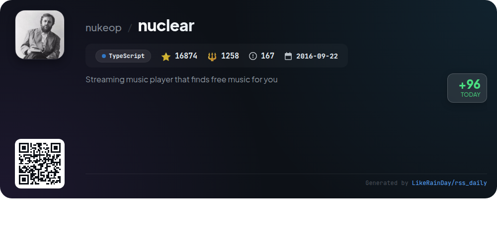
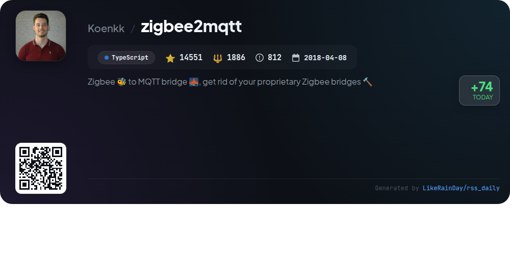

# 📊 🌟 GitHub Trending Daily - 2026-01-04

> > 📅 Daily Picks of GitHub Trending Repositories | Powered by Smart Algorithms

## 📋 Overview

**10** Projects | **216029** ⭐ | **24884** 🍴

**Top Languages:** `TypeScript` (5) · `Rust` (2) · `Go` (1)

**Updated:** 2026-01-04 08:02 UTC

**Categories:**

- 🌟 Daily Top 10 (10 items)

---

## 🌟 Daily Top 10

### 1. [memos](https://github.com/usememos/memos)

> 🤖 **Why Recommend**  
> *Memos is an open-source, self-hosted note-taking service that prioritizes privacy and data ownership. Built with Go and React, it offers features like full markdown support, zero telemetry, and customizable deployment options via Docker. Key highlights include instant performance, full REST and gRPC APIs for integration, and a clean, mobile-responsive interface. With no ads, tracking, or subscription fees, Memos ensures complete control over your notes. Try the live demo or explore the documentation for easy installation and customization.*

- ⭐ 50713 stars
- 💻 Go
- 📅 Updated: 2026-01-04

### 2. [vibe-kanban](https://github.com/BloopAI/vibe-kanban)

> 🤖 **Why Recommend**  
> *Vibe Kanban enhances productivity with AI coding agents like Claude Code and Codex, enabling users to manage coding tasks effectively. Key features include seamless switching between agents, orchestration of parallel or sequential executions, task status tracking, and centralized agent configuration. Users can remotely open projects via SSH, facilitating development on remote servers. With over 12,000 stars on GitHub, Vibe Kanban is designed to streamline the coding process, allowing engineers to focus more on strategy and less on manual coding tasks. Visit the [documentation](https://vibekanban.com/docs) for more details.*

- ⭐ 12186 stars
- 💻 Rust
- 📅 Updated: 2026-01-04

### 3. [newsnow](https://github.com/ourongxing/newsnow)

> 🤖 **Why Recommend**  
> *newsnow is an elegant platform for real-time and trending news, built with TypeScript and designed for optimal reading experiences. Key features include a clean UI, GitHub OAuth login, real-time news updates, and adaptive scraping intervals to prevent IP bans. The project supports a basic deployment option with caching and login, as well as Docker deployment. Future plans include multi-language support, enhanced personalization, and expanded data sources. Contributions are welcome, and it operates under the MIT license.*

- ⭐ 16433 stars
- 💻 TypeScript
- 📅 Updated: 2026-01-04

### 4. [nocodb](https://github.com/nocodb/nocodb)

> 🤖 **Why Recommend**  
> *🔥 🔥 🔥 Open Source Airtable Alternative. popular project, actively maintained, recently updated*

- ⭐ 60375 stars
- 🍴 4492 forks
- 💻 TypeScript
- 📅 Updated: 2026-01-04

### 5. [cc-switch](https://github.com/farion1231/cc-switch)

> 🤖 **Why Recommend**  
> *cc-switch is a cross-platform desktop assistant tool designed for Claude Code, Codex, and Gemini CLI, built with Rust and Tauri. It boasts a dual-layer SQLite + JSON architecture for data management, enabling future cloud sync. Key features include seamless provider management, skills and prompts systems, and multi-language support (English, Chinese, Japanese). The app supports auto-launch, has a redesigned UI, and offers one-click configuration switching. With over 8,900 stars, it is an efficient solution for developers looking to enhance their AI coding experience.*

- ⭐ 8954 stars
- 💻 Rust
- 📅 Updated: 2026-01-04

### 6. [thingsboard](https://github.com/thingsboard/thingsboard)

> 🤖 **Why Recommend**  
> *ThingsBoard is an open-source IoT platform designed for device management, data collection, processing, and visualization. With over 20,000 stars on GitHub, it offers powerful features like real-time dashboards, SCADA capabilities, and a robust rule engine for data processing and alarm management. Users can connect devices, visualize telemetry data, and build custom workflows. Installation options include on-premise, cloud, and live demo. The platform supports various use cases like smart energy, fleet tracking, and smart farming, making it versatile for IoT applications.*

- ⭐ 20872 stars
- 💻 Java
- 📅 Updated: 2026-01-04

### 7. [claudesidian](https://github.com/heyitsnoah/claudesidian)

> 🤖 **Why Recommend**  
> *Claudesidian is a JavaScript-based starter kit that transforms your Obsidian vault into an AI-powered second brain using Claude Code. It enables users to leverage AI as a thinking partner, organize knowledge with the PARA method, and maintain version control via Git. Key features include a structured vault with dedicated folders for projects and resources, an interactive setup wizard, and pre-configured commands like "thinking-partner" and "research-assistant." Optional integrations for image analysis and web research enhance functionality, ensuring a comprehensive knowledge management solution.*

- ⭐ 1035 stars
- 💻 JavaScript
- 📅 Updated: 2026-01-04

### 8. [agents.md](https://github.com/agentsmd/agents.md)

> 🤖 **Why Recommend**  
> *AGENTS.md is an open format designed to guide coding agents effectively, serving as a structured README to provide essential context and instructions for AI-driven projects. Key features include detailed development environment tips, testing instructions, and pull request guidelines, ensuring streamlined collaboration and code quality. With a minimalistic example file for user reference, the project also hosts a Next.js website at https://agents.md/ that outlines its goals and showcases examples. The project, built in TypeScript, has garnered over 14,000 stars on GitHub, highlighting its popularity and utility in the developer community.*

- ⭐ 14036 stars
- 💻 TypeScript
- 📅 Updated: 2026-01-04

### 9. [nuclear](https://github.com/nukeop/nuclear)

> 🤖 **Why Recommend**  
> *Nuclear is a free, open-source music streaming player that focuses on providing access to music from various free sources like YouTube, Jamendo, Audius, and SoundCloud. Key features include a user-friendly GUI, playlist management, album browsing, real-time lyrics, and scrobbling to Last.fm. The project is undergoing a major rewrite to enhance performance, introduce auto-updates, and support for a powerful plugin system. With a commitment to no ads or accounts, Nuclear offers a seamless music experience for users looking for diverse audio content.*

- ⭐ 16874 stars
- 💻 TypeScript
- 📅 Updated: 2026-01-04

### 10. [zigbee2mqtt](https://github.com/Koenkk/zigbee2mqtt)

> 🤖 **Why Recommend**  
> *Zigbee2MQTT is a TypeScript-based bridge that enables users to connect Zigbee devices without relying on proprietary gateways. It facilitates seamless integration with various smart home platforms via MQTT, enhancing compatibility and flexibility. Key features include support for a wide range of devices from major vendors like Xiaomi and Philips, an intuitive web interface for monitoring and configuration, and extensive documentation for easy setup. With over 14,500 stars on GitHub, it boasts an active community for support and contributions.*

- ⭐ 14551 stars
- 💻 TypeScript
- 📅 Updated: 2026-01-04

---

## 📡 RSS Subscription

Subscribe via RSS to get daily trending updates:

- 🔔 [RSS XML] (../../daily-top.xml)
- 🔔 [Daily Report] (../../GITHUB_TODAY.md)
- 🔔 [Daily Top 10](../../daily-top.xml)

---

*⚡ Powered by Smart Trending Algorithm | Generated at 2026-01-04 08:02:59 UTC
