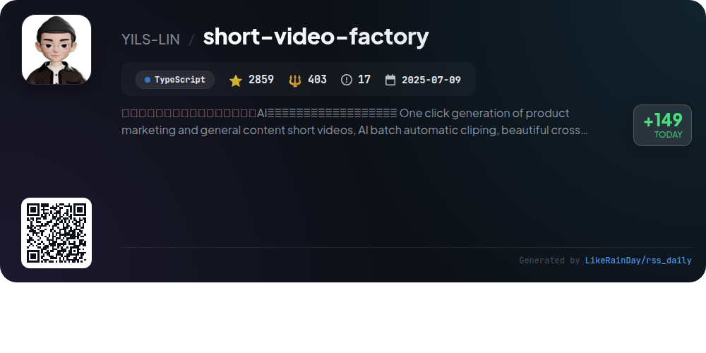

# 📊 🌟 GitHub Trending Daily - 2026-01-07

> > 📅 Daily Picks of GitHub Trending Repositories | Powered by Smart Algorithms

## 📋 Overview

**10** Projects | **161286** ⭐ | **19578** 🍴

**Top Languages:** `TypeScript` (5) · `JavaScript` (2) · `Rust` (2)

**Updated:** 2026-01-07 14:08 UTC

**Categories:**

- 🌟 Daily Top 10 (10 items)

---

## 🌟 Daily Top 10

### 1. [opencode](https://github.com/anomalyco/opencode)

> 🤖 **Why Recommend**  
> *OpenCode is an open-source AI coding agent designed for developers, built with TypeScript and boasting over 52,000 stars. It features two primary agents: a full-access "build" agent for development and a "plan" agent for code exploration, ensuring safe interactions. OpenCode supports a variety of installation methods and is available as a desktop app for macOS, Windows, and Linux. Its client/server architecture enables remote operation, while built-in LSP support enhances coding efficiency. The project prioritizes community engagement through Discord and extensive documentation.*

- ⭐ 52846 stars
- 💻 TypeScript
- 📅 Updated: 2026-01-07

### 2. [web-check](https://github.com/Lissy93/web-check)

> 🤖 **Why Recommend**  
> *Web-Check is an all-in-one OSINT tool for analyzing websites, boasting over 28,250 stars on GitHub. Built with TypeScript, it provides comprehensive insights into website architecture, security configurations, and technologies used. Key features include IP info, SSL analysis, DNS records, cookies, headers, server location, and performance metrics. Users can also explore associated hostnames, analyze open ports, and assess carbon footprints. With easy deployment options via Netlify, Vercel, or Docker, Web-Check aims to optimize and secure websites, making it a valuable resource for developers and security researchers.*

- ⭐ 28250 stars
- 💻 TypeScript
- 📅 Updated: 2026-01-07

### 3. [claude-mem](https://github.com/thedotmack/claude-mem)

> 🤖 **Why Recommend**  
> *Claude-Mem is a TypeScript plugin for Claude Code that enhances coding sessions by automatically capturing and compressing all interactions, ensuring continuity of context across sessions. Key features include persistent memory, skill-based search, a web UI for real-time memory viewing, and privacy controls for sensitive information. Users can easily retrieve project history through intelligent queries. With a beta channel for experimental features, Claude-Mem streamlines coding workflows while maintaining a rich knowledge base. The project is open-source and has garnered over 11,500 stars on GitHub.*

- ⭐ 11573 stars
- 💻 TypeScript
- 📅 Updated: 2026-01-07

### 4. [public-apis](https://github.com/marcelscruz/public-apis)

> 🤖 **Why Recommend**  
> *The public-apis project is a collaborative repository offering a comprehensive list of public APIs for developers, boasting over 7,132 stars on GitHub. It categorizes APIs across diverse domains including Animals, Finance, Health, and Machine Learning, among others. Key features include API authentication details, CORS support, and HTTPS compatibility for each entry. The project serves as a valuable resource for developers seeking to enhance their applications with external data and functionalities, simplifying the integration process across various technologies.*

- ⭐ 7132 stars
- 💻 JavaScript
- 📅 Updated: 2026-01-07

### 5. [claude-code-action](https://github.com/anthropics/claude-code-action)

> 🤖 **Why Recommend**  
> *Claude Code Action is a versatile GitHub action designed for PRs and issues, enabling intelligent code assistance. Key features include automatic mode detection based on workflow context, interactive code analysis, and implementation of fixes or new features. It integrates seamlessly with GitHub comments and supports multiple authentication methods, including Anthropic API and cloud services like AWS and Google. The action runs on your infrastructure and offers structured outputs for automation. Comprehensive documentation and migration guides are available for users.*

- ⭐ 4925 stars
- 💻 TypeScript
- 📅 Updated: 2026-01-07

### 6. [stb](https://github.com/nothings/stb)

> 🤖 **Why Recommend**  
> *The stb project offers a collection of single-file public domain libraries for C/C++, featuring essential tools like image loading (stb_image.h), writing (stb_image_write.h), and resizing (stb_image_resize2.h), along with font rendering (stb_truetype.h) and typesafe containers (stb_ds.h). With over 21 libraries and 51,137 lines of code, stb simplifies integration by allowing developers to include libraries as standalone headers. The libraries are designed for ease of use, supporting various formats and functionalities, making them a go-to resource for graphics, audio, and utility needs in software development.*

- ⭐ 31370 stars
- 💻 C
- 📅 Updated: 2026-01-07

### 7. [cc-switch](https://github.com/farion1231/cc-switch)

> 🤖 **Why Recommend**  
> *cc-switch is a powerful cross-platform desktop assistant tool designed for Claude Code, Codex, and Gemini CLI, built with Rust and Tauri. It boasts features like seamless provider management, an advanced skills management system, and multi-preset prompts management, all enhanced by a new SQLite + JSON architecture for better performance. The application supports Windows, macOS, and Linux, with a sleek user interface and options for cloud sync. Sponsored by Z.ai and AIGoCode, it provides top-tier AI coding services, ensuring efficient and stable coding experiences. With nearly 10,000 stars on GitHub, cc-switch is a valuable tool for developers.*

- ⭐ 9795 stars
- 💻 Rust
- 📅 Updated: 2026-01-07

### 8. [YTPro](https://github.com/prateek-chaubey/YTPro)

> 🤖 **Why Recommend**  
> *YTPro is a feature-rich YouTube client designed for older Android versions. With 1,325 stars on GitHub, it offers a seamless experience with features like Google Gemini for video summarization, video and shorts downloading, ad blocking, and a background audio player. Users can enjoy picture-in-picture mode, customizable gesture controls, and options to hide shorts or skip sponsors. The app is lightweight (under 50KB), has minimal dependencies, and supports auto-updates, making it a versatile choice for enhanced video consumption.*

- ⭐ 1325 stars
- 💻 JavaScript
- 📅 Updated: 2026-01-07

### 9. [memvid](https://github.com/memvid/memvid)

> 🤖 **Why Recommend**  
> *Memvid is a serverless, single-file memory layer for AI agents, providing instant retrieval and long-term memory without the complexity of traditional RAG pipelines. Built in Rust, it packages data, embeddings, and metadata into a portable format, enabling efficient append-only writes and time-travel debugging. Key features include Smart Recall for rapid access, Capsule Context for shareable memory, and codec intelligence for adaptive compression. Ideal for diverse applications like enterprise knowledge bases and offline AI systems, Memvid enhances AI capabilities with a lightweight, model-agnostic memory solution.*

- ⭐ 11211 stars
- 💻 Rust
- 📅 Updated: 2026-01-07

### 10. [short-video-factory](https://github.com/YILS-LIN/short-video-factory)

> 🤖 **Why Recommend**  
> *The "short-video-factory" is an open-source desktop application designed to streamline the creation of short marketing and general content videos using AI technology. Key features include AI-driven video editing, automated clipping, text-to-speech synthesis, and subtitle effects. Users can quickly generate high-quality videos from simple prompts and video assets, with support for batch processing and multiple languages. The application is user-friendly, cross-platform (Windows, macOS, Linux), and operates locally for enhanced data security. With over 2859 stars on GitHub, it offers a powerful, out-of-the-box solution for video production.*

- ⭐ 2859 stars
- 💻 TypeScript
- 📅 Updated: 2026-01-07

---

## 📡 RSS Subscription

Subscribe via RSS to get daily trending updates:

- 🔔 [RSS XML] (../../daily-top.xml)
- 🔔 [Daily Report] (../../GITHUB_TODAY.md)
- 🔔 [Daily Top 10](../../daily-top.xml)

---

*⚡ Powered by Smart Trending Algorithm | Generated at 2026-01-07 14:08:39 UTC
