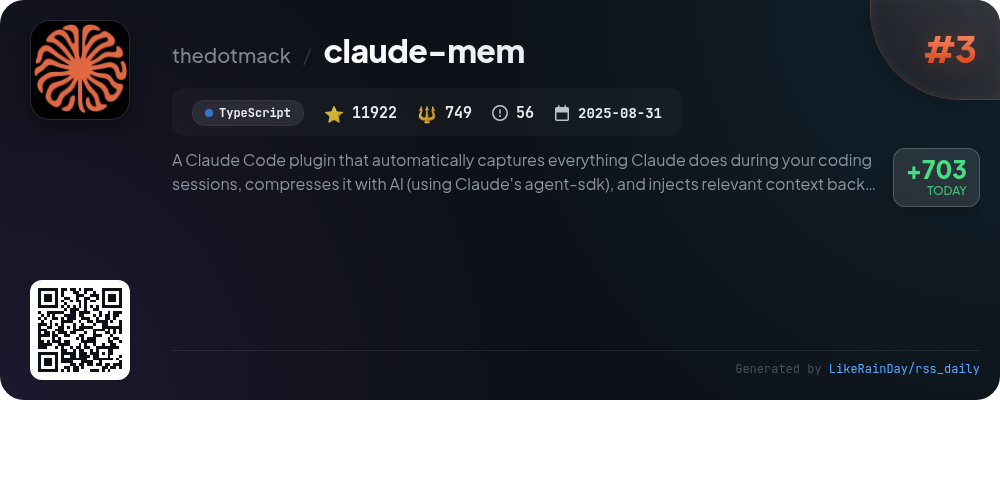
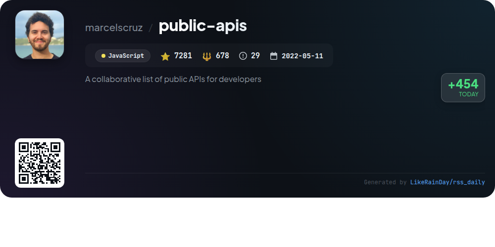
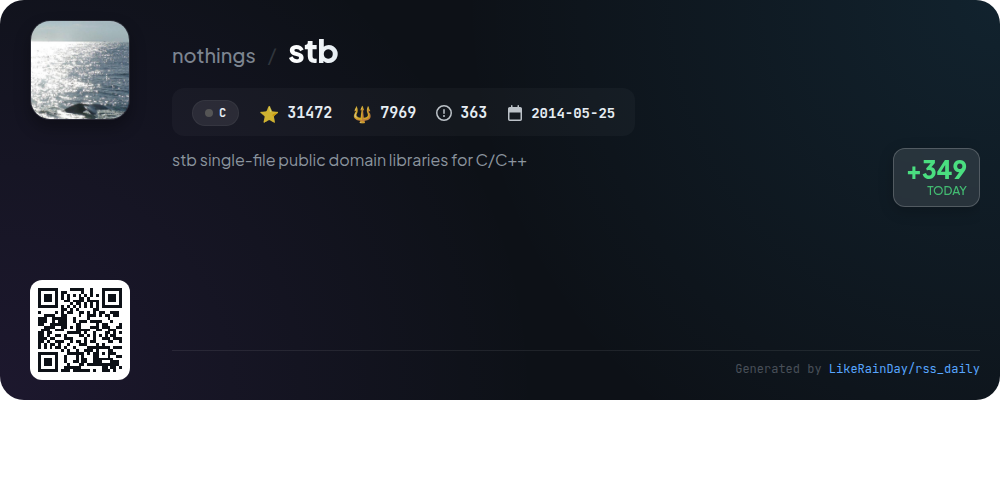
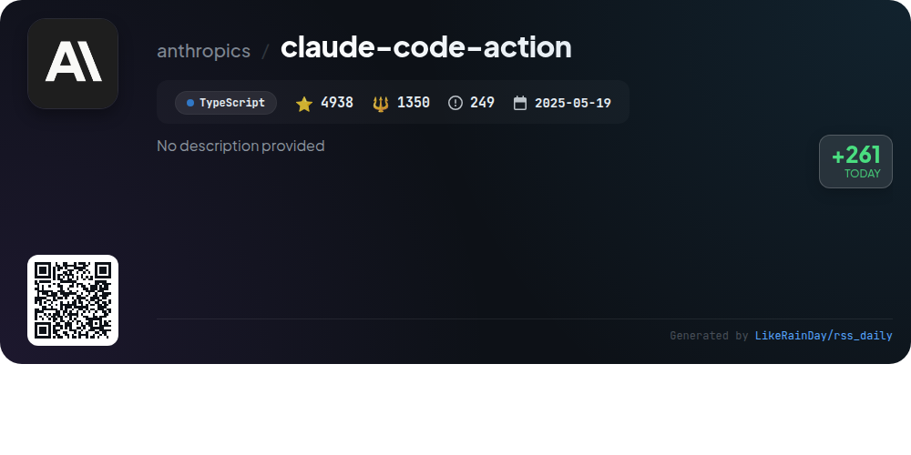
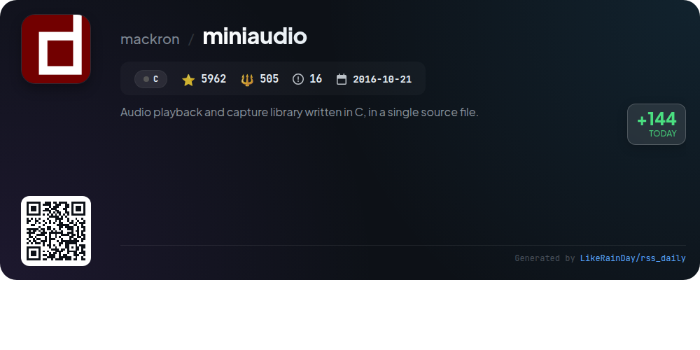

# 📊 🌟 GitHub Trending Daily - 2026-01-08

> > 📅 Daily Picks of GitHub Trending Repositories | Powered by Smart Algorithms

## 📋 Overview

**10** Projects | **166179** ⭐ | **19828** 🍴

**Top Languages:** `TypeScript` (4) · `JavaScript` (2) · `C` (2)

**Updated:** 2026-01-08 01:06 UTC

**Categories:**

- 🌟 Daily Top 10 (10 items)

---

## 🌟 Daily Top 10

### 1. [opencode](https://github.com/anomalyco/opencode)

> 🤖 **Why Recommend**  
> *OpenCode is an open-source AI coding agent built in TypeScript, designed to enhance development workflows. With over 53,000 stars on GitHub, it features two main agents: a full-access "build" agent for development and a read-only "plan" agent for code exploration. The platform supports installation via various package managers and offers a desktop application for macOS, Windows, and Linux. OpenCode prioritizes provider-agnostic integration, allowing users to leverage multiple AI models. Its focus on terminal user interface (TUI) and client/server architecture sets it apart in the coding assistant landscape.*

- ⭐ 53419 stars
- 💻 TypeScript
- 📅 Updated: 2026-01-08

### 2. [web-check](https://github.com/Lissy93/web-check)

> 🤖 **Why Recommend**  
> *Web-Check is an all-in-one OSINT tool designed for comprehensive website analysis. With over 28,000 stars on GitHub, it provides critical insights into website security and performance. Key features include IP info, SSL chain analysis, DNS records, cookies, server location, port scanning, and carbon footprint assessment. It also offers tools for identifying technologies used, analyzing HTTP headers, and checking for potential vulnerabilities. The tool is easily deployable via Netlify, Vercel, or Docker, making it accessible for developers and security researchers alike.*

- ⭐ 28519 stars
- 💻 TypeScript
- 📅 Updated: 2026-01-08

### 3. [claude-mem](https://github.com/thedotmack/claude-mem)

> 🤖 **Why Recommend**  
> *Claude-Mem is a powerful TypeScript plugin for Claude Code that captures coding sessions, compresses information using AI, and reintegrates relevant context into future sessions. Key features include persistent memory across sessions, skill-based search, a web viewer UI for real-time memory access, and privacy controls for sensitive content. It supports progressive disclosure for efficient context retrieval and offers a beta channel for experimental features. With over 11,900 stars, Claude-Mem enhances productivity by ensuring continuity and accessibility of project knowledge.*

- ⭐ 11922 stars
- 💻 TypeScript
- 📅 Updated: 2026-01-08

### 4. [public-apis](https://github.com/marcelscruz/public-apis)

> 🤖 **Why Recommend**  
> *The public-apis project is a collaborative repository featuring a comprehensive list of over 1,000 public APIs for developers across various categories such as Weather, Finance, Machine Learning, and Entertainment. With 7,281 stars, it serves as a valuable resource for quick access to APIs for tasks ranging from data analysis to content creation. Key highlights include APIs for sports data, cryptocurrency tracking, and social media integration, making it a versatile tool for developers seeking to enhance their applications with external data services.*

- ⭐ 7281 stars
- 💻 JavaScript
- 📅 Updated: 2026-01-08

### 5. [stb](https://github.com/nothings/stb)

> 🤖 **Why Recommend**  
> *stb is a collection of single-file public domain libraries for C/C++, boasting over 31,000 stars on GitHub. Key features include image loading and writing (stb_image.h, stb_image_write.h), image resizing (stb_image_resize2.h), font rasterization (stb_truetype.h), and typesafe containers (stb_ds.h). The libraries facilitate easy integration with minimal dependencies, ideal for projects requiring straightforward deployment. While security-related issues may arise, their simplicity and ease of use make them a popular choice for developers.*

- ⭐ 31472 stars
- 💻 C
- 📅 Updated: 2026-01-08

### 6. [claude-code-action](https://github.com/anthropics/claude-code-action)

> 🤖 **Why Recommend**  
> *Claude Code Action is a versatile GitHub action designed for PRs and issues, leveraging the Claude AI for intelligent code assistance. Key features include automatic mode detection, interactive code reviews, and seamless integration with GitHub comments. It supports multiple authentication methods and enables code implementation, refactoring, and structured output generation for complex automations. Notable services include automatic PR reviews, issue triage, and custom review checklists. The action operates on your infrastructure, ensuring data security and flexibility in configuration.*

- ⭐ 4938 stars
- 💻 TypeScript
- 📅 Updated: 2026-01-08

### 7. [YTPro](https://github.com/prateek-chaubey/YTPro)

> 🤖 **Why Recommend**  
> *YTPro is a feature-rich YouTube client designed for older Android versions, boasting 1,427 stars on GitHub. Key features include a background audio player, video downloading (including shorts and captions), Google Gemini integration for video summarization, an ads blocker, and customizable gestures for volume and brightness control. The app supports picture-in-picture mode, displays the number of dislikes, and offers a minimal APK size under 50KB. With almost zero internal dependencies and auto-updating capabilities, YTPro enhances the YouTube experience efficiently and effectively.*

- ⭐ 1427 stars
- 💻 JavaScript
- 📅 Updated: 2026-01-08

### 8. [cc-switch](https://github.com/farion1231/cc-switch)

> 🤖 **Why Recommend**  
> *cc-switch is a cross-platform desktop assistant tool for Claude Code, Codex, and Gemini CLI, built with Rust and Tauri. It offers seamless provider management, allowing users to switch between AI configurations effortlessly. Key features include a dual-layer SQLite + JSON architecture for data management, a redesigned UI, and comprehensive skills and prompts management. The tool supports multiple languages and auto-launch on startup. It integrates with various API services, providing enhanced coding experiences and discounts through partnerships with Z.ai, PackyCode, and AIGoCode.*

- ⭐ 9844 stars
- 💻 Rust
- 📅 Updated: 2026-01-08

### 9. [memvid](https://github.com/memvid/memvid)

> 🤖 **Why Recommend**  
> *Memvid is a portable, serverless memory layer for AI agents, enabling instant retrieval and long-term memory without complex pipelines or databases. Its innovative design organizes memory as immutable "Smart Frames" for efficient storage and retrieval. Key features include append-only writes, time-travel debugging, and predictive caching for rapid access. Memvid supports multiple use cases, such as long-running AI agents and offline systems, and offers SDKs for various programming languages. With over 11,395 stars on GitHub, it’s a robust solution for enhancing AI capabilities.*

- ⭐ 11395 stars
- 💻 Rust
- 📅 Updated: 2026-01-08

### 10. [miniaudio](https://github.com/mackron/miniaudio)

> 🤖 **Why Recommend**  
> *miniaudio is a lightweight audio playback and capture library written in C, encapsulated in a single source file and free of external dependencies. It offers a simple API for both high-level sound management and low-level raw audio data access, supporting multiple audio formats like WAV, FLAC, and MP3. Key features include a flexible node graph for mixing, resource management, basic waveform generation, and built-in effects. Compatible across major platforms, miniaudio is easy to integrate, making it ideal for developers seeking efficient audio solutions.*

- ⭐ 5962 stars
- 💻 C
- 📅 Updated: 2026-01-08

---

## 📡 RSS Subscription

Subscribe via RSS to get daily trending updates:

- 🔔 [RSS XML] (../../daily-top.xml)
- 🔔 [Daily Report] (../../GITHUB_TODAY.md)
- 🔔 [Daily Top 10](../../daily-top.xml)

---

*⚡ Powered by Smart Trending Algorithm | Generated at 2026-01-08 01:06:42 UTC
