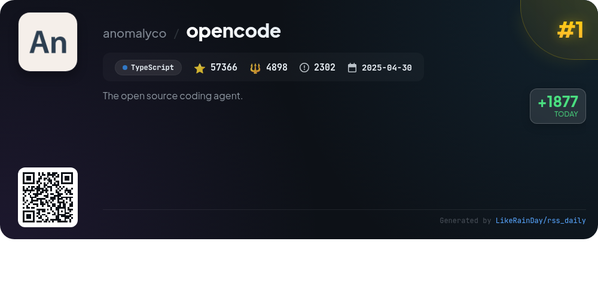
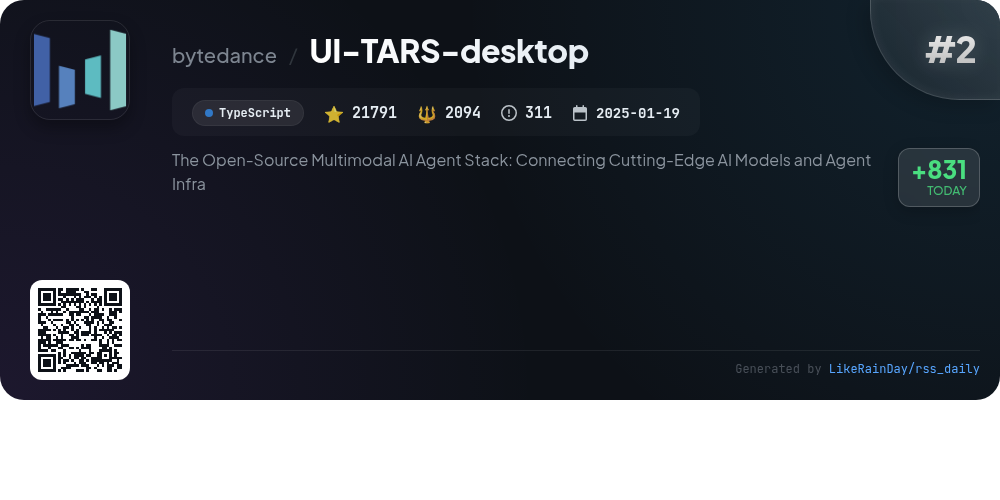
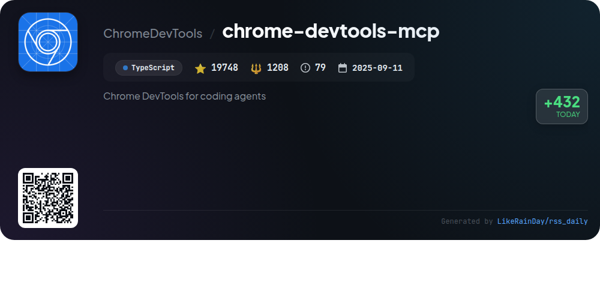
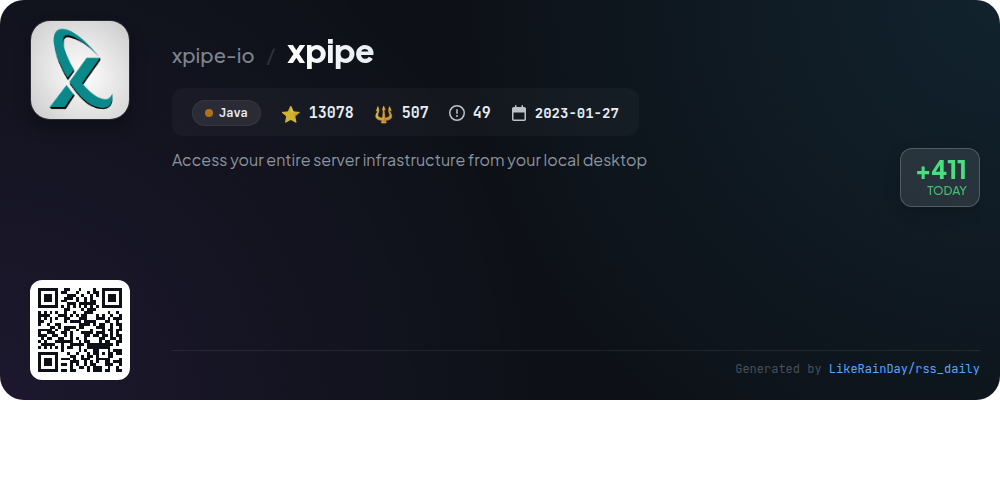
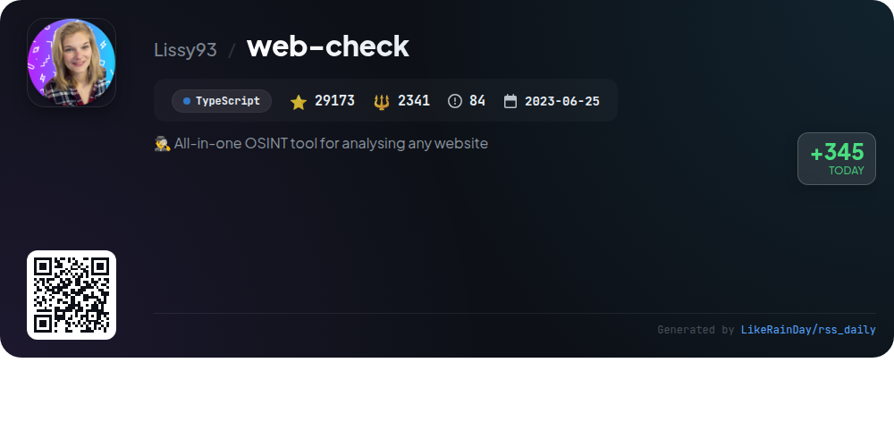
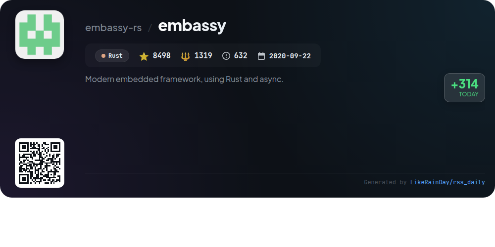
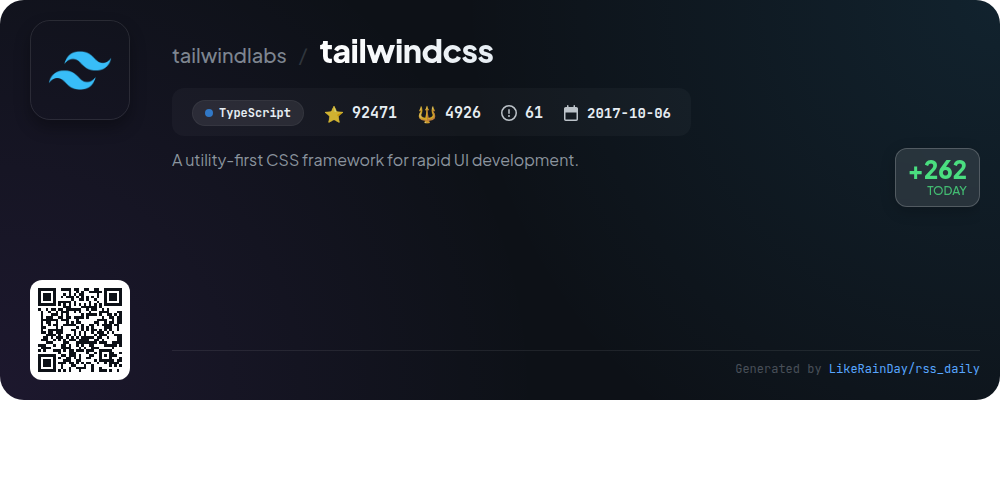
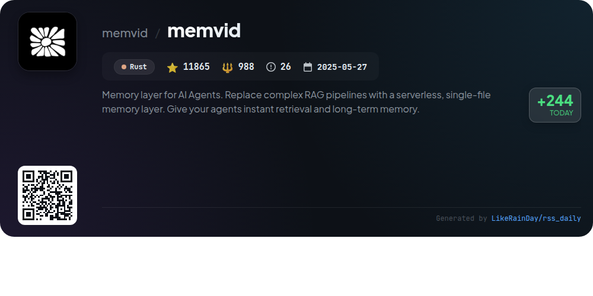
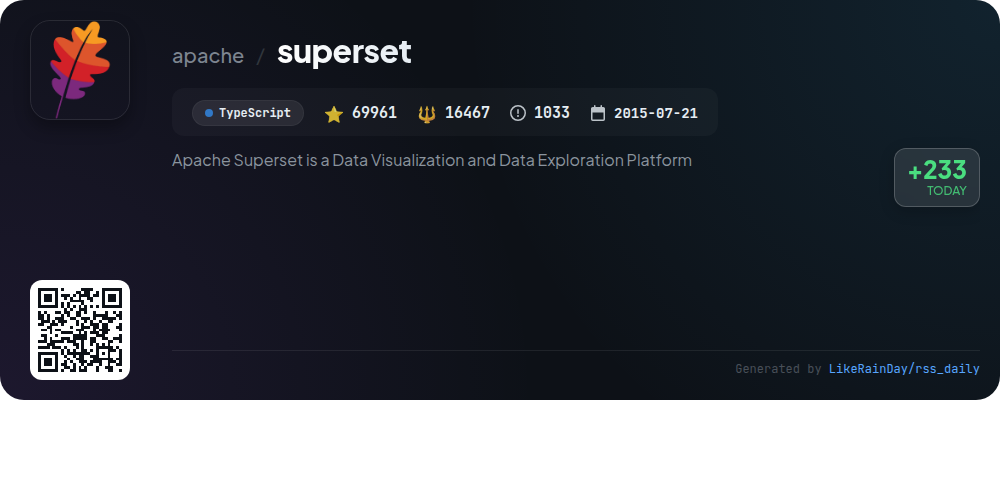

# 📊 🌟 GitHub Trending Daily - 2026-01-10

> > 📅 Daily Picks of GitHub Trending Repositories | Powered by Smart Algorithms

## 📋 Overview

**10** Projects | **336801** ⭐ | **35552** 🍴

**Top Languages:** `TypeScript` (7) · `Rust` (2) · `Java` (1)

**Updated:** 2026-01-10 01:05 UTC

**Categories:**

- 🌟 Daily Top 10 (10 items)

---

## 🌟 Daily Top 10

### 1. [opencode](https://github.com/anomalyco/opencode)

> 🤖 **Why Recommend**  
> *OpenCode is an open-source AI coding agent designed to enhance development workflows. With over 57,000 stars on GitHub, it offers two built-in agents: "build" for full development access and "plan" for read-only code exploration. Users can easily install OpenCode across various platforms, including macOS, Windows, and Linux. The project features a terminal user interface, built-in LSP support, and a client/server architecture for remote access. OpenCode is provider-agnostic, allowing integration with various AI models. Join the community on Discord for support and collaboration.*

- ⭐ 57366 stars
- 💻 TypeScript
- 📅 Updated: 2026-01-10

### 2. [UI-TARS-desktop](https://github.com/bytedance/UI-TARS-desktop)

> 🤖 **Why Recommend**  
> *UI-TARS-desktop is an open-source multimodal AI agent stack, boasting over 21,000 stars on GitHub. It features a native GUI agent for local and remote computer control, leveraging advanced Vision-Language models. Key functionalities include natural language processing, precise mouse and keyboard control, real-time feedback, and cross-platform support (Windows/MacOS/Browser). The project emphasizes seamless integration with real-world tools and offers both local and remote operation capabilities, enhancing user experience through intelligent automation.*

- ⭐ 21791 stars
- 💻 TypeScript
- 📅 Updated: 2026-01-10

### 3. [claude-mem](https://github.com/thedotmack/claude-mem)

> 🤖 **Why Recommend**  
> *Claude-Mem is a powerful plugin for Claude Code that enhances coding sessions by automatically capturing and compressing context into persistent memory. Key features include persistent memory across sessions, skill-based search for project history, a web viewer UI for real-time memory streaming, and privacy controls for sensitive content. Additionally, it supports automatic operation, context configuration, and citations for past observations. With 12,850 stars on GitHub, this TypeScript-based tool streamlines coding workflows and improves continuity in software development.*

- ⭐ 12850 stars
- 💻 TypeScript
- 📅 Updated: 2026-01-10

### 4. [chrome-devtools-mcp](https://github.com/ChromeDevTools/chrome-devtools-mcp)

> 🤖 **Why Recommend**  
> *The `chrome-devtools-mcp` project enables coding agents like Gemini, Claude, and Copilot to control and inspect live Chrome browsers using a Model-Context-Protocol (MCP) server. Key features include advanced browser debugging, performance insights through Chrome DevTools, and reliable automation via Puppeteer. The server supports various configurations for different environments, ensuring flexibility. With a strong community and extensive documentation, it facilitates in-depth debugging and performance analysis, making it an essential tool for developers leveraging AI coding assistants.*

- ⭐ 19748 stars
- 💻 TypeScript
- 📅 Updated: 2026-01-10

### 5. [xpipe](https://github.com/xpipe-io/xpipe)

> 🤖 **Why Recommend**  
> *XPipe is a powerful connection hub enabling seamless access to your entire server infrastructure from your local desktop. It integrates with popular command-line tools like SSH, Docker, and Kubernetes, allowing users to manage connections, organize them hierarchically, and create custom shell environments. Key features include a versatile file browser, a terminal launcher with multi-session support, and a scripting system for automation. The platform prioritizes security, storing data locally and integrating with password managers. XPipe is extensible and designed for professional workflows, making it ideal for managing diverse infrastructures.*

- ⭐ 13078 stars
- 💻 Java
- 📅 Updated: 2026-01-10

### 6. [web-check](https://github.com/Lissy93/web-check)

> 🤖 **Why Recommend**  
> *Web-Check is an all-in-one OSINT tool for analyzing websites, boasting over 29,000 stars on GitHub. Built with TypeScript, it provides insights into various aspects of web security and performance, including IP info, SSL chain, DNS records, cookies, and server configurations. Key features include traceroute, open port checks, associated hostnames, and site performance metrics. Users can deploy via platforms like Netlify or Docker. Web-Check aims to help users optimize and secure their websites, making it an essential resource for developers and security researchers.*

- ⭐ 29173 stars
- 💻 TypeScript
- 📅 Updated: 2026-01-10

### 7. [embassy](https://github.com/embassy-rs/embassy)

> 🤖 **Why Recommend**  
> *Embassy is a modern embedded framework written in Rust, designed for safe, efficient, and energy-conscious embedded applications. It utilizes Rust's async capabilities to streamline multitasking without dynamic memory allocation, eliminating the need for traditional RTOS. Key features include hardware abstraction layers (HALs) for various microcontrollers, a robust timekeeping system, low-power management, and networking support (Ethernet, TCP, UDP). Additionally, it offers Bluetooth integration, USB stack implementations, and a lightweight bootloader for firmware upgrades. With extensive documentation and examples, Embassy simplifies embedded development.*

- ⭐ 8498 stars
- 💻 Rust
- 📅 Updated: 2026-01-10

### 8. [tailwindcss](https://github.com/tailwindlabs/tailwindcss)

> 🤖 **Why Recommend**  
> *Tailwind CSS is a utility-first CSS framework designed for rapid UI development, enabling developers to create custom user interfaces efficiently. With over 92,000 stars on GitHub, it offers a robust set of features, including responsive design utilities, customizable themes, and an extensive range of built-in classes. The project emphasizes flexibility and performance, making it easy to integrate into existing workflows. Comprehensive documentation and a supportive community facilitate learning and collaboration. Explore more at tailwindcss.com.*

- ⭐ 92471 stars
- 💻 TypeScript
- 📅 Updated: 2026-01-10

### 9. [memvid](https://github.com/memvid/memvid)

> 🤖 **Why Recommend**  
> *Memvid is a serverless memory layer for AI agents, designed to simplify complex retrieval-augmented generation (RAG) pipelines. This Rust-based solution offers instant retrieval and long-term memory through a portable, single-file format that includes data, embeddings, and metadata. Key features include append-only memory management, time-travel debugging, and smart recall with sub-5ms access. Memvid is model-agnostic and offline-capable, making it ideal for use cases like enterprise knowledge bases, AI agents, and workflow automation.*

- ⭐ 11865 stars
- 💻 Rust
- 📅 Updated: 2026-01-10

### 10. [superset](https://github.com/apache/superset)

> 🤖 **Why Recommend**  
> *Apache Superset is a modern data visualization and exploration platform designed for enterprise-level analytics. With over 69,000 stars on GitHub, it offers a no-code chart builder, a powerful SQL editor, and support for a wide range of SQL databases. Key features include beautiful visualizations, a lightweight caching layer, customizable security roles, and a cloud-native architecture for scalability. Superset's API enables programmatic customization, making it a versatile tool for teams looking to enhance their data insights and decision-making processes.*

- ⭐ 69961 stars
- 💻 TypeScript
- 📅 Updated: 2026-01-10

---

## 📡 RSS Subscription

Subscribe via RSS to get daily trending updates:

- 🔔 [RSS XML] (../../daily-top.xml)
- 🔔 [Daily Report] (../../GITHUB_TODAY.md)
- 🔔 [Daily Top 10](../../daily-top.xml)

---

*⚡ Powered by Smart Trending Algorithm | Generated at 2026-01-10 01:05:12 UTC
