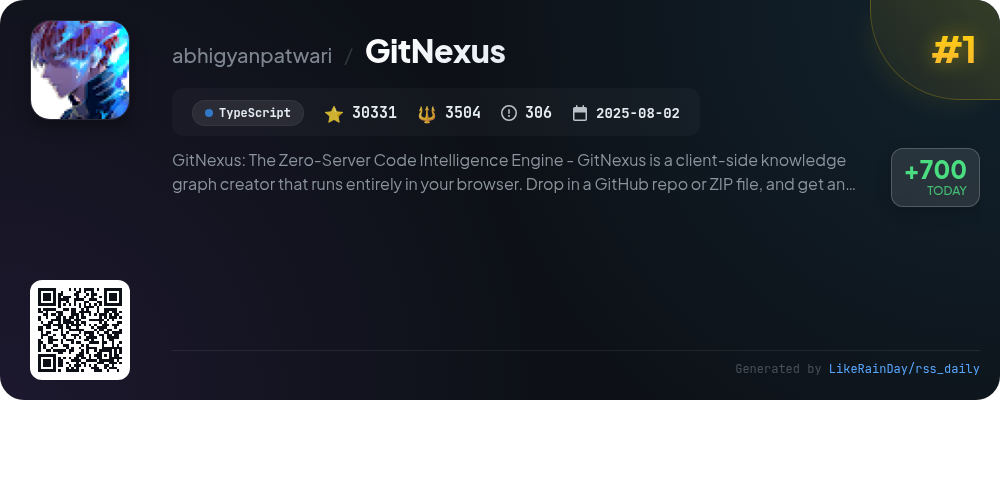
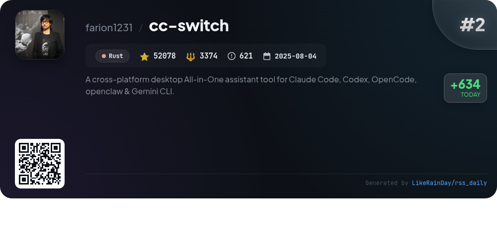
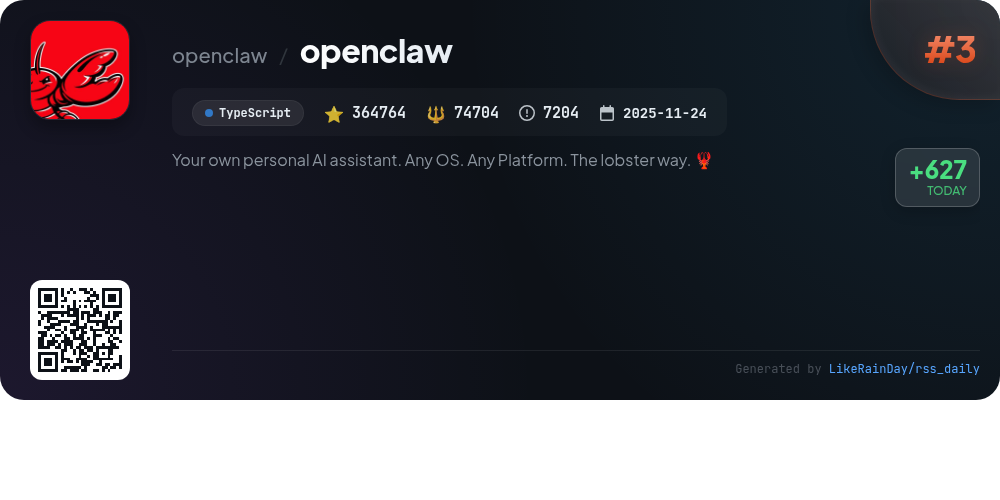
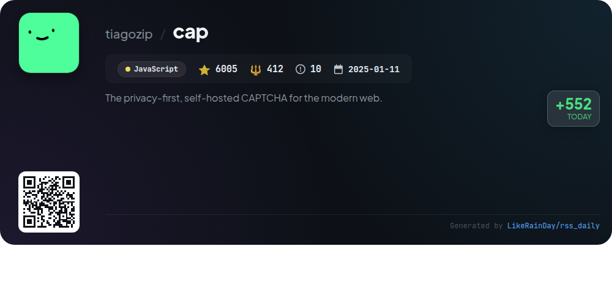
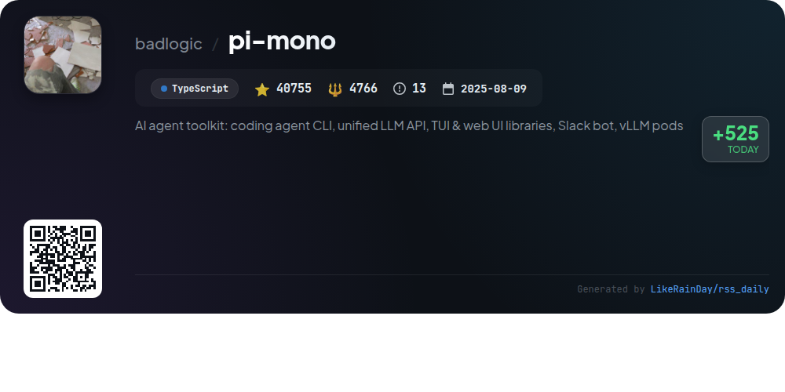
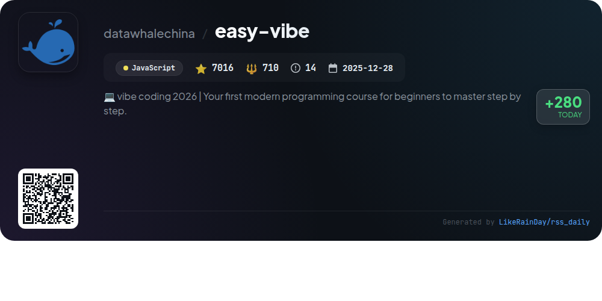
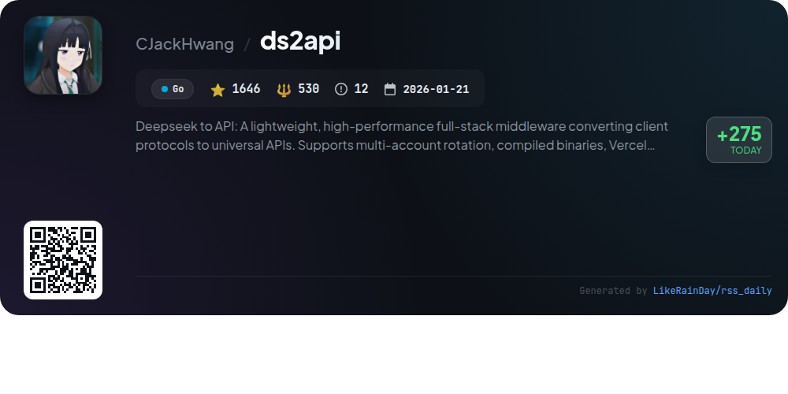

# 📊 🌟 GitHub Trending Daily - 2026-04-27

> > 📅 Daily Picks of GitHub Trending Repositories | Powered by Smart Algorithms

## 📋 Overview

**10** Projects | **677469** ⭐ | **109648** 🍴

**Top Languages:** `TypeScript` (4) · `JavaScript` (3) · `Go` (2)

**Updated:** 2026-04-27 03:43 UTC

**Categories:**

- 🌟 Daily Top 10 (10 items)

---

## 🌟 Daily Top 10

### 1. [GitNexus](https://github.com/abhigyanpatwari/GitNexus)

> 🤖 **Why Recommend**  
> *GitNexus: The Zero-Server Code Intelligence Engine -       GitNexus is a client-side knowledge graph creator that runs entirely in your browser. Drop . popular project, actively maintained, recently updated*

- ⭐ 30331 stars
- 🍴 3504 forks
- 💻 TypeScript
- 📅 Updated: 2026-04-27

### 2. [cc-switch](https://github.com/farion1231/cc-switch)

> 🤖 **Why Recommend**  
> *CC Switch is a cross-platform desktop assistant tool for managing multiple AI CLI tools, including Claude Code, Codex, Gemini CLI, OpenCode, and OpenClaw. With over 52,000 stars on GitHub, it offers a unified interface to streamline provider management without manual configuration editing. Key features include 50+ built-in provider presets, unified MCP and Skills management, quick switching from the system tray, and cloud sync capabilities. Built with Rust and Tauri, it provides a reliable, user-friendly experience for developers across Windows, macOS, and Linux.*

- ⭐ 52078 stars
- 💻 Rust
- 📅 Updated: 2026-04-27

### 3. [openclaw](https://github.com/openclaw/openclaw)

> 🤖 **Why Recommend**  
> *OpenClaw is a personal AI assistant that operates on any OS or platform, designed for seamless integration into your existing messaging channels, including WhatsApp, Telegram, Slack, Discord, and more. Key features include a local-first gateway for control, multi-channel inbox capability, voice activation on macOS/iOS/Android, and a live Canvas for visual interactions. With a focus on user privacy and security, OpenClaw allows for customizable configurations and onboarding through a CLI. Ideal for users seeking a fast, local, and always-on assistant experience.*

- ⭐ 364764 stars
- 💻 TypeScript
- 📅 Updated: 2026-04-27

### 4. [Open-Generative-AI](https://github.com/Anil-matcha/Open-Generative-AI)

> 🤖 **Why Recommend**  
> *Open Generative AI is a free, open-source alternative to platforms like Higgsfield AI, offering unrestricted AI image and video generation with over 200 models, including Flux and Midjourney. Key features include a multi-modal studio for text-to-image, image-to-image, text-to-video, and lip sync generation, all without content filters. The platform supports self-hosting, ensuring data privacy, and features a user-friendly interface with local inference options. Join the community on Discord and explore its capabilities online or via downloadable desktop apps.*

- ⭐ 8945 stars
- 💻 JavaScript
- 📅 Updated: 2026-04-27

### 5. [cap](https://github.com/tiagozip/cap)

> 🤖 **Why Recommend**  
> *Cap is a privacy-first, self-hosted CAPTCHA alternative designed for the modern web. Utilizing SHA-256 proof-of-work and JavaScript challenges, it offers a lightweight solution (~20kb) that integrates easily without dependencies. Key features include full customization with CSS, standalone mode via Docker, and programmatic access for background challenge solving. Cap is open-source, ensuring no telemetry tracking, making it a robust alternative to reCAPTCHA and hCaptcha. With over 6000 stars, it emphasizes speed, privacy, and user accessibility.*

- ⭐ 6005 stars
- 💻 JavaScript
- 📅 Updated: 2026-04-27

### 6. [pi-mono](https://github.com/badlogic/pi-mono)

> 🤖 **Why Recommend**  
> *pi-mono is an AI agent toolkit designed for building and managing AI agents and LLM deployments. Key features include a unified LLM API supporting multiple providers, an interactive coding agent CLI, and libraries for terminal and web UIs. It also offers a Slack bot for message delegation and tooling for managing vLLM deployments on GPU pods. With over 40,000 stars, pi-mono encourages contributions and sharing of open-source coding sessions to enhance agent performance through real-world feedback. For more information, visit pi.dev.*

- ⭐ 40755 stars
- 💻 TypeScript
- 📅 Updated: 2026-04-27

### 7. [opencode](https://github.com/anomalyco/opencode)

> 🤖 **Why Recommend**  
> *OpenCode is an open-source AI coding agent designed for developers. With over 150,000 stars on GitHub, it features two built-in agents—'build' for full development access and 'plan' for read-only analysis. The platform supports various programming models and offers seamless installation across multiple operating systems. Users benefit from a terminal user interface (TUI) and out-of-the-box Language Server Protocol (LSP) support. OpenCode fosters community engagement through Discord and provides extensive documentation for customization and contribution.*

- ⭐ 150079 stars
- 💻 TypeScript
- 📅 Updated: 2026-04-27

### 8. [easy-vibe](https://github.com/datawhalechina/easy-vibe)

> 🤖 **Why Recommend**  
> *Easy-Vibe is a modern programming course designed for beginners to master coding step-by-step using JavaScript. With over 7,000 stars on GitHub, it offers an engaging learning experience through a structured learning map, interactive tutorials, and hands-on project practice. Core features include immersive simulated coding, visual explanations of AI principles, and tools for building product prototypes. The course caters to complete beginners, aspiring product managers, and developers looking to enhance their skills in AI-driven development.*

- ⭐ 7016 stars
- 💻 JavaScript
- 📅 Updated: 2026-04-27

### 9. [ds2api](https://github.com/CJackHwang/ds2api)

> 🤖 **Why Recommend**  
> *ds2api is a high-performance middleware developed in Go that transforms DeepSeek web capabilities into universal APIs compatible with OpenAI, Claude, and Gemini. Key features include multi-account rotation, real-time responses, and a user-friendly React-based WebUI for management. The project supports Docker and Vercel Serverless deployment, ensuring flexibility. Core functionalities encompass a unified API surface for various models, admin controls, and robust concurrency management. With over 1,600 stars, ds2api is ideal for developers seeking efficient API integration solutions.*

- ⭐ 1646 stars
- 💻 Go
- 📅 Updated: 2026-04-27

### 10. [sub2api](https://github.com/Wei-Shaw/sub2api)

> 🤖 **Why Recommend**  
> *Sub2API is an open-source AI API gateway designed for efficient subscription quota distribution across services like Claude, OpenAI, and Gemini. Key features include multi-account management, API key generation, precise billing, smart scheduling, and concurrency control. The platform integrates a built-in payment system supporting various methods, alongside an admin dashboard for management. With high stability and support for external integrations, Sub2API simplifies access to multiple AI resources while optimizing cost-sharing through carpooling functionalities.*

- ⭐ 15850 stars
- 💻 Go
- 📅 Updated: 2026-04-27

---

## 📡 RSS Subscription

Subscribe via RSS to get daily trending updates:

- 🔔 [RSS XML] (../../daily-top.xml)
- 🔔 [Daily Report] (../../GITHUB_TODAY.md)
- 🔔 [Daily Top 10](../../daily-top.xml)

---

*⚡ Powered by Smart Trending Algorithm | Generated at 2026-04-27 03:43:16 UTC
