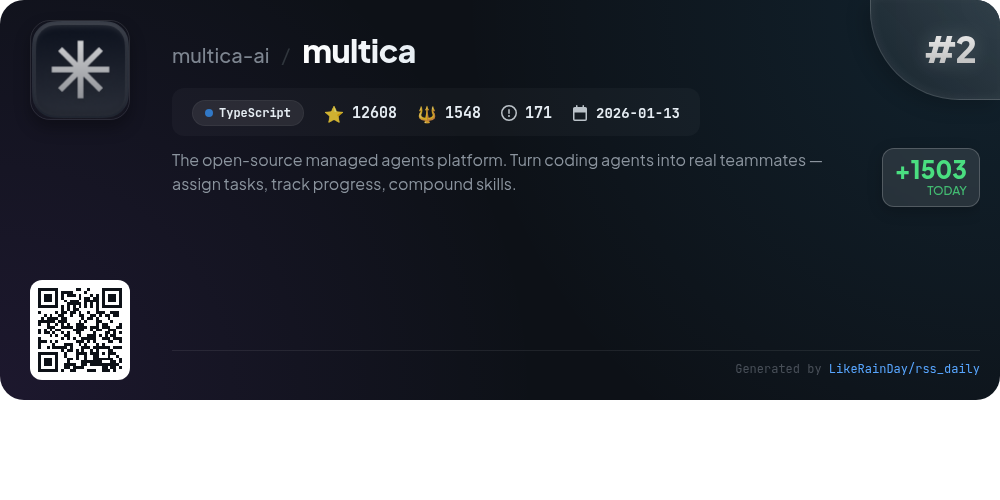
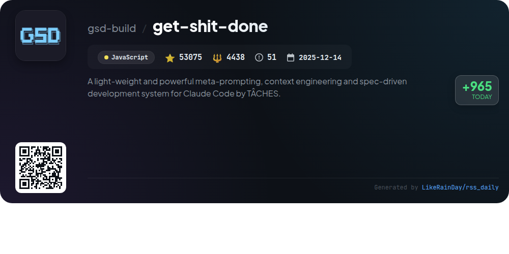
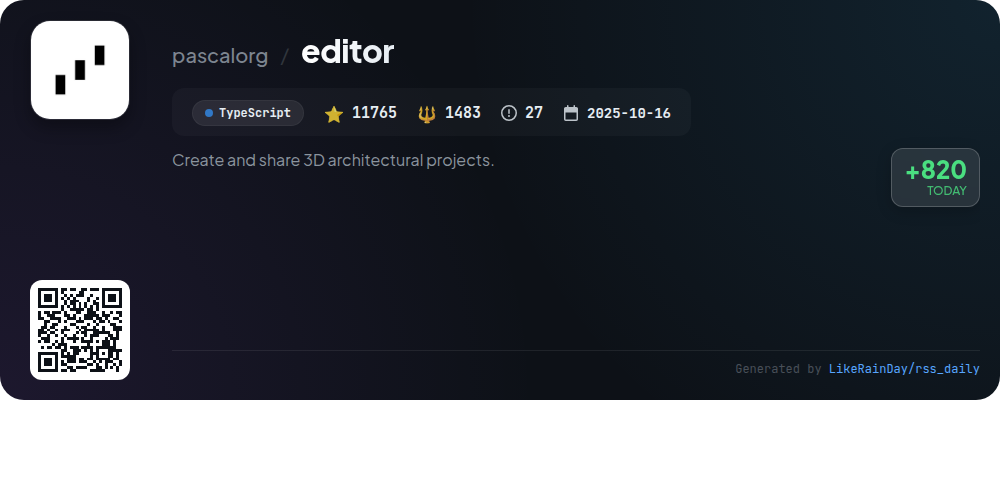
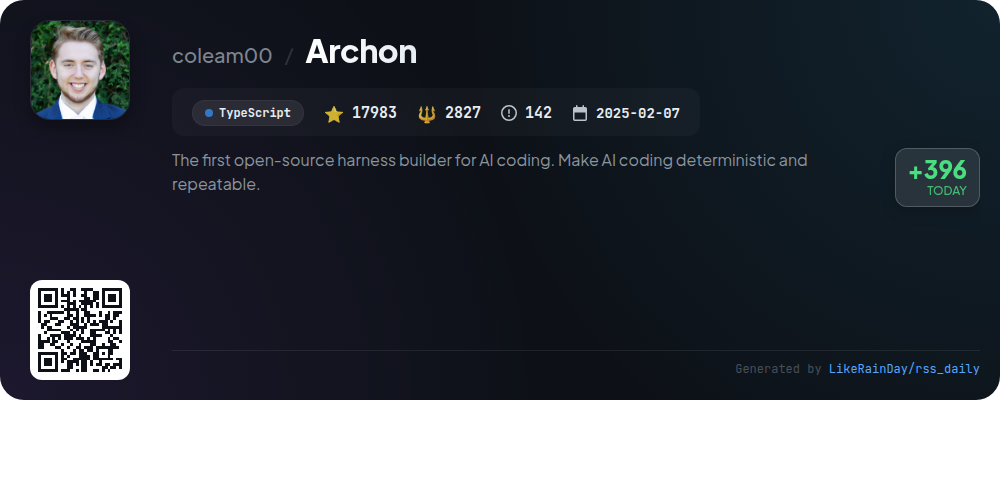
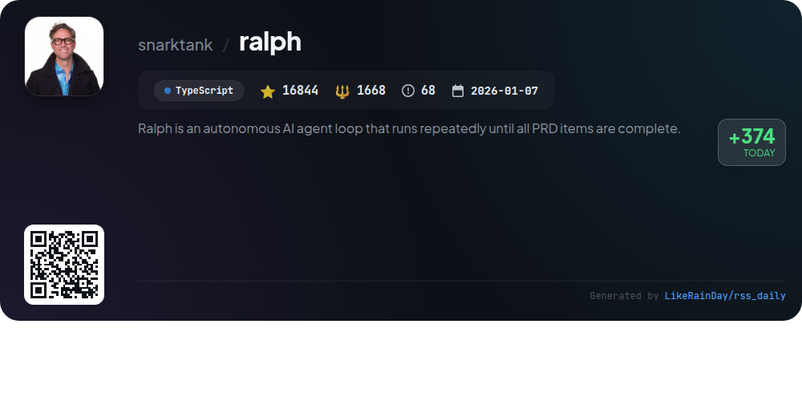
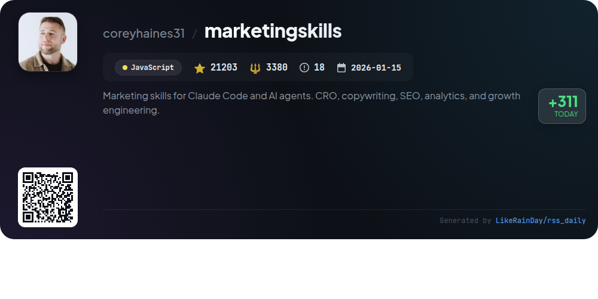
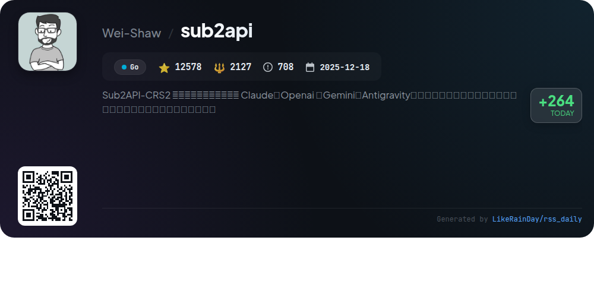

# 📊 🌟 GitHub Trending Daily - 2026-04-15

> > 📅 Daily Picks of GitHub Trending Repositories | Powered by Smart Algorithms

## 📋 Overview

**10** Projects | **264399** ⭐ | **26850** 🍴

**Top Languages:** `TypeScript` (6) · `JavaScript` (2) · `Rust` (1)

**Updated:** 2026-04-15 03:23 UTC

**Categories:**

- 🌟 Daily Top 10 (10 items)

---

## 🌟 Daily Top 10

### 1. [claude-mem](https://github.com/thedotmack/claude-mem)

> 🤖 **Why Recommend**  
> *Claude-Mem is a TypeScript plugin for Claude Code that enhances coding sessions by automatically capturing and compressing contextual information. With over 56,000 stars, it offers persistent memory, allowing users to retain project context across sessions. Key features include progressive memory retrieval, a web viewer UI for real-time monitoring, skill-based search capabilities, and privacy controls for sensitive information. Claude-Mem supports easy installation, automatic operation, and integration with platforms like OpenClaw, making it a valuable tool for developers seeking continuity in their work.*

- ⭐ 56045 stars
- 💻 TypeScript
- 📅 Updated: 2026-04-15

### 2. [multica](https://github.com/multica-ai/multica)

> 🤖 **Why Recommend**  
> *The open-source managed agents platform. Turn coding agents into real teammates — assign tasks, track progress, compound skills.. popular project, actively maintained, recently updated*

- ⭐ 12608 stars
- 🍴 1548 forks
- 💻 TypeScript
- 📅 Updated: 2026-04-15

### 3. [voicebox](https://github.com/jamiepine/voicebox)

> 🤖 **Why Recommend**  
> *Voicebox is an open-source voice synthesis studio that runs locally, offering voice cloning, speech generation in 23 languages, and extensive audio effects. Key features include five TTS engines, a multi-track timeline editor for creating complex audio projects, and an API for integration. Users can customize voice profiles, apply post-processing effects, and manage recordings with transcription capabilities. Designed for privacy and performance, Voicebox supports various platforms including macOS, Windows, and Linux, making it a versatile tool for developers and creators alike.*

- ⭐ 17481 stars
- 💻 TypeScript
- 📅 Updated: 2026-04-15

### 4. [get-shit-done](https://github.com/gsd-build/get-shit-done)

> 🤖 **Why Recommend**  
> *Get Shit Done (GSD) is a lightweight, powerful development system designed for Claude Code and similar platforms. With over 53,000 stars, it effectively combats context rot, ensuring high-quality code generation. Key features include meta-prompting, context engineering, and spec-driven development. GSD automates project initialization, planning, execution, and verification through a series of structured commands, enhancing productivity without the complexity of traditional development workflows. Trusted by engineers at major tech firms, GSD streamlines the coding process while maintaining quality and clarity.*

- ⭐ 53075 stars
- 💻 JavaScript
- 📅 Updated: 2026-04-15

### 5. [editor](https://github.com/pascalorg/editor)

> 🤖 **Why Recommend**  
> *Pascal Editor is a powerful 3D architectural project editor built using React Three Fiber and WebGPU, enabling users to create and share intricate building designs. The monorepo structure includes a core package for state management and schema definitions, and a viewer package for 3D rendering. Key features include interactive editing tools, a robust state management system using Zustand, and an event-driven architecture for seamless user interactions. With a user-friendly interface and tools for selecting, drawing walls, and placing items, Pascal Editor is ideal for architects and designers looking to visualize and manipulate 3D spaces intuitively.*

- ⭐ 11765 stars
- 💻 TypeScript
- 📅 Updated: 2026-04-15

### 6. [cc-switch](https://github.com/farion1231/cc-switch)

> 🤖 **Why Recommend**  
> *CC Switch is a cross-platform desktop application designed to streamline management of five major AI CLI tools: Claude Code, Codex, Gemini CLI, OpenCode, and OpenClaw. With over 50 built-in provider presets, users can effortlessly switch between services without manual configuration. Key features include unified MCP and Skills management, cloud sync across devices, and a system tray for quick access. Built with Tauri and Rust, CC Switch offers robust performance and reliability, making it an essential tool for developers leveraging AI in their workflows.*

- ⭐ 44817 stars
- 💻 Rust
- 📅 Updated: 2026-04-15

### 7. [Archon](https://github.com/coleam00/Archon)

> 🤖 **Why Recommend**  
> *Archon is the first open-source harness builder for AI coding, designed to make the process deterministic and repeatable. With 17 default workflows, it allows users to define development processes in YAML, encompassing planning, implementation, validation, code review, and PR creation, all in isolated environments to prevent conflicts. Key features include composability with deterministic and AI nodes, a web UI for monitoring and interaction, and integration with platforms like Slack and GitHub. Archon empowers teams to automate coding tasks efficiently, fostering collaboration and productivity.*

- ⭐ 17983 stars
- 💻 TypeScript
- 📅 Updated: 2026-04-15

### 8. [ralph](https://github.com/snarktank/ralph)

> 🤖 **Why Recommend**  
> *Ralph is an autonomous AI agent loop designed to automate coding tasks until all PRD items are completed. Integrated with AI coding tools like Amp and Claude Code, it iteratively generates, converts, and implements user stories from PRDs. Key features include fresh context for each iteration, persistent memory via git history and progress tracking, and automated quality checks. Users can create detailed PRDs, convert them to JSON, and execute tasks efficiently. With over 16,800 stars, Ralph enhances productivity in software development through structured feedback loops and effective task management.*

- ⭐ 16844 stars
- 💻 TypeScript
- 📅 Updated: 2026-04-15

### 9. [marketingskills](https://github.com/coreyhaines31/marketingskills)

> 🤖 **Why Recommend**  
> *Marketingskills is a GitHub project designed for AI agents, focusing on marketing functionalities such as conversion optimization, copywriting, SEO, analytics, and growth engineering. With over 21,000 stars, it offers specialized skills through markdown files that enhance AI agents' capabilities. Compatible with platforms like Claude Code and OpenAI Codex, key features include A/B testing, ad creative generation, and customer research. The project, created by Corey Haines, also connects users to hands-on support via Conversion Factory and educational resources through Swipe Files. Contributions are welcome for skill improvements.*

- ⭐ 21203 stars
- 💻 JavaScript
- 📅 Updated: 2026-04-15

### 10. [sub2api](https://github.com/Wei-Shaw/sub2api)

> 🤖 **Why Recommend**  
> *Sub2API is an open-source AI API gateway platform for managing subscription quotas from services like Claude, OpenAI, and Gemini. It offers multi-account management, API key distribution, precise billing, and smart scheduling. Key features include concurrency control, rate limiting, a built-in payment system supporting multiple payment methods, and an admin dashboard for easy management. With seamless integration of external systems and strong community support, Sub2API streamlines AI service access while optimizing cost-sharing for users.*

- ⭐ 12578 stars
- 💻 Go
- 📅 Updated: 2026-04-15

---

## 📡 RSS Subscription

Subscribe via RSS to get daily trending updates:

- 🔔 [RSS XML] (../../daily-top.xml)
- 🔔 [Daily Report] (../../GITHUB_TODAY.md)
- 🔔 [Daily Top 10](../../daily-top.xml)

---

*⚡ Powered by Smart Trending Algorithm | Generated at 2026-04-15 03:23:07 UTC
