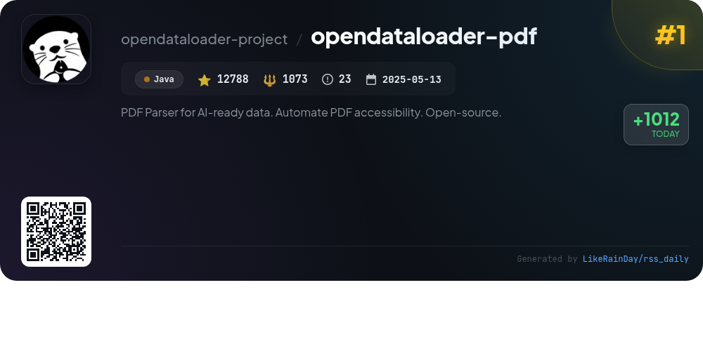
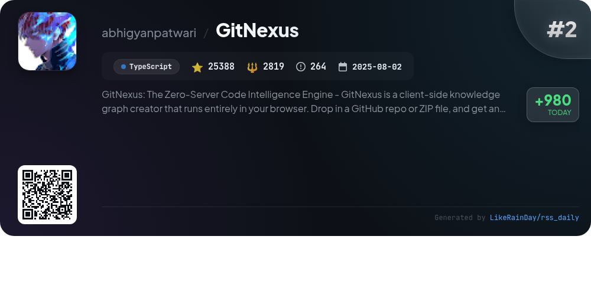
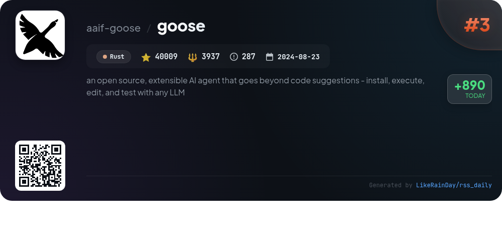
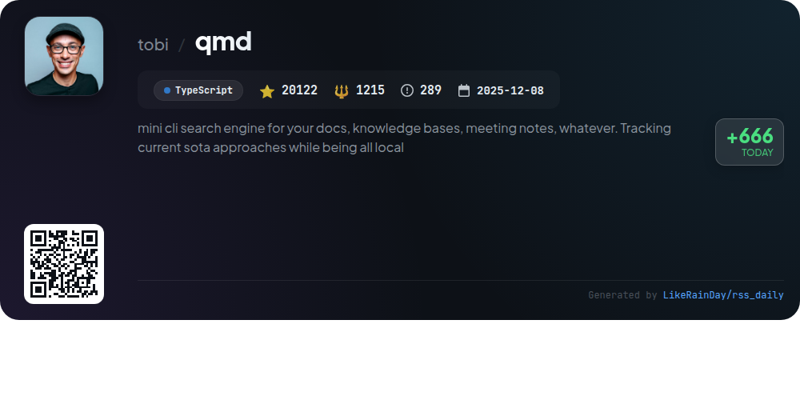
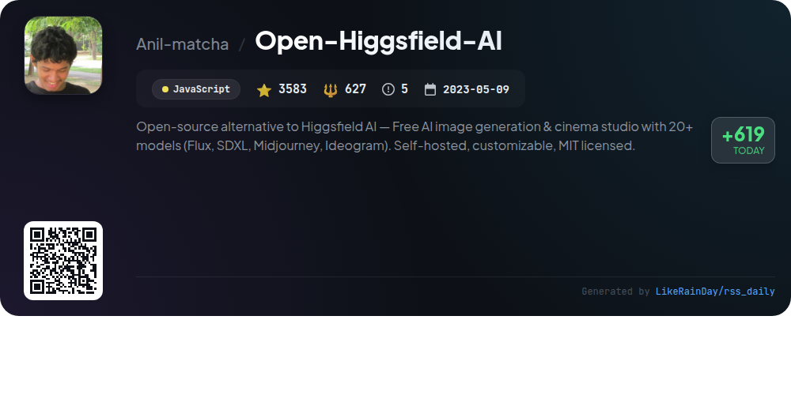
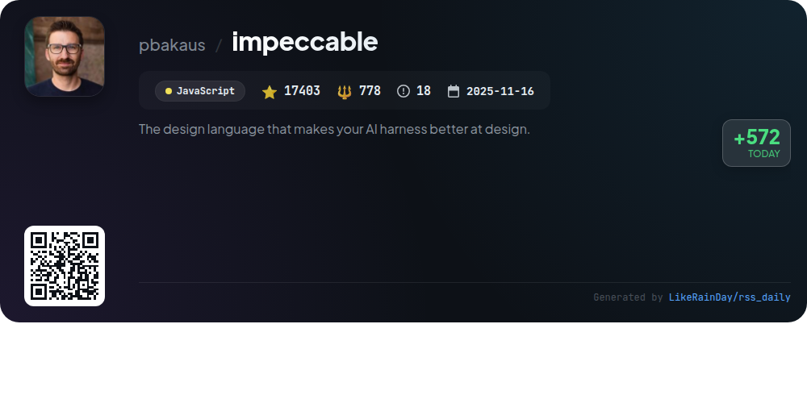
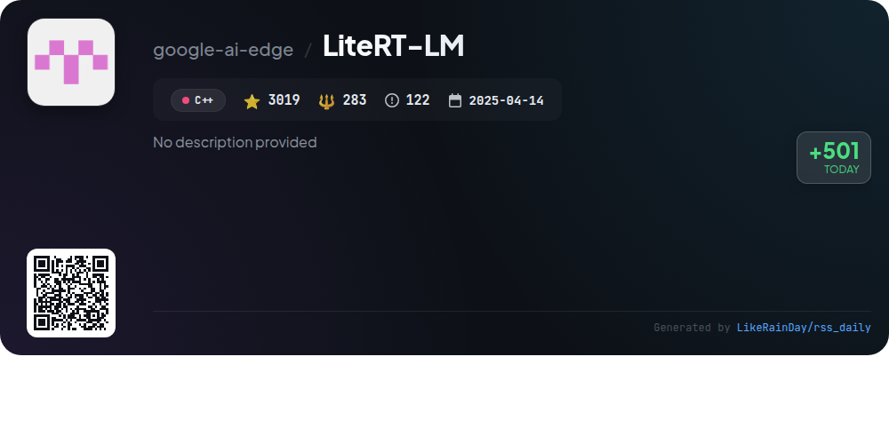

# 📊 🌟 GitHub Trending Daily - 2026-04-09

> > 📅 Daily Picks of GitHub Trending Repositories | Powered by Smart Algorithms

## 📋 Overview

**10** Projects | **232623** ⭐ | **19265** 🍴

**Top Languages:** `JavaScript` (3) · `TypeScript` (2) · `Rust` (2)

**Updated:** 2026-04-09 02:53 UTC

**Categories:**

- 🌟 Daily Top 10 (10 items)

---

## 🌟 Daily Top 10

### 1. [opendataloader-pdf](https://github.com/opendataloader-project/opendataloader-pdf)

> 🤖 **Why Recommend**  
> *OpenDataLoader PDF is an open-source PDF parser designed for AI-ready data extraction and automated PDF accessibility. With over 12,700 stars, it excels in extracting structured data (Markdown, JSON, HTML) while achieving #1 accuracy in benchmarks (0.907 overall). It supports complex content, including tables and OCR for scanned PDFs. The tool features a unique auto-tagging capability for generating Tagged PDFs, compliant with accessibility standards, and integrates with LangChain for RAG pipelines. Core services include layout analysis, accessibility compliance, and enterprise options for PDF/UA export.*

- ⭐ 12788 stars
- 💻 Java
- 📅 Updated: 2026-04-09

### 2. [GitNexus](https://github.com/abhigyanpatwari/GitNexus)

> 🤖 **Why Recommend**  
> *GitNexus: The Zero-Server Code Intelligence Engine -       GitNexus is a client-side knowledge graph creator that runs entirely in your browser. Drop . popular project, actively maintained, recently updated*

- ⭐ 25388 stars
- 🍴 2819 forks
- 💻 TypeScript
- 📅 Updated: 2026-04-09

### 3. [goose](https://github.com/aaif-goose/goose)

> 🤖 **Why Recommend**  
> *Goose is an open-source AI agent designed for versatile tasks beyond code suggestions, including research, automation, and data analysis. It features a native desktop app for macOS, Linux, and Windows, a full CLI for terminal workflows, and an API for integration. Built in Rust for performance, Goose supports 15+ AI providers like OpenAI and Google, and connects to 70+ extensions via the Model Context Protocol. Now part of the Agentic AI Foundation at the Linux Foundation, Goose offers extensive documentation and community support through Discord and other platforms.*

- ⭐ 40009 stars
- 💻 Rust
- 📅 Updated: 2026-04-09

### 4. [gallery](https://github.com/google-ai-edge/gallery)

> 🤖 **Why Recommend**  
> *The Google AI Edge Gallery is an innovative platform that allows users to experience cutting-edge on-device Generative AI, featuring the powerful Gemma 4 family of models. Key features include AI Chat with Thinking Mode for enhanced reasoning, multimodal capabilities with Ask Image, real-time transcription via Audio Scribe, and a Prompt Lab for testing prompts. Privacy is paramount, with all processing occurring offline. The app supports model management and benchmarking and integrates with Hugging Face for easy model access. Available on Android and iOS, it champions user feedback and experimentation.*

- ⭐ 19562 stars
- 💻 Kotlin
- 📅 Updated: 2026-04-09

### 5. [cc-switch](https://github.com/farion1231/cc-switch)

> 🤖 **Why Recommend**  
> *CC Switch is a cross-platform desktop tool designed to manage multiple AI CLI tools—including Claude Code, Codex, Gemini CLI, OpenCode, and OpenClaw—from a single interface. Key features include over 50 built-in provider presets for easy switching, unified management of MCP and skills, and cloud sync capabilities. The app offers quick access via system tray, a local proxy with failover, and a usage dashboard for tracking costs. Built with Rust and Tauri, it ensures reliable performance across Windows, macOS, and Linux.*

- ⭐ 41202 stars
- 💻 Rust
- 📅 Updated: 2026-04-09

### 6. [qmd](https://github.com/tobi/qmd)

> 🤖 **Why Recommend**  
> *QMD is a powerful local CLI search engine designed for indexing and searching markdown notes, meeting transcripts, documentation, and knowledge bases. It combines BM25 full-text search, vector semantic search, and LLM re-ranking, all running on-device for optimal privacy and performance. Key features include customizable collections, hybrid search capabilities, and context management for improved relevance. With support for multiple output formats and integration through an MCP server, QMD streamlines information retrieval, making it ideal for personal and professional knowledge management.*

- ⭐ 20122 stars
- 💻 TypeScript
- 📅 Updated: 2026-04-09

### 7. [Open-Higgsfield-AI](https://github.com/Anil-matcha/Open-Higgsfield-AI)

> 🤖 **Why Recommend**  
> *Open-Higgsfield-AI is an open-source AI image and video generation platform that serves as a free alternative to Higgsfield AI. It features 200+ models, including Flux and Midjourney, enabling text-to-image, image-to-video, and lip sync generation. Users can access a hosted version online or download a desktop app for macOS and Windows. Key highlights include support for multi-image inputs, customizable workflows, a responsive UI, and data privacy through self-hosting. With MIT licensing, it fosters extensibility and community-driven development.*

- ⭐ 3583 stars
- 💻 JavaScript
- 📅 Updated: 2026-04-09

### 8. [impeccable](https://github.com/pbakaus/impeccable)

> 🤖 **Why Recommend**  
> *Impeccable is a powerful design language tool designed to enhance AI-driven frontend design. With 21 commands and 7 domain-specific reference files, it provides extensive guidance for typography, color, spatial design, and more. Key features include auditing, critiquing, and polishing UI designs while avoiding common anti-patterns. The tool integrates seamlessly with various AI platforms like Cursor and Claude Code, offering a standalone CLI for detecting design issues. Visit impeccable.style for quick installation and usage insights.*

- ⭐ 17403 stars
- 💻 JavaScript
- 📅 Updated: 2026-04-09

### 9. [get-shit-done](https://github.com/gsd-build/get-shit-done)

> 🤖 **Why Recommend**  
> *get-shit-done (GSD) is a lightweight meta-prompting and context engineering system designed for Claude Code and various AI development environments. It addresses context degradation, enabling consistent and reliable code generation. Key features include automated project initialization, phase-based planning, execution in parallel waves, and built-in verification. GSD supports multiple runtimes and offers a streamlined workflow to manage tasks efficiently. Trusted by engineers at major tech companies, it prioritizes simplicity and effectiveness in software development.*

- ⭐ 49547 stars
- 💻 JavaScript
- 📅 Updated: 2026-04-09

### 10. [LiteRT-LM](https://github.com/google-ai-edge/LiteRT-LM)

> 🤖 **Why Recommend**  
> *LiteRT-LM is a high-performance, open-source inference framework by Google for deploying Large Language Models (LLMs) on edge devices. With support for multi-platform deployment (Android, iOS, Desktop, IoT), it leverages GPU and NPU acceleration for optimal performance. Key features include multi-modality (vision and audio), function calling for agentic workflows, and support for various models like Gemma, Llama, and Phi-4. LiteRT-LM powers on-device GenAI experiences in products like Chrome and Pixel Watch, and offers a user-friendly CLI for quick model deployment.*

- ⭐ 3019 stars
- 💻 C++
- 📅 Updated: 2026-04-09

---

## 📡 RSS Subscription

Subscribe via RSS to get daily trending updates:

- 🔔 [RSS XML] (../../daily-top.xml)
- 🔔 [Daily Report] (../../GITHUB_TODAY.md)
- 🔔 [Daily Top 10](../../daily-top.xml)

---

*⚡ Powered by Smart Trending Algorithm | Generated at 2026-04-09 02:53:44 UTC
