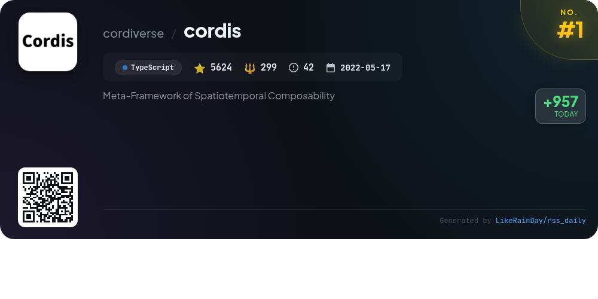
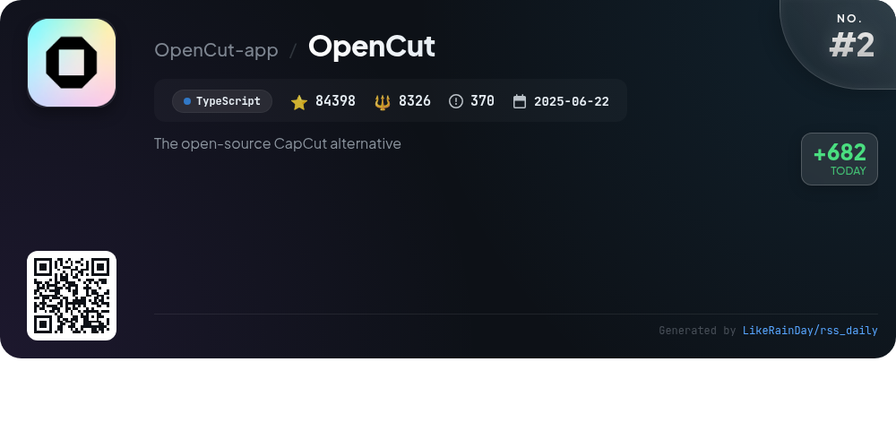
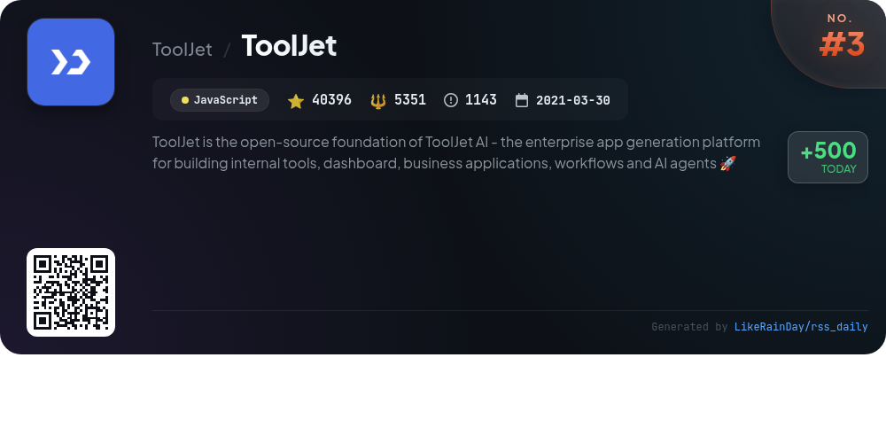
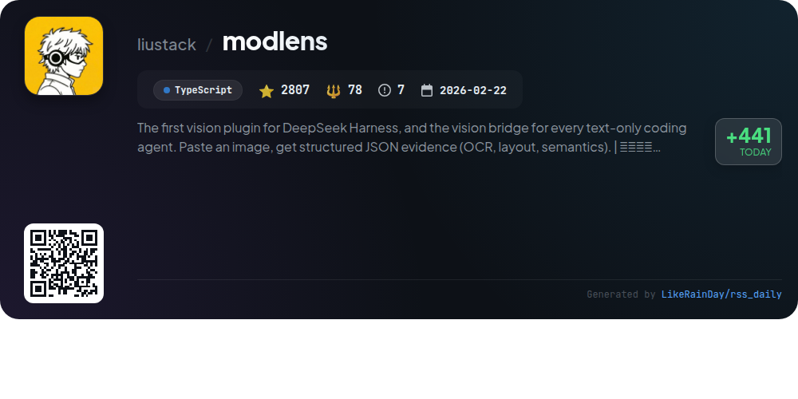
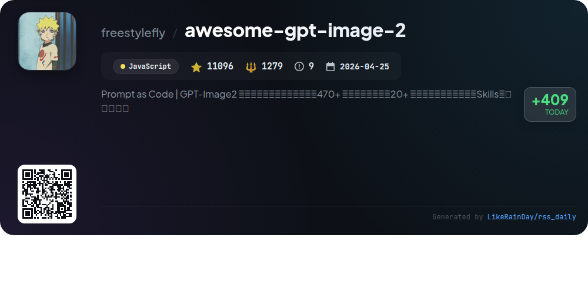
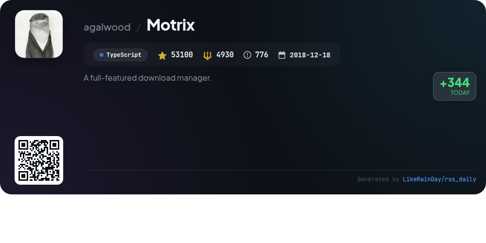
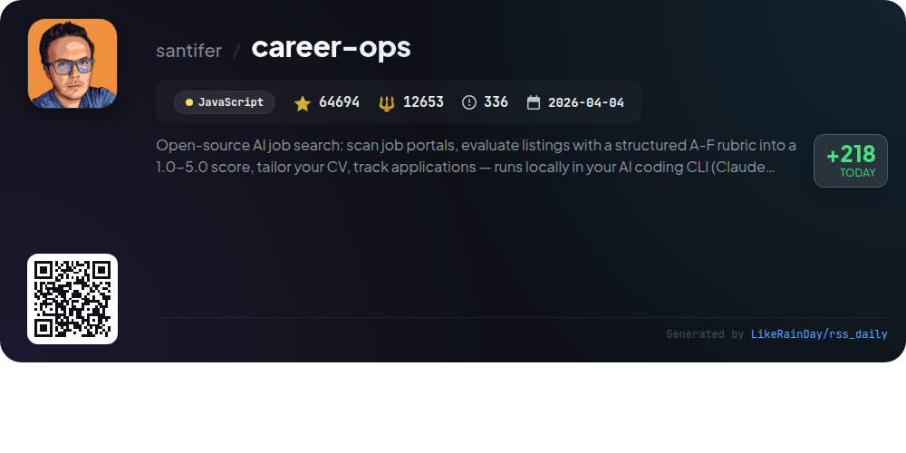

# 📊 🌟 GitHub Trending Daily - 2026-08-18

> > 📅 Daily Picks of GitHub Trending Repositories | Powered by Smart Algorithms

## 📋 Overview

**10** Projects | **486518** ⭐ | **65389** 🍴

**Top Languages:** `TypeScript` (5) · `JavaScript` (4) · `C++` (1)

**Updated:** 2026-08-18 01:40 UTC

**Categories:**

- 🌟 Daily Top 10 (10 items)

---

## 🌟 Daily Top 10

### 1. [cordis](https://github.com/cordiverse/cordis)

> 🤖 **Why Recommend**  
> *Cordis is a TypeScript-based meta-framework focused on spatiotemporal composability, currently under active development with an evolving API. It enables developers to create applications that effectively manage and manipulate spatial and temporal data, offering significant flexibility and advanced compositional capabilities. Key highlights include a foundational paper detailing the programming paradigm and comprehensive documentation available through the cordis-primer. Cordis has gained traction with over 5,600 stars on GitHub, showcasing its growing popularity and potential in the developer community.*

- ⭐ 5624 stars
- 💻 TypeScript
- 📅 Updated: 2026-08-18

### 2. [OpenCut](https://github.com/OpenCut-app/OpenCut)

> 🤖 **Why Recommend**  
> *OpenCut is a free, open-source video editor designed for web, desktop, and mobile platforms, currently in a comprehensive rewrite. Key features include a new Editor API, support for third-party plugins, and a unified codebase leveraging Rust. Additional offerings will include an MCP server for AI agents, headless mode for automation, and an integrated scripting tab. The project has garnered significant attention with over 84,000 stars on GitHub. For ongoing updates, join the Discord community or check the classic version at opencut.app.*

- ⭐ 84398 stars
- 💻 TypeScript
- 📅 Updated: 2026-08-18

### 3. [ToolJet](https://github.com/ToolJet/ToolJet)

> 🤖 **Why Recommend**  
> *ToolJet is an open-source platform for building internal tools, workflows, and AI agents. It features a powerful visual app builder with over 60 components, support for 80+ data sources, and a built-in no-code database. Key highlights include multi-page apps, real-time collaboration, and extensive deployment options (Docker, Kubernetes, AWS, etc.). The enterprise version, ToolJet AI, enhances capabilities with AI-powered app generation, query building, and advanced security features. ToolJet is available on AWS and Azure Marketplaces, promoting easy access for users.*

- ⭐ 40396 stars
- 💻 JavaScript
- 📅 Updated: 2026-08-18

### 4. [modlens](https://github.com/liustack/modlens)

> 🤖 **Why Recommend**  
> *ModLens is a powerful vision plugin for DeepSeek Harness, enabling text-only AI models to process images by simply pasting them into the chat. It generates structured JSON evidence including OCR, layout, and semantics without the need for file saving. Key features include easy installation, zero configuration, and support for multiple vision engines like Gemini and OpenAI. ModLens auto-discovers and integrates with existing models, providing an efficient and user-friendly experience. Its minimalistic design ensures hassle-free uninstallation and seamless operation across various AI environments.*

- ⭐ 2807 stars
- 💻 TypeScript
- 📅 Updated: 2026-08-18

### 5. [awesome-gpt-image-2](https://github.com/freestylefly/awesome-gpt-image-2)

> 🤖 **Why Recommend**  
> *The "awesome-gpt-image-2" project is an industrial-grade prompt engine and template library for AI image generation, featuring over 520 reverse-engineered cases and 20 industrial templates. Its core capabilities include structured prompt schemas for enhanced controllability, automation workflows, and reusable designs. Users can access a visual gallery online, with filters for styles and scenarios. The project also offers a paid community for discussions and insights, and integrates with platforms like Ciyuan API for efficient AI access. With over 11,000 stars on GitHub, it continues to evolve with regular updates.*

- ⭐ 11096 stars
- 💻 JavaScript
- 📅 Updated: 2026-08-18

### 6. [Motrix](https://github.com/agalwood/Motrix)

> 🤖 **Why Recommend**  
> *Motrix is a modern, full-featured download manager designed for simplicity and efficiency, capable of handling HTTP, FTP, BitTorrent, and magnet links. Built with TypeScript and Electron, it offers a clean interface with dark mode, customizable dashboards, and integrated browser extensions for seamless downloads. Key features include per-file BitTorrent management, UPnP support, download limits, and a powerful CLI client. It supports both desktop (macOS, Windows, Linux) and headless server modes with Docker, enhancing versatility for users.*

- ⭐ 53100 stars
- 💻 TypeScript
- 📅 Updated: 2026-08-18

### 7. [up](https://github.com/byoungd/up)

> 🤖 **Why Recommend**  
> *The "up" project is a comprehensive growth guide aimed at personal development, covering English learning, AI education, and life reflection. It promotes a structured, evidence-based learning system that encourages users to diagnose their current status, set goals, practice actively, receive feedback, and adjust accordingly. Key features include an extensive English learning system, AI learning tools, and insights into personal experiences. The project emphasizes actionable evidence over theoretical knowledge, fostering a sustainable cycle of improvement. It is open content under CC BY-NC 4.0 and is actively maintained.*

- ⭐ 59164 stars
- 💻 JavaScript
- 📅 Updated: 2026-08-18

### 8. [reactive-resume](https://github.com/amruthpillai/reactive-resume)

> 🤖 **Why Recommend**  
> *Reactive Resume is a free, open-source resume builder designed with privacy in mind, allowing users to create, update, and share resumes securely. Key features include real-time preview, multiple export formats (PDF, JSON, DOCX), customizable templates, and a rich text editor. Users have complete control over their data, with options for self-hosting and no tracking. The platform also supports AI integration, multi-language capabilities, and offers drag-and-drop functionality for section ordering. With over 40,000 stars on GitHub, it emphasizes community support and continuous development.*

- ⭐ 40846 stars
- 💻 TypeScript
- 📅 Updated: 2026-08-18

### 9. [llama.cpp](https://github.com/ggml-org/llama.cpp)

> 🤖 **Why Recommend**  
> *llama.cpp is a C/C++ library for efficient LLM and VLM inference, boasting over 124,000 stars on GitHub. It features a plain implementation with no dependencies, optimized support for Apple Silicon, x86, and RISC-V architectures, along with a variety of quantization options for faster inference. Key functionalities include a command-line interface, OpenAI-compatible API server, multi-GPU support, and backends for various hardware, including CUDA and Vulkan. The project emphasizes minimal setup and high performance across diverse environments, from local machines to cloud platforms.*

- ⭐ 124393 stars
- 💻 C++
- 📅 Updated: 2026-08-18

### 10. [career-ops](https://github.com/santifer/career-ops)

> 🤖 **Why Recommend**  
> *career-ops is an open-source AI job search tool that transforms any AI coding CLI into a comprehensive job application pipeline. Key features include job offer evaluations against a structured A-F rubric, tailored ATS-optimized CV generation, automated job portal scanning, and application tracking. It supports batch processing and human-in-the-loop decision-making, ensuring users retain final control over applications. With over 74,000 stars on GitHub, career-ops empowers candidates to efficiently filter and manage job opportunities while avoiding spam applications.*

- ⭐ 64694 stars
- 💻 JavaScript
- 📅 Updated: 2026-08-18

---

## 📡 RSS Subscription

Subscribe via RSS to get daily trending updates:

- 🔔 [RSS XML] (../../daily-top.xml)
- 🔔 [Daily Report] (../../GITHUB_TODAY.md)
- 🔔 [Daily Top 10](../../daily-top.xml)

---

*⚡ Powered by Smart Trending Algorithm | Generated at 2026-08-18 01:40:50 UTC
