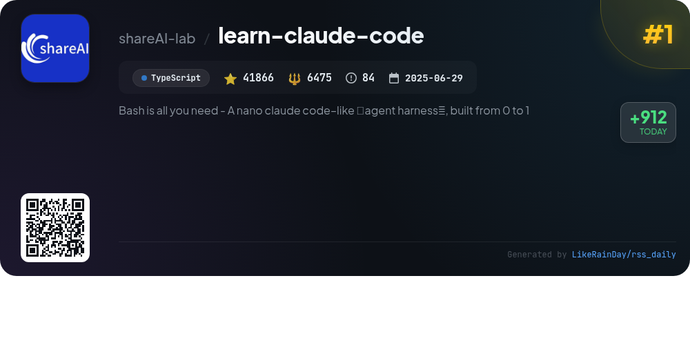
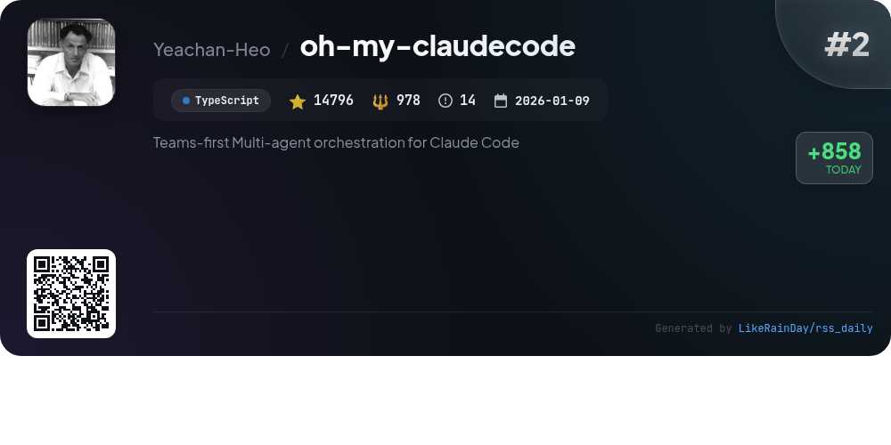
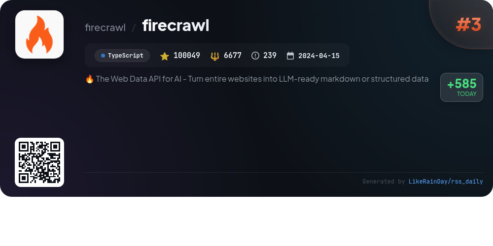
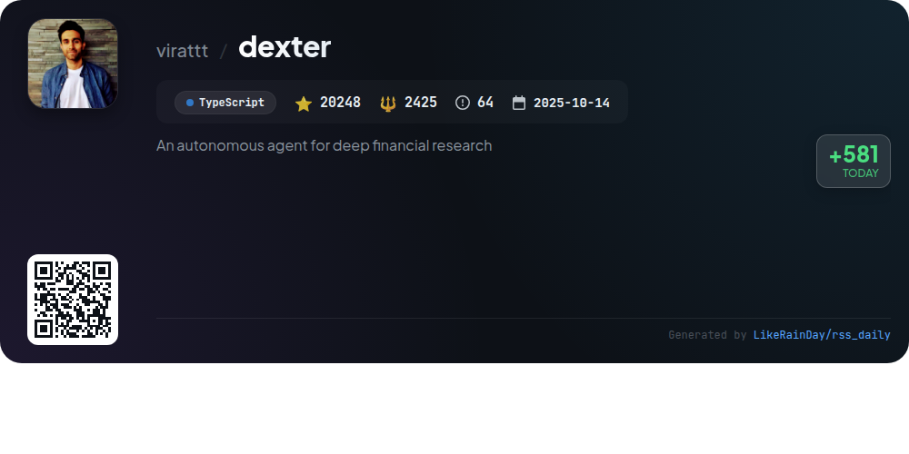
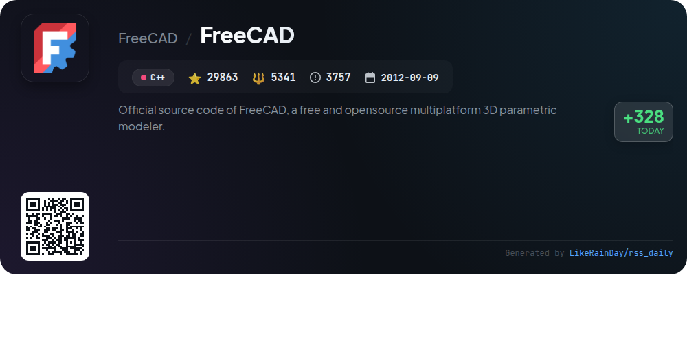
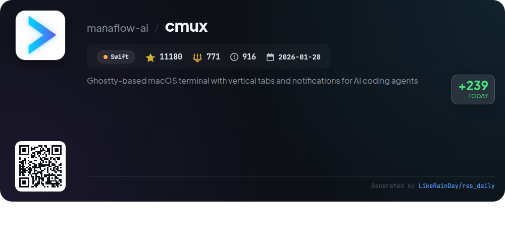

# 📊 🌟 GitHub Trending Daily - 2026-03-29

> > 📅 Daily Picks of GitHub Trending Repositories | Powered by Smart Algorithms

## 📋 Overview

**10** Projects | **437098** ⭐ | **49478** 🍴

**Top Languages:** `TypeScript` (6) · `C++` (2) · `Swift` (1)

**Updated:** 2026-03-29 03:19 UTC

**Categories:**

- 🌟 Daily Top 10 (10 items)

---

## 🌟 Daily Top 10

### 1. [learn-claude-code](https://github.com/shareAI-lab/learn-claude-code)

> 🤖 **Why Recommend**  
> *Learn Claude Code is a comprehensive repository for harness engineering, focused on building environments for AI agents, particularly coding agents. It emphasizes that an "agent" is a trained model, while the "harness" facilitates its operation. The project includes 12 progressive sessions covering key mechanisms like tool integration, task management, context compression, and team coordination. It features a Python implementation, multi-language documentation, and an interactive web platform for learning. The goal is to empower developers with patterns applicable across various domains for creating effective AI agents.*

- ⭐ 41866 stars
- 💻 TypeScript
- 📅 Updated: 2026-03-29

### 2. [oh-my-claudecode](https://github.com/Yeachan-Heo/oh-my-claudecode)

> 🤖 **Why Recommend**  
> *oh-my-claudecode is a teams-first multi-agent orchestration tool for Claude Code, designed for seamless integration and ease of use. Key features include a natural language interface, zero configuration, and intelligent orchestration with 32 specialized agents. It supports team collaboration through a structured pipeline, real-time observability, and automatic task parallelization. Users can leverage customizable skills and notification integrations, ensuring efficient workflows and cost optimization. This TypeScript-based project has gained significant traction with nearly 15,000 stars on GitHub.*

- ⭐ 14796 stars
- 💻 TypeScript
- 📅 Updated: 2026-03-29

### 3. [firecrawl](https://github.com/firecrawl/firecrawl)

> 🤖 **Why Recommend**  
> *Firecrawl is a powerful Web Data API designed to transform entire websites into LLM-ready markdown or structured data. Key features include reliable data extraction, handling dynamic content, and customizable scraping options. Users can scrape in various formats (markdown, JSON, HTML), track changes, and perform batch processing. The API supports advanced interactions, allowing users to click, scroll, and input data before extraction. With an easy-to-use interface and SDKs for multiple languages, Firecrawl streamlines data access for AI applications, making it a top choice for web scraping.*

- ⭐ 100049 stars
- 💻 TypeScript
- 📅 Updated: 2026-03-29

### 4. [dexter](https://github.com/virattt/dexter)

> 🤖 **Why Recommend**  
> *Dexter is an autonomous financial research agent designed to analyze complex financial queries using real-time market data. Key features include intelligent task planning that breaks down queries into structured steps, autonomous execution to gather data, and self-validation to ensure accuracy. It accesses comprehensive financial datasets, such as income statements and balance sheets, while incorporating safety measures like loop detection. Additionally, users can interact with Dexter via WhatsApp. With over 20,000 stars on GitHub, Dexter stands out as a robust tool for deep financial research.*

- ⭐ 20248 stars
- 💻 TypeScript
- 📅 Updated: 2026-03-29

### 5. [twenty](https://github.com/twentyhq/twenty)

> 🤖 **Why Recommend**  
> *twenty is an open-source CRM designed as a modern alternative to Salesforce, emphasizing community-driven development. Key features include customizable layouts, object and field management, role-based permissions, and workflow automation. Users can personalize their experience with kanban and table views, integrate emails and calendar events, and benefit from a plugin ecosystem. Built with TypeScript, NestJS, and React, twenty aims to provide a cohesive user experience, free from vendor lock-in. Join the community on Discord and contribute to its growth.*

- ⭐ 42468 stars
- 💻 TypeScript
- 📅 Updated: 2026-03-29

### 6. [cc-switch](https://github.com/farion1231/cc-switch)

> 🤖 **Why Recommend**  
> *CC Switch is a cross-platform desktop assistant tool for managing multiple CLI tools, including Claude Code, Codex, Gemini CLI, OpenCode, and OpenClaw. With over 34,000 stars on GitHub, it simplifies provider management through a unified interface, eliminating manual configuration edits. Key features include 50+ built-in provider presets, real-time switching via system tray, comprehensive MCP and Skills management, and cloud sync capabilities. Built with Tauri in Rust, it supports Windows, macOS, and Linux, making it an efficient solution for developers seeking streamlined AI coding workflows.*

- ⭐ 34863 stars
- 💻 Rust
- 📅 Updated: 2026-03-29

### 7. [claude-mem](https://github.com/thedotmack/claude-mem)

> 🤖 **Why Recommend**  
> *Claude-Mem is a powerful plugin for Claude Code that enhances coding sessions by automatically capturing interactions, compressing context using AI, and seamlessly injecting relevant information into future sessions. Key features include persistent memory for context retention, skill-based memory search, a web viewer UI, and privacy controls. It supports real-time observation feeds and offers a beta channel for experimental features. With over 42,000 stars, Claude-Mem aims to optimize coding workflows by maintaining continuity and improving knowledge management across projects.*

- ⭐ 42010 stars
- 💻 TypeScript
- 📅 Updated: 2026-03-29

### 8. [FreeCAD](https://github.com/FreeCAD/FreeCAD)

> 🤖 **Why Recommend**  
> *FreeCAD is a powerful, open-source 3D parametric modeler designed for creating real-life objects of any size. Key features include parametric modeling for easy design modifications, the ability to create 3D models from 2D sketches, and a wide range of applications in product design, mechanical engineering, and architecture. It runs on Windows, macOS, and Linux, and is supported by a robust Python API, OpenCASCADE geometry kernel, and Qt-based GUI. FreeCAD offers extensive documentation, a community forum, and active development resources.*

- ⭐ 29863 stars
- 💻 C++
- 📅 Updated: 2026-03-29

### 9. [cmux](https://github.com/manaflow-ai/cmux)

> 🤖 **Why Recommend**  
> *cmux is a Ghostty-based macOS terminal designed for AI coding agents, featuring vertical tabs, in-app notifications, and a scriptable interface. Key highlights include notification rings for active coding sessions, a notification panel for unread alerts, and a built-in browser for seamless multitasking. With both vertical and horizontal tabs, users can easily monitor git branches and workspace status. Built with Swift, cmux offers fast performance and low memory usage while supporting customization through existing Ghostty configurations.*

- ⭐ 11180 stars
- 💻 Swift
- 📅 Updated: 2026-03-29

### 10. [llama.cpp](https://github.com/ggml-org/llama.cpp)

> 🤖 **Why Recommend**  
> *llama.cpp is a high-performance C/C++ library for large language model (LLM) inference, boasting over 99,000 stars on GitHub. Key features include optimized support for various architectures (ARM, x86, RISC-V), extensive integer quantization options for efficient memory use, and custom CUDA kernels for NVIDIA GPUs. It supports multimodal capabilities and offers REST API access via llama-server. Users can easily integrate models from Hugging Face and utilize tools for quantization, benchmarking, and grammar constraint. Quick installation is facilitated through multiple package managers and Docker.*

- ⭐ 99755 stars
- 💻 C++
- 📅 Updated: 2026-03-29

---

## 📡 RSS Subscription

Subscribe via RSS to get daily trending updates:

- 🔔 [RSS XML] (../../daily-top.xml)
- 🔔 [Daily Report] (../../GITHUB_TODAY.md)
- 🔔 [Daily Top 10](../../daily-top.xml)

---

*⚡ Powered by Smart Trending Algorithm | Generated at 2026-03-29 03:19:21 UTC
