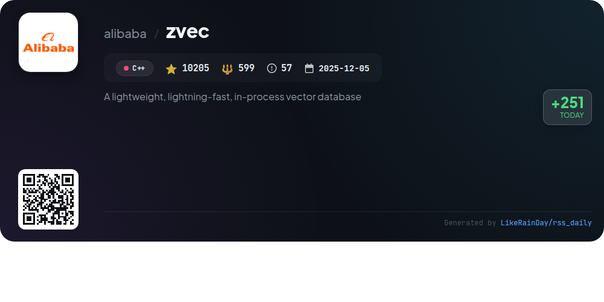
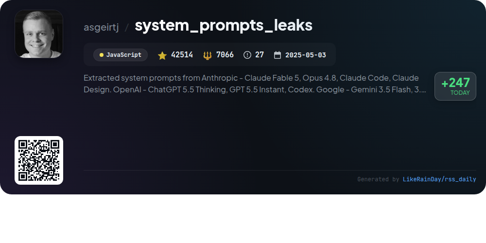
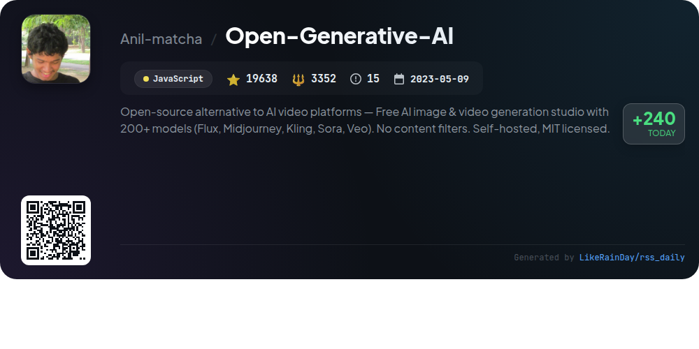
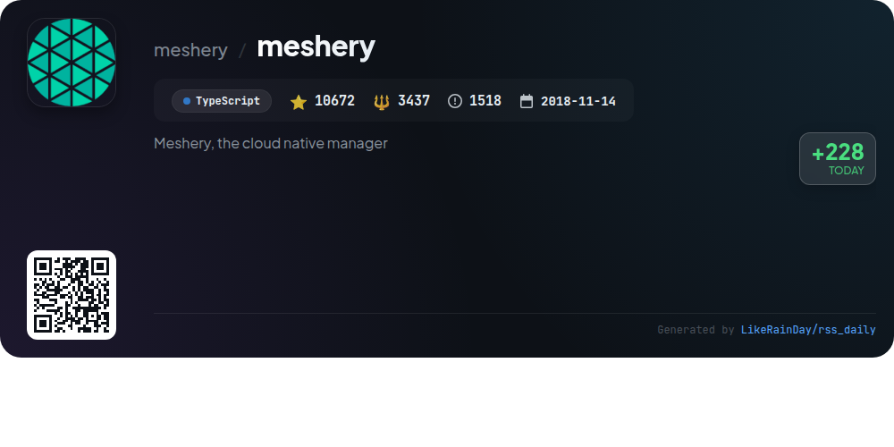
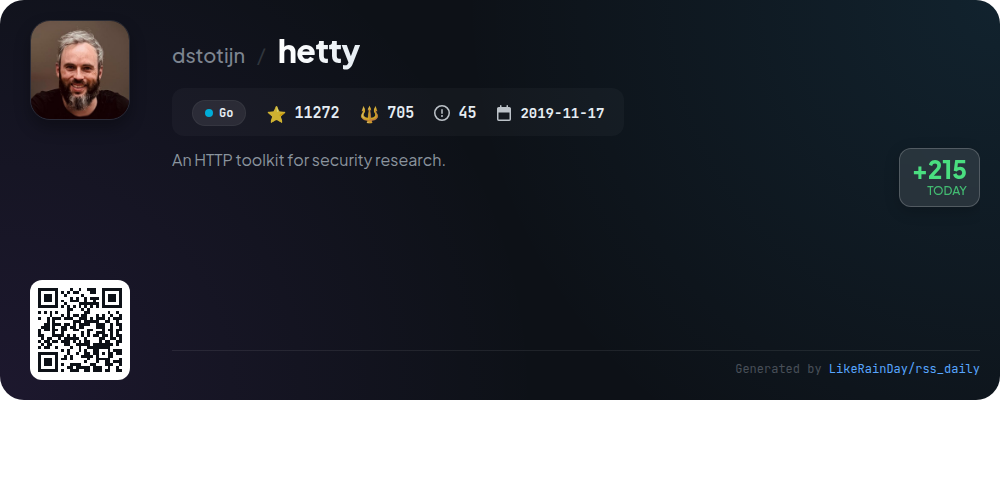

# 📊 🌟 GitHub Trending Daily - 2026-06-16

> > 📅 Daily Picks of GitHub Trending Repositories | Powered by Smart Algorithms

## 📋 Overview

**10** Projects | **1051696** ⭐ | **113227** 🍴

**Top Languages:** `TypeScript` (4) · `JavaScript` (3) · `Swift` (1)

**Updated:** 2026-06-16 05:09 UTC

**Categories:**

- 🌟 Daily Top 10 (10 items)

---

## 🌟 Daily Top 10

### 1. [iptv](https://github.com/iptv-org/iptv)

> 🤖 **Why Recommend**  
> *The IPTV project offers a comprehensive collection of publicly available IPTV channels from around the globe, enabling users to stream content easily. Key features include a main playlist for all channels, Electronic Program Guide (EPG) support, and a robust API for integration. Users can access playlists directly via any compatible video player. The project is actively maintained, with contributions welcomed. Legal compliance is emphasized, as the repository contains links to publicly shared streams, not the content itself. With over 123,000 stars, it's a valuable resource for IPTV enthusiasts.*

- ⭐ 123141 stars
- 💻 TypeScript
- 📅 Updated: 2026-06-16

### 2. [freeCodeCamp](https://github.com/freeCodeCamp/freeCodeCamp)

> 🤖 **Why Recommend**  
> *freeCodeCamp is an open-source platform offering free coding education, powered by a supportive community and a donor-supported charity. With over 448,000 stars on GitHub, it features a comprehensive curriculum in full-stack web development and machine learning. Users can earn certifications in various areas such as Responsive Web Design and Python through interactive lessons and projects. The platform also includes a forum, YouTube channel, and Discord server for community support, along with interview preparation resources to help learners transition into tech careers.*

- ⭐ 448014 stars
- 💻 TypeScript
- 📅 Updated: 2026-06-16

### 3. [LinkSwift](https://github.com/hmjz100/LinkSwift)

> 🤖 **Why Recommend**  
> *LinkSwift is a JavaScript-based tool designed to fetch direct download links from various cloud storage services, including Baidu Cloud, Alibaba Cloud, China Mobile Cloud, and more. With over 16,000 stars, it enhances user experience by offering features like UI beautification, multi-threaded download support, and compatibility with multiple download managers. The project focuses on providing legal and compliant access to files without bypassing any service limitations. Users can install the script from multiple sources for optimal performance.*

- ⭐ 16534 stars
- 💻 JavaScript
- 📅 Updated: 2026-06-16

### 4. [zvec](https://github.com/alibaba/zvec)

> 🤖 **Why Recommend**  
> *Zvec is a lightweight, in-process vector database designed for high-performance similarity search. With over 10,200 stars on GitHub, it supports dense and sparse vectors, hybrid queries combining full-text and vector searches, and durable storage through write-ahead logging. Key features include blazing-fast search capabilities, simple installation, and concurrent access support. Zvec is compatible with multiple languages via SDKs (Python, Node.js, Go, Rust) and can run on various platforms. It also offers a visual tool, Zvec Studio, for easy data management.*

- ⭐ 10205 stars
- 💻 C++
- 📅 Updated: 2026-06-16

### 5. [system_prompts_leaks](https://github.com/asgeirtj/system_prompts_leaks)

> 🤖 **Why Recommend**  
> *The "system_prompts_leaks" GitHub repository documents extracted system prompts from various AI chatbots, including Claude (Anthropic), ChatGPT (OpenAI), Gemini (Google), and Grok (xAI). With over 42,514 stars, it features regularly updated prompts for multiple models, allowing users to compare changes between versions, such as Claude Fable 5 and Opus 4.8. Key highlights include easy access to official prompts, tools, and integrations across platforms like VS Code and GitHub Copilot, making it a valuable resource for developers and researchers interested in AI behavior and capabilities.*

- ⭐ 42514 stars
- 💻 JavaScript
- 📅 Updated: 2026-06-16

### 6. [Open-Generative-AI](https://github.com/Anil-matcha/Open-Generative-AI)

> 🤖 **Why Recommend**  
> *Open Generative AI is an open-source alternative to AI video platforms, providing a free studio for AI image and video generation with over 200 models, including Flux, Midjourney, and Veo. Key features include no content filters, self-hosting capabilities, multi-image input support, and dedicated lip sync tools. Users can automate media generation through AI coding agents and customize the platform. The project encourages community engagement via Reddit and Discord, and offers a hosted version for instant access. It is MIT licensed and designed for both creativity and privacy.*

- ⭐ 19638 stars
- 💻 JavaScript
- 📅 Updated: 2026-06-16

### 7. [meshery](https://github.com/meshery/meshery)

> 🤖 **Why Recommend**  
> *Meshery is an open-source cloud-native manager designed for Kubernetes infrastructure and application management across multiple clouds. Key features include visual GitOps for collaborative infrastructure design, support for over 380 integrations, and the ability to manage multiple Kubernetes clusters seamlessly. It offers dry-run capabilities for safe deployments, performance management tools with load generation, and workspace functionalities for team collaboration. Meshery promotes extensibility through various APIs and plugins, making it an ideal foundation for internal developer platforms.*

- ⭐ 10672 stars
- 💻 TypeScript
- 📅 Updated: 2026-06-16

### 8. [supertonic](https://github.com/supertone-inc/supertonic)

> 🤖 **Why Recommend**  
> *Supertonic is a lightning-fast, on-device multilingual text-to-speech (TTS) system that runs natively via ONNX, ensuring privacy with zero network dependency. It supports 31 languages and delivers real-time synthesis, generating high-quality 44.1kHz audio. Key features include a compact 99M-parameter model for efficient performance and expressive speech with 10 inline tags for natural nuances. Supertonic is compatible with various platforms, including Python, Node.js, and mobile, making it versatile for developers. Try it with a demo or integrate it through the Supertonic API.*

- ⭐ 12326 stars
- 💻 Swift
- 📅 Updated: 2026-06-16

### 9. [developer-roadmap](https://github.com/nilbuild/developer-roadmap)

> 🤖 **Why Recommend**  
> *developer-roadmap is an interactive platform offering community-driven roadmaps, guides, and resources to assist developers in their career growth. With over 357,000 stars on GitHub, it features a variety of interactive roadmaps covering topics like Frontend, Backend, DevOps, Data Science, and more. Users can explore best practices and test their knowledge through a series of questions. The project encourages community contributions and includes a dedicated YouTube channel for further learning. Access the full suite of resources at roadmap.sh.*

- ⭐ 357380 stars
- 💻 TypeScript
- 📅 Updated: 2026-06-16

### 10. [hetty](https://github.com/dstotijn/hetty)

> 🤖 **Why Recommend**  
> *Hetty is an open-source HTTP toolkit designed for security research, providing a robust alternative to commercial tools like Burp Suite Pro. Key features include a machine-in-the-middle (MITM) HTTP proxy with advanced logging, an HTTP client for crafting requests, and request interception capabilities for manual review. It offers a user-friendly web-based admin interface and project-based database storage for organized workflows. Actively developed, Hetty supports various installation methods, including package managers and Docker, making it accessible for security professionals and bug bounty hunters.*

- ⭐ 11272 stars
- 💻 Go
- 📅 Updated: 2026-06-16

---

## 📡 RSS Subscription

Subscribe via RSS to get daily trending updates:

- 🔔 [RSS XML] (../../daily-top.xml)
- 🔔 [Daily Report] (../../GITHUB_TODAY.md)
- 🔔 [Daily Top 10](../../daily-top.xml)

---

*⚡ Powered by Smart Trending Algorithm | Generated at 2026-06-16 05:09:43 UTC
