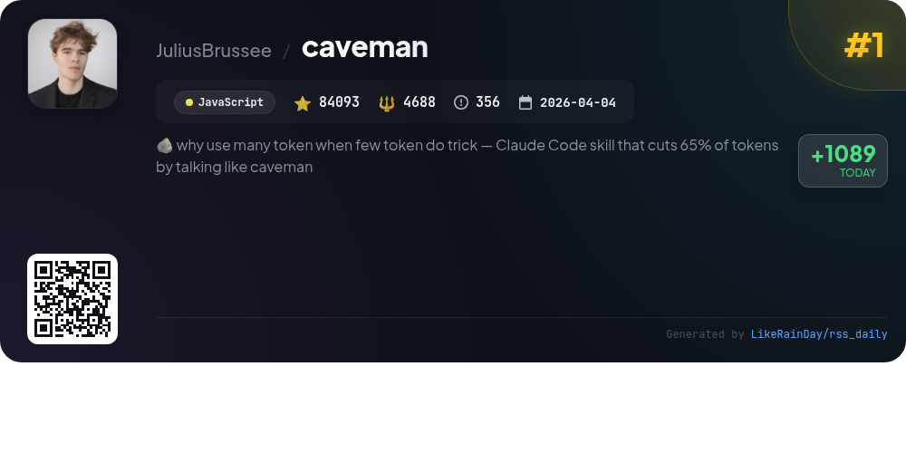
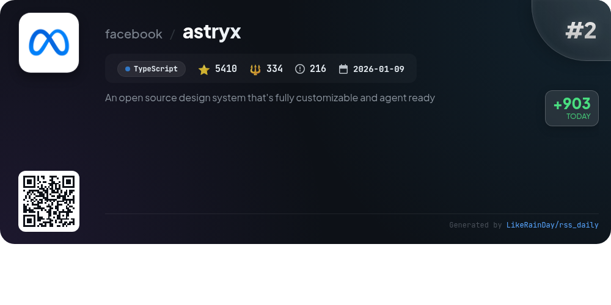
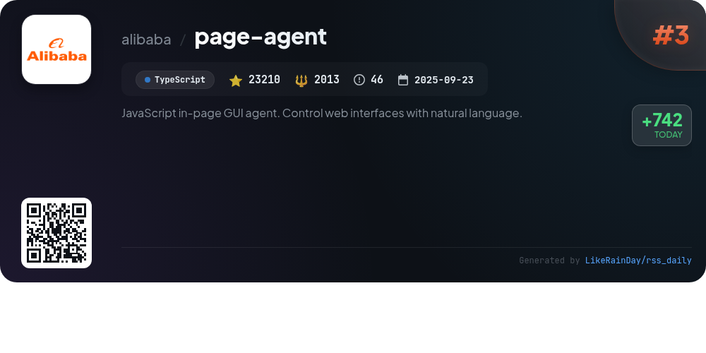
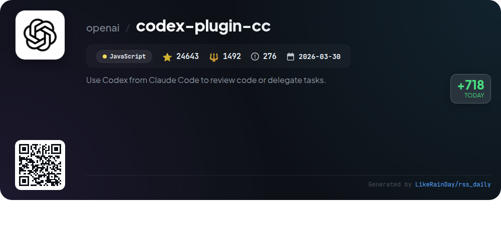
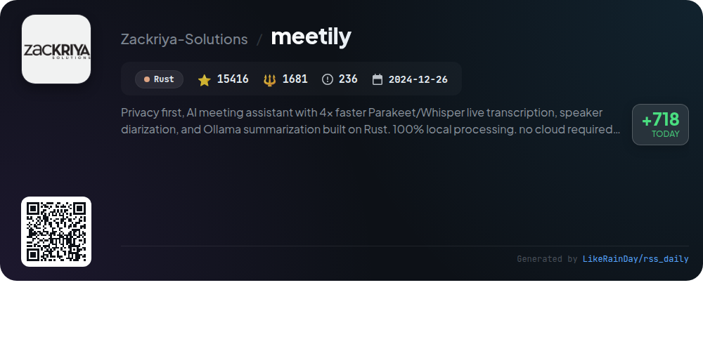
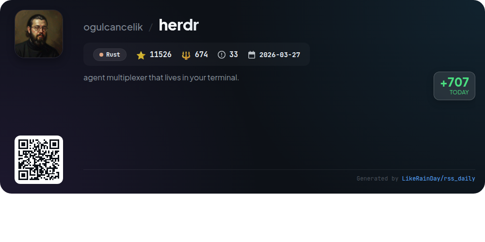
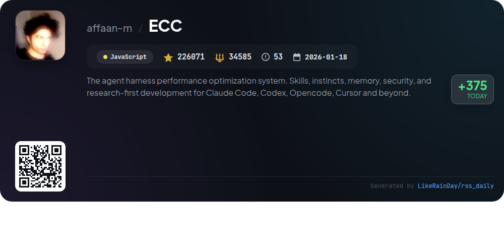
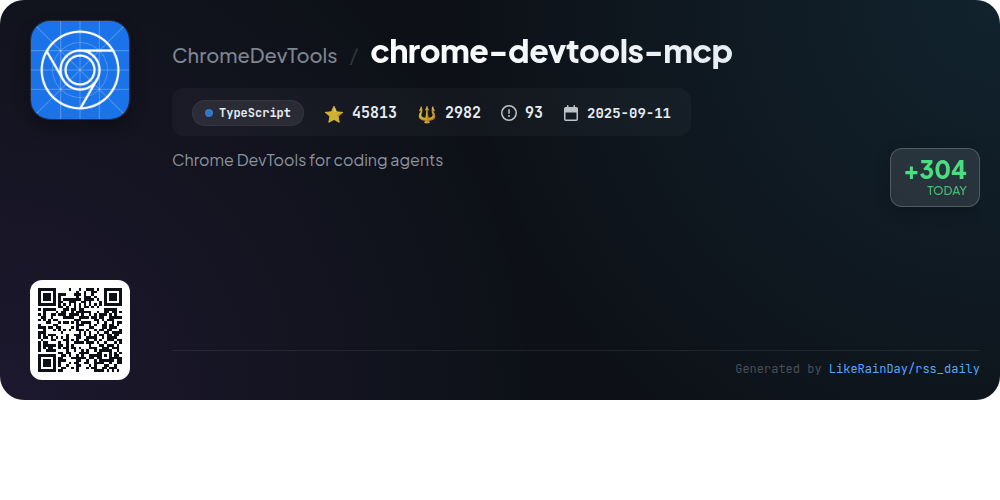

# 📊 🌟 GitHub Trending Daily - 2026-07-05

> > 📅 Daily Picks of GitHub Trending Repositories | Powered by Smart Algorithms

## 📋 Overview

**10** Projects | **528741** ⭐ | **58908** 🍴

**Top Languages:** `JavaScript` (5) · `TypeScript` (3) · `Rust` (2)

**Updated:** 2026-07-05 04:04 UTC

**Categories:**

- 🌟 Daily Top 10 (10 items)

---

## 🌟 Daily Top 10

### 1. [caveman](https://github.com/JuliusBrussee/caveman)

> 🤖 **Why Recommend**  
> *Caveman is a JavaScript plugin that optimizes AI communication by reducing output tokens by 65% while maintaining technical accuracy. It transforms responses from various coding agents, such as Claude Code and Codex, into concise caveman-speak, ensuring clear communication without losing essential information. Key features include adjustable response brevity levels, real-time token savings statistics, and the ability to compress memory files for ongoing efficiency. Caveman integrates seamlessly with over 30 agents, making coding interactions faster and more efficient.*

- ⭐ 84093 stars
- 💻 JavaScript
- 📅 Updated: 2026-07-05

### 2. [astryx](https://github.com/facebook/astryx)

> 🤖 **Why Recommend**  
> *Astryx is an open source, fully customizable design system built on React and StyleX, currently in beta with 5,410 stars. It features 150+ accessible components, brand-level theming, dark mode, and ready-to-ship templates, allowing seamless integration without build plugins. Key highlights include open internals for component customization, no styling lock-in, and a collaborative API designed for both humans and AI assistants. It offers a CLI for easy access to documentation and scaffolding, along with a variety of customizable themes. The system emphasizes strong conventions and user-friendly design principles.*

- ⭐ 5410 stars
- 💻 TypeScript
- 📅 Updated: 2026-07-05

### 3. [page-agent](https://github.com/alibaba/page-agent)

> 🤖 **Why Recommend**  
> *JavaScript in-page GUI agent. Control web interfaces with natural language.. popular project, actively maintained, recently updated*

- ⭐ 23210 stars
- 🍴 2013 forks
- 💻 TypeScript
- 📅 Updated: 2026-07-05

### 4. [codex-plugin-cc](https://github.com/openai/codex-plugin-cc)

> 🤖 **Why Recommend**  
> *The codex-plugin-cc integrates Codex into Claude Code, enabling seamless code reviews and task delegation. Key features include `/codex:review` for standard reviews, `/codex:adversarial-review` for challenging design decisions, and commands like `/codex:rescue`, `/codex:transfer`, and `/codex:status` for managing tasks and job statuses. Users benefit from an efficient workflow, leveraging Codex’s capabilities directly within their existing environment. Requires Node.js and a ChatGPT subscription or OpenAI API key for operation.*

- ⭐ 24643 stars
- 💻 JavaScript
- 📅 Updated: 2026-07-05

### 5. [meetily](https://github.com/Zackriya-Solutions/meetily)

> 🤖 **Why Recommend**  
> *Meetily is a privacy-first AI meeting assistant designed for macOS and Windows, featuring 100% local processing with no cloud dependency. Key features include 4x faster live transcription using Parakeet/Whisper, speaker diarization, and AI summaries via Ollama. It's open-source, ensuring data sovereignty and compliance, making it ideal for enterprises. Users can customize their experience with support for multiple AI providers and advanced export options. Meetily PRO offers enhanced accuracy and additional features for professionals. With over 15,000 stars on GitHub, it stands out for its commitment to privacy and control.*

- ⭐ 15416 stars
- 💻 Rust
- 📅 Updated: 2026-07-05

### 6. [herdr](https://github.com/ogulcancelik/herdr)

> 🤖 **Why Recommend**  
> *Herdr is a Rust-based terminal multiplexer that allows users to run and manage multiple coding agents seamlessly in one terminal. Key features include real terminal views for each agent, real-time state visibility (blocked, working, done), and mouse-native interactions for organizing workspaces, tabs, and panes. Herdr supports SSH and ensures persistent sessions, allowing users to detach and reattach without losing progress. With a lightweight binary and no GUI dependency, Herdr is designed for efficient agent management across various environments.*

- ⭐ 11526 stars
- 💻 Rust
- 📅 Updated: 2026-07-05

### 7. [system_prompts_leaks](https://github.com/asgeirtj/system_prompts_leaks)

> 🤖 **Why Recommend**  
> *The "system_prompts_leaks" GitHub project catalogs extracted system prompts from major AI chatbots, including Anthropic's Claude, OpenAI's ChatGPT, Google's Gemini, and more. With over 49,000 stars, it serves as a comprehensive resource for understanding the underlying instructions of these AI models. Key features include regular updates on new prompts, detailed comparisons of model updates, and integration links for various applications. The project aims to illuminate the hidden rules governing AI behavior, enhancing transparency in AI interactions.*

- ⭐ 49030 stars
- 💻 JavaScript
- 📅 Updated: 2026-07-05

### 8. [ECC](https://github.com/affaan-m/ECC)

> 🤖 **Why Recommend**  
> *ECC is a powerful performance optimization system for AI agent workflows, supporting Codex, Claude Code, Cursor, and more. With over 226,000 stars, it provides a comprehensive suite of features, including skills, instincts, memory optimization, continuous learning, and security scanning. Key services include a GitHub App for seamless integration, a desktop dashboard for component management, and a robust command structure for efficient task execution. ECC's advanced capabilities enable cross-harness orchestration, making it ideal for developers seeking to enhance their AI-driven projects.*

- ⭐ 226071 stars
- 💻 JavaScript
- 📅 Updated: 2026-07-05

### 9. [chrome-devtools-mcp](https://github.com/ChromeDevTools/chrome-devtools-mcp)

> 🤖 **Why Recommend**  
> *Chrome DevTools MCP is a TypeScript-based tool enabling coding agents like Antigravity and Copilot to interact with a live Chrome browser. With over 45k stars, it serves as a Model-Context-Protocol (MCP) server, providing advanced debugging, performance insights, and reliable automation through Puppeteer. Key features include network request analysis, screenshot capabilities, and performance tracing. The CLI allows for seamless integration into various development environments, while strict privacy measures ensure sensitive data is protected. Ideal for enhancing AI-driven coding assistance.*

- ⭐ 45813 stars
- 💻 TypeScript
- 📅 Updated: 2026-07-05

### 10. [impeccable](https://github.com/pbakaus/impeccable)

> 🤖 **Why Recommend**  
> *Impeccable is a design language tool for AI coding agents, offering 23 commands and 45 deterministic rules to enhance AI-generated frontend design. Key features include a streamlined setup with `/impeccable init`, a shared design vocabulary, and tools for UX/UI planning, auditing, and final polishing. The CLI supports live browser iteration and detects common design flaws without LLMs. It integrates seamlessly with tools like Claude Code, GitHub Copilot, and Codex, making it an essential resource for improving AI-assisted design workflows. Visit impeccable.style for documentation and case studies.*

- ⭐ 43529 stars
- 💻 JavaScript
- 📅 Updated: 2026-07-05

---

## 📡 RSS Subscription

Subscribe via RSS to get daily trending updates:

- 🔔 [RSS XML] (../../daily-top.xml)
- 🔔 [Daily Report] (../../GITHUB_TODAY.md)
- 🔔 [Daily Top 10](../../daily-top.xml)

---

*⚡ Powered by Smart Trending Algorithm | Generated at 2026-07-05 04:04:21 UTC
