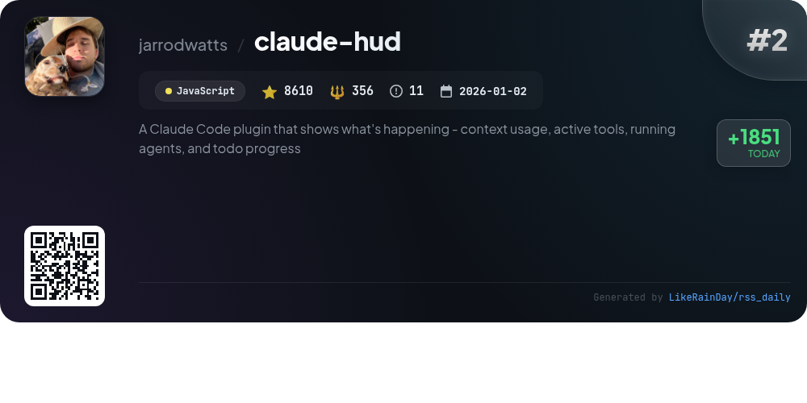
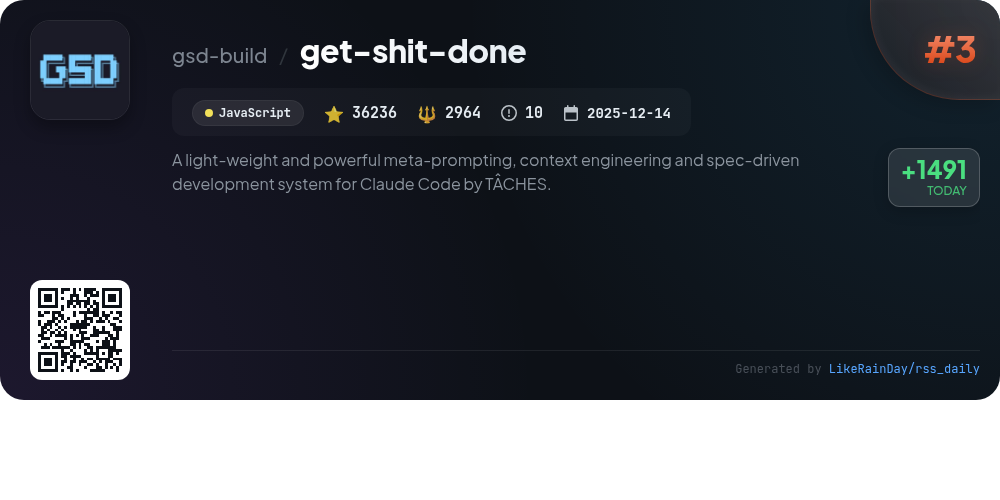
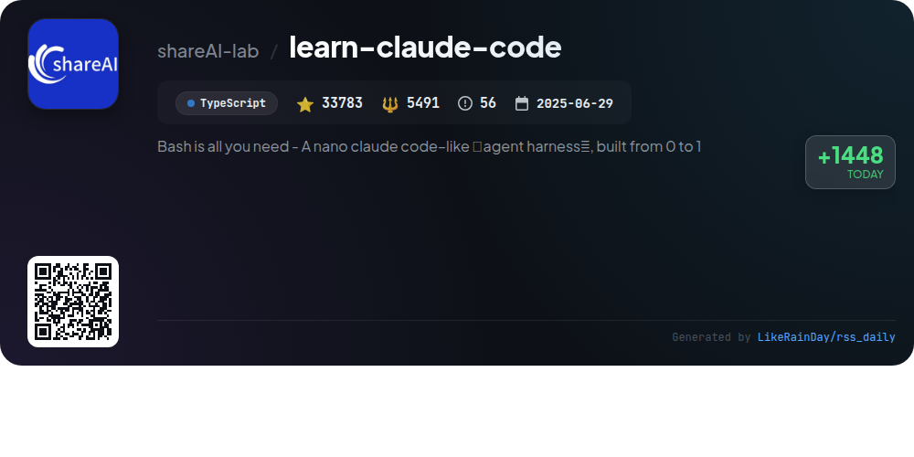
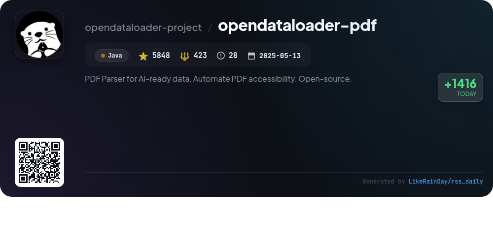
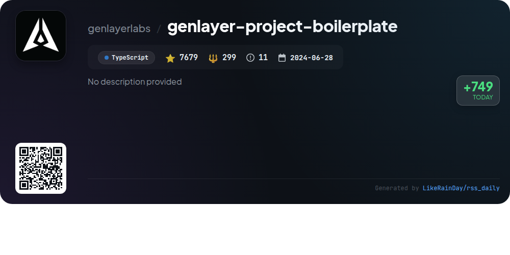
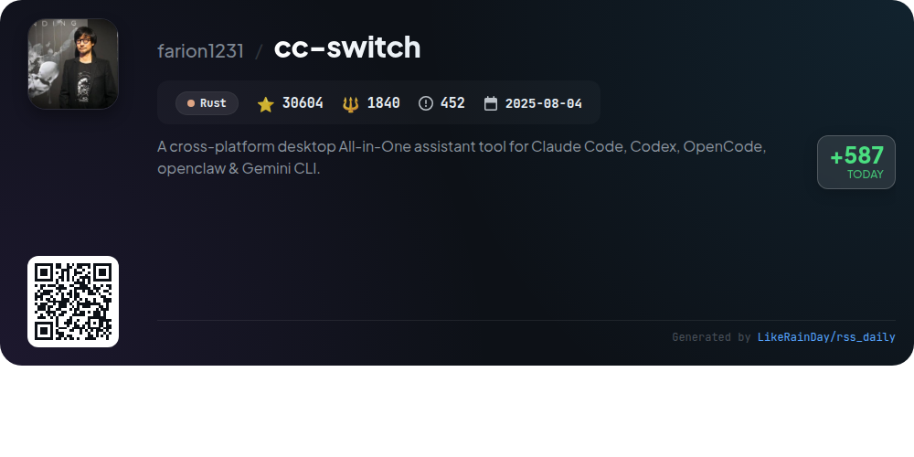
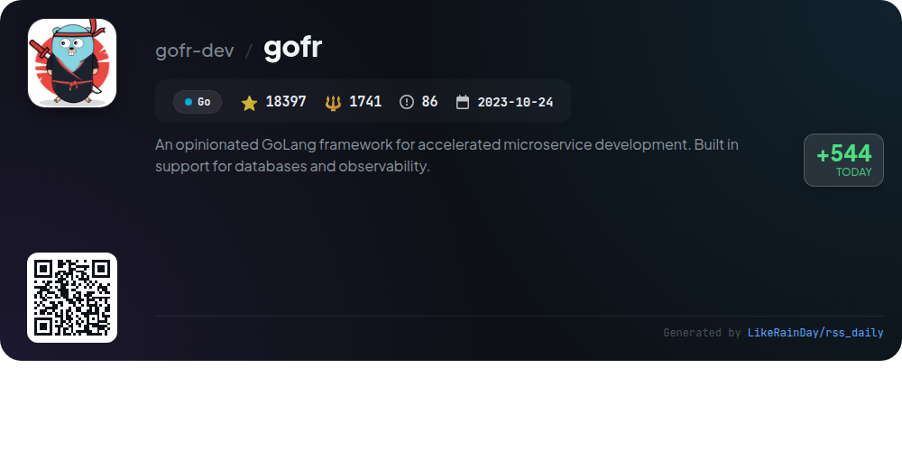
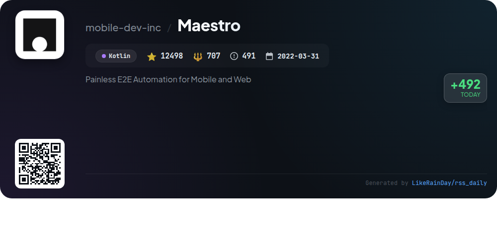

# 📊 🌟 GitHub Trending Daily - 2026-03-20

> > 📅 Daily Picks of GitHub Trending Repositories | Powered by Smart Algorithms

## 📋 Overview

**10** Projects | **252972** ⭐ | **26367** 🍴

**Top Languages:** `JavaScript` (3) · `TypeScript` (2) · `Rust` (2)

**Updated:** 2026-03-20 02:40 UTC

**Categories:**

- 🌟 Daily Top 10 (10 items)

---

## 🌟 Daily Top 10

### 1. [everything-claude-code](https://github.com/affaan-m/everything-claude-code)

> 🤖 **Why Recommend**  
> *Everything Claude Code is a robust performance optimization system for AI agents, supporting platforms like Claude Code, Codex, and Cursor. With over 88,000 stars, it provides 25 agents, 108 skills, and 57 commands to enhance workflows through automation, memory optimization, and security scanning. Key features include instinct-based continuous learning, cross-platform compatibility, and a comprehensive installation guide. It also integrates advanced tools like AgentShield for security audits and a skill creator for generating custom skills from Git history, ensuring high-quality development practices.*

- ⭐ 88485 stars
- 💻 JavaScript
- 📅 Updated: 2026-03-20

### 2. [claude-hud](https://github.com/jarrodwatts/claude-hud)

> 🤖 **Why Recommend**  
> *Claude HUD is a popular Claude Code plugin that enhances user experience by providing real-time insights into context usage, active tools, running agents, and todo progress. With over 8,600 stars, it features a customizable status line that displays project paths, context health, tool activity, and agent tracking. Users can easily configure their HUD settings and choose from presets to minimize clutter. The plugin is designed to work seamlessly within any terminal, updating approximately every 300ms, making it an essential tool for efficient coding and project management.*

- ⭐ 8610 stars
- 💻 JavaScript
- 📅 Updated: 2026-03-20

### 3. [get-shit-done](https://github.com/gsd-build/get-shit-done)

> 🤖 **Why Recommend**  
> *get-shit-done is a lightweight meta-prompting and context engineering system designed for Claude Code and other AI coding tools. It addresses context rot, ensuring high-quality outputs by maintaining fresh context throughout the development process. Key features include streamlined project initialization, multi-phase planning, parallel execution of tasks, and automated verification of deliverables. Trusted by engineers at Amazon, Google, and Shopify, GSD allows users to effortlessly translate ideas into code with minimal overhead, making it ideal for creative developers seeking efficient workflows.*

- ⭐ 36236 stars
- 💻 JavaScript
- 📅 Updated: 2026-03-20

### 4. [learn-claude-code](https://github.com/shareAI-lab/learn-claude-code)

> 🤖 **Why Recommend**  
> *Learn Claude Code is a TypeScript project aimed at harness engineering for AI agents, emphasizing that the model is the agent, not the surrounding code. With over 33,000 stars, it teaches users to build effective harnesses that enable agents to perceive, reason, and act in diverse domains. Key features include tools for file I/O and API interactions, on-demand knowledge loading, context management, and permission governance. The repository offers 12 progressive sessions, guiding developers from basic agent loops to advanced multi-agent collaboration, ultimately promoting the creation of intelligent, automated systems across various fields.*

- ⭐ 33783 stars
- 💻 TypeScript
- 📅 Updated: 2026-03-20

### 5. [opendataloader-pdf](https://github.com/opendataloader-project/opendataloader-pdf)

> 🤖 **Why Recommend**  
> *OpenDataLoader PDF is an open-source PDF parser designed for AI-ready data extraction and accessibility automation. It excels in converting PDFs to structured formats like Markdown, JSON, and HTML, achieving #1 extraction accuracy (0.90 overall) through deterministic and hybrid AI modes. Key features include built-in OCR for scanned documents, complex table handling, and auto-tagging for generating Tagged PDFs—set for release in Q2 2026. The project supports Java, Python, and Node.js, making it versatile for various applications, while ensuring compliance with accessibility standards.*

- ⭐ 5848 stars
- 💻 Java
- 📅 Updated: 2026-03-20

### 6. [arnis](https://github.com/louis-e/arnis)

> 🤖 **Why Recommend**  
> *Arnis is an open-source project that generates detailed Minecraft worlds based on real-world geospatial data. Supporting both Java (1.17+) and Bedrock Editions, it utilizes OpenStreetMap and elevation datasets to create accurate representations of geography, topography, and architecture. Users can easily select locations, customize generation settings, and create large-scale maps. With over 10,800 stars on GitHub, Arnis emphasizes modularity, performance, and user-friendliness. Explore the official site or use the browser-based MapSmith for mobile access.*

- ⭐ 10832 stars
- 💻 Rust
- 📅 Updated: 2026-03-20

### 7. [genlayer-project-boilerplate](https://github.com/genlayerlabs/genlayer-project-boilerplate)

> 🤖 **Why Recommend**  
> *The genlayer-project-boilerplate is a TypeScript-based project featuring a boilerplate for implementing a football betting game using GenLayer. Key highlights include a production-ready Next.js 15 frontend, example intelligent contracts, and end-to-end tests for functionalities like creating and resolving bets. It supports local testing and deployment with the GenLayer CLI and provides integration tests to ensure contract reliability. Community engagement is facilitated through Discord and Telegram, with comprehensive documentation available for users. The project is licensed under the MIT License.*

- ⭐ 7679 stars
- 💻 TypeScript
- 📅 Updated: 2026-03-20

### 8. [cc-switch](https://github.com/farion1231/cc-switch)

> 🤖 **Why Recommend**  
> *CC Switch is a cross-platform desktop tool designed to manage five powerful CLI tools: Claude Code, Codex, Gemini CLI, OpenCode, and OpenClaw. With over 30,000 stars on GitHub, it simplifies API provider management through a unified interface, offering 50+ provider presets and easy switching without manual configuration. Key features include unified MCP and Skills management, cloud sync, session history tracking, and built-in utilities. Built with Rust and Tauri, CC Switch supports Windows, macOS, and Linux, making AI-assisted coding seamless and efficient.*

- ⭐ 30604 stars
- 💻 Rust
- 📅 Updated: 2026-03-20

### 9. [gofr](https://github.com/gofr-dev/gofr)

> 🤖 **Why Recommend**  
> *GoFr is an opinionated GoLang framework designed to accelerate microservice development with a focus on Kubernetes deployment and built-in observability. Key features include a simple API syntax, REST standards, configuration management, observability (logs, traces, metrics), inbuilt authentication middleware, gRPC support, HTTP services with circuit breaker, Pub/Sub, health checks, database migration, cron jobs, and Swagger rendering. With over 18,000 stars, GoFr simplifies the creation of robust microservices while offering extensive documentation and community support.*

- ⭐ 18397 stars
- 💻 Go
- 📅 Updated: 2026-03-20

### 10. [Maestro](https://github.com/mobile-dev-inc/Maestro)

> 🤖 **Why Recommend**  
> *Maestro is an open-source framework for painless end-to-end automation of mobile and web applications, supporting Android, iOS, and web testing. With its human-readable YAML syntax, testers can write and execute tests in under five minutes, harnessing features like smart waiting, resilience to UI changes, and simple installation. Key offerings include Maestro Studio for a visual test design experience and Maestro Cloud for parallel execution and scalability, significantly reducing test execution times. Join the community and streamline your testing process with Maestro.*

- ⭐ 12498 stars
- 💻 Kotlin
- 📅 Updated: 2026-03-20

---

## 📡 RSS Subscription

Subscribe via RSS to get daily trending updates:

- 🔔 [RSS XML] (../../daily-top.xml)
- 🔔 [Daily Report] (../../GITHUB_TODAY.md)
- 🔔 [Daily Top 10](../../daily-top.xml)

---

*⚡ Powered by Smart Trending Algorithm | Generated at 2026-03-20 02:40:58 UTC
