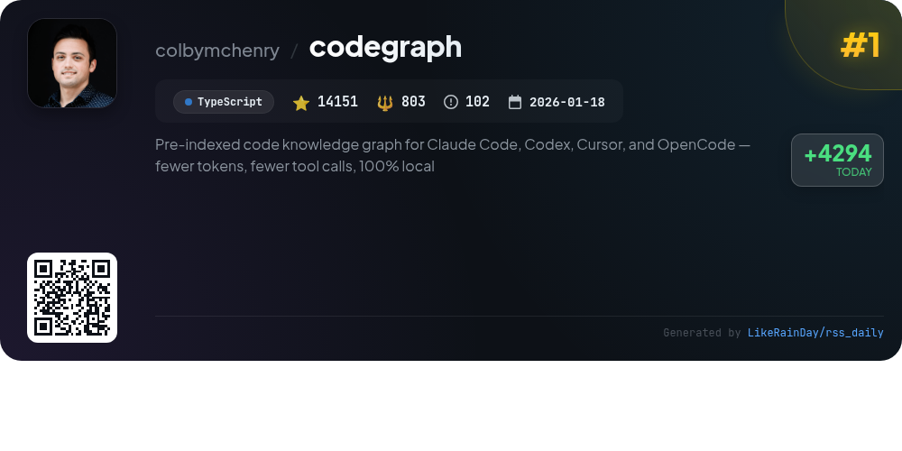
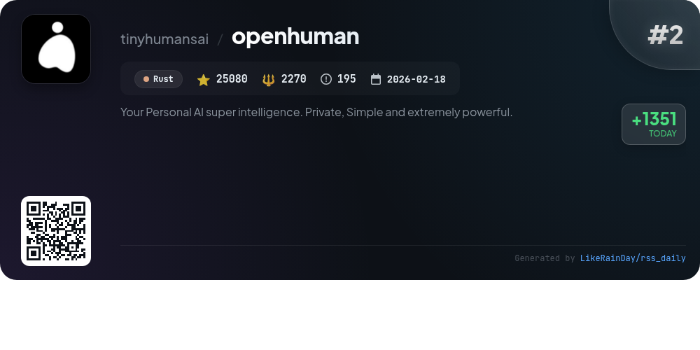
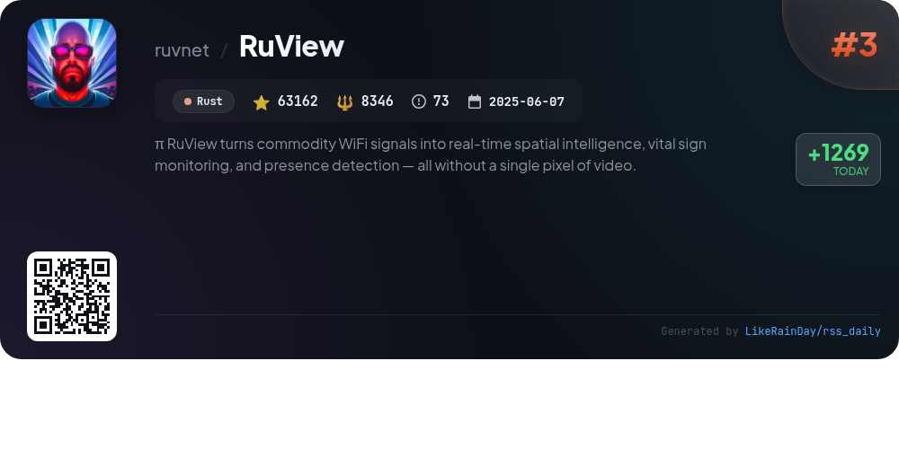
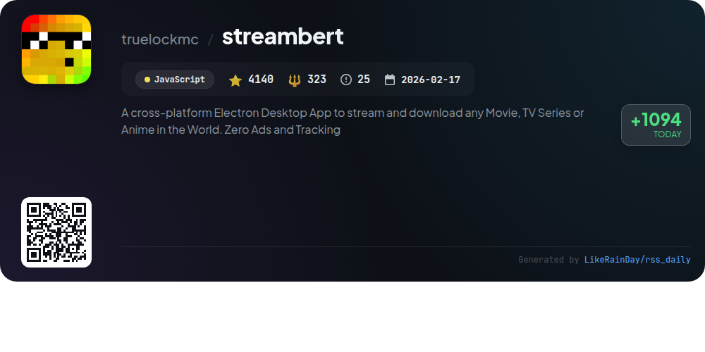
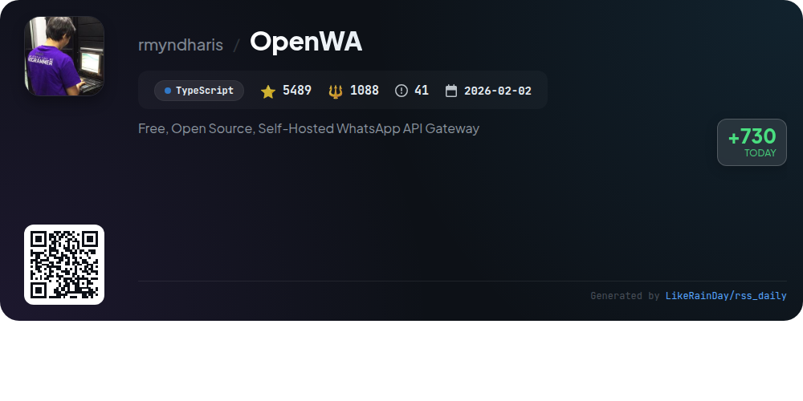
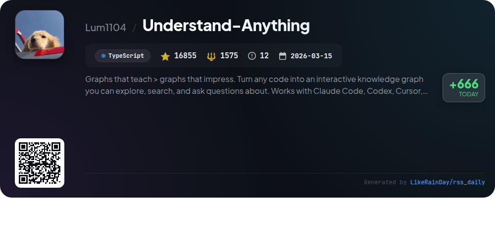
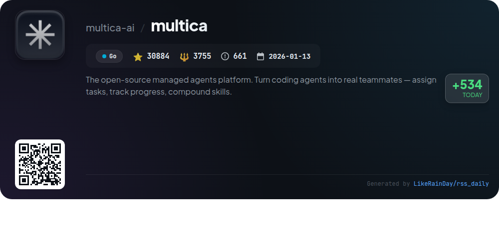
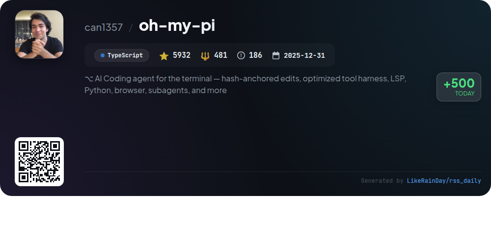
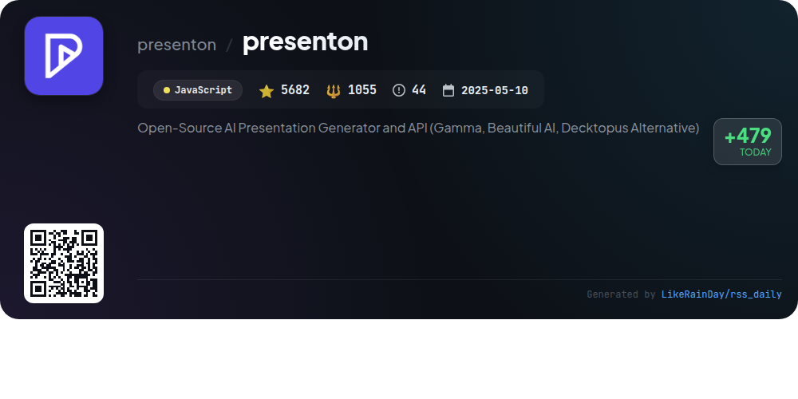

# 📊 🌟 GitHub Trending Daily - 2026-05-22

> > 📅 Daily Picks of GitHub Trending Repositories | Powered by Smart Algorithms

## 📋 Overview

**10** Projects | **223852** ⭐ | **22885** 🍴

**Top Languages:** `TypeScript` (4) · `Rust` (3) · `JavaScript` (2)

**Updated:** 2026-05-22 04:15 UTC

**Categories:**

- 🌟 Daily Top 10 (10 items)

---

## 🌟 Daily Top 10

### 1. [codegraph](https://github.com/colbymchenry/codegraph)

> 🤖 **Why Recommend**  
> *CodeGraph is a powerful, pre-indexed code knowledge graph designed to enhance AI coding agents like Claude Code, Codex, Cursor, and OpenCode. It significantly reduces costs (~35% cheaper), decreases token usage (up to 70% fewer), and minimizes tool calls, operating entirely locally without external services. Key features include smart context building, full-text search, impact analysis, and support for 19+ programming languages. CodeGraph keeps the graph current with real-time updates, ensuring efficient code exploration and analysis for developers.*

- ⭐ 14151 stars
- 💻 TypeScript
- 📅 Updated: 2026-05-22

### 2. [openhuman](https://github.com/tinyhumansai/openhuman)

> 🤖 **Why Recommend**  
> *OpenHuman is a powerful open-source personal AI assistant built in Rust, designed for seamless integration into daily life. Key features include a user-friendly UI, over 118 third-party integrations (e.g., Gmail, Notion), a local-first memory tree for data management, and auto-fetching capabilities to keep information up-to-date. It includes built-in tools for web search, coding, and voice interaction, while prioritizing privacy and security. Currently in early beta, OpenHuman aims to provide a contextual and intelligent experience without long training periods.*

- ⭐ 25080 stars
- 💻 Rust
- 📅 Updated: 2026-05-22

### 3. [RuView](https://github.com/ruvnet/RuView)

> 🤖 **Why Recommend**  
> *RuView is an innovative WiFi sensing platform that converts standard WiFi signals into real-time spatial intelligence, vital sign monitoring, and occupancy detection without using cameras. Key features include contactless detection of breathing and heart rate, activity recognition, and environment mapping through low-cost ESP32 sensors. The system operates entirely on edge hardware, ensuring privacy and eliminating the need for cloud services. With a robust module catalog, RuView supports diverse applications in healthcare, retail, and security, making it a versatile solution for modern sensing needs.*

- ⭐ 63162 stars
- 💻 Rust
- 📅 Updated: 2026-05-22

### 4. [streambert](https://github.com/truelockmc/streambert)

> 🤖 **Why Recommend**  
> *Streambert is a cross-platform Electron desktop app designed for streaming and downloading movies, TV series, and anime without ads or tracking. With over 4,140 stars on GitHub, it offers features like fast streaming, customizable interface, subtitle management, and a library to track and manage content. Users can download media directly through sourced links and discover trending titles daily. The app prioritizes user privacy and operates as a search engine aggregator, ensuring compliance with copyright laws.*

- ⭐ 4140 stars
- 💻 JavaScript
- 📅 Updated: 2026-05-22

### 5. [OpenWA](https://github.com/rmyndharis/OpenWA)

> 🤖 **Why Recommend**  
> *OpenWA is a free, open-source WhatsApp API Gateway that allows developers complete control over their messaging infrastructure without vendor lock-in. Key features include a REST API, multi-session management, real-time webhooks, a modern dashboard for session and API key management, and pluggable architecture for easy integration with various databases and storage solutions. It supports text and media messaging, group management, and rate limiting, all while being Docker-ready for seamless deployment. With 5,489 stars, OpenWA is actively maintained and encourages community contributions.*

- ⭐ 5489 stars
- 💻 TypeScript
- 📅 Updated: 2026-05-22

### 6. [Understand-Anything](https://github.com/Lum1104/Understand-Anything)

> 🤖 **Why Recommend**  
> *Understand-Anything is a TypeScript project that transforms any codebase into an interactive knowledge graph, enabling exploration, searching, and inquiry. Key features include guided tours, fuzzy search, and impact analysis, helping users understand business logic and architectural layers. It supports multiple AI coding platforms like Claude Code, Codex, and GitHub Copilot. The tool's multi-agent pipeline analyzes projects comprehensively, making it ideal for onboarding and enhancing team collaboration. With over 16,800 stars, it emphasizes learning over complexity.*

- ⭐ 16855 stars
- 💻 TypeScript
- 📅 Updated: 2026-05-22

### 7. [rtk](https://github.com/rtk-ai/rtk)

> 🤖 **Why Recommend**  
> *RTK (Rust Token Killer) is a high-performance CLI proxy that reduces LLM token consumption by 60-90% on common developer commands, packaged as a single Rust binary with zero dependencies. It filters and compresses command outputs for over 100 supported commands, achieving significant token savings with less than 10ms overhead. Key features include smart filtering, grouping, truncation, and deduplication of outputs. RTK supports 13 AI coding tools and offers installation via Homebrew or Cargo. It provides analytics for token savings and can automatically rewrite commands for seamless integration.*

- ⭐ 52477 stars
- 💻 Rust
- 📅 Updated: 2026-05-22

### 8. [multica](https://github.com/multica-ai/multica)

> 🤖 **Why Recommend**  
> *The open-source managed agents platform. Turn coding agents into real teammates — assign tasks, track progress, compound skills.. popular project, actively maintained, recently updated*

- ⭐ 30884 stars
- 🍴 3755 forks
- 💻 Go
- 📅 Updated: 2026-05-22

### 9. [oh-my-pi](https://github.com/can1357/oh-my-pi)

> 🤖 **Why Recommend**  
> *oh-my-pi is an AI coding agent designed for terminal use, offering hash-anchored edits, optimized tool harnessing, and support for LSP and DAP. With over 40 providers and 32 built-in tools, it excels in code execution, real-time debugging, and memory management. Key features include first-class subagents for task distribution, a browser tool for web interactions, and seamless integration with GitHub. Built on Rust and TypeScript, it provides a terminal-first UX while being extensible and customizable. Ideal for developers seeking an advanced coding assistant.*

- ⭐ 5932 stars
- 💻 TypeScript
- 📅 Updated: 2026-05-22

### 10. [presenton](https://github.com/presenton/presenton)

> 🤖 **Why Recommend**  
> *Presenton is an open-source AI presentation generator and API, offering a robust alternative to platforms like Gamma and Beautiful AI. Key features include self-hosted or desktop deployment, support for multiple AI models (OpenAI, Gemini, etc.), and fully editable PPTX exports. Users can create custom templates, generate presentations from prompts, and utilize a built-in API for integration. With no subscription fees and complete data control, Presenton is ideal for privacy-conscious users. The project boasts over 5,600 stars on GitHub, reflecting its growing popularity in the open-source community.*

- ⭐ 5682 stars
- 💻 JavaScript
- 📅 Updated: 2026-05-22

---

## 📡 RSS Subscription

Subscribe via RSS to get daily trending updates:

- 🔔 [RSS XML] (../../daily-top.xml)
- 🔔 [Daily Report] (../../GITHUB_TODAY.md)
- 🔔 [Daily Top 10](../../daily-top.xml)

---

*⚡ Powered by Smart Trending Algorithm | Generated at 2026-05-22 04:15:33 UTC
