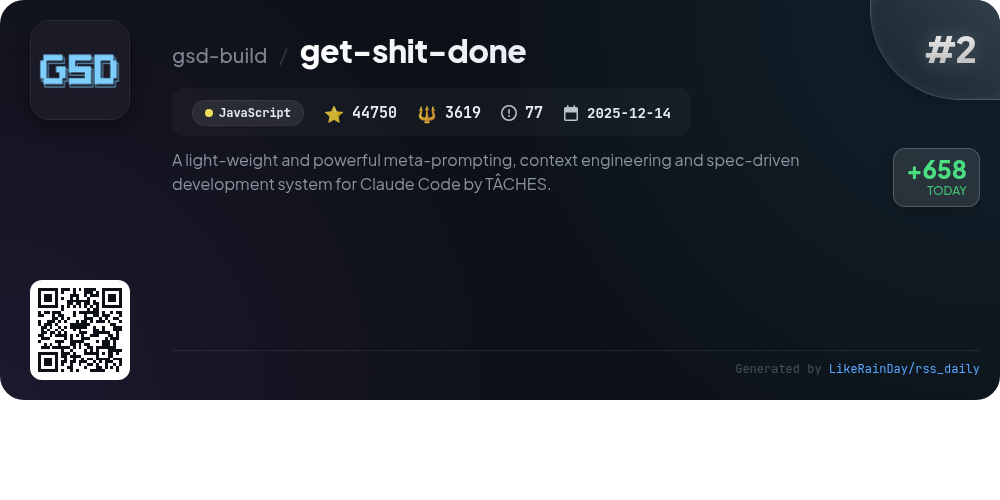
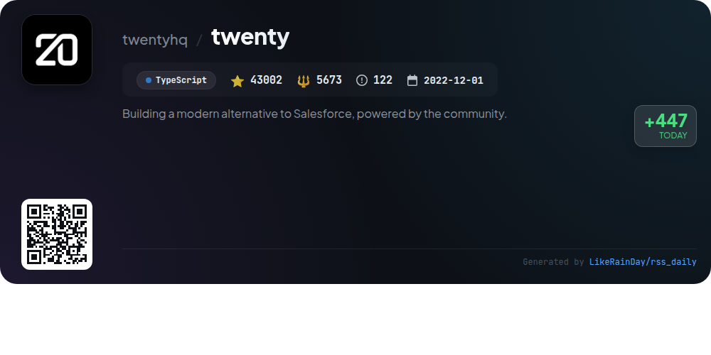
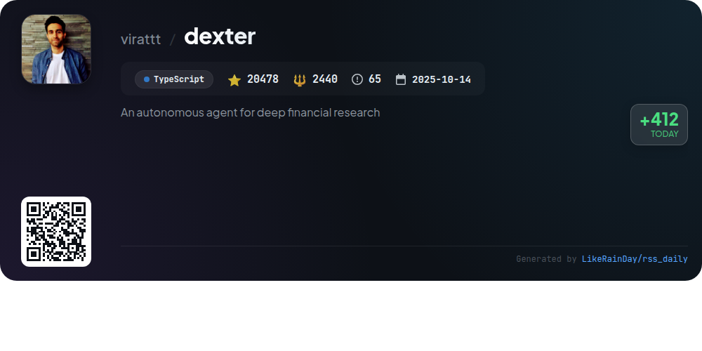
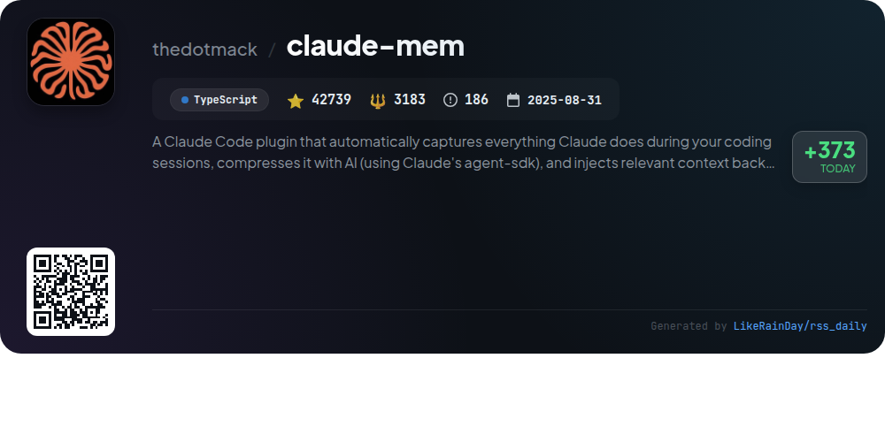
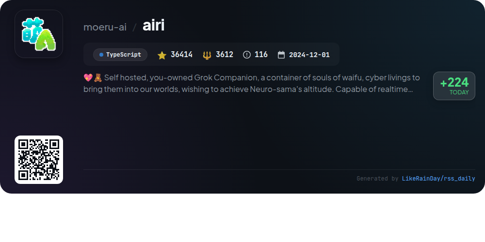
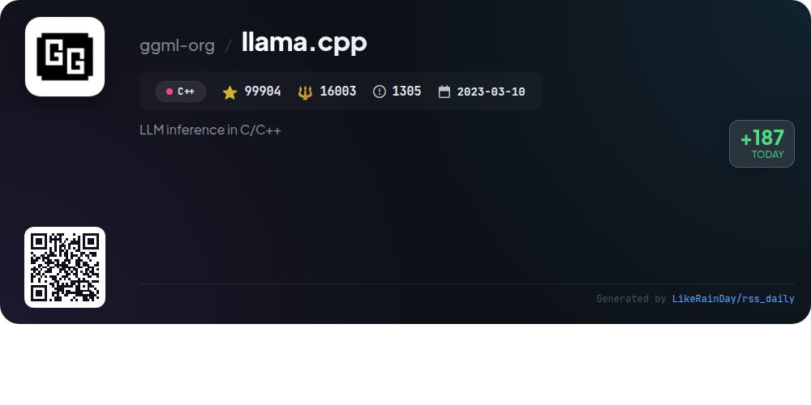
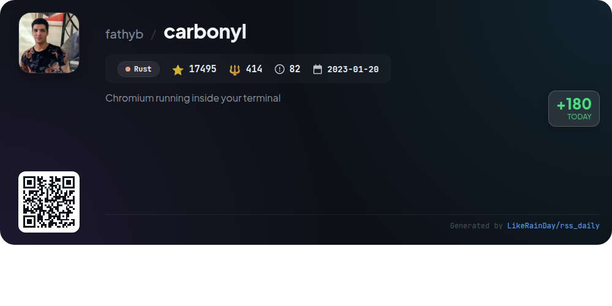
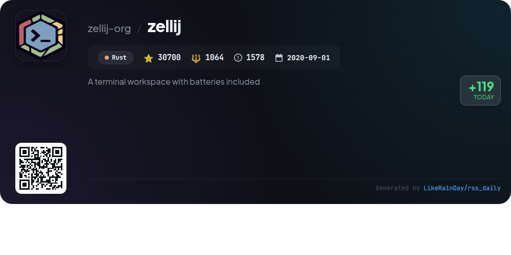

# 📊 🌟 GitHub Trending Daily - 2026-03-30

> > 📅 Daily Picks of GitHub Trending Repositories | Powered by Smart Algorithms

## 📋 Overview

**10** Projects | **383478** ⭐ | **42773** 🍴

**Top Languages:** `TypeScript` (5) · `Rust` (2) · `Swift` (1)

**Updated:** 2026-03-30 03:22 UTC

**Categories:**

- 🌟 Daily Top 10 (10 items)

---

## 🌟 Daily Top 10

### 1. [learn-claude-code](https://github.com/shareAI-lab/learn-claude-code)

> 🤖 **Why Recommend**  
> *Learn Claude Code is a TypeScript project focused on harness engineering for AI agents, emphasizing that the agent itself is a trained model, not just code or prompts. With over 42,000 stars, it offers a structured learning path through 12 sessions, teaching users how to build effective agent harnesses that provide tools, knowledge, and context. Key features include task management, background processing, and team coordination, showcasing how to create adaptable environments for agents across various domains. The project aims to empower developers to create intelligent systems by mastering harness design.*

- ⭐ 42913 stars
- 💻 TypeScript
- 📅 Updated: 2026-03-30

### 2. [get-shit-done](https://github.com/gsd-build/get-shit-done)

> 🤖 **Why Recommend**  
> *Get Shit Done (GSD) is a lightweight meta-prompting and context engineering system designed for Claude Code and other AI coding platforms. With 44,750 stars on GitHub, it effectively combats context rot, ensuring high-quality outputs. GSD features a streamlined workflow that includes project initialization, phase discussion, planning, execution, and verification, all while maintaining fresh context. It supports multiple runtimes, automates tasks, and offers atomic Git commits for clear project history. Trusted by engineers at major tech companies, GSD simplifies the development process for creators.*

- ⭐ 44750 stars
- 💻 JavaScript
- 📅 Updated: 2026-03-30

### 3. [FineTune](https://github.com/ronitsingh10/FineTune)

> 🤖 **Why Recommend**  
> *FineTune is a free and open-source macOS menu bar app designed for per-app volume control, audio routing, and a 10-band equalizer. Key features include independent volume sliders for each app, volume boost options (up to 4x), multi-device audio output, and headphone correction with a comprehensive EQ. Users can manage Bluetooth devices, monitor microphone levels, and automate settings via URL schemes. With over 5,000 stars on GitHub, FineTune provides a powerful alternative to SoundSource, enhancing audio control on macOS.*

- ⭐ 5083 stars
- 💻 Swift
- 📅 Updated: 2026-03-30

### 4. [twenty](https://github.com/twentyhq/twenty)

> 🤖 **Why Recommend**  
> *Twenty is an open-source CRM designed as a modern alternative to Salesforce, emphasizing affordability and user empowerment. With 43,002 stars on GitHub, it boasts features like customizable layouts, object management, role-based permissions, and workflow automation. Built using TypeScript, NestJS, and React, it offers a fresh user experience inspired by contemporary tools. The community-driven project allows for plugin development, fostering an ecosystem of collaboration. Key services include self-hosting capabilities, extensive documentation, and an active Discord community for support.*

- ⭐ 43002 stars
- 💻 TypeScript
- 📅 Updated: 2026-03-30

### 5. [dexter](https://github.com/virattt/dexter)

> 🤖 **Why Recommend**  
> *Dexter is an autonomous financial research agent designed to analyze complex financial queries using real-time market data. Key features include intelligent task planning, autonomous execution of data-gathering tools, and self-validation to ensure accuracy. It provides access to detailed financial statements and includes safety measures like loop detection. Users can interact with Dexter via WhatsApp for seamless research queries. With over 20,000 stars on GitHub, Dexter offers a robust platform for deep financial research and analysis.*

- ⭐ 20478 stars
- 💻 TypeScript
- 📅 Updated: 2026-03-30

### 6. [claude-mem](https://github.com/thedotmack/claude-mem)

> 🤖 **Why Recommend**  
> *Claude-Mem is a powerful plugin for Claude Code that enhances coding sessions by automatically capturing tool usage, generating AI-compressed summaries, and injecting relevant context into future sessions. Key features include persistent memory, skill-based search, a web viewer UI for real-time memory access, and privacy controls. It integrates seamlessly with OpenClaw, allowing for easy installation and setup. With functionalities like automatic operation, context configuration, and citation support, Claude-Mem ensures continuity and efficiency in project development. The project is built with TypeScript and has gained significant traction with over 42,000 stars on GitHub.*

- ⭐ 42739 stars
- 💻 TypeScript
- 📅 Updated: 2026-03-30

### 7. [airi](https://github.com/moeru-ai/airi)

> 🤖 **Why Recommend**  
> *AIRI is a self-hosted AI companion project that recreates Neuro-sama, providing users with a virtual character capable of real-time voice chat and gaming experiences in titles like Minecraft and Factorio. It supports multiple platforms, including web, macOS, and Windows, and allows users to engage in interactive chat and gameplay. Key features include advanced speech recognition, voice synthesis, and memory systems for personalized interactions. With a focus on community development and open-source contributions, AIRI aims to enhance the user experience in the realm of digital companionship.*

- ⭐ 36414 stars
- 💻 TypeScript
- 📅 Updated: 2026-03-30

### 8. [llama.cpp](https://github.com/ggml-org/llama.cpp)

> 🤖 **Why Recommend**  
> *llama.cpp is a high-performance C/C++ library for large language model (LLM) inference, boasting over 99,000 stars on GitHub. Key features include minimal setup, multi-platform support (Apple Silicon, x86, RISC-V), and various integer quantization methods for efficiency. It offers a simple CLI, a REST API for OpenAI compatibility, and multimodal capabilities. Users can leverage Hugging Face integration for model management, and it supports numerous backends like CUDA and Vulkan. The project encourages contributions and supports a wide array of models, including LLaMA and GPT variants.*

- ⭐ 99904 stars
- 💻 C++
- 📅 Updated: 2026-03-30

### 9. [carbonyl](https://github.com/fathyb/carbonyl)

> 🤖 **Why Recommend**  
> *Carbonyl is a terminal-based web browser built on Chromium, designed for fast performance and low resource consumption. It supports a wide range of Web APIs, including WebGL and media playback, and operates without a window server, making it suitable for SSH sessions. Key features include sub-second startup time, 60 FPS rendering, and 0% CPU idle usage. Carbonyl is available for Linux and macOS, with easy installation via Docker or npm. Originally derived from html2svg, it aims to provide a modern browsing experience directly in the terminal.*

- ⭐ 17495 stars
- 💻 Rust
- 📅 Updated: 2026-03-30

### 10. [zellij](https://github.com/zellij-org/zellij)

> 🤖 **Why Recommend**  
> *Zellij is a powerful terminal workspace designed for developers and ops professionals, featuring an intuitive user experience with built-in tools. It supports deep customization, personal automation via layouts, and true multiplayer collaboration. Key features include unique UX elements like floating and stacked panes, a plugin system for WebAssembly-based extensions, and a built-in web client. With over 30,700 stars on GitHub, Zellij emphasizes simplicity without sacrificing functionality, making it suitable for both beginners and advanced users. Explore installation, tutorials, and documentation at zellij.dev.*

- ⭐ 30700 stars
- 💻 Rust
- 📅 Updated: 2026-03-30

---

## 📡 RSS Subscription

Subscribe via RSS to get daily trending updates:

- 🔔 [RSS XML] (../../daily-top.xml)
- 🔔 [Daily Report] (../../GITHUB_TODAY.md)
- 🔔 [Daily Top 10](../../daily-top.xml)

---

*⚡ Powered by Smart Trending Algorithm | Generated at 2026-03-30 03:22:41 UTC
