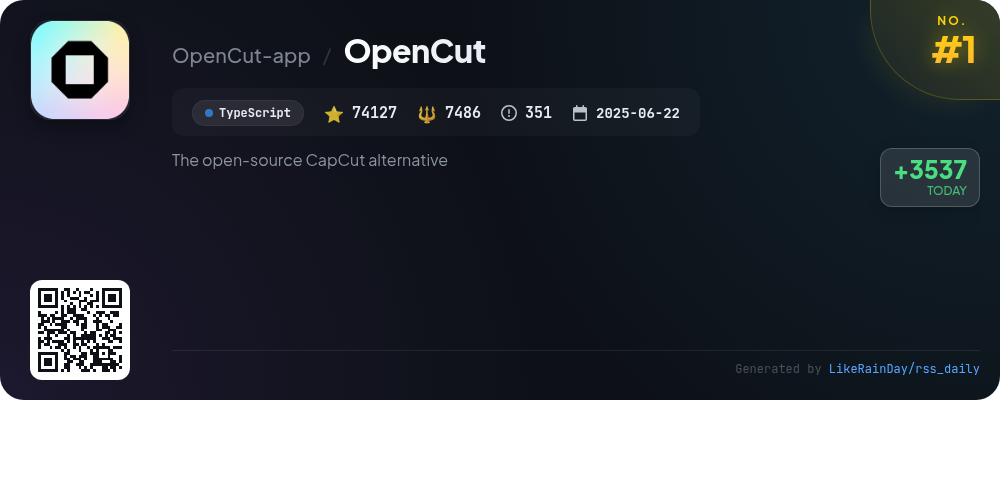
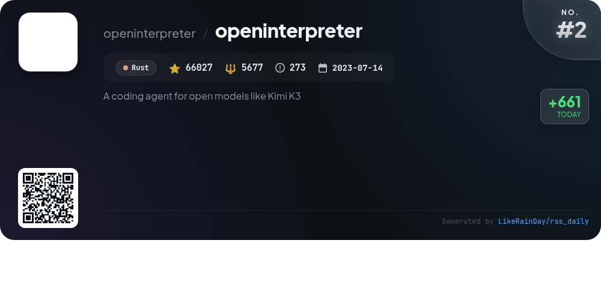
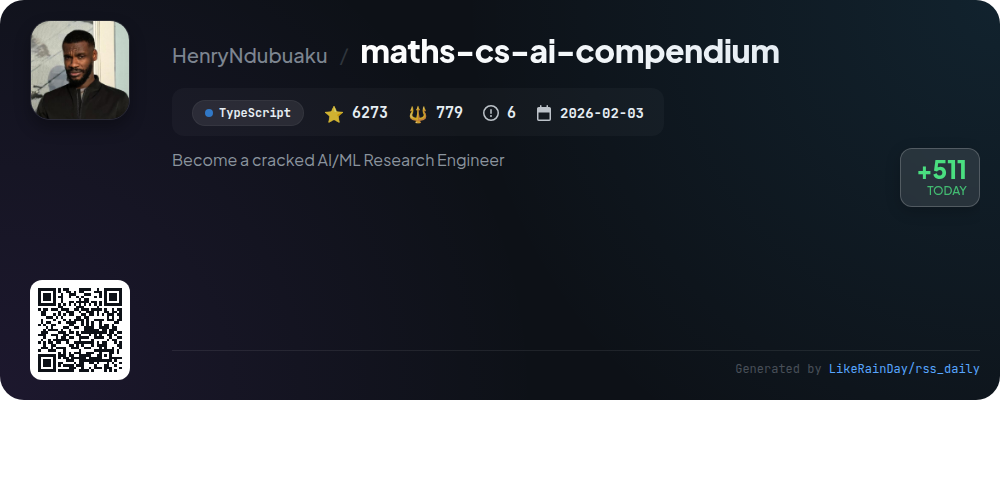
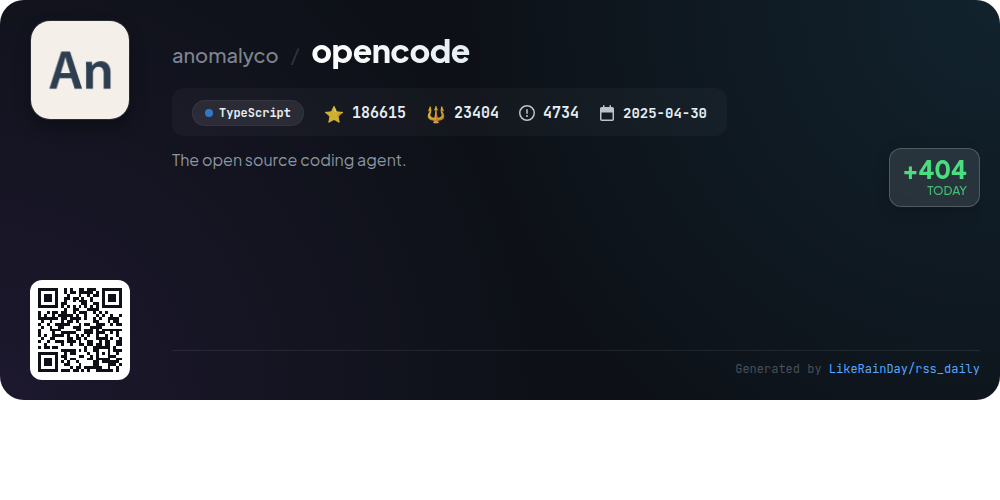
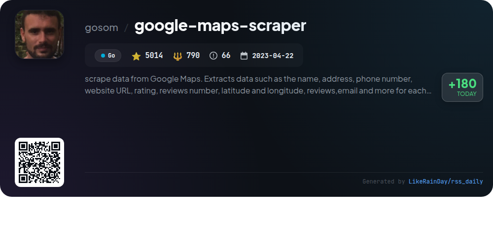
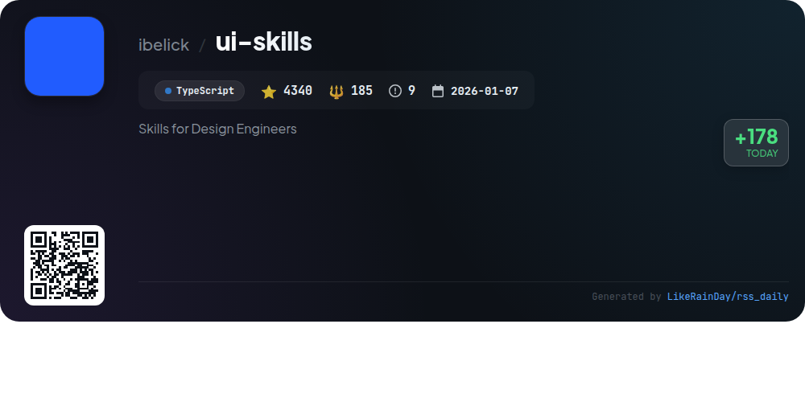

# 📊 🌟 GitHub Trending Daily - 2026-07-17

> > 📅 Daily Picks of GitHub Trending Repositories | Powered by Smart Algorithms

## 📋 Overview

**10** Projects | **565114** ⭐ | **68885** 🍴

**Top Languages:** `TypeScript` (5) · `Rust` (2) · `Go` (2)

**Updated:** 2026-07-17 03:22 UTC

**Categories:**

- 🌟 Daily Top 10 (10 items)

---

## 🌟 Daily Top 10

### 1. [OpenCut](https://github.com/OpenCut-app/OpenCut)

> 🤖 **Why Recommend**  
> *OpenCut is an open-source video editing platform designed for web, desktop, and mobile, currently in a complete rewrite to enhance its capabilities. Key features include a robust Editor API, support for third-party plugins, and a unified codebase leveraging Rust. Upcoming functionalities will feature a headless mode for automation, batch rendering, and a scripting tab within the editor. The project has garnered significant interest, with over 74,000 stars on GitHub, and is supported by sponsors like fal.ai. Join the community on Discord for updates and discussions.*

- ⭐ 74127 stars
- 💻 TypeScript
- 📅 Updated: 2026-07-17

### 2. [openinterpreter](https://github.com/openinterpreter/openinterpreter)

> 🤖 **Why Recommend**  
> *Open Interpreter is a Rust-based coding agent optimized for low-cost models, particularly Kimi K3, offering a Codex-like interface. It features a versatile harness system allowing users to switch between various model providers and harnesses via a command-line interface. Key functionalities include running commands in a secure environment across macOS, Linux, and Windows, testing web and native apps, and compatibility with ACP and Codex SDK. The project boasts extensive documentation for installation, configuration, and usage, making it accessible for developers.*

- ⭐ 66027 stars
- 💻 Rust
- 📅 Updated: 2026-07-17

### 3. [marketingskills](https://github.com/coreyhaines31/marketingskills)

> 🤖 **Why Recommend**  
> *The "marketingskills" project offers a comprehensive collection of AI agent skills tailored for marketing tasks, including conversion optimization, copywriting, SEO, analytics, and growth engineering. Built for technical marketers, it integrates seamlessly with Claude Code and other AI agents, following the Agent Skills spec. Key features include a modular skill system, enabling agents to leverage specialized workflows for various marketing functions. Additionally, the project provides resources for hands-on help, training, and marketing strategy development, making it a valuable tool for enhancing AI-driven marketing efforts.*

- ⭐ 40224 stars
- 💻 JavaScript
- 📅 Updated: 2026-07-17

### 4. [maths-cs-ai-compendium](https://github.com/HenryNdubuaku/maths-cs-ai-compendium)

> 🤖 **Why Recommend**  
> *The Maths, CS & AI Compendium is an open, unconventional textbook designed for practitioners eager to understand mathematics, computing, and AI from the ground up. It covers 18 chapters, including vectors, calculus, machine learning, and production software engineering, providing intuitive explanations and real-world context. The repository also features an MCP server for AI assistants to utilize the compendium as a knowledge base. With 6,273 stars, it aims to enhance learning through structured content and practical study techniques, fostering deeper comprehension in these fast-evolving fields.*

- ⭐ 6273 stars
- 💻 TypeScript
- 📅 Updated: 2026-07-17

### 5. [opencode](https://github.com/anomalyco/opencode)

> 🤖 **Why Recommend**  
> *OpenCode is an open-source AI coding agent designed to enhance software development. Built in TypeScript, it features two primary agents: a full-access "build" agent for development and a read-only "plan" agent for code exploration. Installation is straightforward via various package managers or as a desktop app for macOS, Windows, and Linux. OpenCode supports a wide range of languages and encourages community contributions. Key highlights include its user-friendly terminal UI, complex search capabilities with a general subagent, and comprehensive documentation available online. Join the community on Discord for support and collaboration.*

- ⭐ 186615 stars
- 💻 TypeScript
- 📅 Updated: 2026-07-17

### 6. [airi](https://github.com/moeru-ai/airi)

> 🤖 **Why Recommend**  
> *AIRI is a self-hosted Grok Companion that allows users to own a digital assistant inspired by Neuro-sama. This TypeScript-based project supports real-time voice chat and enables users to engage in gaming experiences with titles like Minecraft and Factorio across web, macOS, and Windows platforms. With capabilities like multi-provider voice synthesis, VRM and Live2D model support, and advanced AI interactions, AIRI aims to redefine digital companionship. It encourages community contributions, fostering a vibrant ecosystem for developers and users alike.*

- ⭐ 42769 stars
- 💻 TypeScript
- 📅 Updated: 2026-07-17

### 7. [codex](https://github.com/openai/codex)

> 🤖 **Why Recommend**  
> *Codex is a lightweight coding agent by OpenAI that runs locally in your terminal, designed for seamless integration with your workflow. With over 98,000 stars on GitHub, it offers installation via various methods, including npm and Homebrew. Users can access Codex through desktop apps or IDEs like VS Code. To enhance functionality, signing in with a ChatGPT plan is recommended, providing access to advanced coding features. Comprehensive documentation and contributing guidelines are available, making it a valuable tool for developers looking to streamline coding tasks.*

- ⭐ 98907 stars
- 💻 Rust
- 📅 Updated: 2026-07-17

### 8. [google-maps-scraper](https://github.com/gosom/google-maps-scraper)

> 🤖 **Why Recommend**  
> *The Google Maps Scraper is an open-source tool in Go that extracts comprehensive business data from Google Maps, including names, addresses, phone numbers, website URLs, ratings, reviews, and geographic coordinates. With over 5,000 stars, it supports multiple interfaces: Command Line, Web UI, and REST API, enabling users to collect data efficiently for lead generation, research, and automation. Key features include proxy support, email extraction, and direct integration with LeadsDB for data management. Its scalable architecture accommodates everything from single machines to Kubernetes clusters.*

- ⭐ 5014 stars
- 💻 Go
- 📅 Updated: 2026-07-17

### 9. [ui-skills](https://github.com/ibelick/ui-skills)

> 🤖 **Why Recommend**  
> *UI Skills is a TypeScript-based project designed to enhance the skill set of Design Engineers. With 4,340 stars, it offers a command-line interface (CLI) that allows users to navigate various UI skill categories and execute tasks efficiently. Key features include routing agents through tailored UI skills, listing skills by category, and accessing baseline UI components. For quick access, users can run commands like `npx ui-skills start` and `npx ui-skills list --category motion`. More information is available at ui-skills.com. The project is licensed under the MIT license.*

- ⭐ 4340 stars
- 💻 TypeScript
- 📅 Updated: 2026-07-17

### 10. [multica](https://github.com/multica-ai/multica)

> 🤖 **Why Recommend**  
> *The open-source managed agents platform. Turn coding agents into real teammates — assign tasks, track progress, compound skills.. popular project, actively maintained, recently updated*

- ⭐ 40818 stars
- 🍴 5149 forks
- 💻 Go
- 📅 Updated: 2026-07-17

---

## 📡 RSS Subscription

Subscribe via RSS to get daily trending updates:

- 🔔 [RSS XML] (../../daily-top.xml)
- 🔔 [Daily Report] (../../GITHUB_TODAY.md)
- 🔔 [Daily Top 10](../../daily-top.xml)

---

*⚡ Powered by Smart Trending Algorithm | Generated at 2026-07-17 03:22:04 UTC
