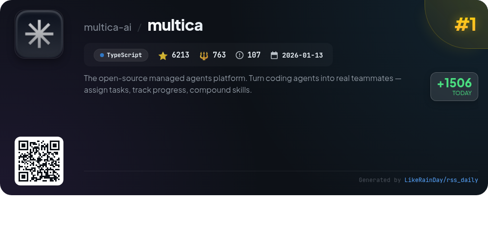
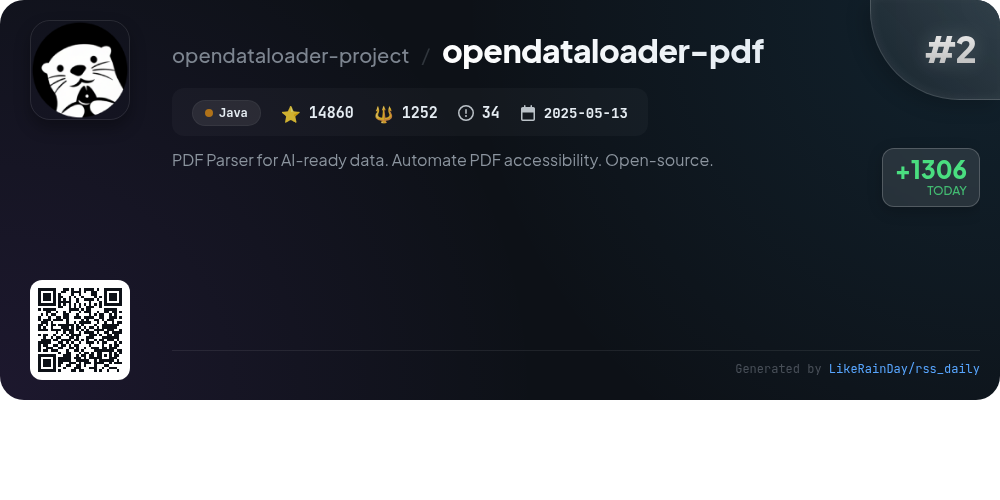
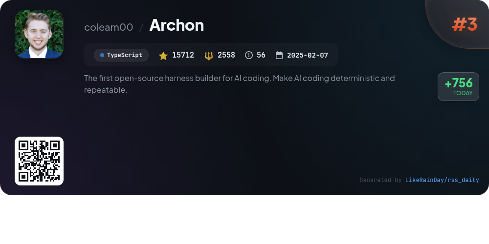
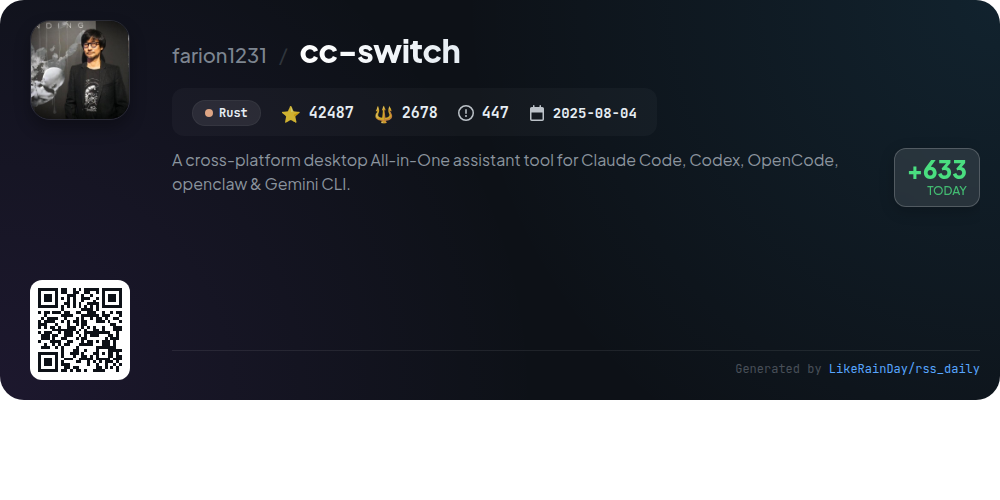
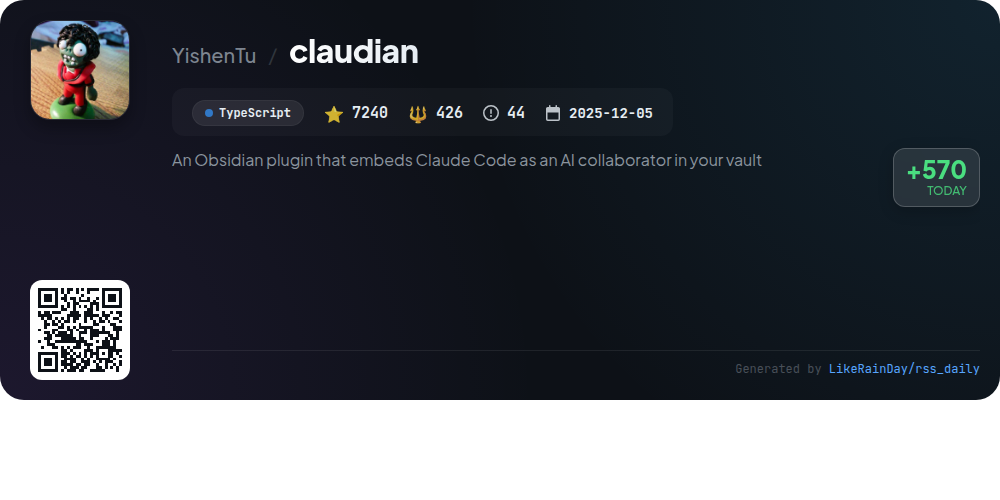
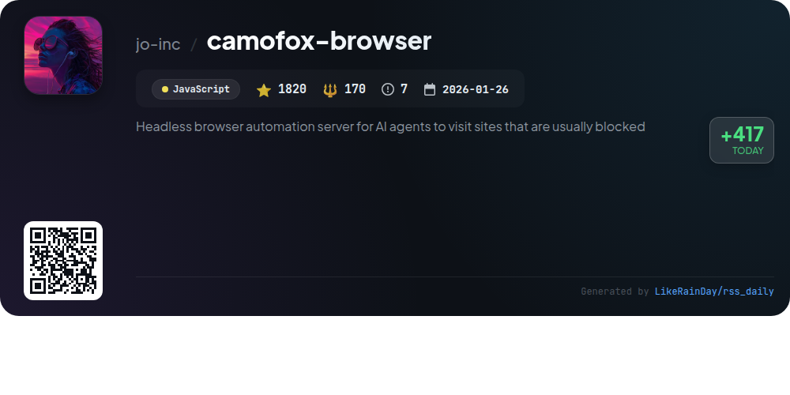
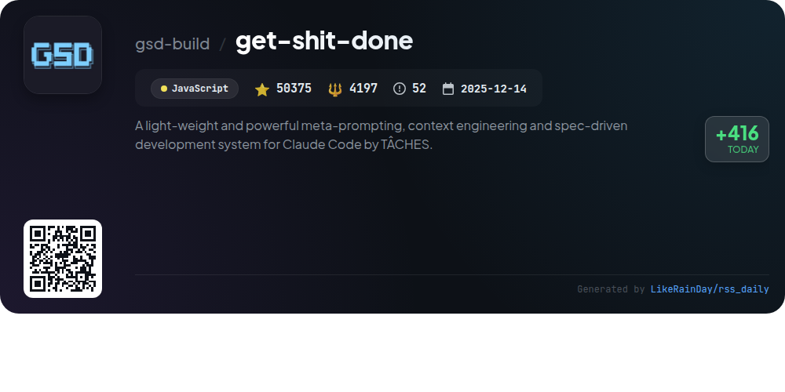
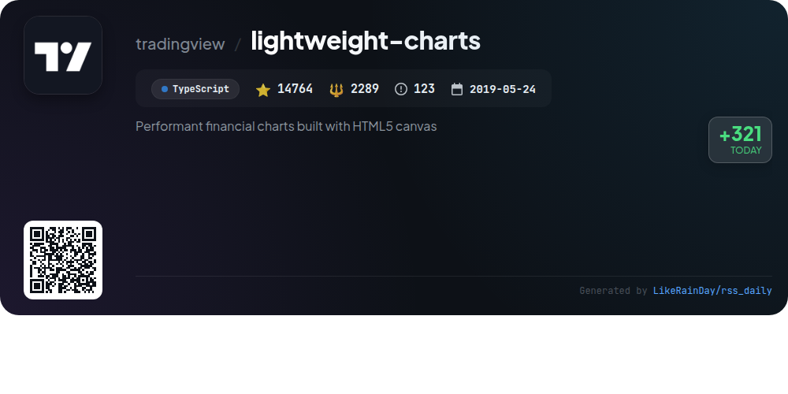

# 📊 🌟 GitHub Trending Daily - 2026-04-11

> > 📅 Daily Picks of GitHub Trending Repositories | Powered by Smart Algorithms

## 📋 Overview

**10** Projects | **183485** ⭐ | **16240** 🍴

**Top Languages:** `TypeScript` (5) · `JavaScript` (3) · `Java` (1)

**Updated:** 2026-04-11 02:50 UTC

**Categories:**

- 🌟 Daily Top 10 (10 items)

---

## 🌟 Daily Top 10

### 1. [multica](https://github.com/multica-ai/multica)

> 🤖 **Why Recommend**  
> *Multica is an open-source managed agents platform designed to integrate coding agents as teammates in software development. With 6,213 stars on GitHub, it allows users to assign tasks, track progress, and leverage reusable skills. Key features include autonomous execution of tasks, a unified dashboard for monitoring, and multi-workspace support for team organization. Compatible with various agent providers like Claude Code and Codex, Multica offers both cloud and self-hosting options, streamlining collaboration between humans and AI in coding environments.*

- ⭐ 6213 stars
- 💻 TypeScript
- 📅 Updated: 2026-04-11

### 2. [opendataloader-pdf](https://github.com/opendataloader-project/opendataloader-pdf)

> 🤖 **Why Recommend**  
> *OpenDataLoader PDF is an open-source PDF parser designed for AI-ready data extraction and automated PDF accessibility. It enables users to extract structured data in Markdown, JSON, and HTML formats, achieving the highest benchmark accuracy (0.907) in complex document parsing. Key features include built-in OCR, hybrid processing for tables and images, and auto-tagging for creating Tagged PDFs, with compliance to the Well-Tagged PDF specification. The tool supports multiple programming languages (Python, Node.js, Java) and aims to automate accessibility compliance by 2026, making it ideal for regulatory needs.*

- ⭐ 14860 stars
- 💻 Java
- 📅 Updated: 2026-04-11

### 3. [Archon](https://github.com/coleam00/Archon)

> 🤖 **Why Recommend**  
> *Archon is the first open-source harness builder for AI coding, enabling deterministic and repeatable workflows. It allows developers to define their processes as YAML workflows, incorporating both AI and deterministic nodes for planning, implementation, validation, code review, and PR creation. Key features include isolated workflow runs, composability of tasks, and multi-platform support via CLI, Web UI, Slack, and more. With 17 pre-built workflows for common tasks, Archon streamlines software development while maintaining control over the coding process.*

- ⭐ 15712 stars
- 💻 TypeScript
- 📅 Updated: 2026-04-11

### 4. [cc-switch](https://github.com/farion1231/cc-switch)

> 🤖 **Why Recommend**  
> *CC Switch is a cross-platform desktop assistant tool designed to manage multiple CLI tools, including Claude Code, Codex, Gemini CLI, OpenCode, and OpenClaw. With over 42,000 stars on GitHub, it simplifies API provider management through a unified interface, eliminating manual config edits. Key features include 50+ built-in provider presets, cloud sync across devices, session management, and a usage dashboard for cost tracking. Built on Rust with Tauri for cross-platform support, CC Switch enhances productivity for developers by streamlining AI-powered coding workflows.*

- ⭐ 42487 stars
- 💻 Rust
- 📅 Updated: 2026-04-11

### 5. [claudian](https://github.com/YishenTu/claudian)

> 🤖 **Why Recommend**  
> *An Obsidian plugin that embeds Claude Code as an AI collaborator in your vault. popular project, actively maintained, recently updated*

- ⭐ 7240 stars
- 🍴 426 forks
- 💻 TypeScript
- 📅 Updated: 2026-04-11

### 6. [rowboat](https://github.com/rowboatlabs/rowboat)

> 🤖 **Why Recommend**  
> *Rowboat is an open-source AI coworker designed to enhance productivity by creating a long-lived knowledge graph from your work context. Key features include email and calendar integration, meeting preparation with summaries, document and presentation generation, and live notes tracking. It maintains all data locally in a Markdown vault, ensuring privacy and control. Users can extend its functionality with external tools via the Model Context Protocol (MCP). With 11,773 stars on GitHub, Rowboat offers a unique, memory-driven approach to AI assistance, empowering users to manage tasks efficiently.*

- ⭐ 11773 stars
- 💻 TypeScript
- 📅 Updated: 2026-04-11

### 7. [impeccable](https://github.com/pbakaus/impeccable)

> 🤖 **Why Recommend**  
> *Impeccable is a powerful design language tool for enhancing AI-driven frontend design, featuring 18 commands and 7 domain-specific reference files. It provides a structured approach to combat common design pitfalls with curated anti-patterns and comprehensive skills in typography, color, spatial design, and more. Users can perform audits, critiques, and final polish on their designs, ensuring high-quality outputs. The tool integrates seamlessly with various AI platforms, making it accessible for developers seeking to elevate their UI design processes. Visit impeccable.style for quick access and resources.*

- ⭐ 18241 stars
- 💻 JavaScript
- 📅 Updated: 2026-04-11

### 8. [camofox-browser](https://github.com/jo-inc/camofox-browser)

> 🤖 **Why Recommend**  
> *Camofox-browser is a headless browser automation server designed for AI agents to access typically blocked websites. Powered by Camoufox, a Firefox fork with advanced fingerprint spoofing, it offers features like C++ anti-detection, session isolation, and accessibility snapshots. Users benefit from token-efficient interactions, proxy support, and structured logging. With easy deployment via Docker and support for cookie import, it facilitates seamless browsing and interaction with sites like YouTube, Google, and Amazon, making it ideal for scalable AI applications.*

- ⭐ 1820 stars
- 💻 JavaScript
- 📅 Updated: 2026-04-11

### 9. [get-shit-done](https://github.com/gsd-build/get-shit-done)

> 🤖 **Why Recommend**  
> *get-shit-done is a lightweight meta-prompting and context engineering system for AI coding tools like Claude Code, Codex, and Copilot. With over 50,375 stars on GitHub, it addresses context rot by ensuring high-quality implementation through a structured workflow. Key features include project initialization, phase discussions, planning, execution, and verification, all with automated context management and atomic git commits. GSD is designed for solo developers seeking efficient, reliable coding without complex workflows, trusted by teams at Amazon, Google, and Shopify.*

- ⭐ 50375 stars
- 💻 JavaScript
- 📅 Updated: 2026-04-11

### 10. [lightweight-charts](https://github.com/tradingview/lightweight-charts)

> 🤖 **Why Recommend**  
> *Lightweight Charts™ is a performant financial charting library built with HTML5 canvas, designed for seamless integration into web pages without compromising loading speed. With over 14,000 stars on GitHub, it offers a compact size comparable to static images while providing interactive capabilities. Key features include a rich set of charting options, custom plugin support, and easy installation via npm or CDN. Ideal for developers looking to enhance their financial data visualization, it ensures high performance and user engagement. Explore demos and documentation for more details.*

- ⭐ 14764 stars
- 💻 TypeScript
- 📅 Updated: 2026-04-11

---

## 📡 RSS Subscription

Subscribe via RSS to get daily trending updates:

- 🔔 [RSS XML] (../../daily-top.xml)
- 🔔 [Daily Report] (../../GITHUB_TODAY.md)
- 🔔 [Daily Top 10](../../daily-top.xml)

---

*⚡ Powered by Smart Trending Algorithm | Generated at 2026-04-11 02:50:34 UTC
