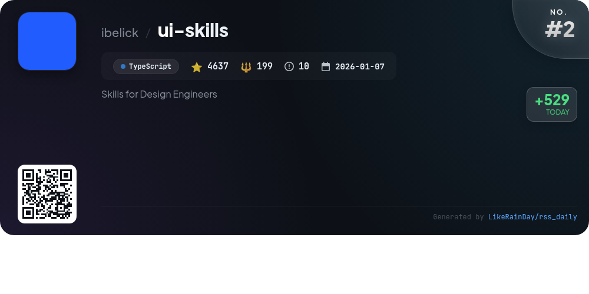
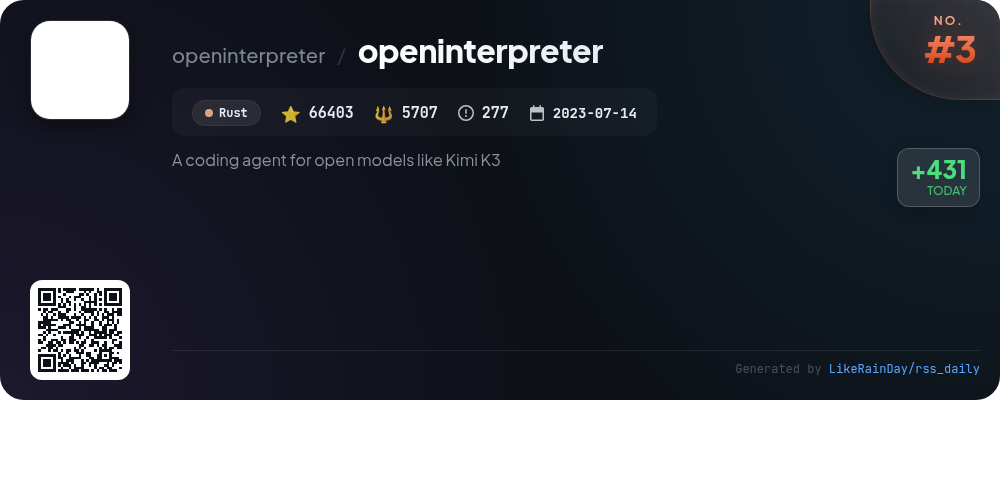
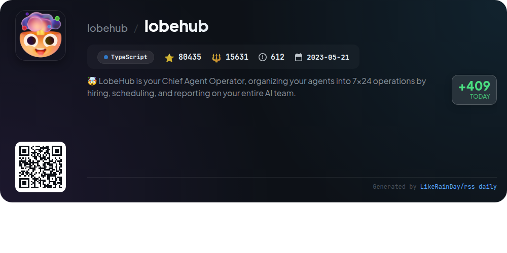
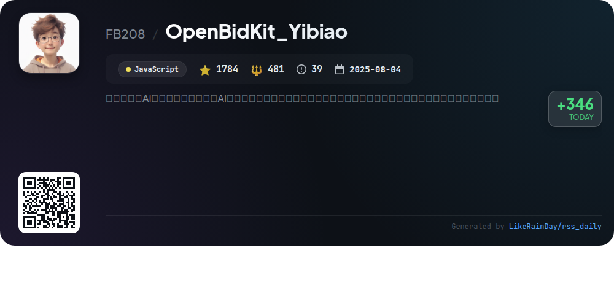
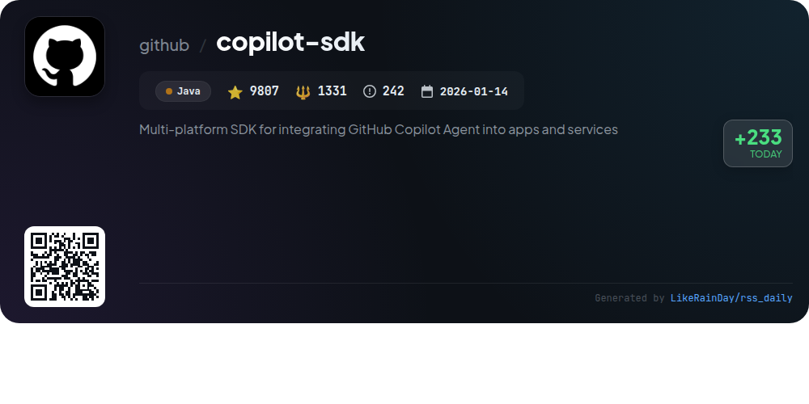

# 📊 🌟 GitHub Trending Daily - 2026-07-18

> > 📅 Daily Picks of GitHub Trending Repositories | Powered by Smart Algorithms

## 📋 Overview

**10** Projects | **592457** ⭐ | **80898** 🍴

**Top Languages:** `TypeScript` (5) · `Rust` (2) · `JavaScript` (2)

**Updated:** 2026-07-18 02:58 UTC

**Categories:**

- 🌟 Daily Top 10 (10 items)

---

## 🌟 Daily Top 10

### 1. [OpenCut](https://github.com/OpenCut-app/OpenCut)

> 🤖 **Why Recommend**  
> *OpenCut is an open-source video editor designed for web, desktop, and mobile platforms, currently being rewritten for enhanced functionality. With a focus on a plugin-first architecture, it will introduce an Editor API, support for third-party plugins, and a scripting tab within the editor. Key features include a Rust core for cross-platform compatibility, automation capabilities through a headless mode, and an MCP server for AI integration. The previous version is available at opencut-app/opencut-classic, while the new version can be followed at new.opencut.app.*

- ⭐ 74930 stars
- 💻 TypeScript
- 📅 Updated: 2026-07-18

### 2. [ui-skills](https://github.com/ibelick/ui-skills)

> 🤖 **Why Recommend**  
> *UI Skills is a TypeScript project designed for design engineers, offering a structured approach to UI skill sets. With 4,637 stars, it provides a command-line interface (CLI) that allows users to easily navigate and execute various commands, such as starting skill sets, listing categories, and retrieving baseline UI components. Users can quickly route their agents to the appropriate UI skills for specific tasks. For more information, visit [ui-skills.com](http://ui-skills.com/). The project is licensed under the MIT license.*

- ⭐ 4637 stars
- 💻 TypeScript
- 📅 Updated: 2026-07-18

### 3. [openinterpreter](https://github.com/openinterpreter/openinterpreter)

> 🤖 **Why Recommend**  
> *Open Interpreter is a Rust-based coding agent designed for low-cost models, particularly optimized for Kimi K3. It features a Codex-like interface, harness emulation for enhanced performance, and supports easy switching between various model providers. Key functionalities include command execution within sandboxed environments, web and native app testing capabilities, and compatibility with the Agent Client Protocol (ACP) for seamless integration with editors. With robust documentation and an active community, Open Interpreter enhances coding efficiency while ensuring local configuration management.*

- ⭐ 66403 stars
- 💻 Rust
- 📅 Updated: 2026-07-18

### 4. [lobehub](https://github.com/lobehub/lobehub)

> 🤖 **Why Recommend**  
> *LobeHub is an innovative platform designed to manage AI agents for 24/7 operations, streamlining hiring, scheduling, and reporting. With over 80,000 stars on GitHub, it allows users to create personalized AI teams using an intuitive Agent Builder, access a library of 10,000+ skills, and collaborate effectively through Agent Groups. LobeHub supports self-hosting with Docker and cloud services like Vercel, Alibaba Cloud, and Zeabur. Its unique features include Personal Memory for adaptive learning, enhancing productivity while ensuring users remain in control.*

- ⭐ 80435 stars
- 💻 TypeScript
- 📅 Updated: 2026-07-18

### 5. [opencode](https://github.com/anomalyco/opencode)

> 🤖 **Why Recommend**  
> *OpenCode is an open-source AI coding agent written in TypeScript, boasting 186,973 stars on GitHub. It offers a desktop application and multiple installation methods across platforms. Key features include two built-in agents: "build," for full development access, and "plan," a read-only agent ideal for code exploration. OpenCode supports complex searches through a general subagent and provides comprehensive documentation for configuration and usage. Join the community on Discord for support and collaboration.*

- ⭐ 186973 stars
- 💻 TypeScript
- 📅 Updated: 2026-07-18

### 6. [OpenBidKit_Yibiao](https://github.com/FB208/OpenBidKit_Yibiao)

> 🤖 **Why Recommend**  
> *OpenBidKit_Yibiao is an open-source AI-powered bid document writing tool designed for tendering scenarios. It offers features such as AI-generated technical solutions, document parsing, knowledge base management, bid duplication checks, and risk assessments. Supporting multiple AI APIs, including GPT and DeepSeek, it facilitates easy deployment and local processing. Its advantages include customizable AI configurations, local desktop workspace, and document recovery capabilities. The tool is available for free, aiming to provide high-quality bid writing solutions for businesses of all sizes.*

- ⭐ 1784 stars
- 💻 JavaScript
- 📅 Updated: 2026-07-18

### 7. [codex](https://github.com/openai/codex)

> 🤖 **Why Recommend**  
> *Codex is a lightweight coding agent by OpenAI that runs locally in your terminal, developed in Rust. With over 99,000 stars on GitHub, it offers seamless integration with popular IDEs like VS Code, alongside a desktop app experience. Users can easily install it via scripts or package managers like npm and Homebrew. Codex enhances coding workflows by allowing users to sign in with their ChatGPT plans, enabling advanced features. Comprehensive documentation and contributing guidelines are available, supporting an open-source community.*

- ⭐ 99176 stars
- 💻 Rust
- 📅 Updated: 2026-07-18

### 8. [open-lovable](https://github.com/firecrawl/open-lovable)

> 🤖 **Why Recommend**  
> *Open Lovable is a powerful tool that enables users to clone and recreate any website as a modern React app in seconds, leveraging AI capabilities. Developed by the Firecrawl team, it facilitates instant app building through chat interactions. Key features include support for multiple AI providers like OpenAI and Anthropic, easy setup with environment configuration, and the ability to deploy on Vercel or E2B. With 27,885 stars, it promises a seamless development experience for users looking to quickly prototype and launch web applications. For full cloud solutions, visit Lovable.dev.*

- ⭐ 27885 stars
- 💻 TypeScript
- 📅 Updated: 2026-07-18

### 9. [copilot-sdk](https://github.com/github/copilot-sdk)

> 🤖 **Why Recommend**  
> *The GitHub Copilot SDK is a multi-platform SDK designed for integrating GitHub Copilot's agentic workflows into applications across various languages including Java, Python, TypeScript, Go, .NET, and Rust. With over 9,800 stars, it provides production-tested agent runtime access, enabling developers to define agent behavior while Copilot manages planning and execution. Key features include support for custom agents and tools, the ability to use BYOK (Bring Your Own Key), and automatic management of the Copilot CLI lifecycle. Comprehensive documentation and installation guides are available for seamless integration.*

- ⭐ 9807 stars
- 💻 Java
- 📅 Updated: 2026-07-18

### 10. [marketingskills](https://github.com/coreyhaines31/marketingskills)

> 🤖 **Why Recommend**  
> *The **marketingskills** project offers a comprehensive suite of AI agent skills tailored for marketing tasks, including conversion optimization, copywriting, SEO, analytics, and growth engineering. Designed for technical marketers and founders, it seamlessly integrates with agents like Claude Code and OpenAI Codex. Key features include modular skills that enhance AI capabilities in areas like A/B testing, social media, and customer research. Additional services include hands-on support through Conversion Factory, marketing training, and the Magister autonomous CMO solution. Contributions are encouraged, fostering continuous improvement.*

- ⭐ 40427 stars
- 💻 JavaScript
- 📅 Updated: 2026-07-18

---

## 📡 RSS Subscription

Subscribe via RSS to get daily trending updates:

- 🔔 [RSS XML] (../../daily-top.xml)
- 🔔 [Daily Report] (../../GITHUB_TODAY.md)
- 🔔 [Daily Top 10](../../daily-top.xml)

---

*⚡ Powered by Smart Trending Algorithm | Generated at 2026-07-18 02:58:17 UTC
