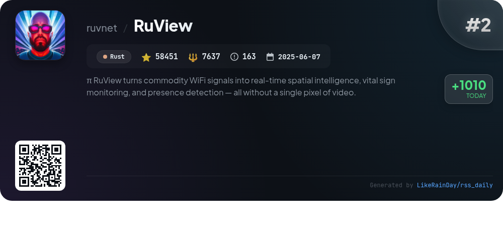
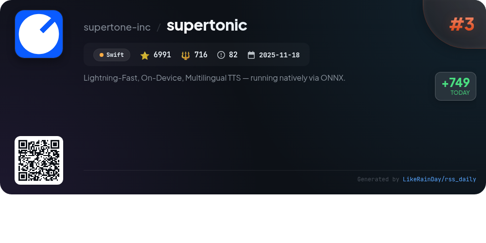
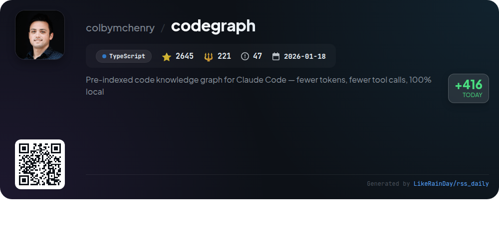
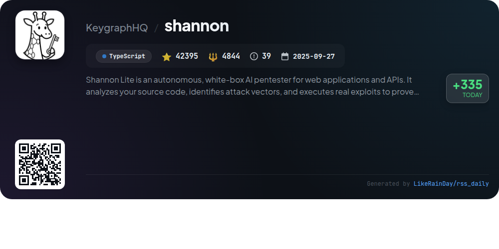
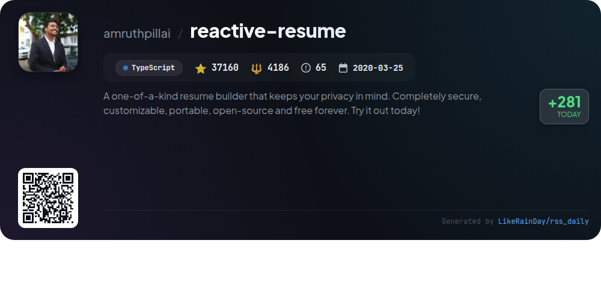

# 📊 🌟 GitHub Trending Daily - 2026-05-17

> > 📅 Daily Picks of GitHub Trending Repositories | Powered by Smart Algorithms

## 📋 Overview

**10** Projects | **474815** ⭐ | **47569** 🍴

**Top Languages:** `TypeScript` (4) · `Rust` (4) · `Swift` (1)

**Updated:** 2026-05-17 04:03 UTC

**Categories:**

- 🌟 Daily Top 10 (10 items)

---

## 🌟 Daily Top 10

### 1. [openhuman](https://github.com/tinyhumansai/openhuman)

> 🤖 **Why Recommend**  
> *OpenHuman is an open-source personal AI superintelligence designed for seamless daily integration. With over 118 third-party integrations and a UI-first approach, it enables users to connect services like Gmail and Notion effortlessly. Key features include a Memory Tree for local knowledge management, automatic data fetching every 20 minutes, and built-in tools for web search and coding. OpenHuman prioritizes privacy with on-device data storage and encryption, all while minimizing vendor sprawl and setup complexity. Currently in early beta, it promises a powerful and personalized AI experience.*

- ⭐ 10973 stars
- 💻 Rust
- 📅 Updated: 2026-05-17

### 2. [RuView](https://github.com/ruvnet/RuView)

> 🤖 **Why Recommend**  
> *RuView is a cutting-edge WiFi sensing platform that transforms commodity WiFi signals into real-time spatial intelligence, enabling presence detection, vital sign monitoring, and activity recognition—without cameras. Key features include through-wall detection, contactless heart and breath monitoring, and environmental mapping using low-cost ESP32 sensors. Built for edge applications, it leverages self-learning AI for adaptive performance. RuView supports multiple use cases across healthcare, retail, and security, ensuring privacy and low deployment costs.*

- ⭐ 58451 stars
- 💻 Rust
- 📅 Updated: 2026-05-17

### 3. [supertonic](https://github.com/supertone-inc/supertonic)

> 🤖 **Why Recommend**  
> *Supertonic is a lightning-fast, on-device multilingual text-to-speech (TTS) system built with Swift and powered by ONNX Runtime, enabling local inference without privacy concerns. It supports 31 languages and provides low-latency synthesis, producing high-quality 44.1kHz audio. Key features include a compact 99M-parameter model for efficient performance, expression tags for natural nuances, and compatibility across multiple platforms (Python, Node.js, iOS, etc.). Supertonic ensures quick deployment and high accuracy, making it ideal for diverse applications.*

- ⭐ 6991 stars
- 💻 Swift
- 📅 Updated: 2026-05-17

### 4. [opencode](https://github.com/anomalyco/opencode)

> 🤖 **Why Recommend**  
> *OpenCode is an open-source AI coding agent designed to enhance development workflows. With over 161,000 stars on GitHub, it supports TypeScript and features two built-in agents: a full-access "build" agent for development and a read-only "plan" agent for analysis. Users can install it via various package managers or as a desktop app. OpenCode is provider-agnostic, supporting multiple AI models, and offers a terminal user interface for seamless coding experiences. Join the community on Discord for support and collaboration.*

- ⭐ 161343 stars
- 💻 TypeScript
- 📅 Updated: 2026-05-17

### 5. [codegraph](https://github.com/colbymchenry/codegraph)

> 🤖 **Why Recommend**  
> *CodeGraph is a pre-indexed knowledge graph designed for Claude Code, enhancing semantic code intelligence with 94% fewer tool calls and 77% faster exploration—all while operating locally. Key features include smart context building, full-text search across 19+ languages, and impact analysis for code changes. CodeGraph automatically syncs with file changes and supports various web frameworks. The tool transforms code exploration by providing instant insights into symbol relationships and call graphs, ensuring efficient codebase navigation without external dependencies.*

- ⭐ 2645 stars
- 💻 TypeScript
- 📅 Updated: 2026-05-17

### 6. [rtk](https://github.com/rtk-ai/rtk)

> 🤖 **Why Recommend**  
> *RTK is a high-performance CLI proxy designed to significantly reduce LLM token consumption by 60-90% for common development commands. Built as a single Rust binary with zero dependencies, it supports over 100 commands, offering ultra-compact outputs while maintaining less than 10ms overhead. Key features include smart filtering, grouping, truncation, and deduplication of command outputs. RTK integrates seamlessly with various AI tools, allowing for efficient command execution and analytics on token savings. Join the community on Discord for support and collaboration.*

- ⭐ 48988 stars
- 💻 Rust
- 📅 Updated: 2026-05-17

### 7. [bun](https://github.com/oven-sh/bun)

> 🤖 **Why Recommend**  
> *Bun is an incredibly fast JavaScript runtime, bundler, test runner, and package manager, all in one. Built in Rust, it serves as a drop-in replacement for Node.js, significantly improving startup times and memory usage. Bun features a streamlined command-line tool for running scripts, testing, and managing packages with fewer dependencies. Its built-in tools enhance performance and compatibility with existing Node.js projects. With support for TypeScript and JSX, Bun simplifies the development process, making it an essential toolkit for modern JavaScript applications.*

- ⭐ 91330 stars
- 💻 Rust
- 📅 Updated: 2026-05-17

### 8. [shannon](https://github.com/KeygraphHQ/shannon)

> 🤖 **Why Recommend**  
> *Shannon Lite is an autonomous AI pentester for web applications and APIs, developed by Keygraph. It conducts white-box security testing by analyzing source code to identify vulnerabilities and executing real exploits to verify them before production. Key features include fully autonomous operation, reproducible proof-of-concept exploits, and coverage of common OWASP vulnerabilities like XSS and injection attacks. Shannon Lite is designed for local testing, while Shannon Pro offers an all-in-one AppSec platform with static-dynamic correlation and CI/CD integration for organizations.*

- ⭐ 42395 stars
- 💻 TypeScript
- 📅 Updated: 2026-05-17

### 9. [Open-Generative-AI](https://github.com/Anil-matcha/Open-Generative-AI)

> 🤖 **Why Recommend**  
> *Open Generative AI is a free, open-source alternative to traditional AI video platforms, offering a comprehensive suite for image and video generation without content filters. Users can access over 200 models, including text-to-image, image-to-video, and lip sync capabilities. The platform supports self-hosting, ensuring data privacy and customization. Key features include a user-friendly desktop app, multi-image input, and automated workflows. Join the community for support via Reddit and Discord, or try the hosted version online at muapi.ai. MIT licensed.*

- ⭐ 14539 stars
- 💻 JavaScript
- 📅 Updated: 2026-05-17

### 10. [reactive-resume](https://github.com/amruthpillai/reactive-resume)

> 🤖 **Why Recommend**  
> *Reactive Resume is a free, open-source resume builder designed with privacy in mind. It allows users to easily create, update, and share resumes without the need for an account. Key features include real-time previews, multiple export formats (PDF, JSON, DOCX), customizable templates, and a rich text editor. Users can self-host the application, ensuring total data ownership with no tracking. Additional functionalities include AI integration, multi-language support, and dark mode. The platform is built with TypeScript and offers a comprehensive documentation for setup and usage.*

- ⭐ 37160 stars
- 💻 TypeScript
- 📅 Updated: 2026-05-17

---

## 📡 RSS Subscription

Subscribe via RSS to get daily trending updates:

- 🔔 [RSS XML] (../../daily-top.xml)
- 🔔 [Daily Report] (../../GITHUB_TODAY.md)
- 🔔 [Daily Top 10](../../daily-top.xml)

---

*⚡ Powered by Smart Trending Algorithm | Generated at 2026-05-17 04:03:26 UTC
