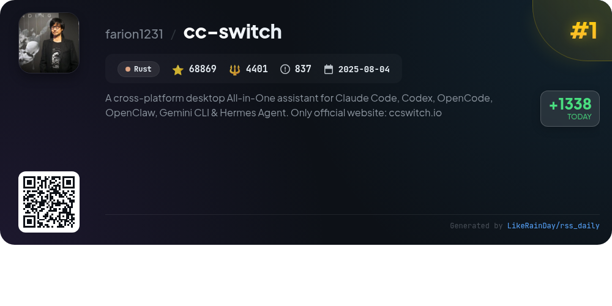
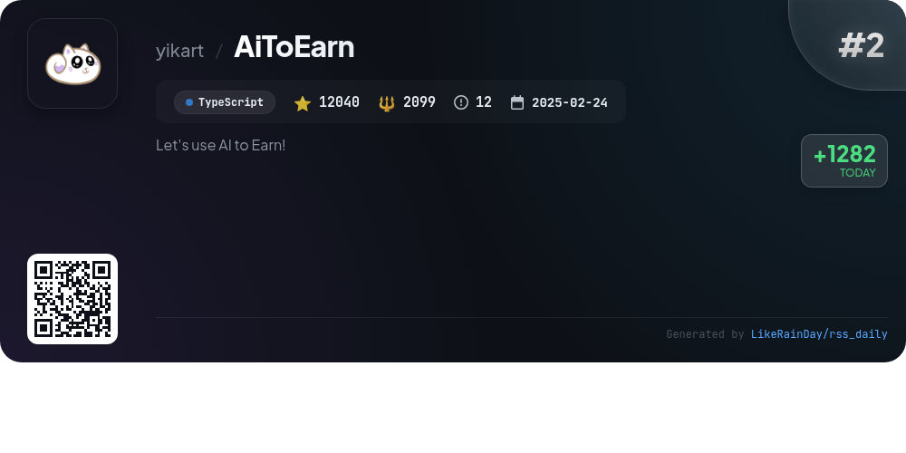
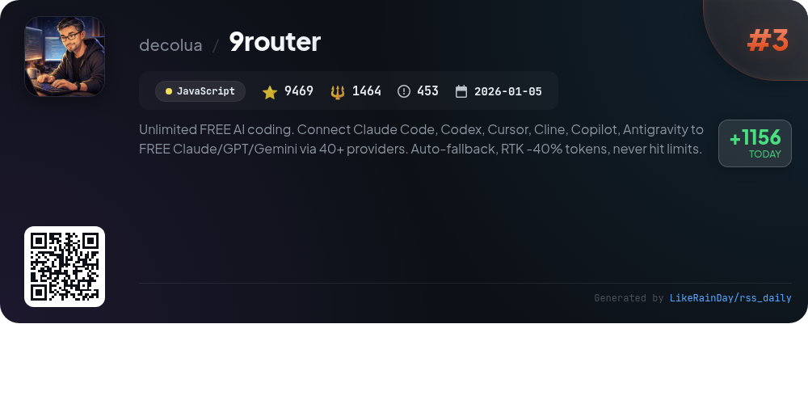
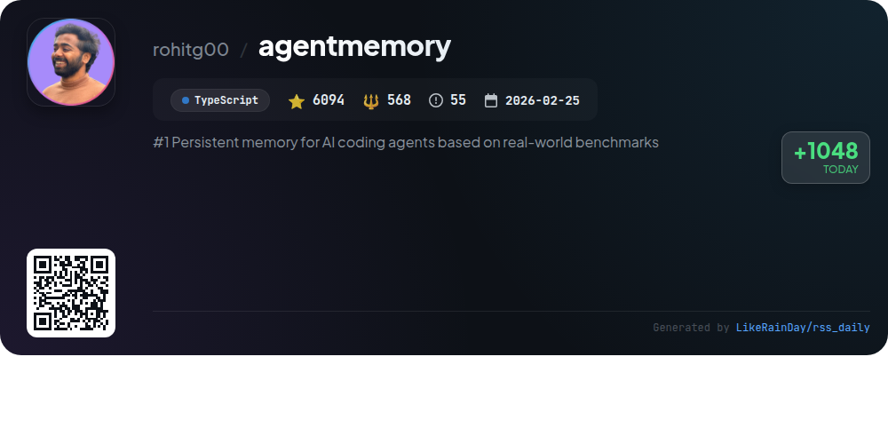
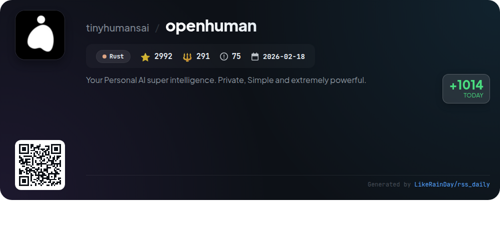
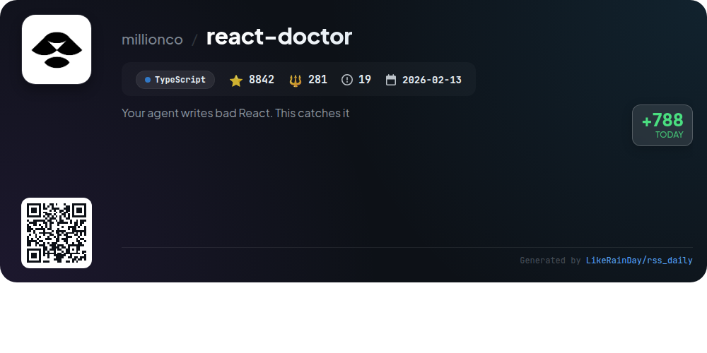
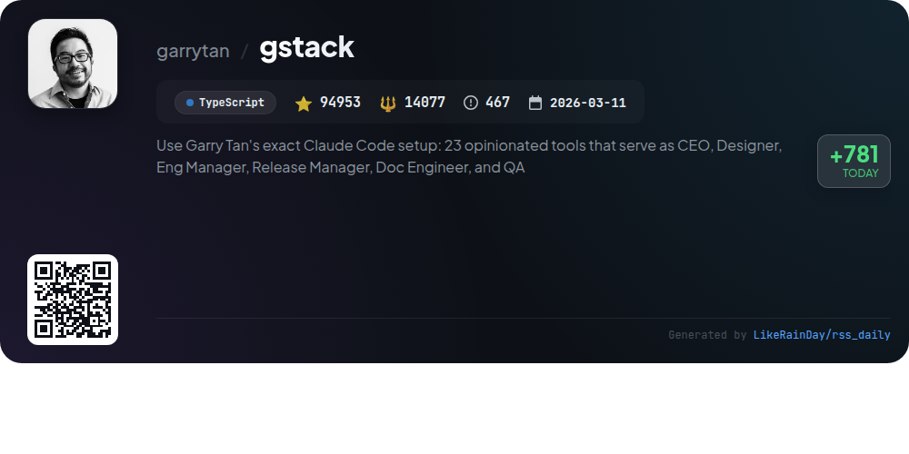
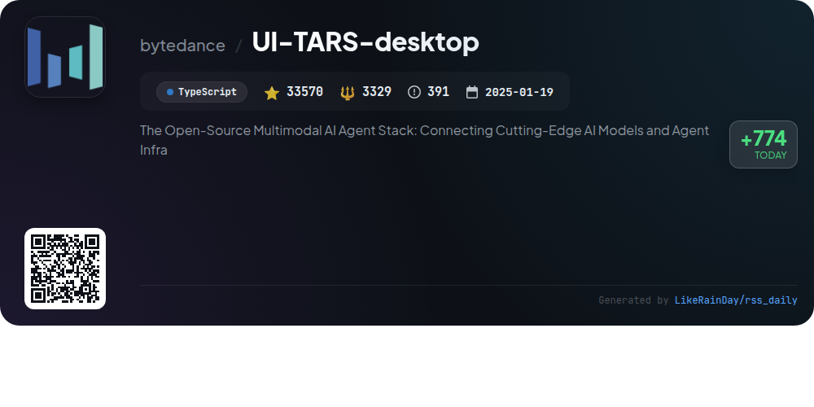
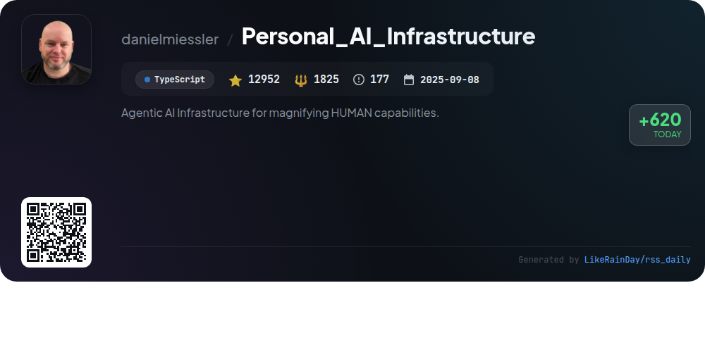

# 📊 🌟 GitHub Trending Daily - 2026-05-13

> > 📅 Daily Picks of GitHub Trending Repositories | Powered by Smart Algorithms

## 📋 Overview

**10** Projects | **260206** ⭐ | **29317** 🍴

**Top Languages:** `TypeScript` (6) · `Rust` (2) · `JavaScript` (2)

**Updated:** 2026-05-13 03:59 UTC

**Categories:**

- 🌟 Daily Top 10 (10 items)

---

## 🌟 Daily Top 10

### 1. [cc-switch](https://github.com/farion1231/cc-switch)

> 🤖 **Why Recommend**  
> *CC Switch is a cross-platform desktop assistant designed to manage multiple AI CLI tools, including Claude Code, Codex, Gemini CLI, OpenCode, and OpenClaw, all from a single interface. Key features include over 50 built-in provider presets for easy switching, unified management of MCP servers and skills, and a system tray for quick access. Users benefit from cloud sync options and built-in utilities. Developed in Rust, CC Switch offers a seamless experience for AI coding, enhancing productivity with atomic writes to protect configurations. Visit ccswitch.io for more.*

- ⭐ 68869 stars
- 💻 Rust
- 📅 Updated: 2026-05-13

### 2. [AiToEarn](https://github.com/yikart/AiToEarn)

> 🤖 **Why Recommend**  
> *AiToEarn is an innovative AI-powered platform designed to help creators, brands, and businesses monetize content across multiple social media channels, including TikTok, YouTube, and Instagram. With over 12,000 stars on GitHub, it offers key features such as automated content creation, publishing, and engagement tools. Users can monetize through various models like CPS, CPE, and CPM, and utilize a browser plugin for automated interactions. The platform supports easy access via web, Docker deployment, or integration with AI assistants, making it versatile for individual creators and teams.*

- ⭐ 12040 stars
- 💻 TypeScript
- 📅 Updated: 2026-05-13

### 3. [9router](https://github.com/decolua/9router)

> 🤖 **Why Recommend**  
> *9Router is an open-source AI coding router enabling unlimited free access to various AI models such as Claude Code, Codex, and Gemini through more than 40 providers. Key features include a Real-Time Token Saver (RTK) that reduces token usage by 20-40%, automatic fallback from subscription to cheaper or free models, and multi-account support for seamless coding without interruptions. With quota tracking and usage analytics, developers can maximize their AI tools while minimizing costs. Start coding effortlessly with 9Router's flexible deployment options.*

- ⭐ 9469 stars
- 💻 JavaScript
- 📅 Updated: 2026-05-13

### 4. [agentmemory](https://github.com/rohitg00/agentmemory)

> 🤖 **Why Recommend**  
> *agentmemory is a TypeScript-based persistent memory solution for AI coding agents, boasting over 6,000 stars on GitHub. It enhances coding efficiency by allowing agents like Claude Code, Cursor, and Gemini CLI to retain and recall session information seamlessly, eliminating the need for re-explanation. Key features include automatic memory capture across sessions, hybrid semantic search with BM25 and vector embeddings, and a real-time viewer for monitoring memory. With 51 MCP tools, it supports multi-agent setups, ensuring a cohesive memory experience. The project is built on the iii engine, offering a robust backend for advanced AI interactions.*

- ⭐ 6094 stars
- 💻 TypeScript
- 📅 Updated: 2026-05-13

### 5. [openhuman](https://github.com/tinyhumansai/openhuman)

> 🤖 **Why Recommend**  
> *OpenHuman is a powerful, open-source personal AI assistant designed for seamless integration into daily life. Built in Rust, it features a user-friendly interface, 118+ third-party integrations, and a unique Memory Tree for quick context-building. With auto-fetch capabilities, it continuously updates your data without manual prompts. The platform includes built-in tools for web search, coding, and voice interaction. Focused on privacy and local data security, OpenHuman aims to provide a personalized experience while minimizing vendor sprawl.*

- ⭐ 2992 stars
- 💻 Rust
- 📅 Updated: 2026-05-13

### 6. [react-doctor](https://github.com/millionco/react-doctor)

> 🤖 **Why Recommend**  
> *React Doctor is a TypeScript tool designed to enhance React code quality by diagnosing issues across state management, performance, security, accessibility, and dead code. It provides a health score (0-100) based on actionable diagnostics, supporting frameworks like Next.js and Vite. Key features include installation for coding agents, GitHub Actions integration for CI/CD, and optional ESLint plugin support. Users can customize configurations, utilize diff and staged modes for selective scanning, and access a leaderboard of top-scored codebases. It is open-source and available on GitHub.*

- ⭐ 8842 stars
- 💻 TypeScript
- 📅 Updated: 2026-05-13

### 7. [gstack](https://github.com/garrytan/gstack)

> 🤖 **Why Recommend**  
> *gstack is an open-source TypeScript project designed to empower developers by simulating a virtual engineering team via AI tools. It integrates 23 specialized skills—acting as CEO, engineer, designer, QA lead, and more—streamlining the software development process from ideation to deployment. Key features include structured role assignments, real browser interactions, automated QA, and comprehensive documentation updates. With an emphasis on productivity, gstack enables rapid feature delivery while maintaining high-quality standards, making it ideal for founders, tech leads, and AI enthusiasts.*

- ⭐ 94953 stars
- 💻 TypeScript
- 📅 Updated: 2026-05-13

### 8. [UI-TARS-desktop](https://github.com/bytedance/UI-TARS-desktop)

> 🤖 **Why Recommend**  
> *UI-TARS-desktop is an open-source multimodal AI agent stack designed for seamless human-like task completion. It features a native GUI agent utilizing advanced Vision-Language models, enabling natural language control, visual recognition, and precise mouse and keyboard operations across platforms (Windows, MacOS, Browser). Key highlights include one-click CLI deployment, hybrid browser control, and real-time feedback. The project also supports local and remote operators, enhancing automation capabilities for various tasks, making it a powerful tool for developers and users alike.*

- ⭐ 33570 stars
- 💻 TypeScript
- 📅 Updated: 2026-05-13

### 9. [easy-vibe](https://github.com/datawhalechina/easy-vibe)

> 🤖 **Why Recommend**  
> *Easy-Vibe is a modern coding course designed for beginners to master app development step by step, featuring interactive tutorials and a beginner-friendly learning map. With over 10,425 stars, it offers immersive simulated coding experiences, visual explanations of AI principles, and practical project-building guidance. Key services include full-stack development paths, AI integration, and a robust appendix covering foundational knowledge across nine areas. This resource empowers users to transform ideas into real products, making programming accessible and engaging.*

- ⭐ 10425 stars
- 💻 JavaScript
- 📅 Updated: 2026-05-13

### 10. [Personal_AI_Infrastructure](https://github.com/danielmiessler/Personal_AI_Infrastructure)

> 🤖 **Why Recommend**  
> *Personal_AI_Infrastructure (PAI) is a transformative Life Operating System designed to enhance human capabilities through AI. Key features include a unified Pulse daemon for life management, a Digital Assistant (DA) for personalized interaction, and a custom Algorithm that guides users from their current to ideal states. PAI supports 45 skills, 171 workflows, and offers structured memory for learning and self-improvement. With a focus on transparency and context, it prioritizes user goals over technology, making AI accessible and beneficial for everyone.*

- ⭐ 12952 stars
- 💻 TypeScript
- 📅 Updated: 2026-05-13

---

## 📡 RSS Subscription

Subscribe via RSS to get daily trending updates:

- 🔔 [RSS XML] (../../daily-top.xml)
- 🔔 [Daily Report] (../../GITHUB_TODAY.md)
- 🔔 [Daily Top 10](../../daily-top.xml)

---

*⚡ Powered by Smart Trending Algorithm | Generated at 2026-05-13 03:59:24 UTC
