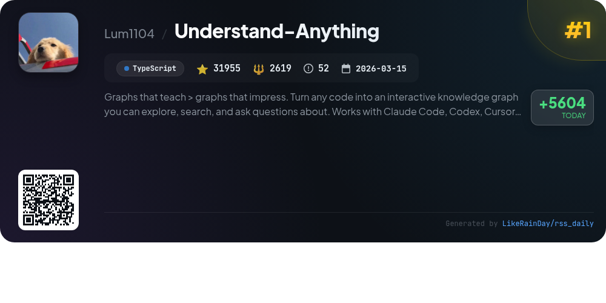
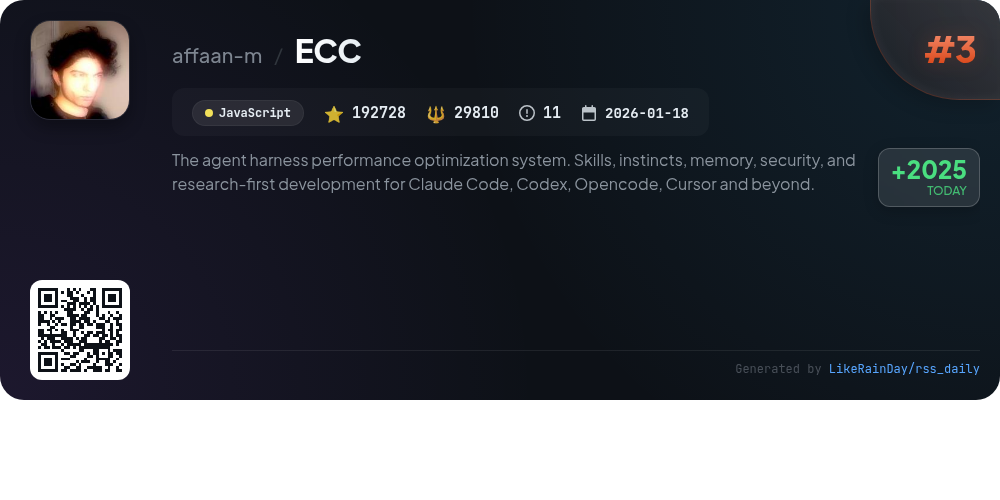
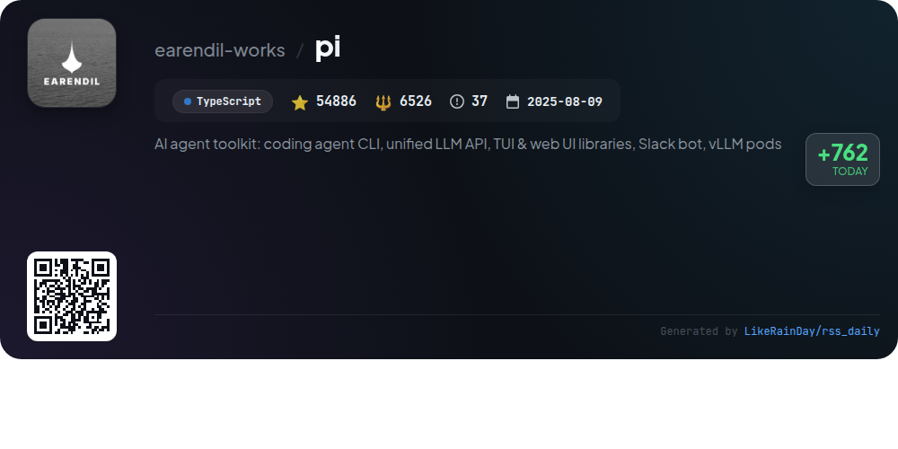
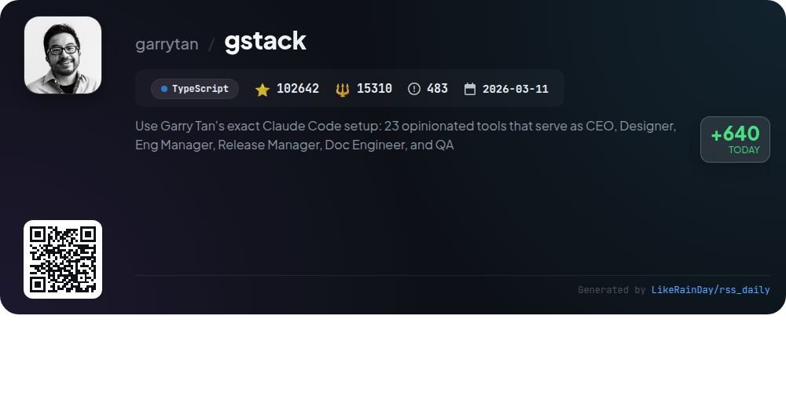
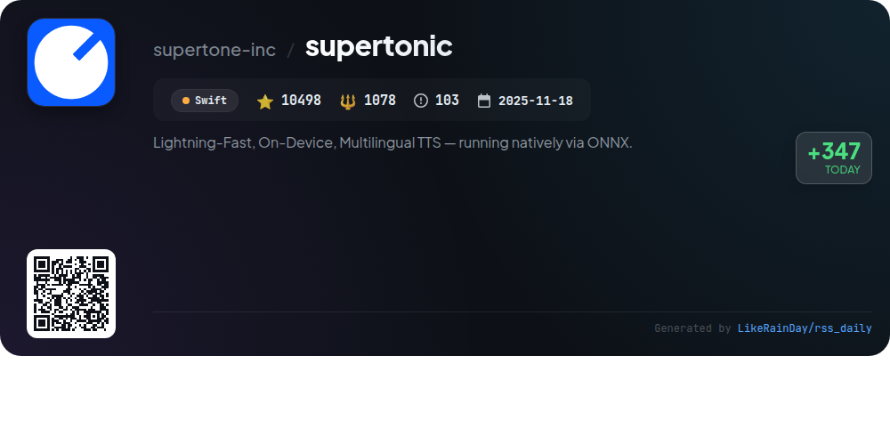
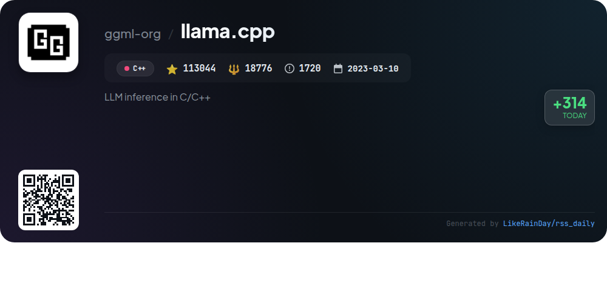

# 📊 🌟 GitHub Trending Daily - 2026-05-26

> > 📅 Daily Picks of GitHub Trending Repositories | Powered by Smart Algorithms

## 📋 Overview

**10** Projects | **669835** ⭐ | **93503** 🍴

**Top Languages:** `TypeScript` (5) · `Swift` (2) · `C++` (1)

**Updated:** 2026-05-26 04:10 UTC

**Categories:**

- 🌟 Daily Top 10 (10 items)

---

## 🌟 Daily Top 10

### 1. [Understand-Anything](https://github.com/Lum1104/Understand-Anything)

> 🤖 **Why Recommend**  
> *Understand-Anything is a powerful tool that transforms any codebase into an interactive knowledge graph, allowing users to explore, search, and ask questions about their projects. It integrates seamlessly with platforms like Claude Code, Codex, Copilot, and Gemini CLI. Key features include an interactive dashboard, guided tours, fuzzy and semantic search, diff impact analysis, and domain visualization. The system employs a multi-agent pipeline for efficient analysis, ensuring users grasp both the structural and business logic of their code, enhancing onboarding and collaboration. With over 31,000 stars, it is a vital resource for developers aiming to understand complex codebases quickly.*

- ⭐ 31955 stars
- 💻 TypeScript
- 📅 Updated: 2026-05-26

### 2. [codegraph](https://github.com/colbymchenry/codegraph)

> 🤖 **Why Recommend**  
> *CodeGraph is a pre-indexed knowledge graph designed to enhance AI coding agents like Claude Code, Codex, Cursor, OpenCode, and Hermes Agent. It significantly reduces costs (up to 35%), token usage (up to 70% fewer), and tool calls (up to 71% fewer) by providing instant access to code relationships and structure without scanning files. Key features include smart context building, full-text search, impact analysis, and support for 19+ programming languages. CodeGraph operates entirely locally, ensuring data privacy with no external dependencies.*

- ⭐ 25736 stars
- 💻 TypeScript
- 📅 Updated: 2026-05-26

### 3. [ECC](https://github.com/affaan-m/ECC)

> 🤖 **Why Recommend**  
> *ECC is a robust performance optimization system designed for AI coding agents like Claude Code, Codex, and Cursor. With over 192K stars, it offers skills, instincts, memory optimization, and security scanning for efficient development. Key features include a comprehensive agent framework, continuous learning capabilities, and a dashboard GUI for easy navigation. ECC supports multiple programming languages and integrates seamlessly with various tools, making it ideal for production-ready workflows. It's community-driven and maintains an open-source ethos with extensive documentation and guides.*

- ⭐ 192728 stars
- 💻 JavaScript
- 📅 Updated: 2026-05-26

### 4. [pi](https://github.com/earendil-works/pi)

> 🤖 **Why Recommend**  
> *The "pi" project is an AI agent toolkit featuring an interactive coding agent CLI, a unified multi-provider LLM API, and various UI libraries for both terminal and web applications. Key components include the coding agent CLI, agent runtime for tool calling and state management, and support for Slack automation. It encourages sharing OSS coding sessions to improve agent capabilities. The project boasts a strong community and offers extensive documentation, making it a valuable resource for developers working with AI-driven coding assistance.*

- ⭐ 54886 stars
- 💻 TypeScript
- 📅 Updated: 2026-05-26

### 5. [multica](https://github.com/multica-ai/multica)

> 🤖 **Why Recommend**  
> *The open-source managed agents platform. Turn coding agents into real teammates — assign tasks, track progress, compound skills.. popular project, actively maintained, recently updated*

- ⭐ 33091 stars
- 🍴 3975 forks
- 💻 TypeScript
- 📅 Updated: 2026-05-26

### 6. [gstack](https://github.com/garrytan/gstack)

> 🤖 **Why Recommend**  
> *gstack is an open-source software factory by Garry Tan, designed for founders and engineers to leverage AI for rapid product development. It incorporates 23 specialized tools that emulate roles like CEO, Designer, and QA, streamlining workflows from planning to shipping. Core features include structured commands for design reviews, engineering audits, and automated testing, enabling users to build faster and more efficiently. With a focus on collaboration, gstack supports multiple AI agents and offers seamless integration for improved productivity, making it ideal for startups and technical teams.*

- ⭐ 102642 stars
- 💻 TypeScript
- 📅 Updated: 2026-05-26

### 7. [cmux](https://github.com/manaflow-ai/cmux)

> 🤖 **Why Recommend**  
> *cmux is a Swift-based macOS terminal designed for AI coding agents, featuring vertical tabs and real-time notifications to enhance productivity. Key features include notification rings for urgent tasks, an in-app browser with a scriptable API, SSH support for remote workspaces, and native macOS performance without Electron. Users can import browser data, define custom commands, and utilize a comprehensive CLI for automation. With robust session restoration and agent integration, cmux offers a customizable and efficient coding environment tailored for developers.*

- ⭐ 19573 stars
- 💻 Swift
- 📅 Updated: 2026-05-26

### 8. [codex](https://github.com/openai/codex)

> 🤖 **Why Recommend**  
> *Codex is a lightweight coding agent by OpenAI that operates directly in your terminal, designed for seamless local development. With over 85,000 stars on GitHub, it supports installation on Mac, Linux, and Windows via scripts or package managers like npm and Homebrew. Users can easily integrate Codex into code editors like VS Code or opt for a desktop app experience. By signing in with a ChatGPT account, Codex enhances coding capabilities for Plus and Pro plan users. Comprehensive documentation and contributing guidelines are available for developers.*

- ⭐ 85682 stars
- 💻 Rust
- 📅 Updated: 2026-05-26

### 9. [supertonic](https://github.com/supertone-inc/supertonic)

> 🤖 **Why Recommend**  
> *Supertonic is a lightning-fast, on-device multilingual text-to-speech (TTS) system powered by ONNX Runtime, enabling real-time synthesis in 31 languages with low latency. Key features include a compact 99M-parameter model, high-quality 44.1kHz audio output, and support for natural expression tags. Supertonic runs locally on various devices, ensuring privacy without reliance on cloud services. It offers multi-runtime SDKs for languages like Python, Swift, and Java, along with tools like the Voice Builder for custom voice profiles.*

- ⭐ 10498 stars
- 💻 Swift
- 📅 Updated: 2026-05-26

### 10. [llama.cpp](https://github.com/ggml-org/llama.cpp)

> 🤖 **Why Recommend**  
> *llama.cpp is a high-performance, dependency-free C/C++ library for large language model (LLM) inference, boasting over 113,000 stars on GitHub. It supports various backends including CUDA, Metal, and Vulkan, optimizing performance on diverse hardware. Key features include 1.5 to 8-bit quantization for efficient memory usage, multimodal capabilities, and a REST API compatible with OpenAI's interface. Users can easily run models via CLI or server, with seamless integration for Hugging Face models. Additionally, tools for model conversion, quantization, and benchmarking enhance usability and flexibility.*

- ⭐ 113044 stars
- 💻 C++
- 📅 Updated: 2026-05-26

---

## 📡 RSS Subscription

Subscribe via RSS to get daily trending updates:

- 🔔 [RSS XML] (../../daily-top.xml)
- 🔔 [Daily Report] (../../GITHUB_TODAY.md)
- 🔔 [Daily Top 10](../../daily-top.xml)

---

*⚡ Powered by Smart Trending Algorithm | Generated at 2026-05-26 04:10:43 UTC
