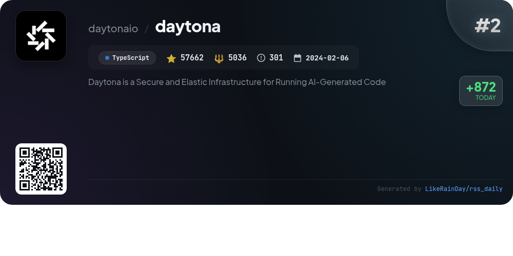
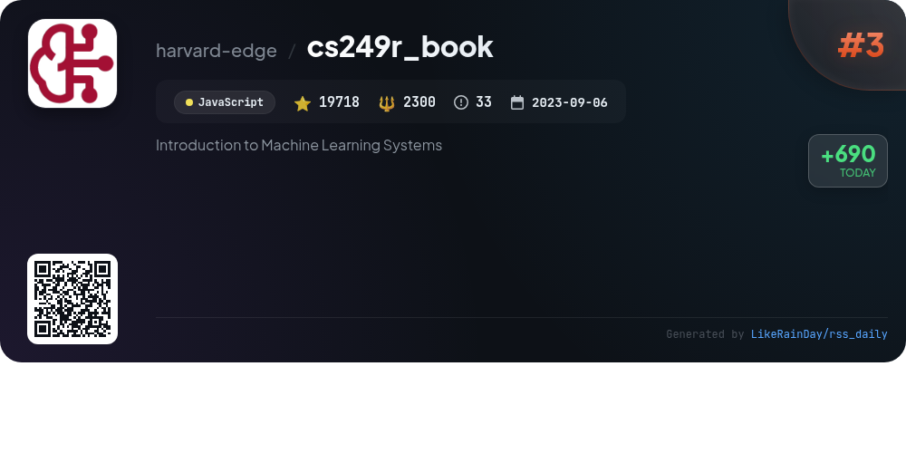
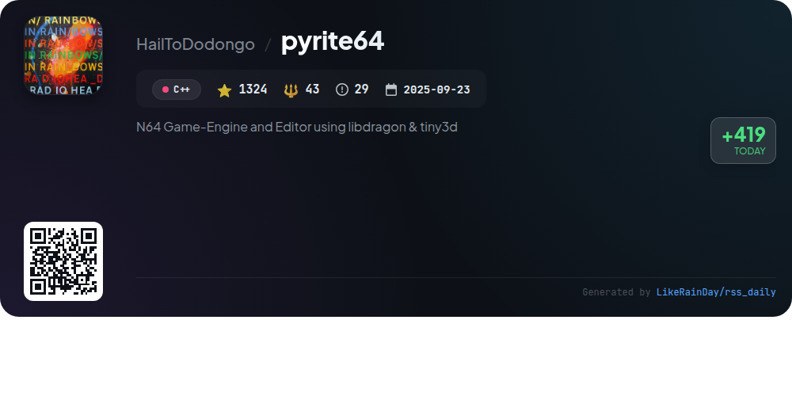
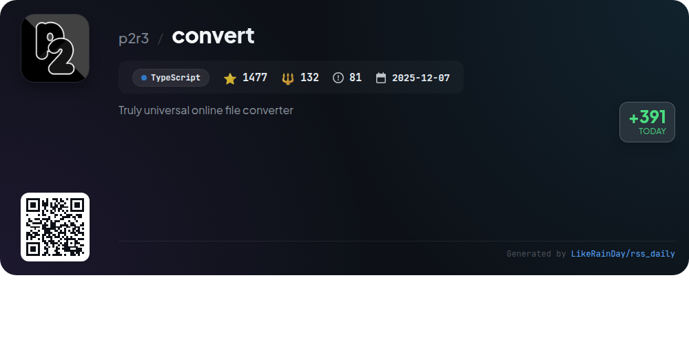
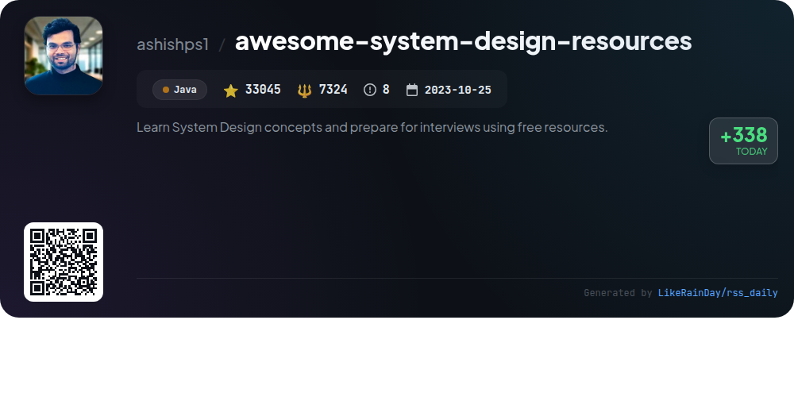
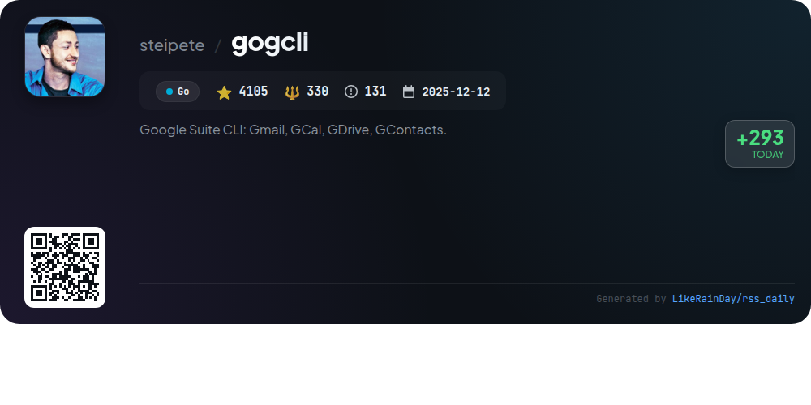
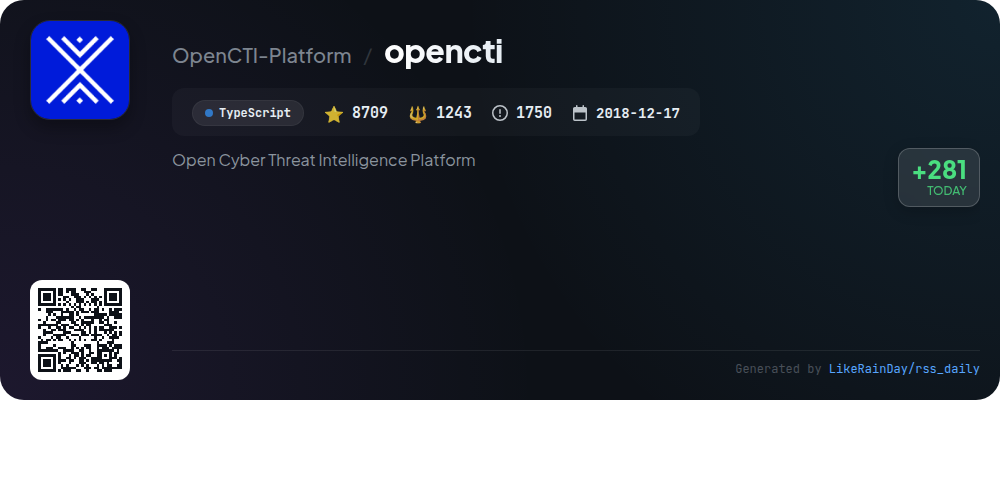

# 📊 🌟 GitHub Trending Daily - 2026-02-19

> > 📅 Daily Picks of GitHub Trending Repositories | Powered by Smart Algorithms

## 📋 Overview

**10** Projects | **355854** ⭐ | **56677** 🍴

**Top Languages:** `TypeScript` (4) · `JavaScript` (2) · `C++` (2)

**Updated:** 2026-02-19 02:46 UTC

**Categories:**

- 🌟 Daily Top 10 (10 items)

---

## 🌟 Daily Top 10

### 1. [openclaw](https://github.com/openclaw/openclaw)

> 🤖 **Why Recommend**  
> *OpenClaw is a versatile personal AI assistant that operates across multiple platforms including WhatsApp, Telegram, Slack, and Discord. Key features include a local-first architecture, multi-channel support, and seamless integration with voice commands on macOS, iOS, and Android. Users can customize their experience through an onboarding wizard, manage skills via ClawHub, and utilize a live Canvas for visual tasks. The platform supports various AI models, ensuring flexibility and performance. Ideal for users seeking a fast, always-on assistant that feels local and personal.*

- ⭐ 209037 stars
- 💻 TypeScript
- 📅 Updated: 2026-02-19

### 2. [daytona](https://github.com/daytonaio/daytona)

> 🤖 **Why Recommend**  
> *Daytona is a Secure and Elastic Infrastructure for Running AI-Generated Code. popular project, actively maintained, recently updated*

- ⭐ 57662 stars
- 🍴 5036 forks
- 💻 TypeScript
- 📅 Updated: 2026-02-19

### 3. [cs249r_book](https://github.com/harvard-edge/cs249r_book)

> 🤖 **Why Recommend**  
> *The cs249r_book project, "Introduction to Machine Learning Systems," presents a comprehensive guide on AI engineering principles, focusing on building efficient, reliable systems. Key features include an interactive online textbook, TinyTorch for hands-on ML framework development, and hardware kits for real-world deployment on devices like Arduino and Raspberry Pi. The project emphasizes a hands-on learning approach, connecting theory with practical applications. With over 19,700 stars, it aims to educate one million learners by 2030, fostering a robust AI engineering community.*

- ⭐ 19718 stars
- 💻 JavaScript
- 📅 Updated: 2026-02-19

### 4. [zvec](https://github.com/alibaba/zvec)

> 🤖 **Why Recommend**  
> *Zvec is a lightweight, high-performance in-process vector database designed for seamless integration into applications. Built on Alibaba's Proxima engine, it supports both dense and sparse vectors, enabling low-latency similarity searches across billions of vectors. Key features include hybrid search capabilities, quick installation with no server setup, and compatibility with Python and Node.js. Zvec runs on various platforms, including Linux and macOS, making it ideal for production workloads. With 4,937 stars on GitHub, it offers exceptional speed and scalability for demanding applications.*

- ⭐ 4937 stars
- 💻 C++
- 📅 Updated: 2026-02-19

### 5. [get-shit-done](https://github.com/gsd-build/get-shit-done)

> 🤖 **Why Recommend**  
> *Get Shit Done (GSD) is a lightweight, powerful meta-prompting and context engineering system for Claude Code, OpenCode, and Gemini CLI, designed to combat context rot in AI coding. With 15,840 stars on GitHub, it streamlines spec-driven development through a structured command workflow: initialize projects, discuss phases, plan, execute tasks in parallel, and verify results. GSD ensures atomic Git commits and clean project history, making it ideal for solo developers who want effective, non-enterprise workflows. Trusted by engineers at major tech firms, GSD is built for those seeking efficient code generation without complications.*

- ⭐ 15840 stars
- 💻 JavaScript
- 📅 Updated: 2026-02-19

### 6. [pyrite64](https://github.com/HailToDodongo/pyrite64)

> 🤖 **Why Recommend**  
> *Pyrite64 is an N64 game engine and visual editor built with libdragon and tiny3d, designed for creating 3D games compatible with real N64 hardware and accurate emulators. Key features include automatic toolchain installation on Windows, GLTF 3D model import with fast64 material support, HDR and Bloom rendering, big-texture support, and a runtime engine for scene management, rendering, and audio. The Node-Graph editor allows for scripting control flow. Although still in early development, it emphasizes accurate emulation and offers a growing set of documentation and resources.*

- ⭐ 1324 stars
- 💻 C++
- 📅 Updated: 2026-02-19

### 7. [convert](https://github.com/p2r3/convert)

> 🤖 **Why Recommend**  
> *Convert.to.it is a versatile online file converter that addresses the limitations of traditional tools by supporting a wide range of format conversions beyond just media types. Users can easily convert files by dragging and dropping them into the interface, selecting input and output formats, and clicking "Convert." The project prioritizes user privacy by avoiding file uploads to external servers. With robust support for various formats and an active community for contributions, Convert.to.it stands out as a valuable resource for diverse file conversion needs.*

- ⭐ 1477 stars
- 💻 TypeScript
- 📅 Updated: 2026-02-19

### 8. [awesome-system-design-resources](https://github.com/ashishps1/awesome-system-design-resources)

> 🤖 **Why Recommend**  
> *The "awesome-system-design-resources" GitHub repository offers a comprehensive collection of free materials to learn System Design concepts and prepare for interviews. With over 33,000 stars, it covers core topics like scalability, reliability, and fault tolerance, along with networking, API, database, and caching fundamentals. It features hands-on design problems, courses, newsletters, and key articles and papers on distributed systems. Ideal for both beginners and experienced engineers, this resource streamlines the learning process for aspiring system designers.*

- ⭐ 33045 stars
- 💻 Java
- 📅 Updated: 2026-02-19

### 9. [gogcli](https://github.com/steipete/gogcli)

> 🤖 **Why Recommend**  
> *gogcli is a powerful CLI tool for managing Google services directly from your terminal, supporting Gmail, Google Calendar, Drive, Contacts, and more. Key features include email management (sending, searching, tracking), calendar event creation and modification, file handling in Google Drive, and task management. It supports multiple accounts, OAuth2 authentication, and provides JSON output for easy integration into scripts. With over 4,100 stars on GitHub, gogcli is designed for efficiency and automation, making Google Workspace accessible through a streamlined command-line interface.*

- ⭐ 4105 stars
- 💻 Go
- 📅 Updated: 2026-02-19

### 10. [opencti](https://github.com/OpenCTI-Platform/opencti)

> 🤖 **Why Recommend**  
> *OpenCTI is an open-source Cyber Threat Intelligence Platform designed for organizations to manage, structure, and visualize cyber threat data. It utilizes a STIX2-based schema and includes a user-friendly web application with a GraphQL API. Key features include integration with tools like MISP and MITRE ATT&CK, data import/export capabilities, and a dual-edition model (Community and Enterprise). OpenCTI enables users to link technical and non-technical threat information, facilitating deeper insights and knowledge extraction. Comprehensive documentation and a demo instance are available for users.*

- ⭐ 8709 stars
- 💻 TypeScript
- 📅 Updated: 2026-02-19

---

## 📡 RSS Subscription

Subscribe via RSS to get daily trending updates:

- 🔔 [RSS XML] (../../daily-top.xml)
- 🔔 [Daily Report] (../../GITHUB_TODAY.md)
- 🔔 [Daily Top 10](../../daily-top.xml)

---

*⚡ Powered by Smart Trending Algorithm | Generated at 2026-02-19 02:46:02 UTC
