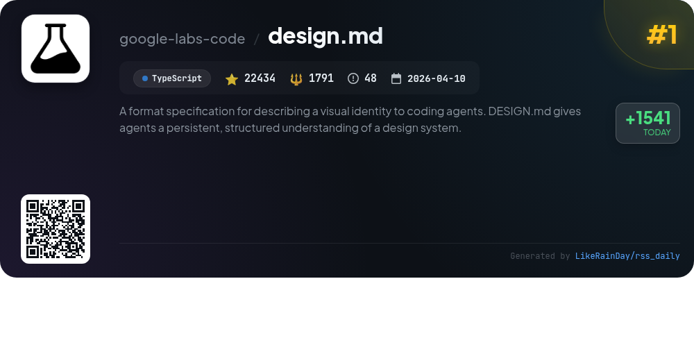
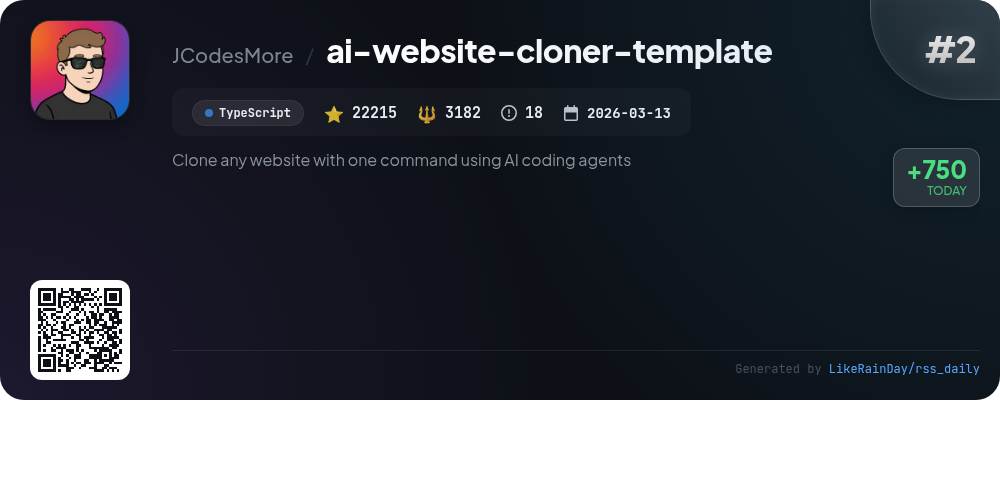
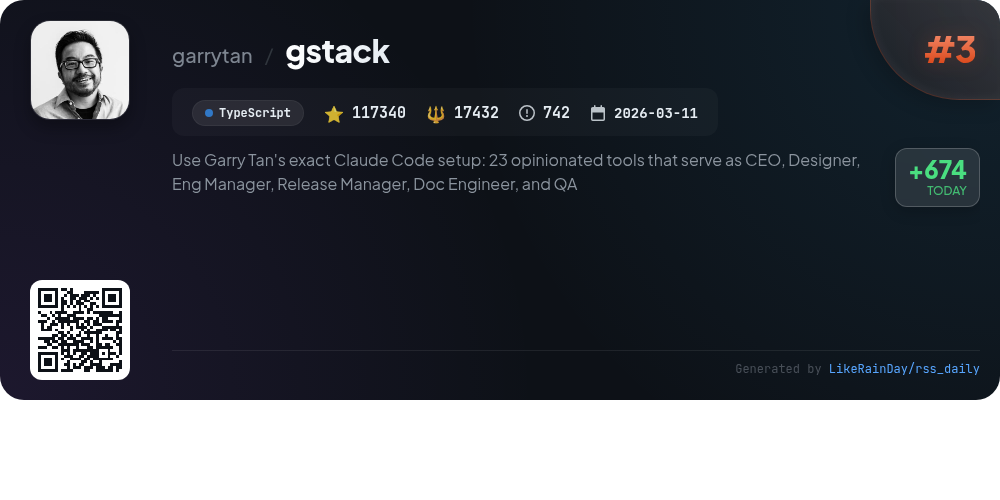
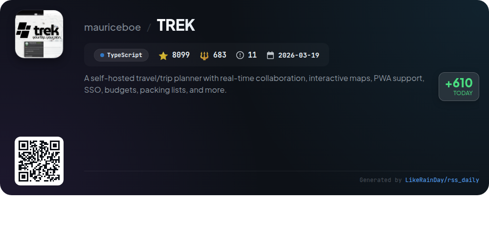
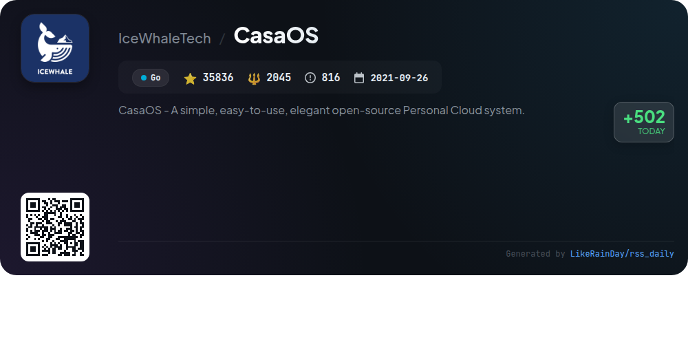
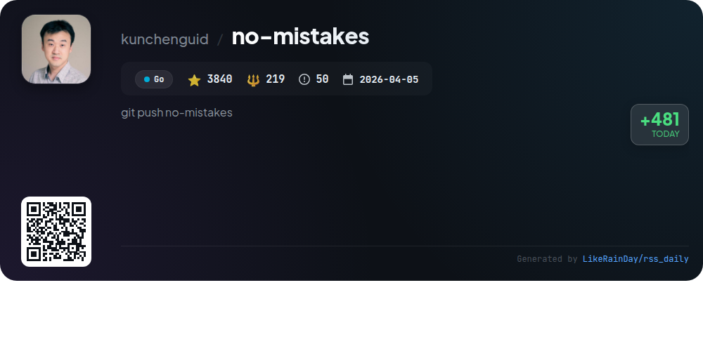
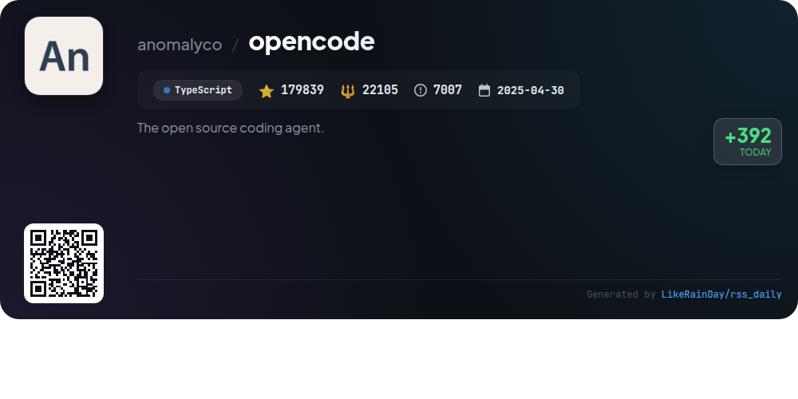
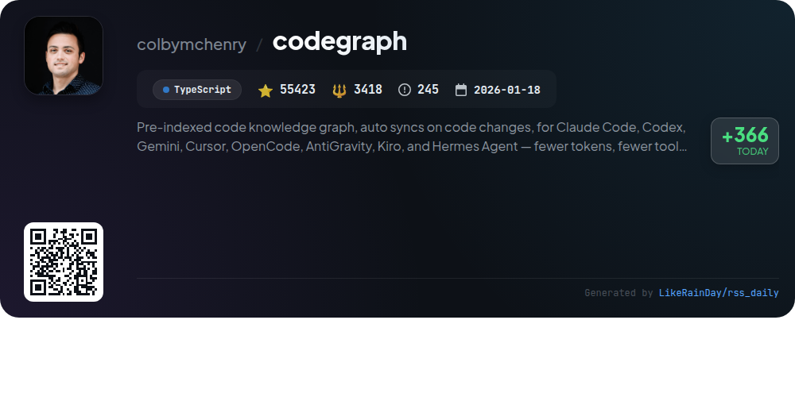
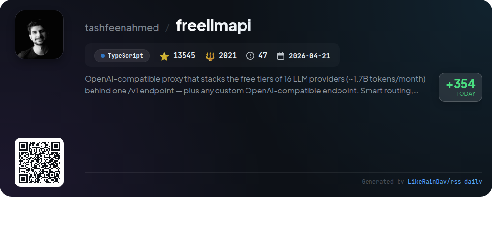
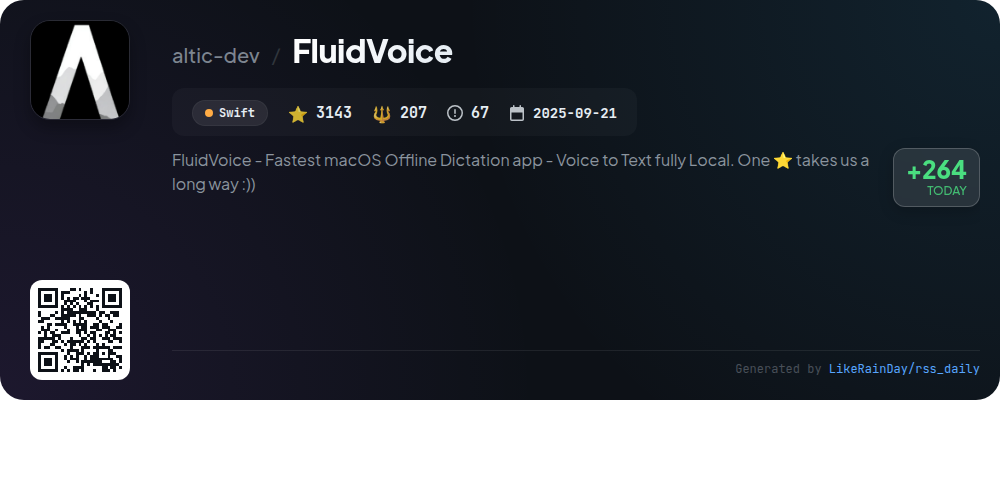

# 📊 🌟 GitHub Trending Daily - 2026-06-28

> > 📅 Daily Picks of GitHub Trending Repositories | Powered by Smart Algorithms

## 📋 Overview

**10** Projects | **461714** ⭐ | **53103** 🍴

**Top Languages:** `TypeScript` (7) · `Go` (2) · `Swift` (1)

**Updated:** 2026-06-28 04:25 UTC

**Categories:**

- 🌟 Daily Top 10 (10 items)

---

## 🌟 Daily Top 10

### 1. [design.md](https://github.com/google-labs-code/design.md)

> 🤖 **Why Recommend**  
> *DESIGN.md is a TypeScript-based format specification that enables coding agents to understand and implement a visual identity through structured design tokens and rationale. It combines machine-readable YAML tokens with human-readable markdown, ensuring a clear design system. Key features include linting for structural correctness, comparison of design versions, and export options to formats like Tailwind and DTCG. The project emphasizes accessibility by checking WCAG compliance and provides a robust CLI for validation and integration, making it an essential tool for modern design systems.*

- ⭐ 22434 stars
- 💻 TypeScript
- 📅 Updated: 2026-06-28

### 2. [ai-website-cloner-template](https://github.com/JCodesMore/ai-website-cloner-template)

> 🤖 **Why Recommend**  
> *The AI Website Cloner Template enables users to clone any website with a single command using AI coding agents. Built on a modern Next.js codebase, it extracts design tokens, assets, and constructs detailed component specifications. Users can initiate the cloning process by pointing to a URL and running the `/clone-website` command. The template supports various AI tools, with Claude Code recommended for optimal results. Ideal for platform migration, recovering lost code, or educational purposes, it emphasizes ethical use while providing a robust development environment in TypeScript.*

- ⭐ 22215 stars
- 💻 TypeScript
- 📅 Updated: 2026-06-28

### 3. [gstack](https://github.com/garrytan/gstack)

> 🤖 **Why Recommend**  
> *gstack is an open-source project designed by Garry Tan to enhance productivity for developers using AI tools. It provides a structured workflow with 23 specialized skills, enabling roles such as CEO, Designer, and QA in a single environment. Key features include automated planning, design reviews, coding, testing, and deployment processes, all managed through intuitive commands. gstack integrates with Claude Code and various AI agents, allowing users to ship products faster than traditional teams. It emphasizes collaboration, rigorous quality assurance, and continuous learning, making it ideal for founders and technical leads.*

- ⭐ 117340 stars
- 💻 TypeScript
- 📅 Updated: 2026-06-28

### 4. [TREK](https://github.com/mauriceboe/TREK)

> 🤖 **Why Recommend**  
> *TREK is a self-hosted travel planner that enables real-time collaboration and offers a comprehensive suite of features for managing trips. Key highlights include an interactive map for planning, budget tracking, packing lists, and a journal. It supports Single Sign-On (SSO) and two-factor authentication for secure access. Users can sync changes in real-time, create multi-user trips, and utilize AI for trip automation. The application is a Progressive Web App (PWA) with offline support, making it accessible on mobile devices. With over 8,000 stars on GitHub, TREK is built using TypeScript and runs seamlessly on Docker.*

- ⭐ 8099 stars
- 💻 TypeScript
- 📅 Updated: 2026-06-28

### 5. [CasaOS](https://github.com/IceWhaleTech/CasaOS)

> 🤖 **Why Recommend**  
> *CasaOS is an open-source personal cloud system designed for ease of use and elegance, boasting over 35,800 stars on GitHub. Built in Go, it supports various hardware, including ZimaBoard, Intel NUC, and Raspberry Pi. Key features include a user-friendly interface, one-click app installations from a curated app store, and seamless Docker app integration. CasaOS enables efficient file management and smart device control, offering a comprehensive solution for managing personal data and fostering data ownership. Join the community for collaborative innovation in reshaping digital home experiences.*

- ⭐ 35836 stars
- 💻 Go
- 📅 Updated: 2026-06-28

### 6. [no-mistakes](https://github.com/kunchenguid/no-mistakes)

> 🤖 **Why Recommend**  
> *The `no-mistakes` project provides a Git proxy that enhances the push process by validating code through an AI-driven pipeline before forwarding it to the remote repository. Core features include non-blocking operation in disposable worktrees, support for various AI agents, and automated clean pull requests. Users can trigger the pipeline via `git push no-mistakes`, through a TUI, or via coding agents. The system ensures safe automatic fixes while allowing human oversight for critical decisions. It aims to streamline the development workflow while minimizing errors.*

- ⭐ 3840 stars
- 💻 Go
- 📅 Updated: 2026-06-28

### 7. [opencode](https://github.com/anomalyco/opencode)

> 🤖 **Why Recommend**  
> *OpenCode is an open-source AI coding agent developed in TypeScript, boasting over 179,000 stars on GitHub. It features two built-in agents: a full-access "build" agent for development and a read-only "plan" agent for code exploration. Users can easily install it via various package managers, and it also offers a desktop application for macOS, Windows, and Linux. Key highlights include a user-friendly terminal UI, multi-language support, and active community engagement on Discord. Comprehensive documentation is available for configuration and contributions.*

- ⭐ 179839 stars
- 💻 TypeScript
- 📅 Updated: 2026-06-28

### 8. [codegraph](https://github.com/colbymchenry/codegraph)

> 🤖 **Why Recommend**  
> *CodeGraph is a pre-indexed code knowledge graph that automatically syncs with code changes, enhancing AI coding agents like Claude Code, Codex, and Cursor. Key features include surgical context for faster queries, a full-text search across 20+ programming languages, and impact analysis to trace code dependencies. It operates entirely locally, ensuring data privacy, and integrates seamlessly with various agents. CodeGraph saves time and costs by reducing tool calls and file reads, making it ideal for large codebases.*

- ⭐ 55423 stars
- 💻 TypeScript
- 📅 Updated: 2026-06-28

### 9. [freellmapi](https://github.com/tashfeenahmed/freellmapi)

> 🤖 **Why Recommend**  
> *FreeLLMAPI is an OpenAI-compatible proxy that consolidates free tier access to 16 LLM providers, offering around 1.7 billion tokens per month via a single `/v1` endpoint. Key features include smart routing, automatic failover, and encrypted key storage, ensuring seamless requests even when providers hit rate limits. It supports chat, embeddings, image generation, and audio services, with comprehensive analytics and an admin dashboard for management. Perfect for personal experimentation, it simplifies access to multiple AI models while maintaining user privacy and security.*

- ⭐ 13545 stars
- 💻 TypeScript
- 📅 Updated: 2026-06-28

### 10. [FluidVoice](https://github.com/altic-dev/FluidVoice)

> 🤖 **Why Recommend**  
> *FluidVoice is an open-source, macOS dictation app that offers fast, offline voice-to-text transcription using local AI. Key features include Fluid Intelligence for on-device enhancement, real-time transcription with minimal delay, and dual modes for command execution and text entry. It supports multiple speech models and provides privacy by ensuring no data leaves the device. The app includes adaptive theming, audio history, and customizable hotkeys, making it user-friendly and efficient. Ideal for users seeking a powerful, local dictation solution.*

- ⭐ 3143 stars
- 💻 Swift
- 📅 Updated: 2026-06-28

---

## 📡 RSS Subscription

Subscribe via RSS to get daily trending updates:

- 🔔 [RSS XML] (../../daily-top.xml)
- 🔔 [Daily Report] (../../GITHUB_TODAY.md)
- 🔔 [Daily Top 10](../../daily-top.xml)

---

*⚡ Powered by Smart Trending Algorithm | Generated at 2026-06-28 04:25:20 UTC
