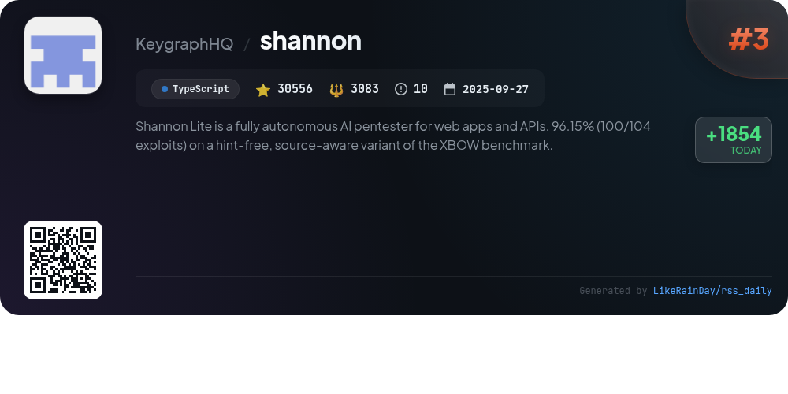
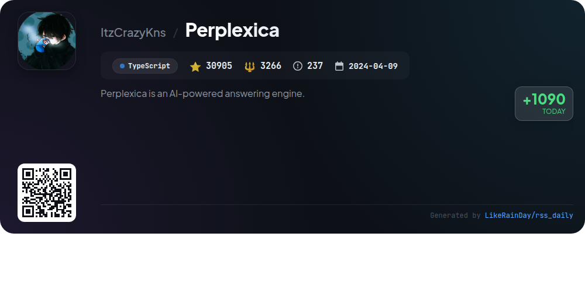
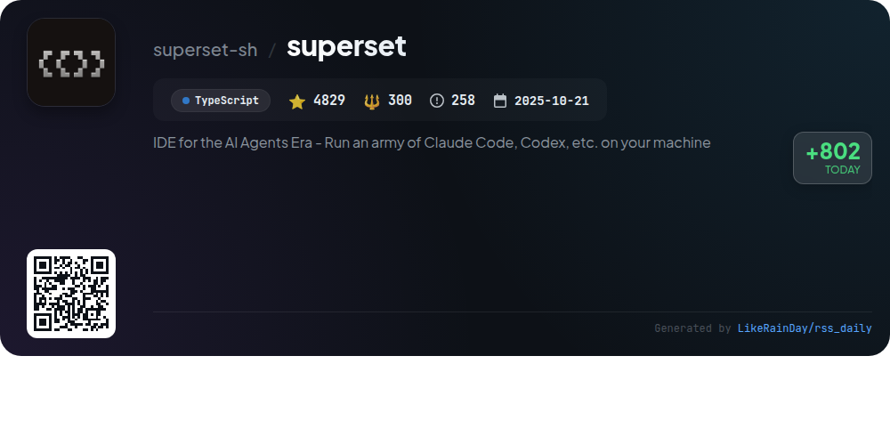
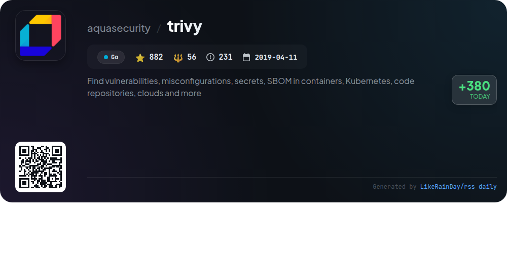
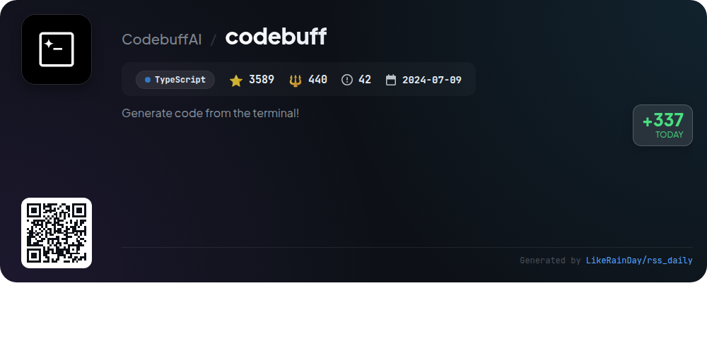
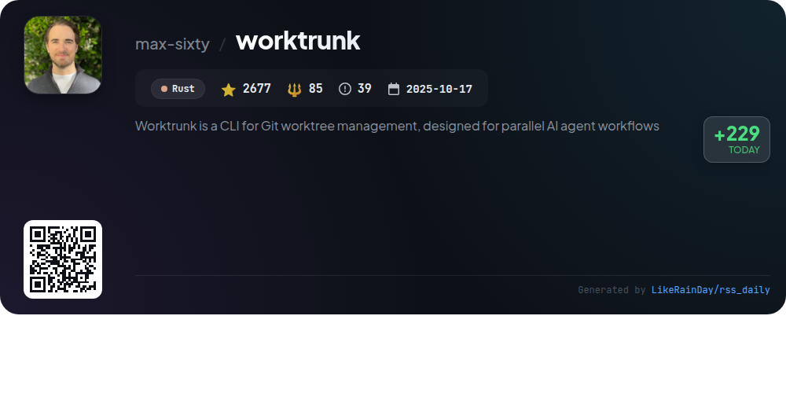

# 📊 🌟 GitHub Trending Daily - 2026-03-05

> > 📅 Daily Picks of GitHub Trending Repositories | Powered by Smart Algorithms

## 📋 Overview

**10** Projects | **399051** ⭐ | **63680** 🍴

**Top Languages:** `TypeScript` (7) · `Rust` (2) · `Go` (1)

**Updated:** 2026-03-05 02:41 UTC

**Categories:**

- 🌟 Daily Top 10 (10 items)

---

## 🌟 Daily Top 10

### 1. [openclaw](https://github.com/openclaw/openclaw)

> 🤖 **Why Recommend**  
> *OpenClaw is a versatile personal AI assistant that operates across multiple platforms and messaging services, including WhatsApp, Telegram, Discord, and more. Built with TypeScript, it features a local-first Gateway for managing sessions and channels, multi-channel integration, and voice capabilities like Voice Wake and Talk Mode. Users can customize their experience through a wizard-driven setup, with support for various AI models. Additional services include a live Canvas for visual tasks, browser control, and companion apps for macOS, iOS, and Android, making it a comprehensive solution for personal productivity.*

- ⭐ 260845 stars
- 💻 TypeScript
- 📅 Updated: 2026-03-05

### 2. [RuView](https://github.com/ruvnet/RuView)

> 🤖 **Why Recommend**  
> *RuView is a cutting-edge project that utilizes commodity WiFi signals for real-time human pose estimation, vital sign monitoring, and presence detection without cameras or wearables. Key features include high-speed pose tracking at 54,000 fps, vital sign detection (breathing and heart rate), and through-wall sensing capabilities. The system operates on low-cost ESP32 hardware, enabling edge intelligence with instant response times. With a focus on privacy, RuView maintains data locally, supports multi-person tracking, and adapts seamlessly to different environments via self-learning AI and advanced signal processing techniques.*

- ⭐ 27228 stars
- 💻 Rust
- 📅 Updated: 2026-03-05

### 3. [shannon](https://github.com/KeygraphHQ/shannon)

> 🤖 **Why Recommend**  
> *Shannon Lite is an autonomous AI pentester designed for web applications and APIs, achieving 96.15% on the XBOW benchmark. It conducts white-box security testing by analyzing source code to identify vulnerabilities, then executing real exploits to confirm findings. Key features include fully autonomous operation, reproducible proof-of-concept exploits, OWASP vulnerability coverage, and integrated security tooling. Shannon is part of the Keygraph Security and Compliance Platform, offering on-demand testing to close security gaps between traditional penetration tests. Available in AGPL-3.0 and commercial editions.*

- ⭐ 30556 stars
- 💻 TypeScript
- 📅 Updated: 2026-03-05

### 4. [airi](https://github.com/moeru-ai/airi)

> 🤖 **Why Recommend**  
> *AIRI is a self-hosted AI companion project inspired by Neuro-sama, allowing users to own and interact with their digital waifus or virtual characters. Key features include real-time voice chat, support for playing games like Minecraft and Factorio, and compatibility across web, macOS, and Windows platforms. The project leverages modern web technologies, enabling seamless interactions and rich animations. With over 25,000 stars on GitHub, AIRI focuses on community contributions, offering a range of sub-projects and tools for developers interested in AI and virtual interactions.*

- ⭐ 25026 stars
- 💻 TypeScript
- 📅 Updated: 2026-03-05

### 5. [Perplexica](https://github.com/ItzCrazyKns/Perplexica)

> 🤖 **Why Recommend**  
> *Perplexica is a privacy-focused AI answering engine that runs on your hardware, combining local LLMs and cloud providers like OpenAI and Claude. It offers smart search modes, supports multiple sources, and features widgets for quick info. Users can conduct web, image, and video searches, upload documents for queries, and limit searches to specific domains. With intelligent suggestions and saved search history, Perplexica enhances research efficiency. The project is open-source, actively developed, and has a vibrant community for support and feedback.*

- ⭐ 30905 stars
- 💻 TypeScript
- 📅 Updated: 2026-03-05

### 6. [superset](https://github.com/superset-sh/superset)

> 🤖 **Why Recommend**  
> *Superset is an advanced IDE designed for the AI Agents Era, enabling users to run multiple CLI coding agents like Claude Code and OpenAI Codex simultaneously. Key features include parallel execution, worktree isolation for task management, agent monitoring, and a built-in diff viewer for quick change reviews. It supports automation for environment setups and integrates seamlessly with various editors. Ideal for macOS, Superset enhances development workflows, allowing developers to ship code faster while efficiently managing multiple coding tasks.*

- ⭐ 4829 stars
- 💻 TypeScript
- 📅 Updated: 2026-03-05

### 7. [qmd](https://github.com/tobi/qmd)

> 🤖 **Why Recommend**  
> *QMD is a powerful local CLI search engine designed for managing and retrieving information from markdown notes, meeting transcripts, and documentation. It employs advanced search techniques, including BM25 full-text search, vector semantic search, and LLM re-ranking, all optimized for on-device use. Key features include context management for enhanced search relevance, hybrid search capabilities, and an MCP server for integration with AI agents. With an intuitive command structure, users can easily index collections, generate embeddings, and perform efficient searches using keywords or natural language.*

- ⭐ 12514 stars
- 💻 TypeScript
- 📅 Updated: 2026-03-05

### 8. [trivy](https://github.com/aquasecurity/trivy)

> 🤖 **Why Recommend**  
> *Trivy is a powerful open-source security scanner designed to detect vulnerabilities, misconfigurations, secrets, and SBOM in various targets, including container images, Kubernetes, and code repositories. Key features include support for OS packages, known vulnerabilities (CVEs), Infrastructure as Code (IaC) issues, and software licenses. Trivy seamlessly integrates with popular platforms like GitHub Actions and Kubernetes. With over 882 stars on GitHub, it offers extensive scanning coverage, making it a versatile tool for enhancing security in modern software development environments.*

- ⭐ 882 stars
- 💻 Go
- 📅 Updated: 2026-03-05

### 9. [codebuff](https://github.com/CodebuffAI/codebuff)

> 🤖 **Why Recommend**  
> *Codebuff is an open-source AI coding assistant designed to enhance your codebase through natural language commands. Unlike single-model tools, it employs a multi-agent system, including File Picker, Planner, Editor, and Reviewer Agents, to make precise changes and validate them. With over 3,500 stars, it excels in 175+ coding tasks, outperforming competitors like Claude Code. Users can easily install it via npm, create custom agents, and integrate with applications using the SDK. Codebuff supports various models and fosters community contributions through its Agent Store and extensive documentation.*

- ⭐ 3589 stars
- 💻 TypeScript
- 📅 Updated: 2026-03-05

### 10. [worktrunk](https://github.com/max-sixty/worktrunk)

> 🤖 **Why Recommend**  
> *Worktrunk is a Rust-based CLI tool for managing Git worktrees, optimized for executing parallel AI agent workflows. With over 2,600 stars on GitHub, it simplifies worktree operations, allowing users to create, switch, and manage worktrees as easily as branches. Key features include workflow automation via hooks, LLM-generated commit messages, an interactive picker for worktrees, and a streamlined merge process. Worktrunk enhances productivity for developers leveraging multiple agents, making it a powerful addition to any Git workflow. For full documentation, visit worktrunk.dev.*

- ⭐ 2677 stars
- 💻 Rust
- 📅 Updated: 2026-03-05

---

## 📡 RSS Subscription

Subscribe via RSS to get daily trending updates:

- 🔔 [RSS XML] (../../daily-top.xml)
- 🔔 [Daily Report] (../../GITHUB_TODAY.md)
- 🔔 [Daily Top 10](../../daily-top.xml)

---

*⚡ Powered by Smart Trending Algorithm | Generated at 2026-03-05 02:41:03 UTC
