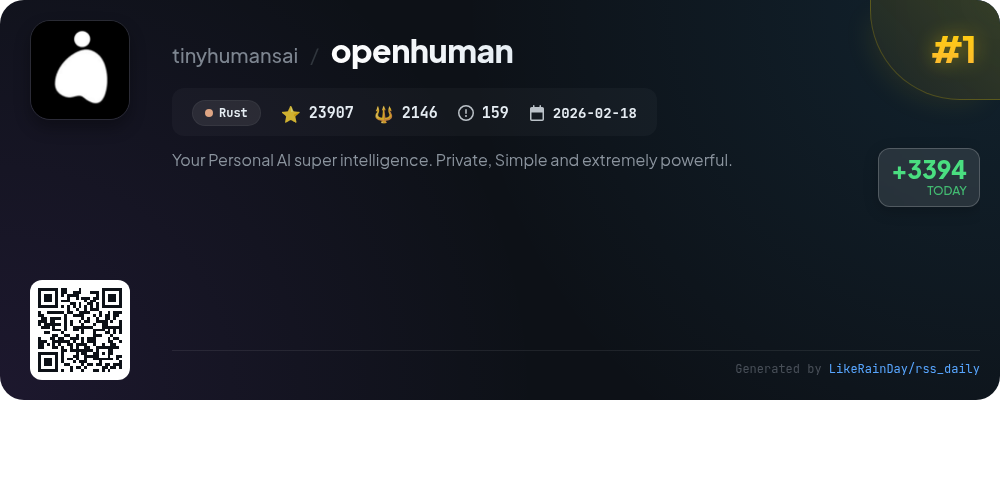
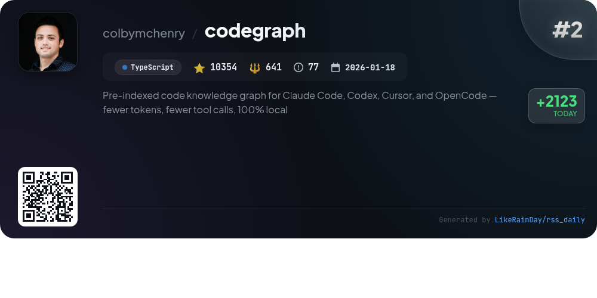
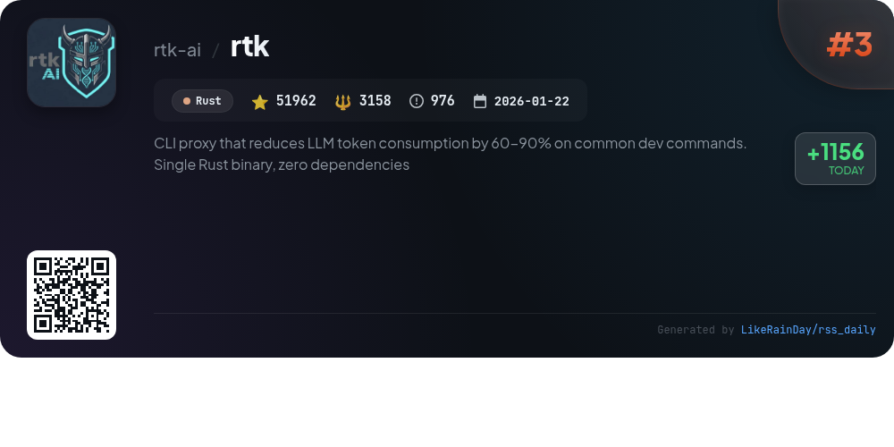
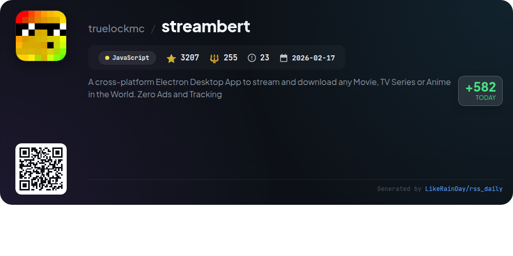
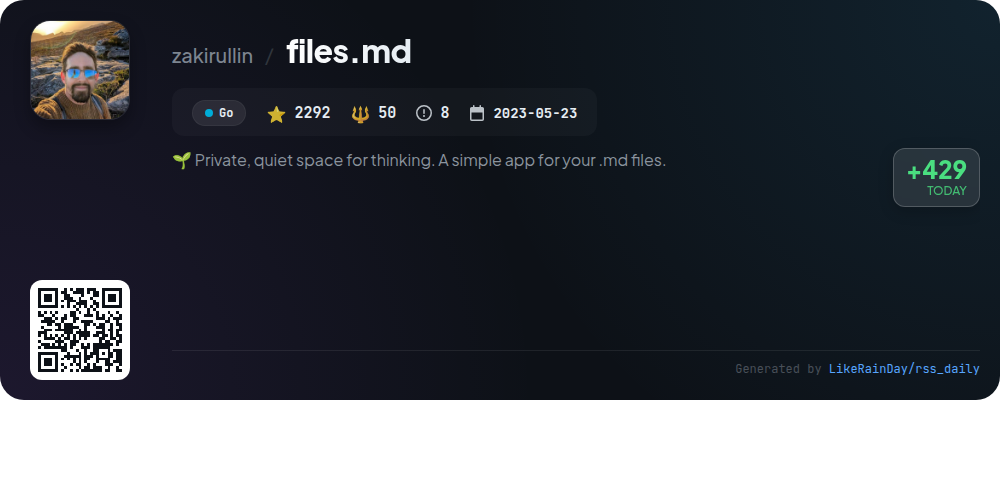
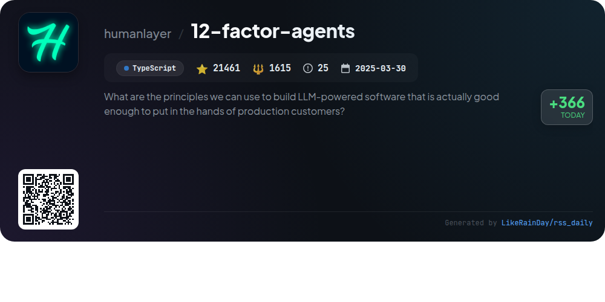
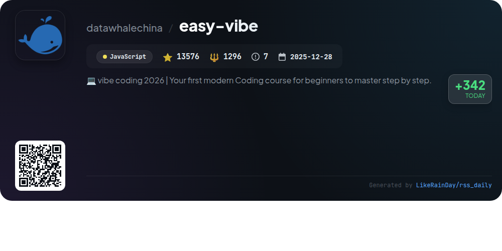

# 📊 🌟 GitHub Trending Daily - 2026-05-21

> > 📅 Daily Picks of GitHub Trending Repositories | Powered by Smart Algorithms

## 📋 Overview

**10** Projects | **266692** ⭐ | **20133** 🍴

**Top Languages:** `TypeScript` (5) · `JavaScript` (2) · `Rust` (2)

**Updated:** 2026-05-21 04:19 UTC

**Categories:**

- 🌟 Daily Top 10 (10 items)

---

## 🌟 Daily Top 10

### 1. [openhuman](https://github.com/tinyhumansai/openhuman)

> 🤖 **Why Recommend**  
> *OpenHuman is an open-source personal AI assistant designed to enhance daily productivity while prioritizing user privacy. Key features include a user-friendly interface, over 118 third-party integrations via one-click OAuth, and a unique Memory Tree that compiles and compresses your data into an Obsidian-compatible format. The agent learns context rapidly through auto-fetching data every 20 minutes. Built-in tools for web search, coding, and voice support streamline user experience. OpenHuman aims to minimize API sprawl and empower users with complete control over their data.*

- ⭐ 23907 stars
- 💻 Rust
- 📅 Updated: 2026-05-21

### 2. [codegraph](https://github.com/colbymchenry/codegraph)

> 🤖 **Why Recommend**  
> *CodeGraph is a pre-indexed code knowledge graph designed to enhance AI coding agents like Claude Code, Codex, Cursor, and OpenCode. It reduces costs by approximately 35%, cuts tool calls by 70%, and operates entirely locally, ensuring data privacy. Key features include smart context building, full-text search, impact analysis, and real-time file synchronization across 19+ programming languages. CodeGraph's architecture allows for instant symbol lookups and efficient code exploration, making it an essential tool for developers seeking to optimize their coding workflows.*

- ⭐ 10354 stars
- 💻 TypeScript
- 📅 Updated: 2026-05-21

### 3. [rtk](https://github.com/rtk-ai/rtk)

> 🤖 **Why Recommend**  
> *RTK is a high-performance CLI proxy that significantly reduces LLM token consumption by 60-90% on common development commands, utilizing a single Rust binary with zero dependencies. It supports over 100 commands, enabling smart filtering, grouping, and deduplication of outputs, which optimizes token usage. Key features include an auto-rewrite hook for seamless integration with AI tools like Claude Code and GitHub Copilot, and analytics to track token savings. With 51,962 stars, RTK is a valuable tool for developers aiming to enhance efficiency and reduce costs in LLM interactions.*

- ⭐ 51962 stars
- 💻 Rust
- 📅 Updated: 2026-05-21

### 4. [agentmemory](https://github.com/rohitg00/agentmemory)

> 🤖 **Why Recommend**  
> *agentmemory is a TypeScript-based project designed to provide persistent memory for AI coding agents, enabling them to retain context across sessions. Key features include automatic observation capture, hybrid semantic search, and a real-time viewer for live memory updates. It integrates seamlessly with multiple agents such as Claude Code, Codex, and Cursor, supporting 53 MCP tools and 12 auto hooks. With a retrieval accuracy of 95.2% and significantly reduced token usage, agentmemory enhances developer efficiency by eliminating repetitive explanations and improving contextual awareness in coding tasks.*

- ⭐ 15264 stars
- 💻 TypeScript
- 📅 Updated: 2026-05-21

### 5. [OpenWA](https://github.com/rmyndharis/OpenWA)

> 🤖 **Why Recommend**  
> *OpenWA is a free, open-source WhatsApp API Gateway that empowers developers with complete control over their messaging infrastructure. Key features include a REST API for sending messages, a modern web dashboard for management, multi-session support, and webhook capabilities. Built with a pluggable architecture, it allows seamless integration of different databases and storage solutions. OpenWA is Docker-ready, supports various messaging types, and includes extensive documentation. With 4,955 stars on GitHub, it is a robust solution for self-hosted messaging needs.*

- ⭐ 4955 stars
- 💻 TypeScript
- 📅 Updated: 2026-05-21

### 6. [streambert](https://github.com/truelockmc/streambert)

> 🤖 **Why Recommend**  
> *Streambert is a cross-platform Electron desktop app designed for streaming and downloading movies, TV series, and anime with zero ads and tracking. Key features include high-speed streaming, customizable interface, subtitle management, and a personal library to track and save content. It aggregates video streams from multiple sources, ensuring users can access a wide range of media. Streambert prioritizes user privacy and offers a seamless experience for discovering and downloading content. Ideal for those seeking an ad-free viewing experience.*

- ⭐ 3207 stars
- 💻 JavaScript
- 📅 Updated: 2026-05-21

### 7. [files.md](https://github.com/zakirullin/files.md)

> 🤖 **Why Recommend**  
> *Files.md is a Go-based application designed for managing `.md` files in a private, offline environment. It serves as a local-first space for notes, documents, journals, checklists, and tasks, ensuring user data remains on-device and secure. Key features include a lightweight web app, optional cloud synchronization (via iCloud, Dropbox, or self-hosted servers), and a Telegram chatbot for quick access. The app encourages creative thinking with its minimalistic design and allows users to connect ideas seamlessly. Open-source and easy to deploy, Files.md is ideal for those seeking a distraction-free knowledge management tool.*

- ⭐ 2292 stars
- 💻 Go
- 📅 Updated: 2026-05-21

### 8. [12-factor-agents](https://github.com/humanlayer/12-factor-agents)

> 🤖 **Why Recommend**  
> *The 12-factor-agents project provides principles for building reliable, LLM-powered applications that are production-ready. It emphasizes 12 core factors, such as owning prompts and context windows, leveraging structured outputs, and ensuring modularity for easier maintenance. The project aims to guide developers in creating high-quality AI agents by incorporating best practices from industry experience. With over 21,000 stars, it serves as a collaborative resource for enhancing AI applications in customer-facing scenarios, encouraging community contributions and discussions.*

- ⭐ 21461 stars
- 💻 TypeScript
- 📅 Updated: 2026-05-21

### 9. [easy-vibe](https://github.com/datawhalechina/easy-vibe)

> 🤖 **Why Recommend**  
> *Easy-Vibe is a beginner-friendly coding course designed to help users master programming step-by-step, supported by a vibrant community. With over 13,500 stars on GitHub, it features multilingual tutorials, interactive visual guides, and simulated coding environments. Key offerings include a structured learning map, hands-on projects, and resources for both novice and advanced developers. The curriculum covers everything from AI integration and full-stack development to practical exercises that transform ideas into real products, making it perfect for aspiring coders and product managers alike.*

- ⭐ 13576 stars
- 💻 JavaScript
- 📅 Updated: 2026-05-21

### 10. [clash-verge-rev](https://github.com/clash-verge-rev/clash-verge-rev)

> 🤖 **Why Recommend**  
> *Clash Verge Rev is a modern GUI client for tailored proxy experiences, built on Tauri, supporting Windows, macOS, and Linux. Key features include a sleek and customizable interface, built-in Clash.Meta kernel, configuration management, visual node editing, and WebDav synchronization. The project emphasizes performance, offering a robust user experience with support for TUN mode and system proxy management. With over 119,000 stars, it also promotes services like Doggygo VPN and GPTKefu, enhancing accessibility and customer support in the proxy landscape.*

- ⭐ 119714 stars
- 💻 TypeScript
- 📅 Updated: 2026-05-21

---

## 📡 RSS Subscription

Subscribe via RSS to get daily trending updates:

- 🔔 [RSS XML] (../../daily-top.xml)
- 🔔 [Daily Report] (../../GITHUB_TODAY.md)
- 🔔 [Daily Top 10](../../daily-top.xml)

---

*⚡ Powered by Smart Trending Algorithm | Generated at 2026-05-21 04:19:56 UTC
