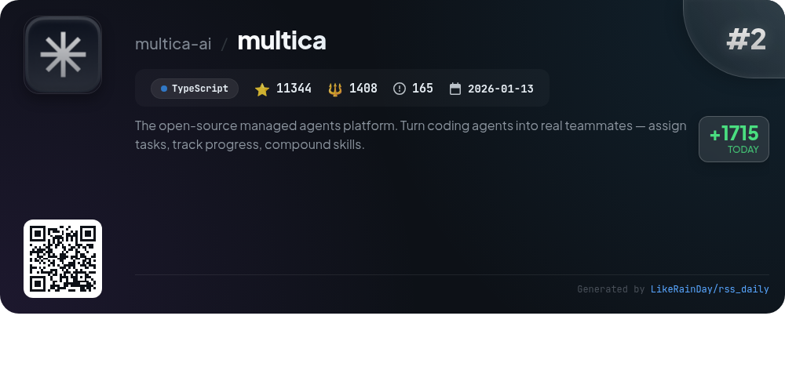
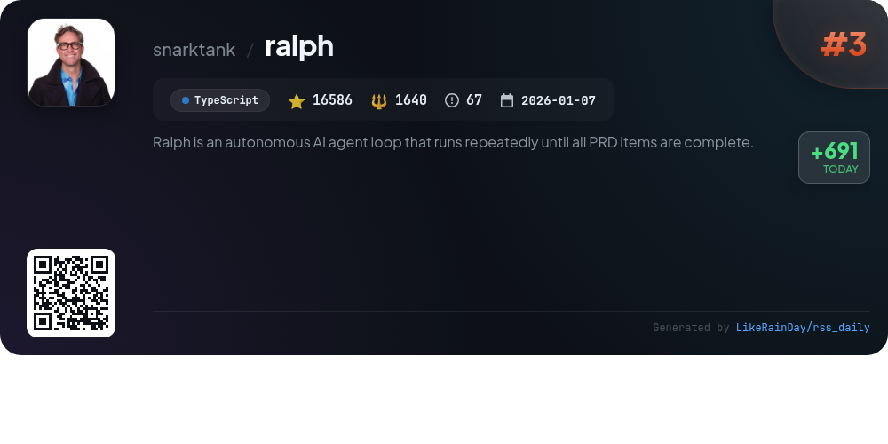
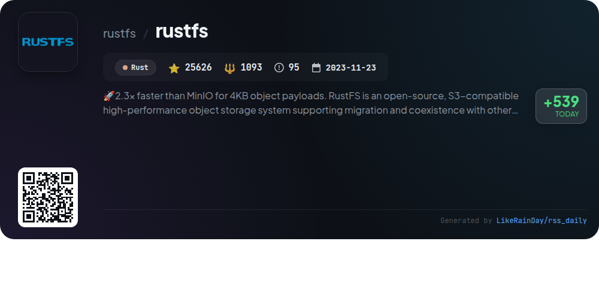
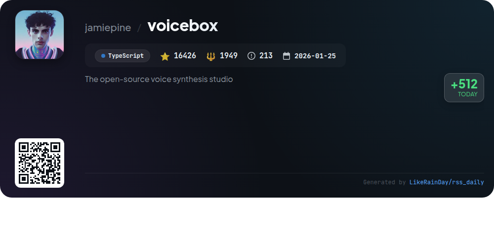
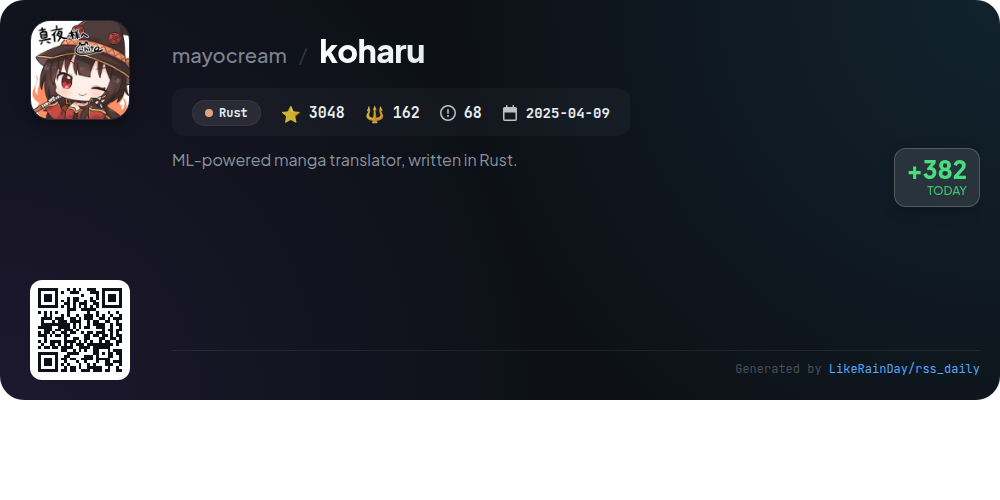
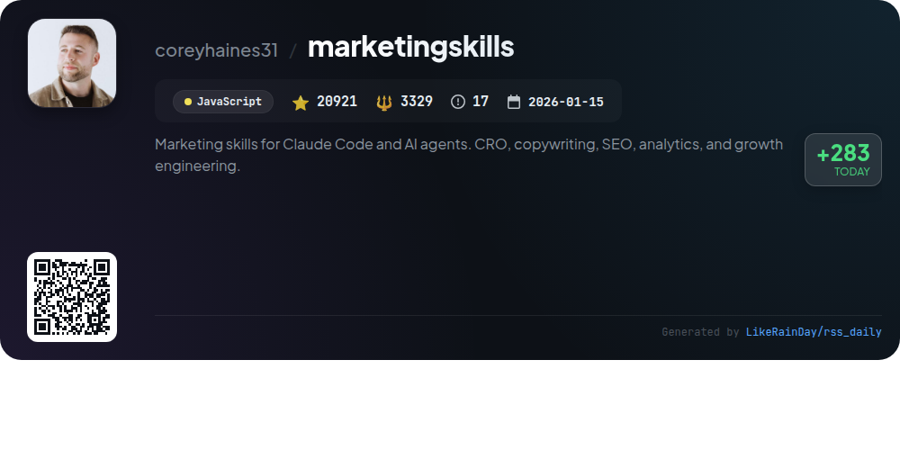

# 📊 🌟 GitHub Trending Daily - 2026-04-14

> > 📅 Daily Picks of GitHub Trending Repositories | Powered by Smart Algorithms

## 📋 Overview

**10** Projects | **229812** ⭐ | **23086** 🍴

**Top Languages:** `TypeScript` (5) · `JavaScript` (2) · `Rust` (2)

**Updated:** 2026-04-14 03:25 UTC

**Categories:**

- 🌟 Daily Top 10 (10 items)

---

## 🌟 Daily Top 10

### 1. [claude-mem](https://github.com/thedotmack/claude-mem)

> 🤖 **Why Recommend**  
> *Claude-Mem is a TypeScript plugin for Claude Code that enhances coding sessions by automatically capturing tool usage and generating AI-compressed summaries, preserving context across sessions. Key features include persistent memory for continuity, skill-based search capabilities, a web viewer for real-time memory streams, and privacy controls for sensitive data. The plugin supports seamless installation, integration with OpenClaw gateways, and offers experimental features like Endless Mode. With over 53,000 stars, it is designed to optimize coding efficiency and context management.*

- ⭐ 53633 stars
- 💻 TypeScript
- 📅 Updated: 2026-04-14

### 2. [multica](https://github.com/multica-ai/multica)

> 🤖 **Why Recommend**  
> *The open-source managed agents platform. Turn coding agents into real teammates — assign tasks, track progress, compound skills.. popular project, actively maintained, recently updated*

- ⭐ 11344 stars
- 🍴 1408 forks
- 💻 TypeScript
- 📅 Updated: 2026-04-14

### 3. [ralph](https://github.com/snarktank/ralph)

> 🤖 **Why Recommend**  
> *Ralph is an autonomous AI agent loop designed to iteratively complete Product Requirements Documents (PRDs) using AI coding tools like Amp and Claude Code. With 16,586 stars on GitHub, it excels in generating and converting PRDs into structured JSON for execution. Each iteration runs in a fresh context, utilizing git history, `progress.txt`, and `prd.json` for memory. Key features include automatic handoff for large tasks, integrated skills for PRD generation, and a robust workflow ensuring quality checks. Ralph enhances coding efficiency through feedback loops and continuous learning.*

- ⭐ 16586 stars
- 💻 TypeScript
- 📅 Updated: 2026-04-14

### 4. [Archon](https://github.com/coleam00/Archon)

> 🤖 **Why Recommend**  
> *Archon is the first open-source harness builder for AI coding, enabling deterministic and repeatable workflows. With over 17,000 stars, it allows users to define development processes in YAML, encompassing planning, implementation, validation, code review, and PR creation. Key features include isolated git worktrees for parallel tasks, a web UI for real-time monitoring, and a comprehensive suite of workflows for common development tasks. Archon facilitates seamless integration with platforms like Slack, Telegram, and GitHub, making AI coding efficient and structured.*

- ⭐ 17683 stars
- 💻 TypeScript
- 📅 Updated: 2026-04-14

### 5. [get-shit-done](https://github.com/gsd-build/get-shit-done)

> 🤖 **Why Recommend**  
> *get-shit-done is a lightweight meta-prompting and context engineering system designed for Claude Code and multiple AI coding environments, boasting over 52,000 stars on GitHub. It effectively mitigates context degradation during code generation by utilizing a structured workflow that includes phases for discussion, planning, execution, and verification. Key features include built-in quality gates, atomic git commits, and multi-agent orchestration, ensuring high-quality, efficient code development. Trusted by engineers from Amazon and Google, GSD streamlines the development process while maintaining clarity and control.*

- ⭐ 52232 stars
- 💻 JavaScript
- 📅 Updated: 2026-04-14

### 6. [rustfs](https://github.com/rustfs/rustfs)

> 🤖 **Why Recommend**  
> *RustFS is a high-performance, open-source object storage system built in Rust, boasting speeds 2.3x faster than MinIO for 4KB payloads. It supports full S3 compatibility, seamless migration from other platforms like MinIO and Ceph, and includes features such as distributed architecture, OpenStack Keystone integration, and data lake optimization. RustFS is licensed under Apache 2.0, ensuring community contributions without restrictive clauses. Ideal for big data, AI workloads, and edge devices, it combines safety, speed, and user-friendly management in a powerful console interface.*

- ⭐ 25626 stars
- 💻 Rust
- 📅 Updated: 2026-04-14

### 7. [voicebox](https://github.com/jamiepine/voicebox)

> 🤖 **Why Recommend**  
> *Voicebox is an open-source voice synthesis studio that allows users to clone voices, generate speech in 23 languages, and apply various effects locally on their machines. Key features include five TTS engines, expressive speech with paralinguistic tags, a multi-voice timeline editor for projects, and comprehensive privacy as all data remains on-device. Voicebox supports unlimited generation lengths, offers a REST API for integration, and features a user-friendly interface for voice profile management. Available on macOS, Windows, and Linux, it emphasizes native performance and privacy.*

- ⭐ 16426 stars
- 💻 TypeScript
- 📅 Updated: 2026-04-14

### 8. [koharu](https://github.com/mayocream/koharu)

> 🤖 **Why Recommend**  
> *Koharu is a Rust-based, ML-powered manga translator designed for a local-first workflow, ensuring user privacy. It automates manga translation using object detection, OCR, inpainting, and LLMs, offering features like automatic text region detection, layered PSD export, and advanced text rendering with support for various scripts. Koharu supports local GPU acceleration (CUDA, Metal, Vulkan) and integrates with local or remote LLM backends. With a built-in HTTP API and MCP server, it facilitates automation and easy integration, making it a comprehensive tool for manga translation.*

- ⭐ 3048 stars
- 💻 Rust
- 📅 Updated: 2026-04-14

### 9. [sub2api](https://github.com/Wei-Shaw/sub2api)

> 🤖 **Why Recommend**  
> *Sub2API is an open-source AI API gateway designed for managing and distributing API quotas from various AI services like Claude, OpenAI, and Gemini. Key features include multi-account management, API key generation, precise billing, smart scheduling, and built-in payment options (EasyPay, Alipay, WeChat Pay, Stripe). The platform also offers an admin dashboard for monitoring and external system integration. With over 12,000 stars, Sub2API streamlines cost-sharing and enhances user experience through efficient resource allocation.*

- ⭐ 12313 stars
- 💻 Go
- 📅 Updated: 2026-04-14

### 10. [marketingskills](https://github.com/coreyhaines31/marketingskills)

> 🤖 **Why Recommend**  
> *The `marketingskills` project offers a comprehensive collection of marketing-focused skills for AI agents, enhancing capabilities in conversion optimization, copywriting, SEO, analytics, and growth engineering. Designed for technical marketers and founders, it integrates seamlessly with systems like Claude Code and OpenAI Codex. Key features include a modular skill system that allows agents to utilize specialized workflows for various marketing tasks. The repository also supports contributions and offers resources like hands-on assistance through Conversion Factory and a guide for coding marketers.*

- ⭐ 20921 stars
- 💻 JavaScript
- 📅 Updated: 2026-04-14

---

## 📡 RSS Subscription

Subscribe via RSS to get daily trending updates:

- 🔔 [RSS XML] (../../daily-top.xml)
- 🔔 [Daily Report] (../../GITHUB_TODAY.md)
- 🔔 [Daily Top 10](../../daily-top.xml)

---

*⚡ Powered by Smart Trending Algorithm | Generated at 2026-04-14 03:25:53 UTC
