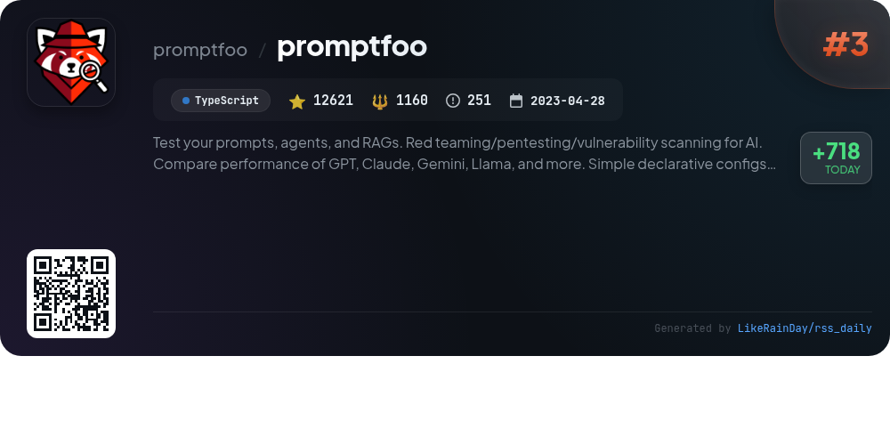
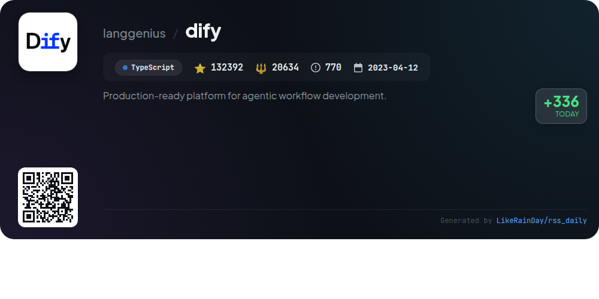
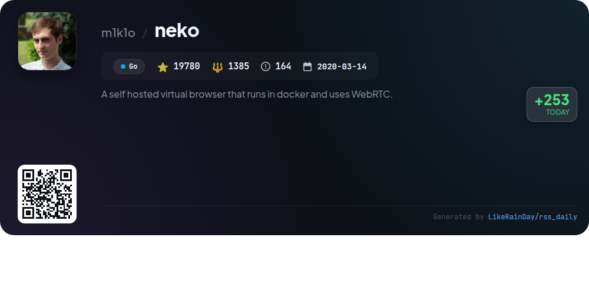
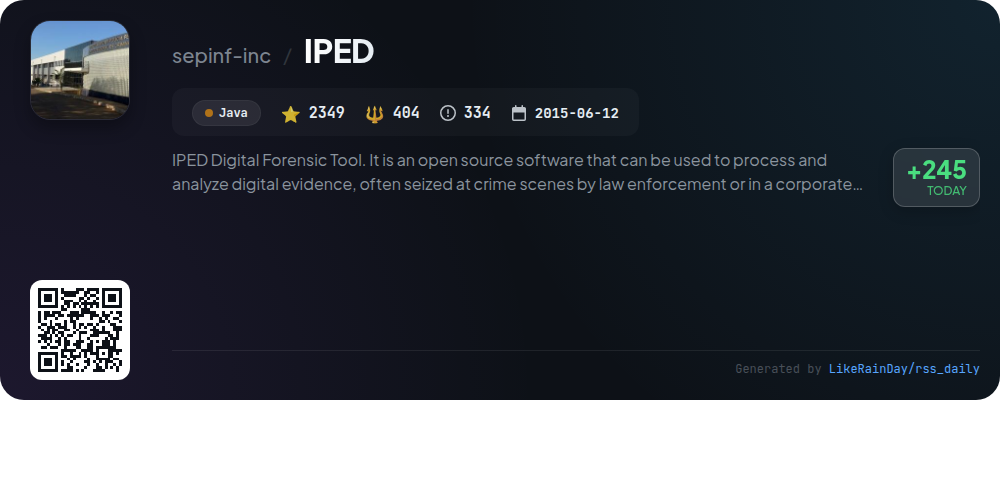
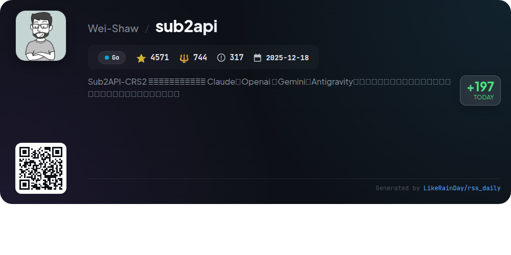

# 📊 🌟 GitHub Trending Daily - 2026-03-12

> > 📅 Daily Picks of GitHub Trending Repositories | Powered by Smart Algorithms

## 📋 Overview

**10** Projects | **577911** ⭐ | **93369** 🍴

**Top Languages:** `TypeScript` (4) · `Go` (2) · `JavaScript` (2)

**Updated:** 2026-03-12 02:43 UTC

**Categories:**

- 🌟 Daily Top 10 (10 items)

---

## 🌟 Daily Top 10

### 1. [openclaw](https://github.com/openclaw/openclaw)

> 🤖 **Why Recommend**  
> *OpenClaw is a versatile personal AI assistant that operates across multiple platforms and messaging services, including WhatsApp, Telegram, Discord, Slack, and more. Key features include a local-first Gateway for managing sessions and tools, multi-channel support for seamless communication, and voice interaction capabilities on macOS and Android. With a simple onboarding wizard, users can set up and customize their experience. OpenClaw also offers a live Canvas workspace, companion apps for macOS/iOS/Android, and robust automation tools, making it a powerful assistant for personal use.*

- ⭐ 304309 stars
- 💻 TypeScript
- 📅 Updated: 2026-03-12

### 2. [page-agent](https://github.com/alibaba/page-agent)

> 🤖 **Why Recommend**  
> *JavaScript in-page GUI agent. Control web interfaces with natural language.. popular project, actively maintained, recently updated*

- ⭐ 4881 stars
- 🍴 384 forks
- 💻 TypeScript
- 📅 Updated: 2026-03-12

### 3. [promptfoo](https://github.com/promptfoo/promptfoo)

> 🤖 **Why Recommend**  
> *Promptfoo is a powerful CLI and library designed for evaluating and securing LLM applications. With capabilities for automated prompt testing, red teaming, and vulnerability scanning, it allows developers to ensure the reliability and security of their AI apps. Key features include side-by-side model comparisons (supporting providers like OpenAI and Anthropic), CI/CD integration, and local evaluations to maintain privacy. Open-sourced and developer-friendly, Promptfoo empowers teams to make data-driven decisions while fostering collaboration through shared results and community support.*

- ⭐ 12621 stars
- 💻 TypeScript
- 📅 Updated: 2026-03-12

### 4. [get-shit-done](https://github.com/gsd-build/get-shit-done)

> 🤖 **Why Recommend**  
> *get-shit-done is a lightweight, powerful meta-prompting and context engineering system designed for Claude Code, OpenCode, Gemini CLI, and Codex. It effectively mitigates context rot, enhancing the quality of generated code. Key features include a streamlined command structure for initializing projects, capturing implementation contexts, and executing parallel tasks with atomic git commits. Trusted by engineers from major tech companies, GSD simplifies the development process while ensuring high-quality, reliable outputs through automated verification and meticulous planning.*

- ⭐ 28199 stars
- 💻 JavaScript
- 📅 Updated: 2026-03-12

### 5. [impeccable](https://github.com/pbakaus/impeccable)

> 🤖 **Why Recommend**  
> *Impeccable is a JavaScript design language project enhancing AI capabilities in frontend design with 4,098 stars on GitHub. It builds on Anthropic's frontend-design skill, offering an expanded toolkit with 7 domain-specific references and 17 commands for auditing, reviewing, and optimizing designs. Key features include curated anti-patterns to avoid common design mistakes, such as overused fonts and poor color contrasts. Users can quickly start by visiting impeccable.style for ready-to-use bundles and case studies showcasing its effectiveness in transforming UI designs.*

- ⭐ 4098 stars
- 💻 JavaScript
- 📅 Updated: 2026-03-12

### 6. [dify](https://github.com/langgenius/dify)

> 🤖 **Why Recommend**  
> *Dify is a production-ready, open-source platform for developing AI workflows. It features an intuitive visual canvas for building complex workflows, seamless integration with diverse LLMs, and robust tools for monitoring and optimizing performance. Key highlights include a Prompt IDE for crafting prompts, a comprehensive RAG pipeline for document processing, and agent capabilities with over 50 built-in tools. Dify offers both cloud hosting and self-hosting options, catering to individual developers and enterprises alike, making it easy to prototype and deploy AI applications.*

- ⭐ 132392 stars
- 💻 TypeScript
- 📅 Updated: 2026-03-12

### 7. [neko](https://github.com/m1k1o/neko)

> 🤖 **Why Recommend**  
> *Neko is a self-hosted virtual browser leveraging WebRTC, designed to run in Docker. With over 19,000 stars, it enables secure and private internet access from anywhere. Key features include multi-user support for collaborative browsing, interactive presentations, and watch parties, making it ideal for teams and social gatherings. Users can run various applications within a secure environment, maintain persistent sessions, and share access effortlessly. Neko supports multiple browsers and desktop environments, offering flexibility for developers and privacy-conscious users alike.*

- ⭐ 19780 stars
- 💻 Go
- 📅 Updated: 2026-03-12

### 8. [codex](https://github.com/openai/codex)

> 🤖 **Why Recommend**  
> *Codex is a lightweight coding agent by OpenAI that runs locally in your terminal, with over 64,700 stars on GitHub. Built in Rust, it can be installed via npm or Homebrew. Codex offers seamless integration into code editors like VS Code and provides a desktop app experience. Users can sign in with a ChatGPT account for enhanced features or use an API key. Key highlights include easy installation, versatile platform support, and comprehensive documentation. Explore Codex for efficient coding assistance in your development workflow.*

- ⭐ 64711 stars
- 💻 Rust
- 📅 Updated: 2026-03-12

### 9. [IPED](https://github.com/sepinf-inc/IPED)

> 🤖 **Why Recommend**  
> *IPED is an open-source digital forensic tool designed for processing and analyzing digital evidence, developed by Brazilian Federal Police experts since 2012. Key features include command-line batch processing, multi-platform support, and an intuitive analysis interface. It supports various disk image formats and offers advanced functionalities like hash deduplication, file categorization, georeferencing, regex searches, and audio transcription. Additionally, it provides powerful data carving, customizable filters, and a web API for remote case management, making it ideal for law enforcement and corporate investigations.*

- ⭐ 2349 stars
- 💻 Java
- 📅 Updated: 2026-03-12

### 10. [sub2api](https://github.com/Wei-Shaw/sub2api)

> 🤖 **Why Recommend**  
> *Sub2API is an open-source AI API gateway platform designed for efficient management and distribution of API quotas from various AI product subscriptions like Claude, OpenAI, and Gemini. Key features include multi-account support, API key generation, precise billing with token-level tracking, smart scheduling, concurrency control, and an admin dashboard for effective monitoring. Built with Go, Vue, PostgreSQL, and Redis, it offers a straightforward installation via scripts or Docker. The platform supports shared usage to reduce costs while providing seamless integration with native tools.*

- ⭐ 4571 stars
- 💻 Go
- 📅 Updated: 2026-03-12

---

## 📡 RSS Subscription

Subscribe via RSS to get daily trending updates:

- 🔔 [RSS XML] (../../daily-top.xml)
- 🔔 [Daily Report] (../../GITHUB_TODAY.md)
- 🔔 [Daily Top 10](../../daily-top.xml)

---

*⚡ Powered by Smart Trending Algorithm | Generated at 2026-03-12 02:43:10 UTC
