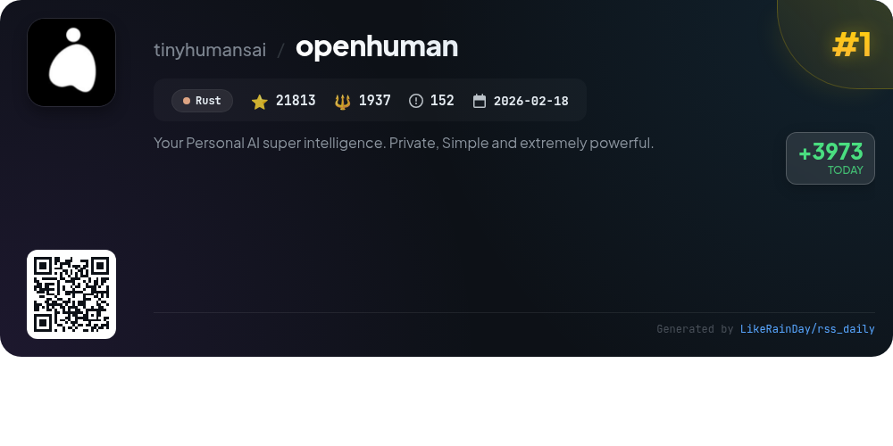
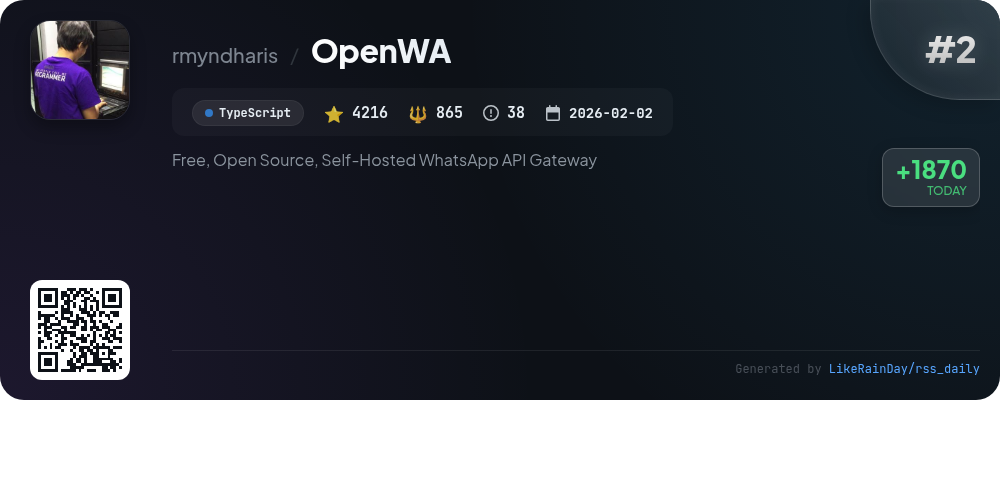
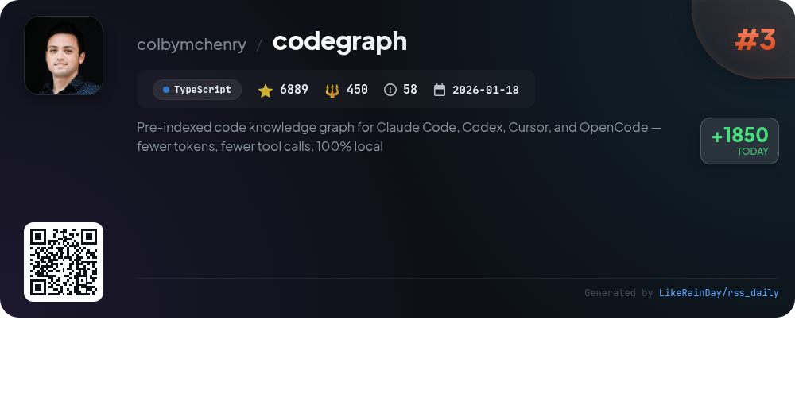
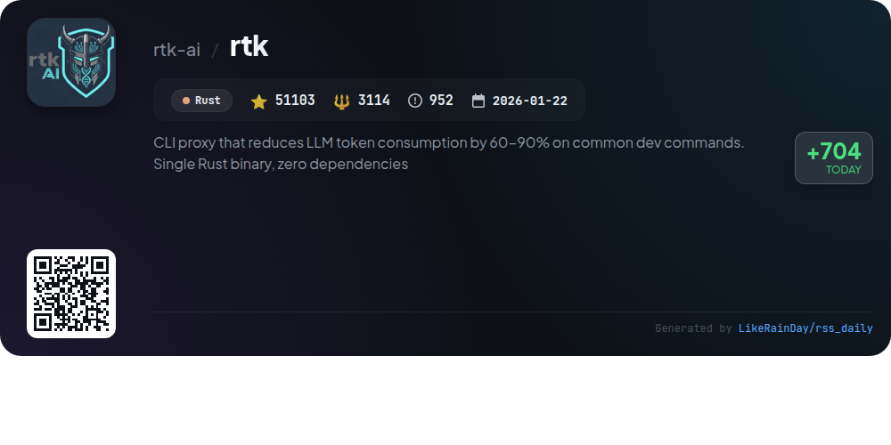
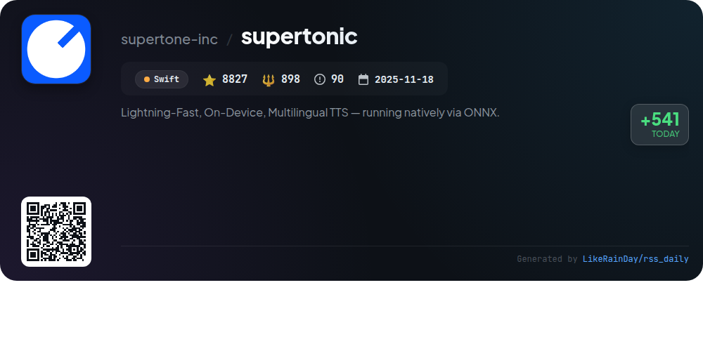
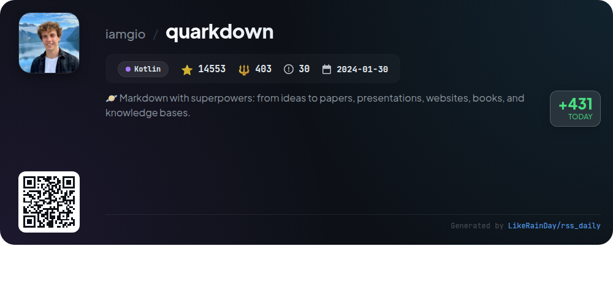

# 📊 🌟 GitHub Trending Daily - 2026-05-20

> > 📅 Daily Picks of GitHub Trending Repositories | Powered by Smart Algorithms

## 📋 Overview

**10** Projects | **256717** ⭐ | **29108** 🍴

**Top Languages:** `TypeScript` (4) · `Rust` (2) · `C++` (1)

**Updated:** 2026-05-20 04:11 UTC

**Categories:**

- 🌟 Daily Top 10 (10 items)

---

## 🌟 Daily Top 10

### 1. [openhuman](https://github.com/tinyhumansai/openhuman)

> 🤖 **Why Recommend**  
> *OpenHuman is an open-source AI assistant designed to integrate seamlessly into daily life, emphasizing privacy and usability. Key features include a user-friendly interface, over 118 third-party integrations with auto-fetch capabilities, and a unique Memory Tree that organizes user data into a local knowledge base. It offers built-in tools for web scraping, coding, and voice interaction. OpenHuman minimizes vendor sprawl, maintains on-device data security, and provides a persistent memory for enhanced context and efficiency, all while operating under an early beta status.*

- ⭐ 21813 stars
- 💻 Rust
- 📅 Updated: 2026-05-20

### 2. [OpenWA](https://github.com/rmyndharis/OpenWA)

> 🤖 **Why Recommend**  
> *OpenWA is a free, open-source WhatsApp API Gateway enabling developers to manage their messaging infrastructure without vendor lock-in. Key features include a REST API for messaging, multi-session management, webhooks, and a modern dashboard for visual management. Its pluggable architecture allows easy swapping of databases (SQLite/PostgreSQL), storage backends (Local/S3), and caching layers (Redis). With Docker support for seamless deployment, OpenWA empowers automation and integration, making it ideal for custom WhatsApp solutions.*

- ⭐ 4216 stars
- 💻 TypeScript
- 📅 Updated: 2026-05-20

### 3. [codegraph](https://github.com/colbymchenry/codegraph)

> 🤖 **Why Recommend**  
> *CodeGraph is a pre-indexed code knowledge graph designed to enhance tools like Claude Code, Codex, Cursor, and OpenCode. It dramatically reduces tool calls by 94% and accelerates exploration by 77%, all while keeping data 100% local. Key features include smart context building, full-text search, impact analysis, and support for over 19 programming languages. The interactive installer simplifies setup, while automatic syncing ensures the graph remains current. With framework-aware routing, CodeGraph significantly streamlines codebase exploration and understanding.*

- ⭐ 6889 stars
- 💻 TypeScript
- 📅 Updated: 2026-05-20

### 4. [agentmemory](https://github.com/rohitg00/agentmemory)

> 🤖 **Why Recommend**  
> *Agentmemory is a TypeScript-based memory engine for AI coding agents, boasting over 14,000 stars on GitHub. It enables persistent memory across various agents such as Claude Code, Codex CLI, and Gemini, eliminating the need for repetitive explanations. Key features include automatic observation capture, hybrid semantic search, and a real-time viewer for monitoring memory. With a high retrieval accuracy of 95.2% and significant token savings, Agentmemory provides a robust solution for enhancing AI interactions. It supports multiple integration methods via a flexible MCP server and REST API.*

- ⭐ 14331 stars
- 💻 TypeScript
- 📅 Updated: 2026-05-20

### 5. [streambert](https://github.com/truelockmc/streambert)

> 🤖 **Why Recommend**  
> *Streambert is a cross-platform Electron desktop app designed for streaming and downloading movies, TV series, and anime without ads or tracking. Key features include fast streaming and downloading, subtitle management, a customizable interface, and a library to track watched content. Users can access a wide range of media sourced from VidSrc and AniList, ensuring a diverse viewing experience. Streambert prioritizes user privacy and offers trending content discovery, making it an ideal choice for entertainment enthusiasts seeking a streamlined viewing solution.*

- ⭐ 2219 stars
- 💻 JavaScript
- 📅 Updated: 2026-05-20

### 6. [12-factor-agents](https://github.com/humanlayer/12-factor-agents)

> 🤖 **Why Recommend**  
> *12-Factor Agents is a TypeScript project aimed at establishing principles for building reliable LLM-powered applications suitable for production environments. With over 21,000 stars, it emphasizes modular design patterns and integrates 12 key factors to enhance the reliability and scalability of AI agents, including owning prompts, managing context windows, and ensuring state unification. The project encourages community contributions and provides resources for developers seeking to build effective AI solutions. Key highlights include a focus on error management and the seamless integration of human interaction through tool calls.*

- ⭐ 21262 stars
- 💻 TypeScript
- 📅 Updated: 2026-05-20

### 7. [rtk](https://github.com/rtk-ai/rtk)

> 🤖 **Why Recommend**  
> *RTK is a high-performance CLI proxy written in Rust that reduces LLM token consumption by 60-90% on common development commands, offering a single binary with zero dependencies. With support for over 100 commands, RTK employs smart filtering, grouping, truncation, and deduplication to optimize outputs before reaching the LLM context. Key features include Git, file management, and test runner integrations, providing analytics for token savings. Designed for developers, it enhances productivity while minimizing costs associated with LLM usage.*

- ⭐ 51103 stars
- 💻 Rust
- 📅 Updated: 2026-05-20

### 8. [llama.cpp](https://github.com/ggml-org/llama.cpp)

> 🤖 **Why Recommend**  
> *llama.cpp is a powerful library for large language model (LLM) inference in C/C++, boasting over 111,000 stars on GitHub. It offers a plain C/C++ implementation with no dependencies, optimized for various architectures including ARM, AVX, and RISC-V. Key features include advanced quantization options, custom CUDA kernels, and multimodal support via llama-server. It provides easy installation via different package managers and Docker, along with a user-friendly CLI and HTTP server for model serving. Enhanced with extensive model support and integration tools, llama.cpp aims for high performance across diverse hardware setups.*

- ⭐ 111504 stars
- 💻 C++
- 📅 Updated: 2026-05-20

### 9. [supertonic](https://github.com/supertone-inc/supertonic)

> 🤖 **Why Recommend**  
> *Supertonic is a lightning-fast, on-device multilingual text-to-speech (TTS) system that operates using ONNX Runtime, ensuring low-latency synthesis across various platforms, including desktop and mobile. It supports 31 languages with a compact 99M-parameter model, delivering studio-quality 44.1kHz audio. Key features include expression tags for natural speech nuances, zero network dependency, and compatibility with multiple programming languages via SDKs. Supertonic also offers a Voice Builder for custom voice profiles and provides ready-to-use examples for developers.*

- ⭐ 8827 stars
- 💻 Swift
- 📅 Updated: 2026-05-20

### 10. [quarkdown](https://github.com/iamgio/quarkdown)

> 🤖 **Why Recommend**  
> *Quarkdown is a versatile Markdown-based typesetting system that transforms your ideas into documents, presentations, websites, and more. Built in Kotlin, it features a Turing-complete Markdown extension, enabling functions, conditional statements, and dynamic content creation. Quarkdown supports various output formats, including HTML, PDF, and plain text, making it suitable for academic papers, books, and knowledge bases. With fast compilation, live preview, and a robust VS Code extension, Quarkdown empowers users to create complex documents effortlessly. Join its thriving community with over 14,500 stars on GitHub.*

- ⭐ 14553 stars
- 💻 Kotlin
- 📅 Updated: 2026-05-20

---

## 📡 RSS Subscription

Subscribe via RSS to get daily trending updates:

- 🔔 [RSS XML] (../../daily-top.xml)
- 🔔 [Daily Report] (../../GITHUB_TODAY.md)
- 🔔 [Daily Top 10](../../daily-top.xml)

---

*⚡ Powered by Smart Trending Algorithm | Generated at 2026-05-20 04:11:10 UTC
