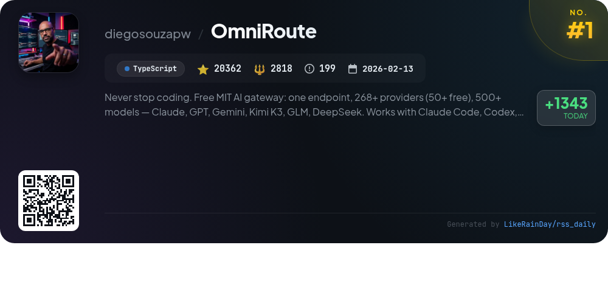
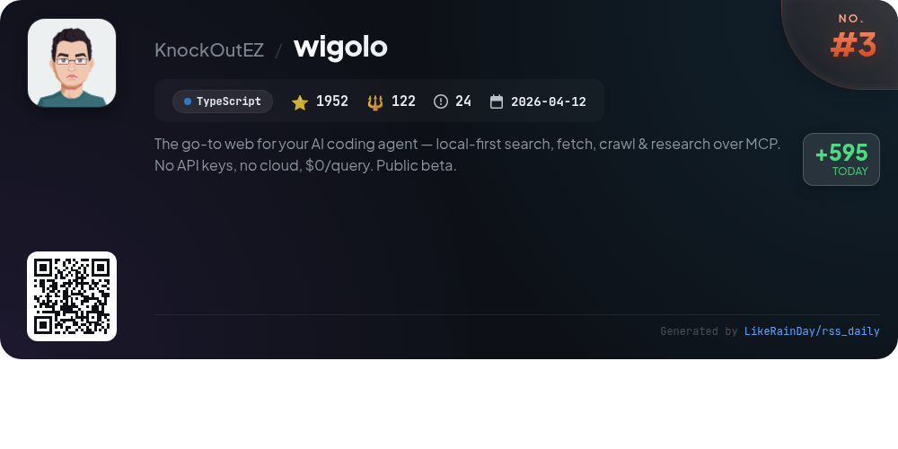
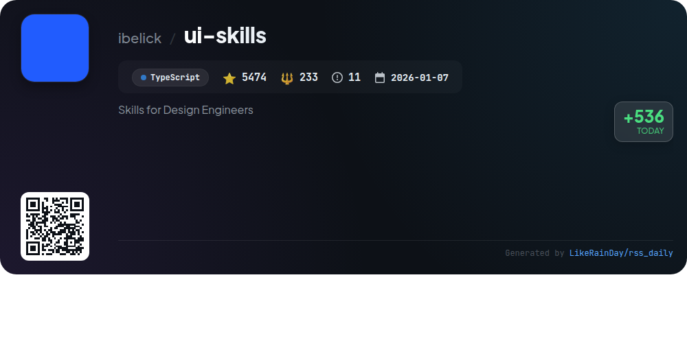
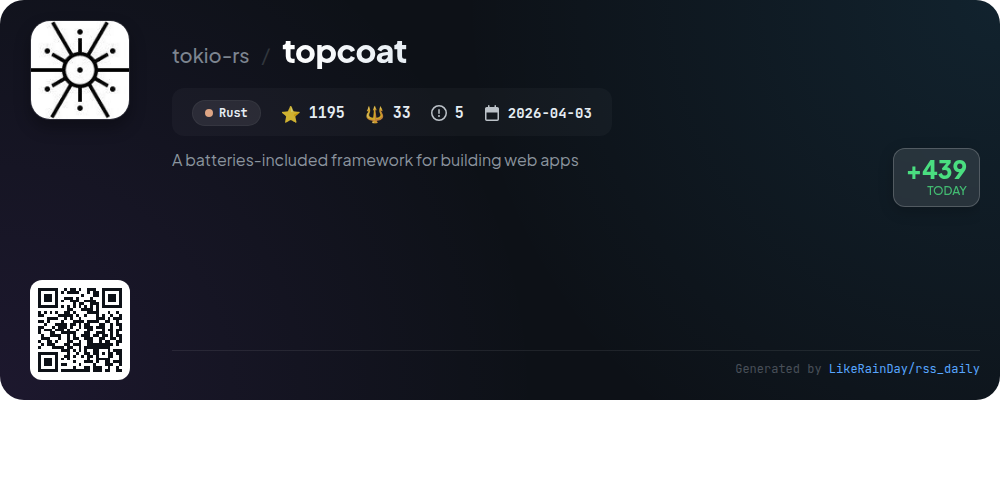
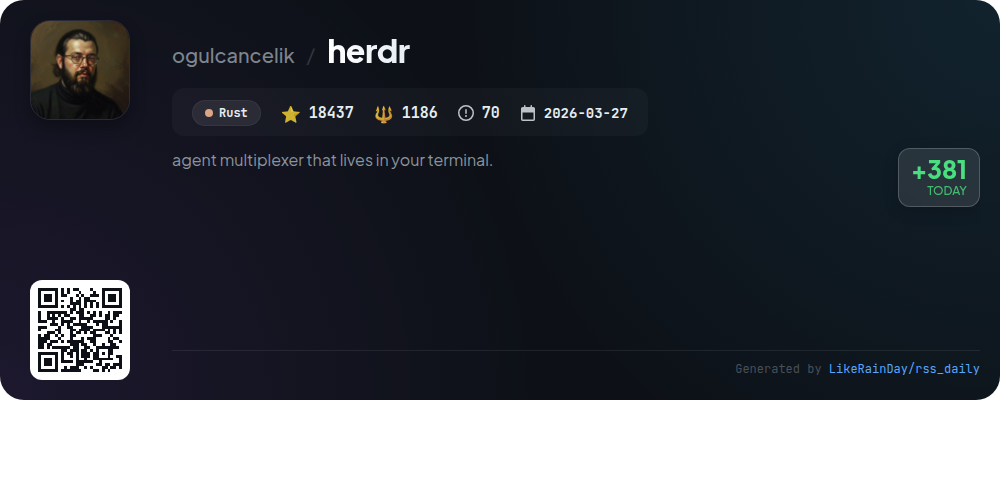
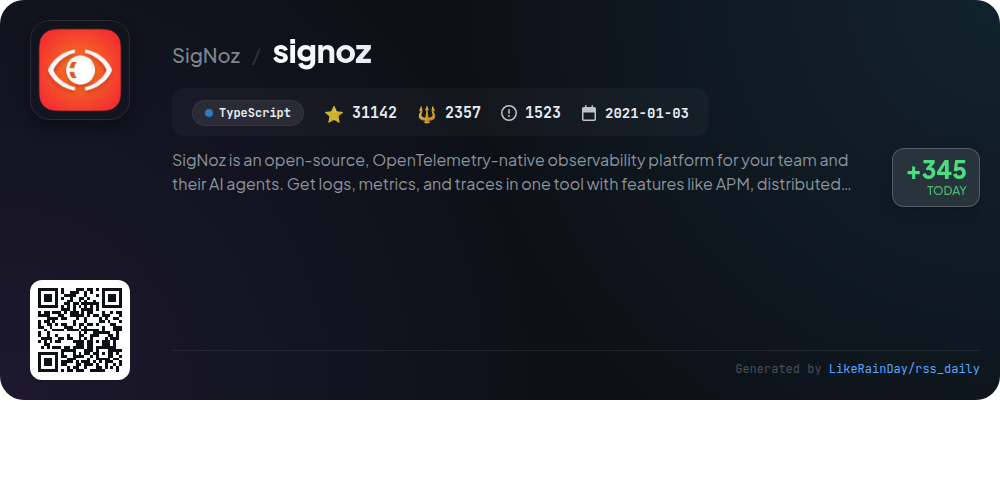
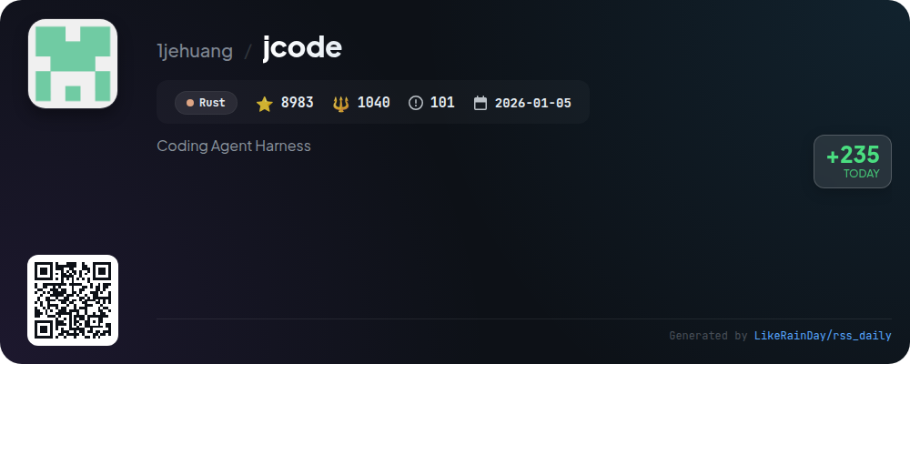

# 📊 🌟 GitHub Trending Daily - 2026-07-20

> > 📅 Daily Picks of GitHub Trending Repositories | Powered by Smart Algorithms

## 📋 Overview

**10** Projects | **259137** ⭐ | **32082** 🍴

**Top Languages:** `TypeScript` (7) · `Rust` (3)

**Updated:** 2026-07-20 03:44 UTC

**Categories:**

- 🌟 Daily Top 10 (10 items)

---

## 🌟 Daily Top 10

### 1. [OmniRoute](https://github.com/diegosouzapw/OmniRoute)

> 🤖 **Why Recommend**  
> *OmniRoute is a free AI gateway that unifies access to over 268 AI providers (90+ free) and 500+ models, including Claude, GPT, and Gemini, through a single endpoint. Key features include quota-aware auto-fallback, advanced token compression saving 15-95% tokens, and support for various coding agents like Claude Code and Copilot. With 18 routing strategies, it optimizes cost and performance while ensuring seamless integration across platforms. Built by over 500 contributors, OmniRoute empowers developers to maximize AI capabilities with minimal costs and complexity.*

- ⭐ 20362 stars
- 💻 TypeScript
- 📅 Updated: 2026-07-20

### 2. [voicebox](https://github.com/jamiepine/voicebox)

> 🤖 **Why Recommend**  
> *Voicebox is an open-source AI voice studio enabling users to clone voices, generate speech, and dictate across applications, all while ensuring privacy by running locally. Key features include support for seven TTS engines, voice cloning from short audio samples, and multilingual capabilities across 23 languages. Users can apply post-processing effects, manage voice profiles, and utilize a global dictation hotkey. Voicebox also integrates with MCP-aware agents for dynamic voice interactions and offers an API for custom applications. With a user-friendly interface and robust functionality, it serves as a comprehensive tool for voice-related tasks.*

- ⭐ 43490 stars
- 💻 TypeScript
- 📅 Updated: 2026-07-20

### 3. [wigolo](https://github.com/KnockOutEZ/wigolo)

> 🤖 **Why Recommend**  
> *wigolo is a local-first web intelligence tool for AI agents, enabling search, fetch, crawl, extract, and cache functionalities without API keys or cloud reliance, ensuring $0 per query. It seamlessly integrates with various coding agents like Claude Code, Cursor, and Codex, and supports multiple protocols (MCP, REST). Key features include multi-engine web search, structured data extraction, and an autonomous gather loop for research. Designed for privacy and efficiency, wigolo is currently in public beta, offering high-quality results comparable to paid services.*

- ⭐ 1952 stars
- 💻 TypeScript
- 📅 Updated: 2026-07-20

### 4. [ui-skills](https://github.com/ibelick/ui-skills)

> 🤖 **Why Recommend**  
> *UI Skills is a TypeScript-based CLI tool designed for design engineers, boasting 5,474 stars on GitHub. The project helps users navigate essential UI skill sets with commands like `npx ui-skills start`, `categories`, and `list`. Key features include tailored support for various design tasks and access to a motion category. The platform aims to enhance design workflows efficiently. For more information, visit [ui-skills.com](http://ui-skills.com/). The project is licensed under the MIT license.*

- ⭐ 5474 stars
- 💻 TypeScript
- 📅 Updated: 2026-07-20

### 5. [topcoat](https://github.com/tokio-rs/topcoat)

> 🤖 **Why Recommend**  
> *Topcoat is a full-stack Rust framework designed for building web apps with simplicity and productivity in mind. It features server-rendered components that eliminate the need for an API layer, allowing direct database queries and client reactivity without boilerplate. Topcoat includes a module-based routing system, built-in Tailwind CSS support, and premade UI components. The asset bundling system efficiently serves static files, while utility macros streamline HTML templating. With a focus on modularity and performance, Topcoat aims to enhance developer experience in Rust web development.*

- ⭐ 1195 stars
- 💻 Rust
- 📅 Updated: 2026-07-20

### 6. [herdr](https://github.com/ogulcancelik/herdr)

> 🤖 **Why Recommend**  
> *Herdr is a terminal-based agent multiplexer designed to streamline workflows by providing a real-time view of all agents—blocked, working, or done. Key features include detachable sessions that persist across terminal restarts, support for both keyboard and mouse interactions, and a pure socket API for agent communication. Users can enhance functionality with plugins from a marketplace. Built in Rust, Herdr avoids the bloat of Electron, making it lightweight and efficient. Comprehensive documentation and installation instructions are available at herdr.dev.*

- ⭐ 18437 stars
- 💻 Rust
- 📅 Updated: 2026-07-20

### 7. [signoz](https://github.com/SigNoz/signoz)

> 🤖 **Why Recommend**  
> *SigNoz is an open-source observability platform built on OpenTelemetry, offering a unified solution for logs, metrics, and traces. Key features include APM, distributed tracing, log management, infrastructure monitoring, and AI observability. Users can choose from a fully managed cloud service, enterprise solutions, or self-hosted options, ensuring data control. SigNoz provides correlated signals, predictable pricing, and compliance features, making it an enterprise-ready alternative to fragmented monitoring tools. With over 31,000 stars on GitHub, it streamlines debugging and enhances application resilience.*

- ⭐ 31142 stars
- 💻 TypeScript
- 📅 Updated: 2026-07-20

### 8. [gstack](https://github.com/garrytan/gstack)

> 🤖 **Why Recommend**  
> *gstack is an open-source software factory that empowers solo builders to ship products at scale, utilizing AI agents for various roles like CEO, Designer, and QA. It features 23 specialized tools, all command-driven, enabling seamless processes from planning to deployment. Key highlights include automated design reviews, real-time QA with a browser interface, and integrations with multiple AI coding agents. Designed for founders and technical leads, gstack enhances productivity by streamlining workflows and ensuring rigorous code quality. Fork it, improve it, and elevate your development speed.*

- ⭐ 123020 stars
- 💻 TypeScript
- 📅 Updated: 2026-07-20

### 9. [jcode](https://github.com/1jehuang/jcode)

> 🤖 **Why Recommend**  
> *jcode is an advanced coding agent harness built in Rust, designed for enhanced performance and multi-session workflows. With over 8,900 stars on GitHub, it offers infinite customizability, efficient memory management, and real-time collaboration through swarm functionality. Key features include a high-performance UI, browser automation capabilities, and support for various OAuth providers like OpenAI and GitHub Copilot. Jcode's unique memory system enables context-aware interactions, while self-development mode allows agents to modify their source code for continuous improvement.*

- ⭐ 8983 stars
- 💻 Rust
- 📅 Updated: 2026-07-20

### 10. [open-seo](https://github.com/every-app/open-seo)

> 🤖 **Why Recommend**  
> *OpenSEO is an open-source SEO tool designed as an affordable alternative to Semrush and Ahrefs, featuring a modern, user-friendly interface. With core functionalities like keyword research, rank tracking, competitor insights, backlinks, and site audits, it empowers users to manage their SEO effectively. OpenSEO integrates seamlessly with AI agents for enhanced workflows and offers flexible hosting options, including self-hosting via Docker or Cloudflare. Users pay only for the DataForSEO API they utilize, making it a cost-effective choice for SEO management.*

- ⭐ 5082 stars
- 💻 TypeScript
- 📅 Updated: 2026-07-20

---

## 📡 RSS Subscription

Subscribe via RSS to get daily trending updates:

- 🔔 [RSS XML] (../../daily-top.xml)
- 🔔 [Daily Report] (../../GITHUB_TODAY.md)
- 🔔 [Daily Top 10](../../daily-top.xml)

---

*⚡ Powered by Smart Trending Algorithm | Generated at 2026-07-20 03:44:44 UTC
