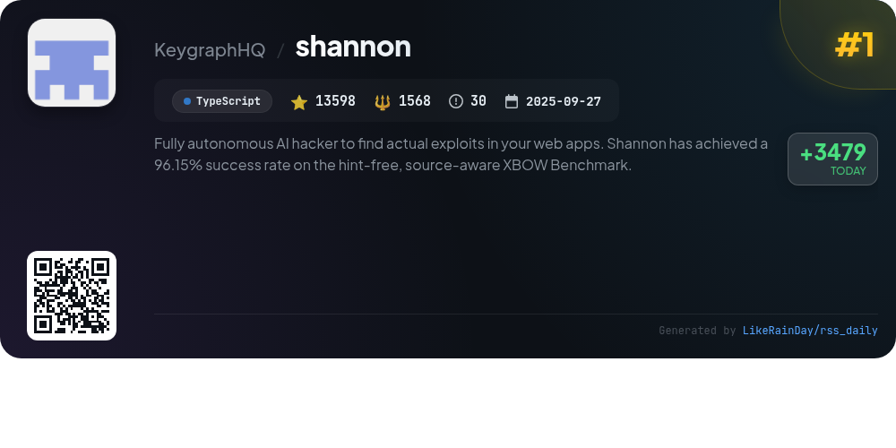
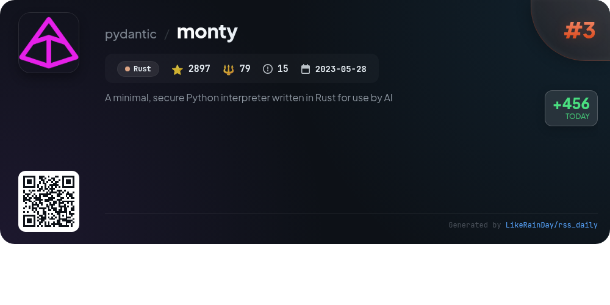
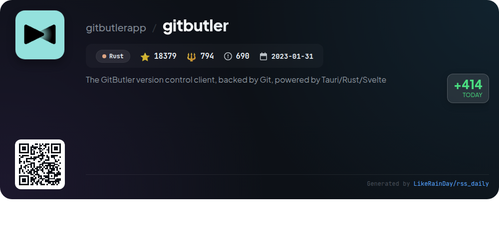
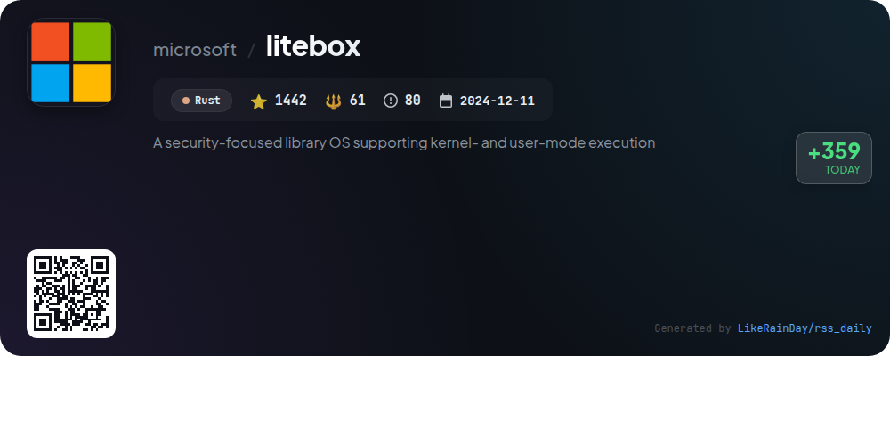
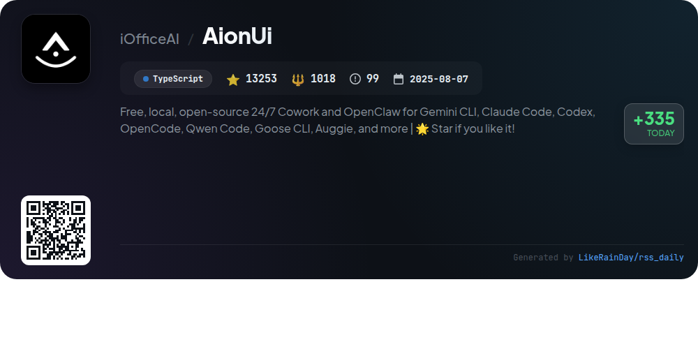
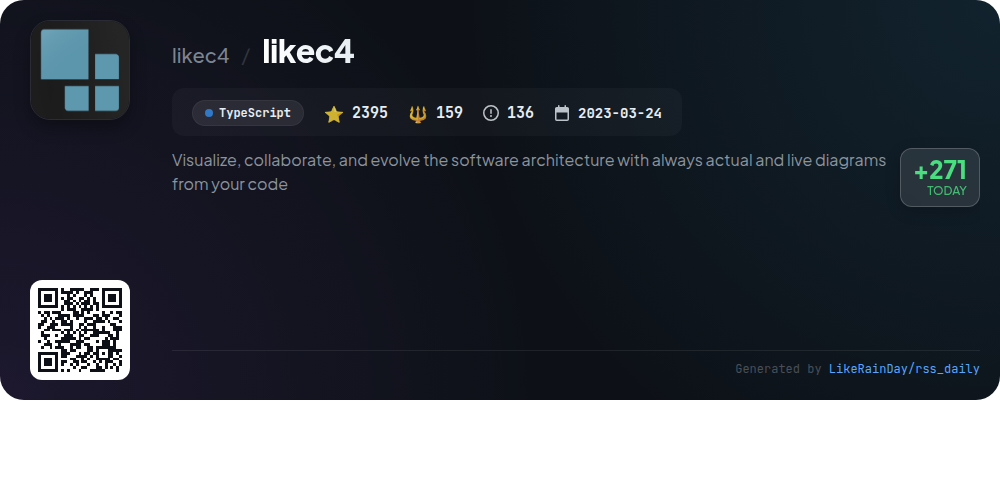
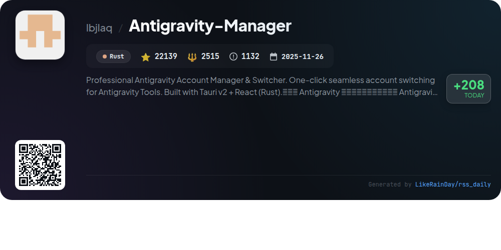
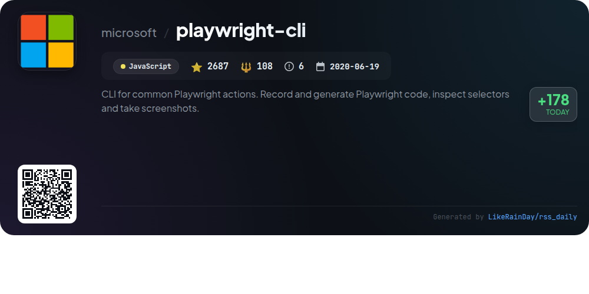

# 📊 🌟 GitHub Trending Daily - 2026-02-09

> > 📅 Daily Picks of GitHub Trending Repositories | Powered by Smart Algorithms

## 📋 Overview

**10** Projects | **97534** ⭐ | **8421** 🍴

**Top Languages:** `TypeScript` (4) · `Rust` (4) · `JavaScript` (2)

**Updated:** 2026-02-09 02:48 UTC

**Categories:**

- 🌟 Daily Top 10 (10 items)

---

## 🌟 Daily Top 10

### 1. [shannon](https://github.com/KeygraphHQ/shannon)

> 🤖 **Why Recommend**  
> *Shannon is a fully autonomous AI pentester designed to identify and exploit vulnerabilities in web applications, achieving a 96.15% success rate on the XBOW Benchmark. It autonomously executes real attacks, such as injection and authentication bypass, providing actionable proof-of-concept reports. Key features include code-aware dynamic testing, pentester-grade reporting, and integration with tools like Nmap and Subfinder. Available in Lite and Pro editions, Shannon serves both security teams and enterprises, closing security gaps between annual tests with on-demand assessments.*

- ⭐ 13598 stars
- 💻 TypeScript
- 📅 Updated: 2026-02-09

### 2. [dexter](https://github.com/virattt/dexter)

> 🤖 **Why Recommend**  
> *Dexter is an autonomous financial research agent designed to analyze complex financial queries through intelligent task planning and real-time market data. Key features include automated decomposition of queries, autonomous execution of research tasks, self-validation for refined results, and access to comprehensive financial datasets. With built-in safety features to prevent runaway execution, Dexter enhances the research process, making it efficient and reliable. The project is open-source, built in TypeScript, and has garnered 12,740 stars on GitHub.*

- ⭐ 12740 stars
- 💻 TypeScript
- 📅 Updated: 2026-02-09

### 3. [monty](https://github.com/pydantic/monty)

> 🤖 **Why Recommend**  
> *Monty is a minimal, secure Python interpreter built in Rust, designed for AI applications. It enables rapid execution of a subset of Python code with startup times under 1 microsecond, avoiding the overhead of traditional container-based sandboxes. Key features include strict access control to the host environment, support for modern type hints, snapshotting of interpreter state, and the ability to run async or sync code. Monty seamlessly integrates with Rust, Python, and JavaScript, making it ideal for executing LLM-generated code safely and efficiently.*

- ⭐ 2897 stars
- 💻 Rust
- 📅 Updated: 2026-02-09

### 4. [gitbutler](https://github.com/gitbutlerapp/gitbutler)

> 🤖 **Why Recommend**  
> *GitButler is a modern Git-based version control client, combining a user-friendly GUI and a powerful CLI, built with Tauri, Rust, and Svelte. It enhances traditional Git workflows with features like stacked and parallel branches, easy commit management, an undo timeline, first-class conflict resolution, and seamless forge integration with GitHub and GitLab. GitButler also incorporates AI tools for generating commit messages and PR descriptions, making version control more efficient and intuitive. With over 18,000 stars, it is a robust alternative to conventional Git.*

- ⭐ 18379 stars
- 💻 Rust
- 📅 Updated: 2026-02-09

### 5. [litebox](https://github.com/microsoft/litebox)

> 🤖 **Why Recommend**  
> *LiteBox is a security-focused library OS designed for kernel- and user-mode execution, minimizing the attack surface by reducing the host interface. It supports versatile interoperation between "North" shims and "South" platforms, enabling various use cases such as running Linux programs on Windows, sandboxing Linux applications, and executing programs on SEV SNP or OP-TEE. Built in Rust, LiteBox offers a Rust-inspired interface and is actively evolving, inviting experimentation while moving towards a stable release. The project is licensed under MIT.*

- ⭐ 1442 stars
- 💻 Rust
- 📅 Updated: 2026-02-09

### 6. [AionUi](https://github.com/iOfficeAI/AionUi)

> 🤖 **Why Recommend**  
> *AionUi is a free, open-source platform for seamless collaboration with command-line AI tools like Gemini CLI, Claude Code, and Codex. Key features include a user-friendly graphical interface, multi-agent support, local data security, and remote access via WebUI and chat platforms like Telegram and Slack. Users can schedule automated tasks, manage files intelligently, and preview AI-generated content in real-time. AionUi supports multiple AI models and offers customizable interfaces, making it an ideal choice for enhancing AI productivity.*

- ⭐ 13253 stars
- 💻 TypeScript
- 📅 Updated: 2026-02-09

### 7. [likec4](https://github.com/likec4/likec4)

> 🤖 **Why Recommend**  
> *LikeC4 is a powerful TypeScript-based tool for visualizing and evolving software architecture through live diagrams generated directly from your code. Inspired by the C4 model, it enables users to customize notations and element types, offering flexibility in architectural modeling. Key features include a CLI for real-time previews, a dedicated playground, and robust community support via Discord and GitHub Discussions. With 2,395 stars, LikeC4 promotes collaboration and continuous integration of architecture, making it an essential tool for developers. Explore more at [likec4.dev](https://likec4.dev/).*

- ⭐ 2395 stars
- 💻 TypeScript
- 📅 Updated: 2026-02-09

### 8. [escrcpy](https://github.com/viarotel-org/escrcpy)

> 🤖 **Why Recommend**  
> *Escrcpy is a powerful tool that allows users to display and control Android devices graphically from their computers. Key features include intelligent control via natural-language commands, automated workflows for efficiency, and the ability to manage multiple devices simultaneously. It supports wireless connectivity with reverse tethering and offers high-performance screen mirroring. With a clean installation process and comprehensive documentation, Escrcpy is ideal for developers and users seeking to enhance their Android experience. The project is open-source and welcomes contributions.*

- ⭐ 8004 stars
- 💻 JavaScript
- 📅 Updated: 2026-02-09

### 9. [Antigravity-Manager](https://github.com/lbjlaq/Antigravity-Manager)

> 🤖 **Why Recommend**  
> *Antigravity-Manager is a professional account management tool designed for seamless switching and integration of Antigravity tools. Built with Tauri and React, it offers one-click account switching, OAuth 2.0 support, and a smart dashboard for real-time monitoring of account quotas. Key features include multi-protocol support (OpenAI, Claude, Gemini), automated quota protection, and intelligent API request handling to optimize performance. With 22,139 stars on GitHub, it serves as a robust solution for AI enthusiasts and developers, ensuring efficient management and cost-effective operations.*

- ⭐ 22139 stars
- 💻 Rust
- 📅 Updated: 2026-02-09

### 10. [playwright-cli](https://github.com/microsoft/playwright-cli)

> 🤖 **Why Recommend**  
> *playwright-cli is a command-line interface for Playwright, designed for efficient browser automation with coding agents. Key features include code generation, selector inspection, and screenshot capabilities. It offers token-efficient operations, avoiding large data loads, making it ideal for high-throughput environments. Users can manage multiple browser sessions, mock network requests, and persist browser states. With easy installation and extensive command options, playwright-cli streamlines tasks like testing, tracing, and video recording, enhancing productivity for developers and testers.*

- ⭐ 2687 stars
- 💻 JavaScript
- 📅 Updated: 2026-02-09

---

## 📡 RSS Subscription

Subscribe via RSS to get daily trending updates:

- 🔔 [RSS XML] (../../daily-top.xml)
- 🔔 [Daily Report] (../../GITHUB_TODAY.md)
- 🔔 [Daily Top 10](../../daily-top.xml)

---

*⚡ Powered by Smart Trending Algorithm | Generated at 2026-02-09 02:48:40 UTC
