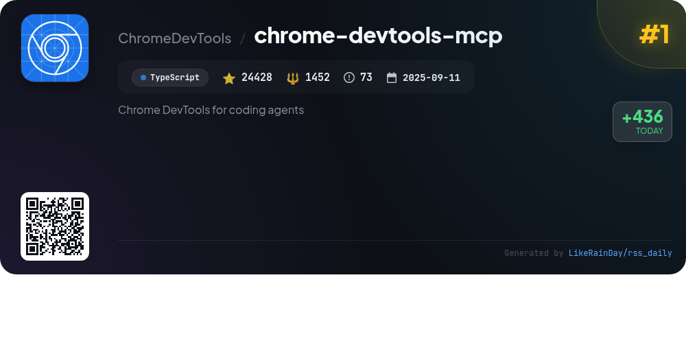
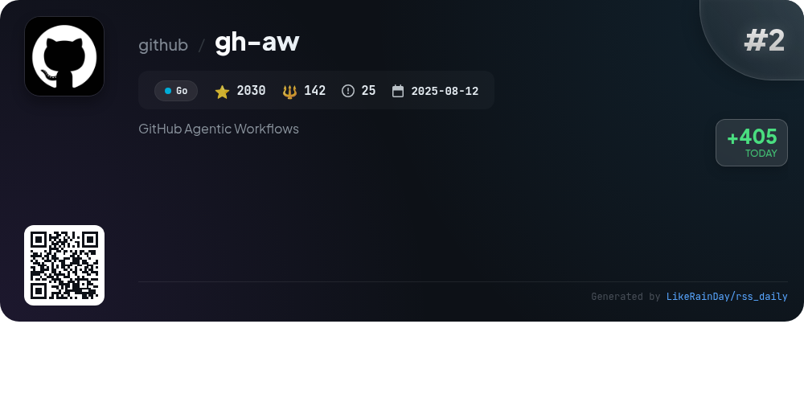
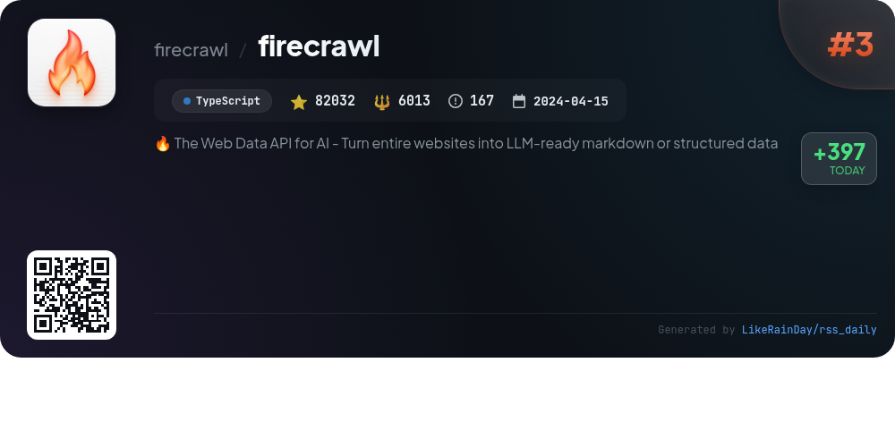
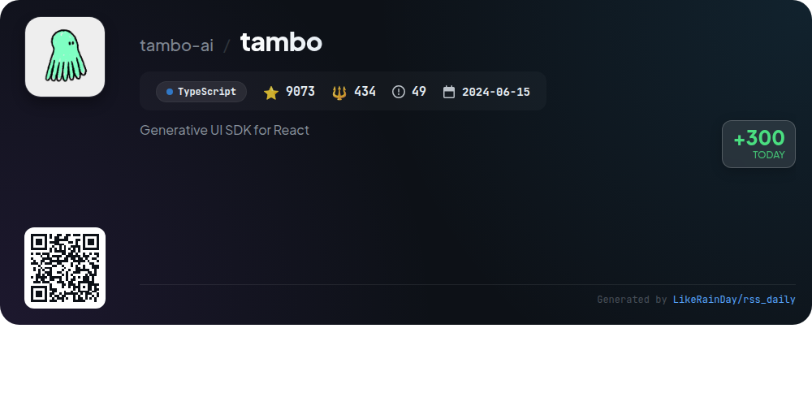
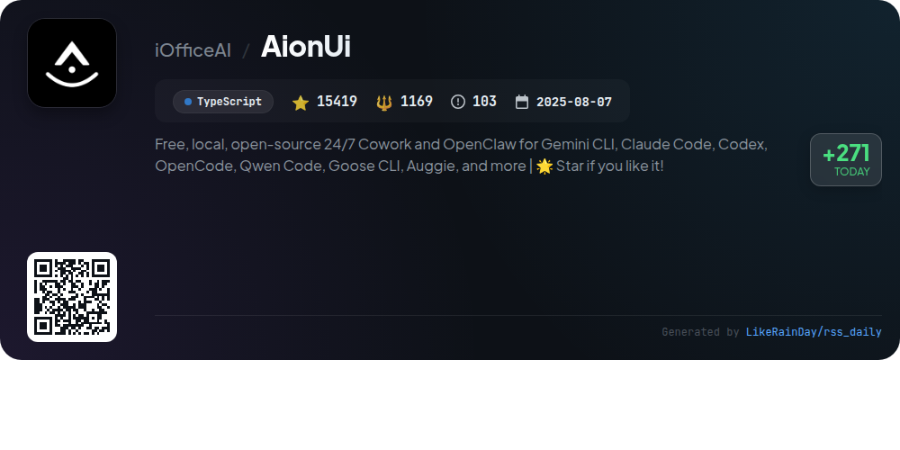
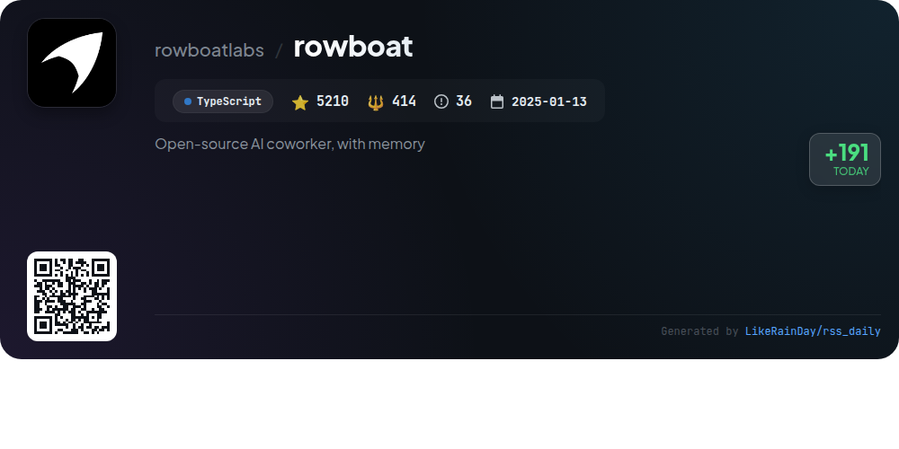
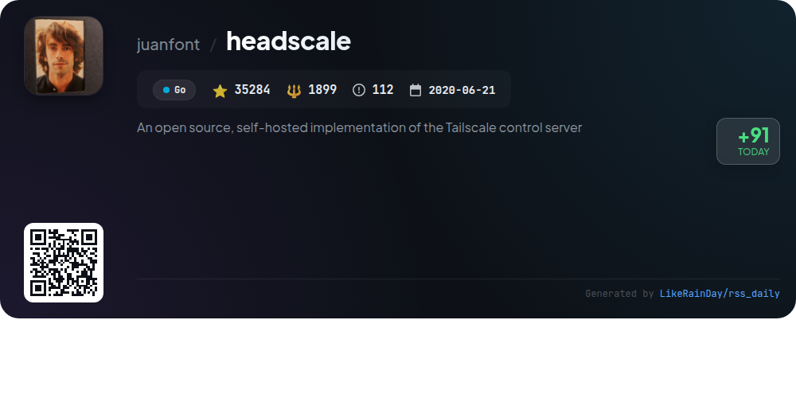
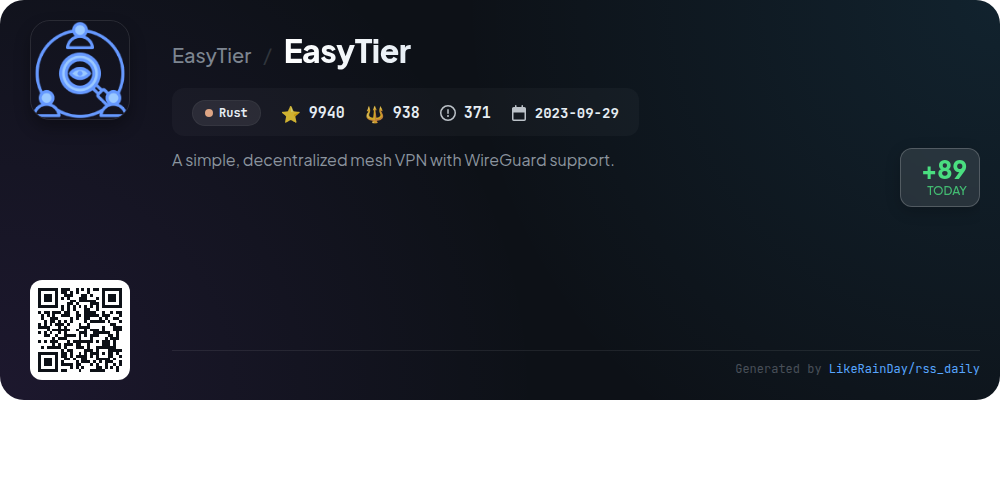

# 📊 🌟 GitHub Trending Daily - 2026-02-13

> > 📅 Daily Picks of GitHub Trending Repositories | Powered by Smart Algorithms

## 📋 Overview

**10** Projects | **191707** ⭐ | **13593** 🍴

**Top Languages:** `TypeScript` (6) · `Go` (2) · `C++` (1)

**Updated:** 2026-02-13 02:51 UTC

**Categories:**

- 🌟 Daily Top 10 (10 items)

---

## 🌟 Daily Top 10

### 1. [chrome-devtools-mcp](https://github.com/ChromeDevTools/chrome-devtools-mcp)

> 🤖 **Why Recommend**  
> *chrome-devtools-mcp is a TypeScript project that enables coding agents like Gemini, Claude, Cursor, and Copilot to control and inspect a live Chrome browser. Key features include advanced performance insights, automated browser interactions via Puppeteer, and in-depth debugging capabilities such as network analysis and error tracking. With over 24,000 stars on GitHub, it provides a robust Model-Context-Protocol (MCP) server for seamless integration with AI coding assistants, ensuring reliable automation and performance analysis.*

- ⭐ 24428 stars
- 💻 TypeScript
- 📅 Updated: 2026-02-13

### 2. [gh-aw](https://github.com/github/gh-aw)

> 🤖 **Why Recommend**  
> *GitHub Agentic Workflows (gh-aw) enables the creation of agentic workflows in natural language markdown, integrated seamlessly with GitHub Actions. Key features include a Quick Start Guide, robust documentation, and a focus on security with guardrails like read-only permissions, sanitized outputs, and sandboxed execution. It supports collaboration with human approval gates for critical operations. Companion projects, such as the Agent Workflow Firewall and MCP Gateway, enhance security and access management. With over 2,030 stars, it promotes safe AI automation in repositories.*

- ⭐ 2030 stars
- 💻 Go
- 📅 Updated: 2026-02-13

### 3. [firecrawl](https://github.com/firecrawl/firecrawl)

> 🤖 **Why Recommend**  
> *Firecrawl is a powerful web data API designed to transform entire websites into LLM-ready markdown or structured data. Key features include robust scraping capabilities that handle dynamic content, JavaScript rendering, and proxy management, achieving over 80% reliability in benchmarks. Users can extract data in various formats, including markdown, HTML, and JSON, and utilize batch processing, change tracking, and automated data gathering via an AI agent. Firecrawl supports easy integration with SDKs for Python and Node.js, making it ideal for developers seeking comprehensive web data solutions.*

- ⭐ 82032 stars
- 💻 TypeScript
- 📅 Updated: 2026-02-13

### 4. [Personal_AI_Infrastructure](https://github.com/danielmiessler/Personal_AI_Infrastructure)

> 🤖 **Why Recommend**  
> *Personal_AI_Infrastructure (PAI) is an open-source TypeScript project designed to enhance human capabilities through personalized AI. It aims to activate individuals' creative potential by providing an agentic AI that learns from interactions, remembers user preferences, and supports goal-oriented tasks. Key features include a modular architecture with 23 self-contained packs, continuous learning, a robust security system, and customizable workflows. PAI is suitable for everyone—from individuals to businesses—offering tools for productivity, creativity, and self-discovery. With 7,560 stars, it emphasizes making advanced AI accessible to all.*

- ⭐ 7560 stars
- 💻 TypeScript
- 📅 Updated: 2026-02-13

### 5. [tambo](https://github.com/tambo-ai/tambo)

> 🤖 **Why Recommend**  
> *Tambo is an open-source generative UI SDK for React, enabling developers to build dynamic user interfaces powered by AI. With over 9,000 stars on GitHub, it streamlines component integration, state management, and conversation flow through its robust backend. Key features include customizable components with Zod schemas, real-time prop streaming, and support for various LLM providers like OpenAI and Anthropic. Tambo offers both a cloud-hosted solution and self-hosting via Docker, making it versatile for different deployment needs. Join the community on Discord for support and collaboration.*

- ⭐ 9073 stars
- 💻 TypeScript
- 📅 Updated: 2026-02-13

### 6. [AionUi](https://github.com/iOfficeAI/AionUi)

> 🤖 **Why Recommend**  
> *AionUi is a free, open-source platform designed for seamless coworking with command-line AI tools like Gemini CLI, Claude Code, and Codex. It features a unified graphical interface, multi-agent support, and local data security. Key highlights include auto-detection of CLI tools, remote access via WebUI and chat platforms (e.g., Telegram, Slack), and advanced file management. Users can automate tasks, generate and preview documents in various formats, and customize the interface. Available on macOS, Windows, and Linux, AionUi enhances productivity while maintaining data privacy.*

- ⭐ 15419 stars
- 💻 TypeScript
- 📅 Updated: 2026-02-13

### 7. [rowboat](https://github.com/rowboatlabs/rowboat)

> 🤖 **Why Recommend**  
> *Rowboat is an open-source AI coworker designed to enhance productivity by creating a long-lived knowledge graph from your emails and meeting notes. Key features include generating documents and briefs, preparing for meetings with relevant context, and maintaining a local Markdown vault for easy inspection and editing. It supports integrations with Gmail, Granola, and Fireflies, and allows users to connect their preferred AI models. With background agents for automation and a local-first design, Rowboat ensures your data remains private and manageable.*

- ⭐ 5210 stars
- 💻 TypeScript
- 📅 Updated: 2026-02-13

### 8. [zvec](https://github.com/alibaba/zvec)

> 🤖 **Why Recommend**  
> *Zvec is a lightweight, in-process vector database designed for high-performance similarity search, built on Alibaba's Proxima engine. With over 731 stars, it offers blazing-fast searches across billions of vectors, supporting both dense and sparse embeddings. Key features include hybrid search capabilities and ease of installation via `pip`. Zvec operates seamlessly in various environments—servers, notebooks, and edge devices. It prioritizes low-latency, scalable solutions, making it ideal for demanding applications. Comprehensive documentation and community support are available online.*

- ⭐ 731 stars
- 💻 C++
- 📅 Updated: 2026-02-13

### 9. [headscale](https://github.com/juanfont/headscale)

> 🤖 **Why Recommend**  
> *Headscale is an open-source, self-hosted implementation of the Tailscale control server, designed for users seeking an alternative to Tailscale's proprietary services. Built in Go, it facilitates secure, private networking using WireGuard technology, enabling users to create personal or small organizational networks (tailnets). Key features include key exchange, IP assignment, user boundaries, and route advertisement. With strong community support and extensive documentation, Headscale caters to self-hosters and enthusiasts, ensuring a sustainable and collaborative environment. Join the community on Discord for support and discussions.*

- ⭐ 35284 stars
- 💻 Go
- 📅 Updated: 2026-02-13

### 10. [EasyTier](https://github.com/EasyTier/EasyTier)

> 🤖 **Why Recommend**  
> *EasyTier is a decentralized mesh VPN solution built with Rust, providing secure connections using WireGuard encryption. Key features include cross-platform support (Windows, macOS, Linux, FreeBSD, Android), easy web and command-line interfaces, and efficient NAT traversal. The platform offers intelligent routing, subnet proxy capabilities, and high performance with zero-copy data handling. Users can quickly set up networks using shared nodes and manage configurations via a web console. With over 9,940 stars on GitHub, EasyTier is a reliable choice for a simple and secure VPN.*

- ⭐ 9940 stars
- 💻 Rust
- 📅 Updated: 2026-02-13

---

## 📡 RSS Subscription

Subscribe via RSS to get daily trending updates:

- 🔔 [RSS XML] (../../daily-top.xml)
- 🔔 [Daily Report] (../../GITHUB_TODAY.md)
- 🔔 [Daily Top 10](../../daily-top.xml)

---

*⚡ Powered by Smart Trending Algorithm | Generated at 2026-02-13 02:51:00 UTC
