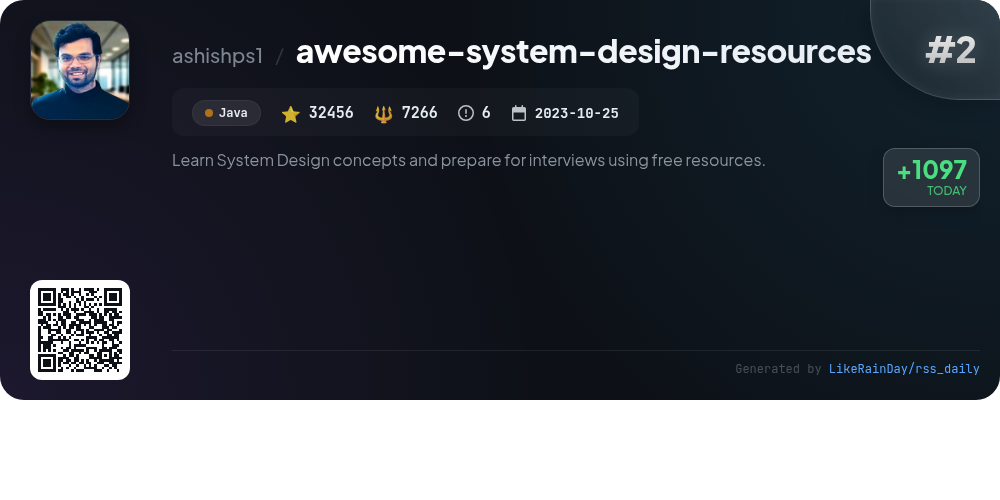
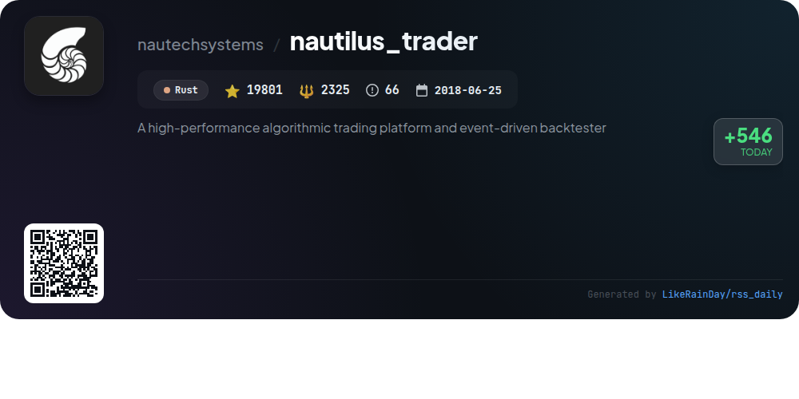
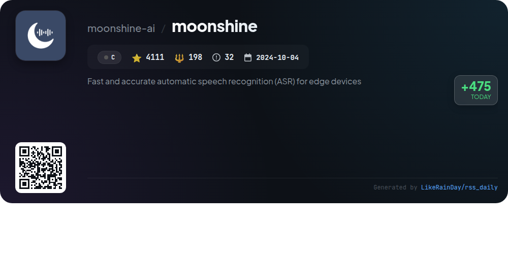
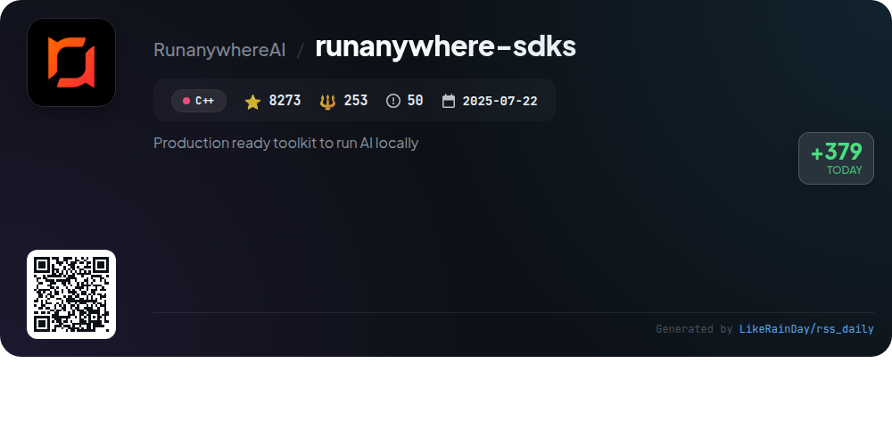

# 📊 🌟 GitHub Trending Daily - 2026-02-17

> > 📅 Daily Picks of GitHub Trending Repositories | Powered by Smart Algorithms

## 📋 Overview

**10** Projects | **298980** ⭐ | **48995** 🍴

**Top Languages:** `TypeScript` (2) · `C++` (2) · `Go` (2)

**Updated:** 2026-02-17 02:43 UTC

**Categories:**

- 🌟 Daily Top 10 (10 items)

---

## 🌟 Daily Top 10

### 1. [openclaw](https://github.com/openclaw/openclaw)

> 🤖 **Why Recommend**  
> *OpenClaw is a versatile personal AI assistant built on TypeScript, designed to run on any OS and platform. It integrates seamlessly with popular messaging channels like WhatsApp, Telegram, Discord, and more, providing a local, fast, and always-on experience. Key features include a local-first control plane, multi-channel support, voice activation, and a live Canvas for visual tasks. With an easy onboarding wizard, users can set up and customize their assistant efficiently. This project boasts over 201,000 stars, reflecting its strong community and robust functionality.*

- ⭐ 201910 stars
- 💻 TypeScript
- 📅 Updated: 2026-02-17

### 2. [awesome-system-design-resources](https://github.com/ashishps1/awesome-system-design-resources)

> 🤖 **Why Recommend**  
> *The "awesome-system-design-resources" GitHub repository offers a comprehensive collection of free resources to learn System Design concepts and prepare for interviews, boasting over 32,000 stars. Key features include in-depth guides on scalability, reliability, APIs, databases, and architectural patterns. The project provides practical problems to solve, courses, newsletters, and must-read articles and papers on distributed systems. Ideal for beginners and experienced developers alike, it serves as a valuable tool for mastering System Design and interview preparation.*

- ⭐ 32456 stars
- 💻 Java
- 📅 Updated: 2026-02-17

### 3. [zvec](https://github.com/alibaba/zvec)

> 🤖 **Why Recommend**  
> *Zvec is a lightweight, in-process vector database designed for high-performance vector similarity searches. Built on Alibaba's Proxima engine, it supports both dense and sparse vectors and enables hybrid searches with semantic similarity and structured filters. Key features include lightning-fast searches across billions of vectors, minimal setup, and compatibility with Python and Node.js. Zvec runs seamlessly on Linux and macOS, making it ideal for various applications from notebooks to edge devices. Join the community for updates and support!*

- ⭐ 3689 stars
- 💻 C++
- 📅 Updated: 2026-02-17

### 4. [rowboat](https://github.com/rowboatlabs/rowboat)

> 🤖 **Why Recommend**  
> *Rowboat is an open-source AI coworker designed to enhance productivity by creating a long-lived knowledge graph from your work activities. It integrates with Gmail and meeting notes, allowing users to generate documents, summaries, and meeting preparations based on accumulated context. Key features include voice memo recording, background automation for routine tasks, and compatibility with local models and external tools through the Model Context Protocol. With all data stored locally in Markdown format, Rowboat ensures privacy and full user control over information.*

- ⭐ 7344 stars
- 💻 TypeScript
- 📅 Updated: 2026-02-17

### 5. [gogcli](https://github.com/steipete/gogcli)

> 🤖 **Why Recommend**  
> *gogcli is a powerful CLI tool for managing Google services directly from your terminal, supporting Gmail, Calendar, Drive, Contacts, and more. With features like email tracking, event management, file handling, and secure credential storage, it enables users to interact with multiple Google accounts seamlessly. Key services include emailing with attachments, calendar event creation and updates, file uploads/downloads on Google Drive, and contact management. Its JSON output format enhances scripting and automation capabilities, making it ideal for developers and power users.*

- ⭐ 3533 stars
- 💻 Go
- 📅 Updated: 2026-02-17

### 6. [nautilus_trader](https://github.com/nautechsystems/nautilus_trader)

> 🤖 **Why Recommend**  
> *NautilusTrader is a high-performance, open-source algorithmic trading platform designed in Rust for reliable and efficient trading. It features an event-driven backtester that allows quantitative traders to backtest and deploy automated strategies seamlessly in both live and historical environments. With modular adapters, it supports various asset classes and trading venues. Key highlights include high-frequency trading capabilities, advanced order types, and customizable components. NautilusTrader ensures parity between backtesting and live trading, enhancing safety and reducing operational risks.*

- ⭐ 19801 stars
- 💻 Rust
- 📅 Updated: 2026-02-17

### 7. [moonshine](https://github.com/moonshine-ai/moonshine)

> 🤖 **Why Recommend**  
> *Moonshine is an open-source automatic speech recognition (ASR) toolkit optimized for edge devices, enabling fast and accurate voice applications without requiring accounts or API keys. Key features include on-device processing for low latency, flexible input windows, and caching for real-time interactions. It supports multiple languages and offers high-level APIs for tasks like transcription and intent recognition. Cross-platform compatibility spans Python, iOS, Android, and more, making it accessible for various developers. Moonshine's models often exceed Whisper's accuracy while being more efficient for live speech applications.*

- ⭐ 4111 stars
- 💻 C
- 📅 Updated: 2026-02-17

### 8. [get-shit-done](https://github.com/gsd-build/get-shit-done)

> 🤖 **Why Recommend**  
> *Get Shit Done (GSD) is a lightweight meta-prompting and context engineering system designed for Claude Code, OpenCode, and Gemini CLI. It effectively addresses context rot, ensuring high-quality outputs as tasks progress. Key features include streamlined project initialization, automated phase planning, execution in parallel waves, and atomic Git commits for traceable changes. Trusted by engineers at major companies like Amazon and Google, GSD simplifies software development workflows, allowing users to focus on building without the complexity of traditional project management tools.*

- ⭐ 14917 stars
- 💻 JavaScript
- 📅 Updated: 2026-02-17

### 9. [runanywhere-sdks](https://github.com/RunanywhereAI/runanywhere-sdks)

> 🤖 **Why Recommend**  
> *RunAnywhere is a production-ready toolkit for on-device AI, enabling local execution of large language models (LLMs), speech-to-text (STT), and text-to-speech (TTS) across multiple platforms. With over 8,200 stars, it offers a privacy-first, offline solution for developers to integrate AI features into their apps. Key functionalities include LLM chat, a complete STT → LLM → TTS pipeline, and support for various platforms such as iOS, Android, Web, React Native, and Flutter. The toolkit ensures no data leaves the device, providing fast and secure AI capabilities.*

- ⭐ 8273 stars
- 💻 C++
- 📅 Updated: 2026-02-17

### 10. [gh-aw](https://github.com/github/gh-aw)

> 🤖 **Why Recommend**  
> *GitHub Agentic Workflows (gh-aw) enables users to create and run natural language markdown workflows within GitHub Actions. Key features include a comprehensive Quick Start Guide, security-focused guardrails with read-only permissions, sanitized outputs, and sandboxed execution to ensure safe automation of repository tasks. The project supports contributions and community feedback while offering companion tools like the Agent Workflow Firewall for enhanced security and the MCP Gateway for access management. With 2,946 stars, it emphasizes safety and user collaboration in AI-driven workflows.*

- ⭐ 2946 stars
- 💻 Go
- 📅 Updated: 2026-02-17

---

## 📡 RSS Subscription

Subscribe via RSS to get daily trending updates:

- 🔔 [RSS XML] (../../daily-top.xml)
- 🔔 [Daily Report] (../../GITHUB_TODAY.md)
- 🔔 [Daily Top 10](../../daily-top.xml)

---

*⚡ Powered by Smart Trending Algorithm | Generated at 2026-02-17 02:43:34 UTC
