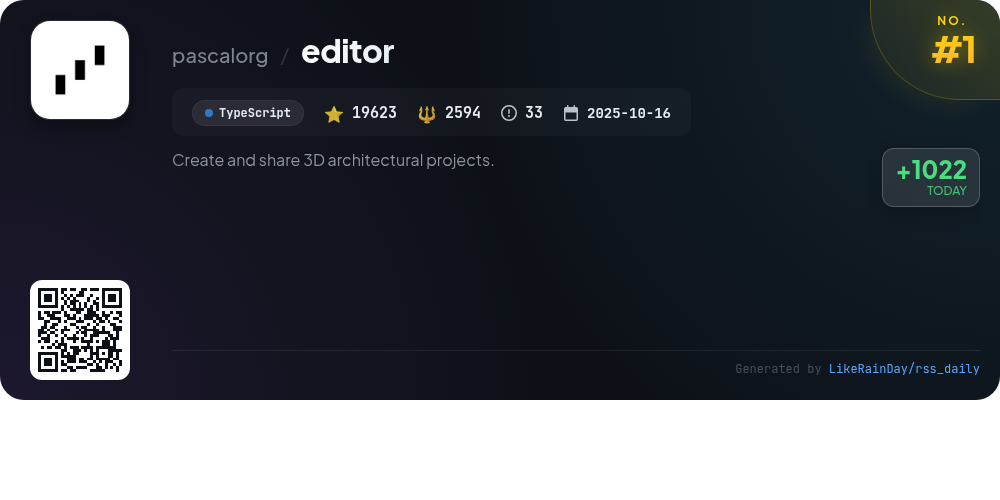
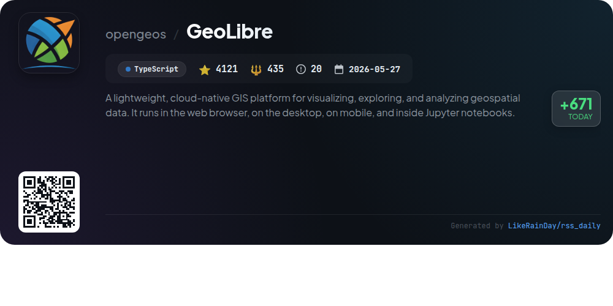
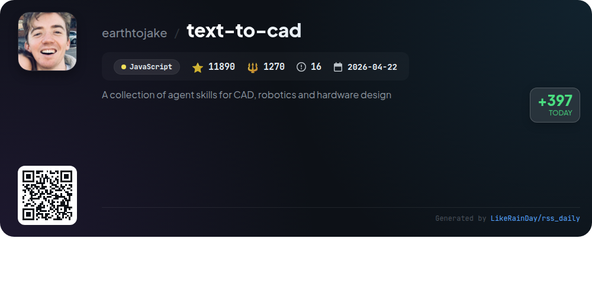
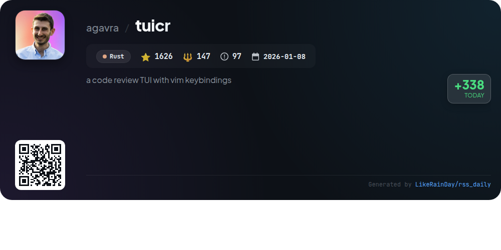

# 📊 🌟 GitHub Trending Daily - 2026-07-30

> > 📅 Daily Picks of GitHub Trending Repositories | Powered by Smart Algorithms

## 📋 Overview

**10** Projects | **422492** ⭐ | **51224** 🍴

**Top Languages:** `TypeScript` (3) · `JavaScript` (3) · `Go` (2)

**Updated:** 2026-07-30 02:52 UTC

**Categories:**

- 🌟 Daily Top 10 (10 items)

---

## 🌟 Daily Top 10

### 1. [editor](https://github.com/pascalorg/editor)

> 🤖 **Why Recommend**  
> *Pascal Editor is a powerful 3D architectural project editor built with React Three Fiber and WebGPU, enabling users to create and share intricate designs. With over 19,600 stars on GitHub, it offers features such as node-based scene management, real-time editing tools, and a customizable viewer. The architecture includes separate packages for core functionalities, rendering, and UI components, ensuring modularity and efficient state management via Zustand. Additionally, it supports extensibility through plugins, making it a versatile tool for architects and developers alike.*

- ⭐ 19623 stars
- 💻 TypeScript
- 📅 Updated: 2026-07-30

### 2. [ECC](https://github.com/affaan-m/ECC)

> 🤖 **Why Recommend**  
> *ECC is an advanced agent harness performance optimization system designed to enhance coding workflows. Key features include 67 specialized agents for planning, review, and security, along with 281 reusable skills and 94 command shims, all aimed at streamlining development processes. ECC emphasizes a structured approach—planning, testing, implementation, and review—facilitated through a modular architecture. It integrates seamlessly with popular tools like Claude Code, Codex, and GitHub Copilot, offering robust memory management and security scanning through its AgentShield service. With over 235,000 stars on GitHub, ECC is a powerful tool for developers seeking efficiency and effectiveness in their coding practices.*

- ⭐ 235652 stars
- 💻 JavaScript
- 📅 Updated: 2026-07-30

### 3. [airi](https://github.com/moeru-ai/airi)

> 🤖 **Why Recommend**  
> *AIRI is a self-hosted AI companion project designed to recreate digital beings, inspired by Neuro-sama. It allows users to engage in real-time voice chats and play games like Minecraft and Factorio across web, macOS, and Windows platforms. Key features include multi-provider voice synthesis, VRM and Live2D support, and browser compatibility with advanced Web technologies. AIRI aims to empower users with ownership of their digital lives while offering extensive customization and development opportunities, making it a versatile platform for AI-driven interactions.*

- ⭐ 45443 stars
- 💻 TypeScript
- 📅 Updated: 2026-07-30

### 4. [GeoLibre](https://github.com/opengeos/GeoLibre)

> 🤖 **Why Recommend**  
> *GeoLibre is a lightweight, cloud-native GIS platform for visualizing, exploring, and analyzing geospatial data across web browsers, desktops, mobile devices, and Jupyter notebooks. Built with TypeScript, React, and MapLibre GL JS, it offers seamless functionality and local data privacy. Key features include 3D visualization, planetary basemaps, and over 700 GIS tools, all accessible without installation. Users can launch the web app, download desktop versions, or access it on mobile. GeoLibre supports extensive documentation and plugins, making it a versatile choice for geospatial analysis.*

- ⭐ 4121 stars
- 💻 TypeScript
- 📅 Updated: 2026-07-30

### 5. [jcode](https://github.com/1jehuang/jcode)

> 🤖 **Why Recommend**  
> *jcode is a highly efficient RAM harness built in Rust, designed to optimize resource usage for multi-session workflows. With over 13,500 stars on GitHub, it supports Linux, macOS, and Windows. Key features include intelligent memory management, rapid response times, and the ability to spawn multiple collaborative agents (Swarm). jcode integrates various OAuth providers for seamless authentication and offers browser automation tools. Its self-development mode allows agents to modify their source code, enhancing customizability and performance. Visit [jcode.sh](https://jcode.sh) for more information.*

- ⭐ 13524 stars
- 💻 Rust
- 📅 Updated: 2026-07-30

### 6. [superfile](https://github.com/yorukot/superfile)

> 🤖 **Why Recommend**  
> *superfile is a modern terminal file manager built in Go, boasting over 21,800 stars on GitHub. It offers a sleek interface and supports common file operations, with features including customizable themes, hotkeys, and plugins. Users can easily install it on macOS, Linux, and Windows, with auto-update functionality to ensure the latest version. The project encourages community contribution and provides extensive documentation, including tutorials and troubleshooting guides. Join the community on Discord for support and collaboration.*

- ⭐ 21856 stars
- 💻 Go
- 📅 Updated: 2026-07-30

### 7. [text-to-cad](https://github.com/earthtojake/text-to-cad)

> 🤖 **Why Recommend**  
> *text-to-cad is a powerful JavaScript library designed for CAD, robotics, and hardware design agents, boasting over 11,890 stars on GitHub. It provides a suite of skills for generating, editing, and visualizing CAD models, including support for STEP, STL, and URDF file formats. Key features include a CAD Viewer for local previews, sourcing of off-the-shelf parts, and slicing capabilities for G-code. The library also integrates with popular 3D printing services like Bambu Labs and offers experimental implicit CAD modeling. Comprehensive documentation and a user-friendly installation process are available.*

- ⭐ 11890 stars
- 💻 JavaScript
- 📅 Updated: 2026-07-30

### 8. [impeccable](https://github.com/pbakaus/impeccable)

> 🤖 **Why Recommend**  
> *Impeccable is a design language for AI coding agents, offering 23 commands and 60 deterministic detector rules to enhance AI-generated frontend design. Key features include a single setup flow with `/impeccable init`, a shared design vocabulary, and commands for tasks like `polish`, `audit`, and `critique`. The tool ensures adherence to design best practices, avoiding common anti-patterns. It seamlessly integrates with platforms like Claude Code and GitHub Copilot. For more details, visit [impeccable.style](https://impeccable.style).*

- ⭐ 52659 stars
- 💻 JavaScript
- 📅 Updated: 2026-07-30

### 9. [open-code-review](https://github.com/alibaba/open-code-review)

> 🤖 **Why Recommend**  
> *Open-source & free — Battle-tested at Alibaba's scale. Hybrid architecture code review tool: deterministic pipelines + LLM Agent, precise line-level. popular project, actively maintained, recently updated*

- ⭐ 16098 stars
- 🍴 1084 forks
- 💻 Go
- 📅 Updated: 2026-07-30

### 10. [tuicr](https://github.com/agavra/tuicr)

> 🤖 **Why Recommend**  
> *tuicr is a Rust-based terminal user interface (TUI) for code reviews, featuring Vim keybindings and supporting GitHub, GitLab, and clipboard exports. With 1,626 stars, it enables continuous diff viewing in the terminal, PR-style comments, and review tracking at granular levels. Users can review uncommitted changes or commit ranges, and seamlessly push comments to GitHub or GitLab. Additional features include structured markdown export, compatibility with git, jj, and mercurial, and a persistent review session CLI for easy integration into workflows.*

- ⭐ 1626 stars
- 💻 Rust
- 📅 Updated: 2026-07-30

---

## 📡 RSS Subscription

Subscribe via RSS to get daily trending updates:

- 🔔 [RSS XML] (../../daily-top.xml)
- 🔔 [Daily Report] (../../GITHUB_TODAY.md)
- 🔔 [Daily Top 10](../../daily-top.xml)

---

*⚡ Powered by Smart Trending Algorithm | Generated at 2026-07-30 02:52:18 UTC
