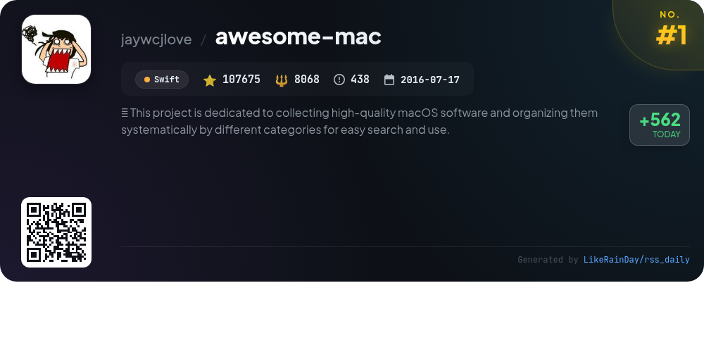
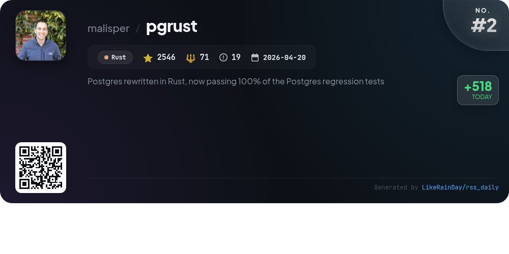
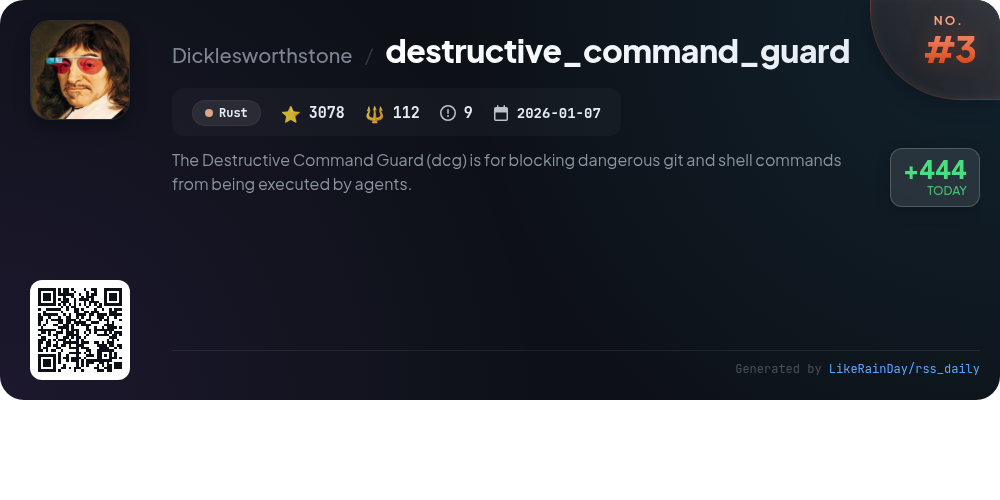
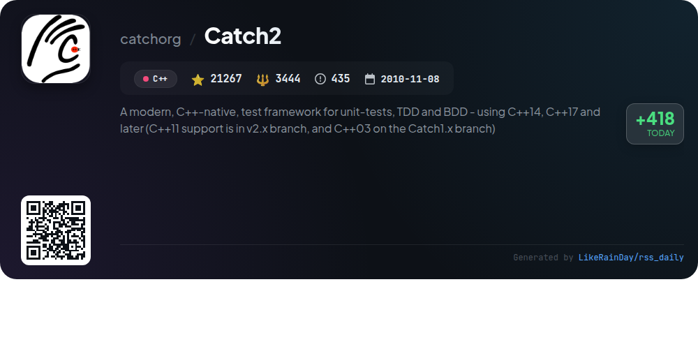
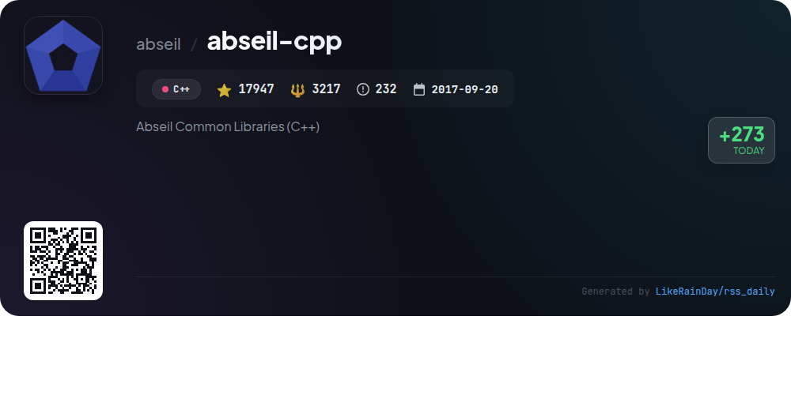
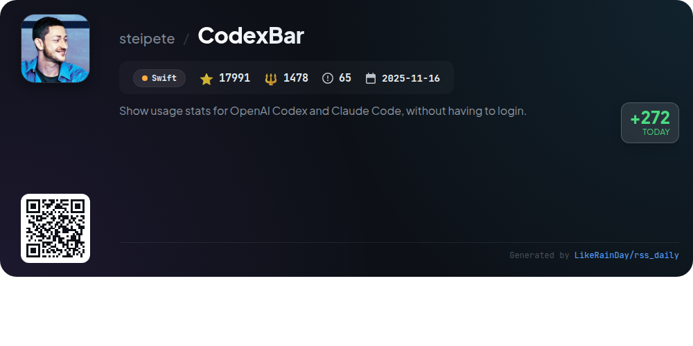
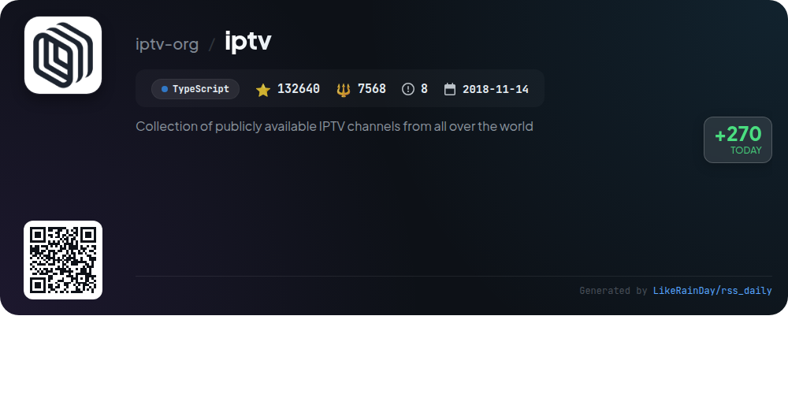

# 📊 🌟 GitHub Trending Daily - 2026-07-13

> > 📅 Daily Picks of GitHub Trending Repositories | Powered by Smart Algorithms

## 📋 Overview

**10** Projects | **596154** ⭐ | **62919** 🍴

**Top Languages:** `JavaScript` (3) · `Swift` (2) · `Rust` (2)

**Updated:** 2026-07-13 03:36 UTC

**Categories:**

- 🌟 Daily Top 10 (10 items)

---

## 🌟 Daily Top 10

### 1. [awesome-mac](https://github.com/jaywcjlove/awesome-mac)

> 🤖 **Why Recommend**  
> *Awesome Mac is a comprehensive GitHub project featuring a curated collection of high-quality macOS software, systematically organized into categories for easy navigation. With over 107,000 stars, it serves as a valuable resource for users seeking tools ranging from productivity apps and developer utilities to design software and games. Key features include support for open-source applications, extensive software lists, and contributions from the community. Users can easily discover and install applications to enhance their macOS experience, fostering a collaborative environment for improvement and sharing.*

- ⭐ 107675 stars
- 💻 Swift
- 📅 Updated: 2026-07-13

### 2. [pgrust](https://github.com/malisper/pgrust)

> 🤖 **Why Recommend**  
> *Postgres rewritten in Rust, now passing 100% of the Postgres regression tests. popular project, recently updated*

- ⭐ 2546 stars
- 🍴 71 forks
- 💻 Rust
- 📅 Updated: 2026-07-13

### 3. [destructive_command_guard](https://github.com/Dicklesworthstone/destructive_command_guard)

> 🤖 **Why Recommend**  
> *The Destructive Command Guard (dcg) is for blocking dangerous git and shell commands from being executed by agents.. popular project, actively maintained, recently updated*

- ⭐ 3078 stars
- 🍴 112 forks
- 💻 Rust
- 📅 Updated: 2026-07-13

### 4. [Catch2](https://github.com/catchorg/Catch2)

> 🤖 **Why Recommend**  
> *A modern, C++-native, test framework for unit-tests, TDD and BDD - using C++14, C++17 and later (C++11 support is in v2.x branch, and C++03 on the Cat. popular project, actively maintained, recently updated*

- ⭐ 21267 stars
- 🍴 3444 forks
- 💻 C++
- 📅 Updated: 2026-07-13

### 5. [ECC](https://github.com/affaan-m/ECC)

> 🤖 **Why Recommend**  
> *ECC is an advanced performance optimization system designed for AI agent workflows, supporting platforms like Claude Code, Codex, and Cursor. It features 67 specialized agents, 278 reusable skills, and extensive hooks for automation. Key highlights include continuous learning, security scanning via AgentShield, and a user-friendly dashboard GUI. ECC emphasizes a research-first development approach, enabling cross-harness collaboration and real-time performance monitoring. The project boasts over 228,000 stars, reflecting its robust community and utility in optimizing AI coding tasks.*

- ⭐ 228987 stars
- 💻 JavaScript
- 📅 Updated: 2026-07-13

### 6. [abseil-cpp](https://github.com/abseil/abseil-cpp)

> 🤖 **Why Recommend**  
> *Abseil is an open-source collection of C++ libraries (C++17 compliant) designed to enhance the C++ standard library. Developed from Google's production code, it offers essential components like memory management, string utilities, logging, error handling, and concurrency primitives. Key features include extensive testing, compatibility with Bazel and CMake build systems, and a focus on augmenting standard library functionalities. Abseil provides Long Term Support Releases for stability and adheres to Google's C++ Support Policy, making it a valuable resource for the C++ community.*

- ⭐ 17947 stars
- 💻 C++
- 📅 Updated: 2026-07-13

### 7. [CodexBar](https://github.com/steipete/CodexBar)

> 🤖 **Why Recommend**  
> *CodexBar is a macOS 14+ menu bar app that displays usage statistics for various AI coding providers like OpenAI Codex and Claude, without requiring login. It features per-provider usage meters, countdowns to session resets, and cost scans. The app supports multiple providers, including Copilot, Gemini, and AWS Bedrock, with privacy-first design, reusing existing sessions without storing passwords. Key highlights include live status polling, configurable refresh rates, CLI tools for scripting, and multilingual support. With over 17,991 stars, it streamlines AI coding management efficiently.*

- ⭐ 17991 stars
- 💻 Swift
- 📅 Updated: 2026-07-13

### 8. [impeccable](https://github.com/pbakaus/impeccable)

> 🤖 **Why Recommend**  
> *Impeccable is a design language for AI coding agents, facilitating better frontend design with a streamlined setup and robust command set. With 23 commands like `/impeccable audit`, `/impeccable polish`, and `/impeccable critique`, it offers a comprehensive design workflow. The tool includes 46 deterministic detector rules that check for common design flaws, ensuring quality and consistency. Designed for seamless integration with platforms like Claude Code, GitHub Copilot, and Codex, Impeccable enhances AI-generated designs while promoting best practices and avoiding common pitfalls. For installation, users can quickly start with `npx impeccable install`.*

- ⭐ 46031 stars
- 💻 JavaScript
- 📅 Updated: 2026-07-13

### 9. [iptv](https://github.com/iptv-org/iptv)

> 🤖 **Why Recommend**  
> *The IPTV project is a comprehensive collection of publicly available IPTV channels from around the globe, utilizing TypeScript and boasting over 132,000 stars on GitHub. Users can easily stream channels by pasting playlist links into compatible video players. Key features include a main playlist, an Electronic Program Guide (EPG) for channel scheduling, and an API for integration. The project is community-driven, encouraging contributions and discussions, while maintaining legal compliance by only linking to publicly accessible streams.*

- ⭐ 132640 stars
- 💻 TypeScript
- 📅 Updated: 2026-07-13

### 10. [LinkSwift](https://github.com/hmjz100/LinkSwift)

> 🤖 **Why Recommend**  
> *LinkSwift is a JavaScript-based tool for obtaining direct download links from various cloud storage services, including Baidu Cloud, Alibaba Cloud, China Mobile Cloud, Tianyi Cloud, and more. With over 17,000 stars, it enhances user experience by providing direct link retrieval, UI beautification, and support for multiple download managers. Key features include real-time link caching, multi-threaded download options, and compatibility with major browsers. The project emphasizes compliance and user convenience, aiming to assist users without infringing on service providers' interests.*

- ⭐ 17992 stars
- 💻 JavaScript
- 📅 Updated: 2026-07-13

---

## 📡 RSS Subscription

Subscribe via RSS to get daily trending updates:

- 🔔 [RSS XML] (../../daily-top.xml)
- 🔔 [Daily Report] (../../GITHUB_TODAY.md)
- 🔔 [Daily Top 10](../../daily-top.xml)

---

*⚡ Powered by Smart Trending Algorithm | Generated at 2026-07-13 03:36:46 UTC
