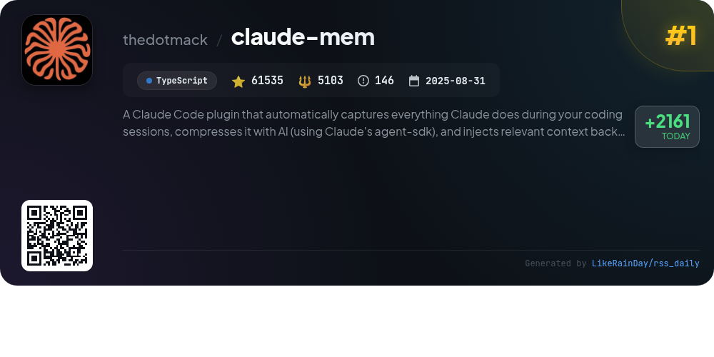
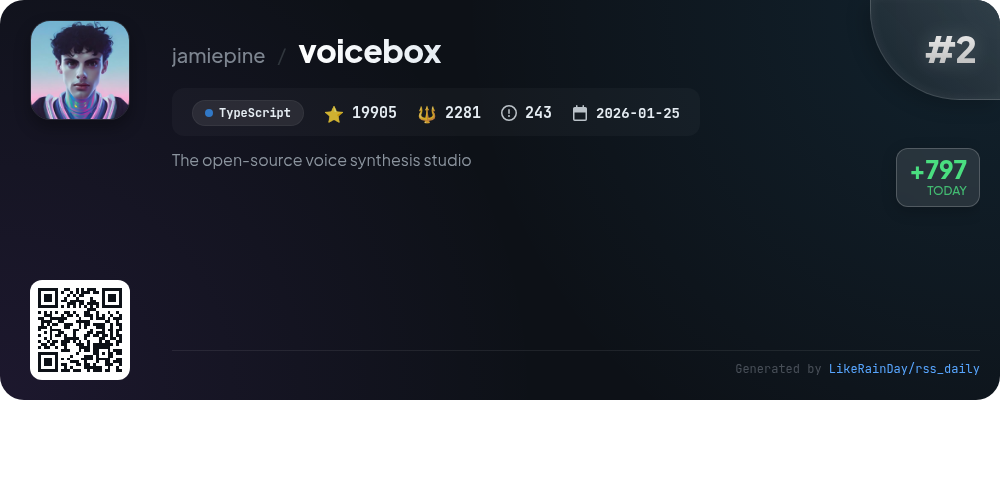
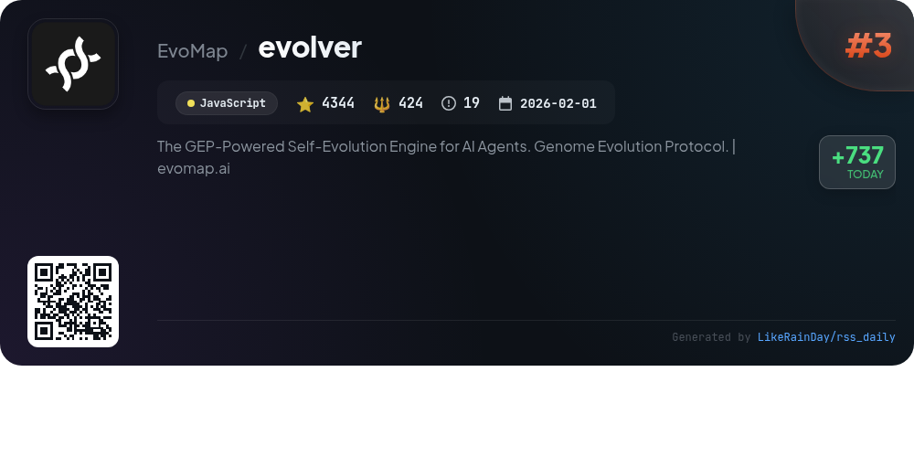
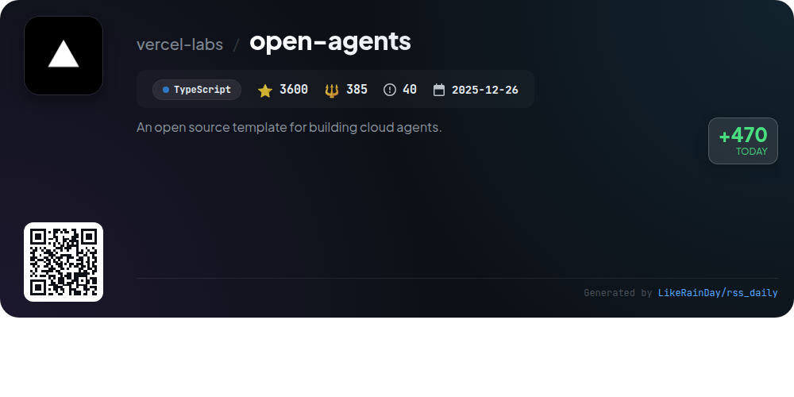
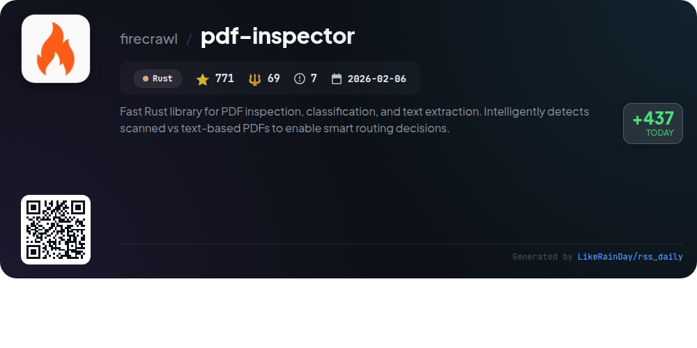
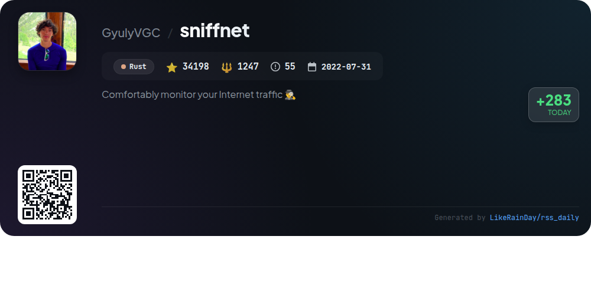

# 📊 🌟 GitHub Trending Daily - 2026-04-18

> > 📅 Daily Picks of GitHub Trending Repositories | Powered by Smart Algorithms

## 📋 Overview

**10** Projects | **380931** ⭐ | **35917** 🍴

**Top Languages:** `TypeScript` (5) · `Rust` (3) · `JavaScript` (2)

**Updated:** 2026-04-18 02:58 UTC

**Categories:**

- 🌟 Daily Top 10 (10 items)

---

## 🌟 Daily Top 10

### 1. [claude-mem](https://github.com/thedotmack/claude-mem)

> 🤖 **Why Recommend**  
> *Claude-Mem is a TypeScript plugin for Claude Code that captures and compresses coding session activities, enhancing context continuity for future work. Key features include persistent memory that survives across sessions, skill-based memory search, real-time memory streaming via a web UI, and privacy controls for handling sensitive data. The plugin automates the injection of context into new sessions and supports various IDEs, including Gemini CLI. With over 61,000 stars, it offers a robust system for maintaining project knowledge and improving developer productivity.*

- ⭐ 61535 stars
- 💻 TypeScript
- 📅 Updated: 2026-04-18

### 2. [voicebox](https://github.com/jamiepine/voicebox)

> 🤖 **Why Recommend**  
> *Voicebox is an open-source voice synthesis studio designed for local use, allowing users to clone voices, generate speech in 23 languages using five TTS engines, and apply post-processing effects. Key features include a multi-track timeline editor for narratives, expressive speech generation with paralinguistic tags, and complete privacy as all data remains on your machine. Voicebox supports various platforms, offers a REST API for integration, and is built with a native performance architecture. Perfect for creating voice-powered applications, podcasts, and more.*

- ⭐ 19905 stars
- 💻 TypeScript
- 📅 Updated: 2026-04-18

### 3. [evolver](https://github.com/EvoMap/evolver)

> 🤖 **Why Recommend**  
> *Evolver is a GEP-powered self-evolution engine for AI agents, enabling auditable and reusable evolution assets. Key features include auto-log analysis, self-repair guidance, and protocol-constrained evolution through Genes and Capsules. It supports configurable strategy presets for tailored evolution processes and allows integration with the EvoMap network for skill sharing and collaborative evolution. Users can run Evolver offline or connect to the EvoMap Hub for enhanced network functionalities. Ideal for teams managing agent prompts at scale, it emphasizes traceability and structured evolution.*

- ⭐ 4344 stars
- 💻 JavaScript
- 📅 Updated: 2026-04-18

### 4. [opencode](https://github.com/anomalyco/opencode)

> 🤖 **Why Recommend**  
> *OpenCode is an open-source AI coding agent designed to enhance development workflows. Built with TypeScript, it features two main agents—'build' for full access to development and 'plan' for read-only exploration. Users can easily install via multiple package managers and access a desktop app across various platforms. OpenCode supports multiple AI models, ensuring flexibility, and incorporates terminal UI focus for a streamlined coding experience. With extensive documentation and a vibrant community on Discord, OpenCode is a powerful tool for developers seeking an adaptable coding assistant.*

- ⭐ 145107 stars
- 💻 TypeScript
- 📅 Updated: 2026-04-18

### 5. [cc-switch](https://github.com/farion1231/cc-switch)

> 🤖 **Why Recommend**  
> *CC Switch is a cross-platform desktop assistant tool designed for managing multiple AI CLI tools, including Claude Code, Codex, Gemini CLI, OpenCode, and OpenClaw. With over 46,000 stars on GitHub, it offers a unified interface to switch between providers without manual file editing, featuring 50+ built-in presets. Key highlights include a visual MCP and Skills management panel, system tray quick switching, and cloud synchronization across devices. Built with Rust and Tauri, CC Switch enhances productivity by simplifying API provider management for developers.*

- ⭐ 46577 stars
- 💻 Rust
- 📅 Updated: 2026-04-18

### 6. [open-agents](https://github.com/vercel-labs/open-agents)

> 🤖 **Why Recommend**  
> *Open Agents is an open-source template for building cloud agents, designed to run on Vercel. With 3,600 stars, it features a web UI for chat-driven coding, durable workflow execution, and a sandbox environment for isolated code execution. The architecture separates the agent from the sandbox, enabling independent lifecycle management. Key capabilities include multi-step execution, GitHub integration for repo management, and optional voice input. The project is meant for adaptation and offers a comprehensive guide for deployment and customization.*

- ⭐ 3600 stars
- 💻 TypeScript
- 📅 Updated: 2026-04-18

### 7. [pdf-inspector](https://github.com/firecrawl/pdf-inspector)

> 🤖 **Why Recommend**  
> *pdf-inspector is a fast Rust library for PDF inspection, classification, and text extraction, designed to intelligently differentiate between text-based and scanned PDFs. Key features include smart classification with confidence scoring, position-aware text extraction, and clean Markdown conversion without OCR. It supports dual-mode table detection and various font encodings. With bindings for Python and Node.js, pdf-inspector processes PDFs locally in under 200ms, making it an efficient solution for scalable PDF processing pipelines. The library's lightweight architecture eliminates the need for external services, ensuring quick and cost-effective handling of documents.*

- ⭐ 771 stars
- 💻 Rust
- 📅 Updated: 2026-04-18

### 8. [impeccable](https://github.com/pbakaus/impeccable)

> 🤖 **Why Recommend**  
> *Impeccable is a JavaScript design language tool that enhances AI-generated frontend design with 18 commands and 7 domain-specific references. It builds on Anthropic's frontend-design skill, providing deeper expertise and control. Key features include a comprehensive skillset covering typography, color contrast, spatial design, and more, alongside curated anti-patterns to avoid common design pitfalls. Users can quickly audit, critique, polish, and optimize designs through intuitive commands. Visit impeccable.style for downloads and case studies showcasing its transformative capabilities.*

- ⭐ 20332 stars
- 💻 JavaScript
- 📅 Updated: 2026-04-18

### 9. [twenty](https://github.com/twentyhq/twenty)

> 🤖 **Why Recommend**  
> *Twenty is an open-source CRM designed as a modern alternative to Salesforce, emphasizing community-driven development. Key features include customizable layouts with filters and views, role-based permissions, workflow automation, and integration with emails and calendar events. Built with TypeScript, NestJS, and React, it offers a cohesive user experience inspired by contemporary tools. With over 44,000 stars, Twenty fosters collaboration through a roadmap, documentation, and active community channels, making it a robust and flexible choice for businesses seeking an affordable CRM solution.*

- ⭐ 44562 stars
- 💻 TypeScript
- 📅 Updated: 2026-04-18

### 10. [sniffnet](https://github.com/GyulyVGC/sniffnet)

> 🤖 **Why Recommend**  
> *Comfortably monitor your Internet traffic 🕵️‍♂️. popular project, actively maintained, recently updated*

- ⭐ 34198 stars
- 🍴 1247 forks
- 💻 Rust
- 📅 Updated: 2026-04-18

---

## 📡 RSS Subscription

Subscribe via RSS to get daily trending updates:

- 🔔 [RSS XML] (../../daily-top.xml)
- 🔔 [Daily Report] (../../GITHUB_TODAY.md)
- 🔔 [Daily Top 10](../../daily-top.xml)

---

*⚡ Powered by Smart Trending Algorithm | Generated at 2026-04-18 02:58:34 UTC
